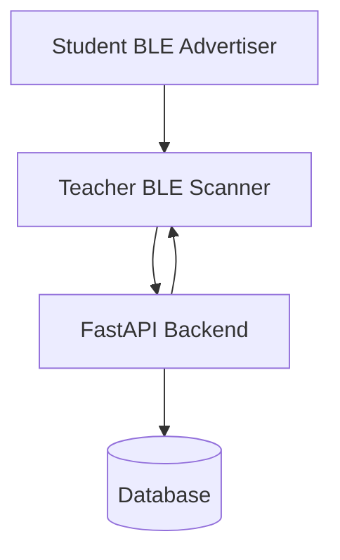

# Project Report

## Project Overview

Smart Attendance Registry is a BLE-based attendance system designed for session-aware student detection, observation validation, and automated attendance generation. The implementation separates student advertising, teacher scanning, backend validation, and attendance persistence so the BLE workflow remains independent from other attendance modes.

## Problem Statement

Manual attendance is slow, easy to proxy, and difficult to audit. QR attendance is still vulnerable to sharing and screenshot reuse, GPS attendance is unreliable indoors, and NFC requires close-contact interactions and often additional hardware flow. The project solves these issues by using anonymous BLE advertisements, rolling tokens, backend validation, and cooldown-based replay suppression.

## Architecture

The architecture is deliberately split into independent stages:
- student session-aware advertising
- teacher packet discovery and filtering
- observation upload and backend validation
- attendance generation and summary reporting

## Technology Stack

- Android/Kotlin for the student and teacher apps
- FastAPI for the backend API
- SQLAlchemy for persistence
- PostgreSQL for data storage
- Retrofit and OkHttp for client networking
- Compose for the teacher UI
- Pytest for backend verification

## Modules

### Student App

- BLE advertisement generation
- rolling token generation
- foreground BLE advertising service
- heartbeat submission gating
- session-aware stop/start behavior

### Teacher App

- BLE foreground scanner service
- observation parsing
- registered-device filtering
- batch upload pipeline
- live attendance dashboard
- session summary view

### Backend

- BLE session management
- device registration
- observation validation
- cooldown enforcement
- attendance persistence
- dashboard and summary APIs
- structured demo logs

## Security Features

- Anonymous IDs instead of raw device identifiers
- Rolling token freshness checks
- HMAC validation path
- Replay resistance through per-student cooldown
- Registered-device filtering before persistence
- Session-aware advertising and heartbeat gating

## BLE Workflow

1. Teacher starts a BLE session.
2. Student app detects that the session is active.
3. Student app advertises the BLE packet.
4. Teacher scanner receives and parses the packet.
5. Teacher app uploads the observation metadata.
6. Backend validates anonymous ID, rolling token, and cooldown state.
7. Backend stores the accepted observation.
8. Attendance is updated and returned in dashboard summaries.

## Attendance Workflow

- Received packets are counted when uploads arrive.
- Accepted packets are persisted after validation and cooldown checks.
- Students seen reflects unique detected students with valid observations.
- Attendance records are generated from the validated observation stream.
- Session end finalizes the result set and prints the summary log.

## Database Design

- `ble_sessions` stores session lifecycle state.
- `ble_registered_devices` stores anonymous BLE bindings.
- `ble_observations` stores raw validated scan observations.
- `ble_attendance` stores the derived attendance outcome.

## Anti-Proxy Mechanisms

- Anonymous device IDs prevent direct identity reuse.
- Rolling tokens limit packet lifetime.
- Cooldown prevents repeated upload amplification.
- Backend validation rejects invalid or replayed data.
- Teacher scanner ignores unregistered devices.

## Battery Optimization

- Student advertising stays idle when there is no active session.
- Heartbeat submission is skipped unless the active session is running.
- BLE work is tied to the session lifecycle.
- Teacher scanner remains in a foreground service only while scanning is active.

## Testing Strategy

- Backend unit and integration tests validate cooldown, observation ingestion, and dashboard behavior.
- Android compile checks validate teacher and student module changes.
- Log formatting changes are validated through code review and module compilation.
- Session lifecycle behavior is exercised through end-to-end workflow tests.

## Limitations

- The current live attendance API contract does not expose student email in observation responses.
- Rolling token display is intentionally backend-only and is not shown in the teacher UI.
- HMAC verification remains structurally supported but not fully provisioned with keys in the current implementation.

## Future Improvements

- Add richer student metadata to the teacher UI contract if the API is expanded later.
- Introduce persisted notification or event history for demo playback.
- Add more dashboard trend views for packet volume and session activity.
- Replace the hardcoded demo backend URL with environment-specific configuration.

## Conclusion

The project demonstrates a complete BLE attendance pipeline with session-aware behavior, structured logs, validated observation processing, replay protection, and clear attendance summaries. The final implementation is suitable for demonstrations while preserving the separation between packet transport, backend validation, and attendance generation.
