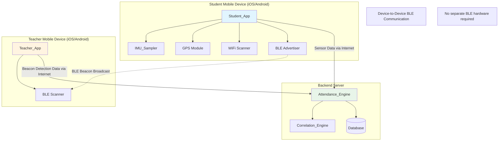
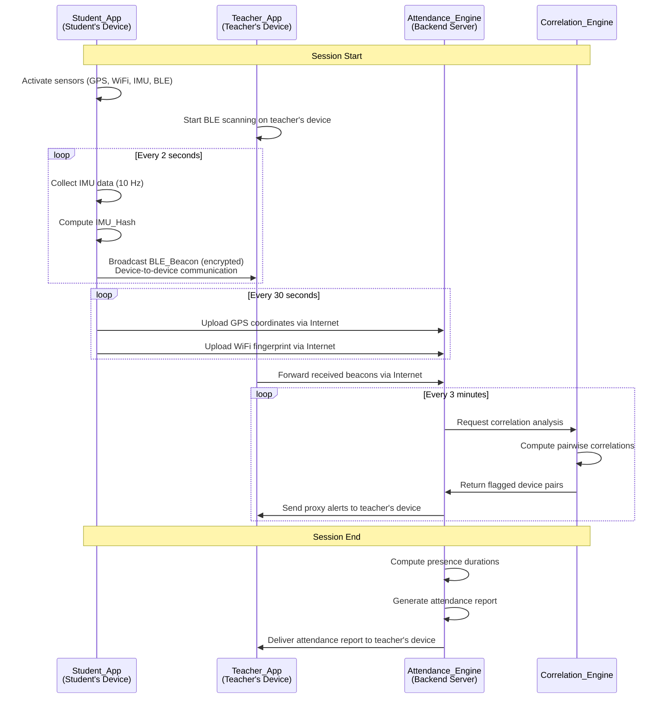
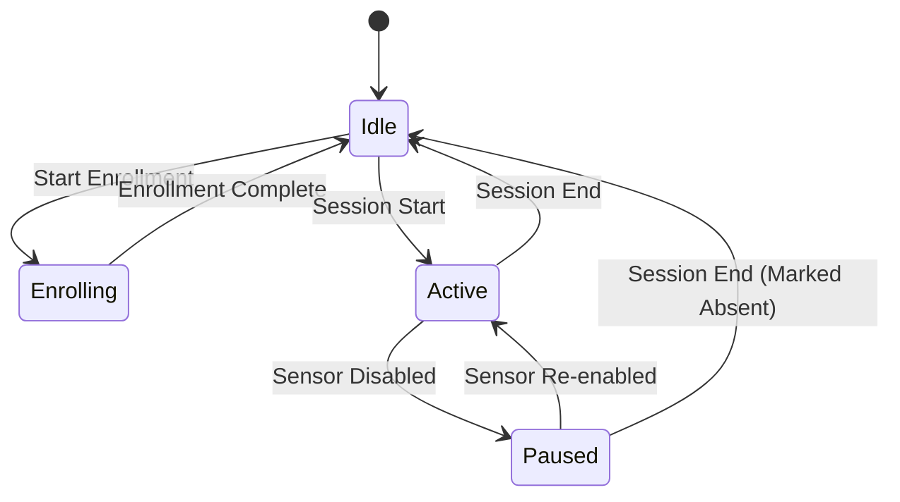
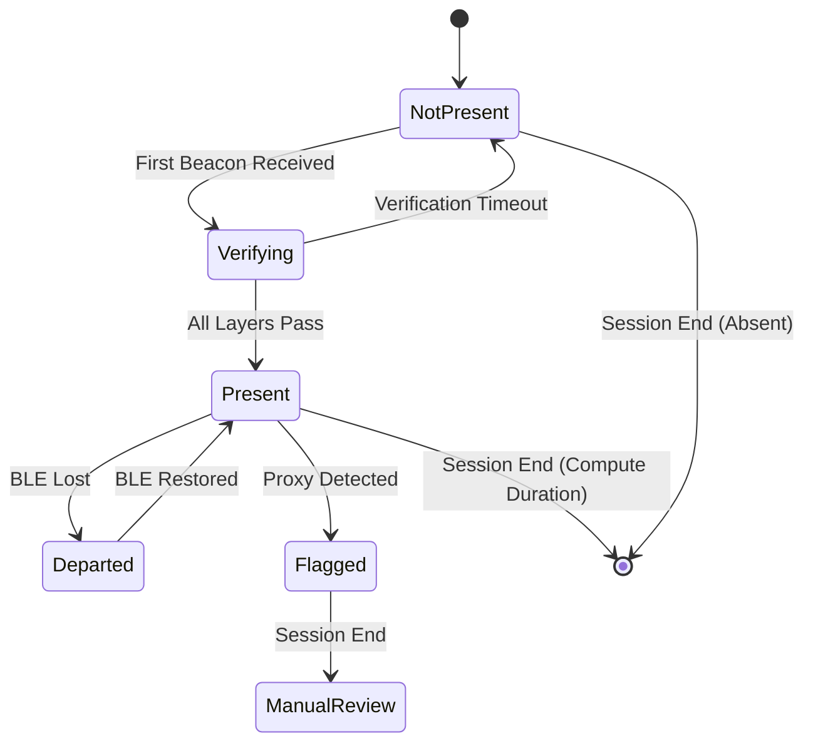

# Design Document: Attendance Management System

## Overview

The Attendance Management System is a sophisticated passive attendance tracking solution that combines multi-layer location verification with motion signature analysis to prevent proxy attendance fraud. The system architecture consists of three primary components:

1. **Student_App** (Mobile Client): Cross-platform mobile application (iOS/Android) that collects sensor data, broadcasts BLE beacons, and operates efficiently in background mode
2. **Teacher_App** (Mobile BLE Scanner): Cross-platform mobile application (iOS/Android) running on the teacher's personal device that scans for student BLE beacons and relays detection data to the backend. The teacher's device acts as the BLE scanner—no separate beacon scanning hardware is required.
3. **Attendance_Engine** (Backend Server): Centralized processing system that performs motion correlation analysis, manages enrollment, and generates attendance records

**Important Architecture Note**: The system uses device-to-device BLE communication. Student devices broadcast BLE beacons, and the teacher's mobile device (running Teacher_App) scans for these beacons. No dedicated BLE scanning equipment or infrastructure is required—the teacher simply needs their smartphone or tablet with the Teacher_App installed.

### Key Technical Challenges

The system addresses several complex technical challenges:

- **Proxy Detection**: Detecting when one person carries multiple enrolled devices through continuous IMU correlation analysis
- **Background Operation**: Maintaining sensor collection and BLE advertising while minimizing battery consumption
- **Secure Beacons**: Preventing beacon spoofing through encryption and replay attack mitigation
- **Cross-Platform Consistency**: Ensuring identical behavior across iOS and Android despite platform differences in sensor APIs and background execution models
- **Real-Time Correlation**: Computing motion signature similarity for all device pairs within acceptable latency bounds

### Research Findings

Based on research into similar systems and relevant technologies:

1. **BLE Security**: Modern BLE implementations support application-layer encryption using AES-256-GCM. The beacon payload itself must be encrypted at the application layer since BLE advertising packets are inherently broadcast and unencrypted ([source](https://www.cisoplatform.com/profiles/blogs/end-to-end-encryption-in-ble-iot-networks)).

2. **IMU Processing**: Motion signature analysis typically uses sensor fusion algorithms (Madgwick, Mahony, Complementary filters) to combine accelerometer and gyroscope data. For correlation analysis, raw sensor data is often more effective than fused orientation estimates ([source](https://www.researchgate.net/publication/363523775_Estimating_Relative_Angles_Using_Two_Inertial_Measurement_Units_Without_Magnetometers)).

3. **Cross-Correlation for Motion**: Time-series cross-correlation can detect lead-lag relationships and similarity between motion signals. However, autocorrelation in sensor data can produce spurious correlations, requiring careful preprocessing and windowing ([source](https://link.springer.com/article/10.3758/s13428-015-0611-2)).

4. **Battery Optimization**: Background location services are major battery consumers. Best practices include reducing update frequency, using significant location change APIs, and batching network operations. Location services can consume 15-30% of battery per hour if not optimized ([source](http://rangle.io/blog/optimizing-ios-location-services)).

5. **Attendance Fraud Mitigation**: Existing attendance systems use IMEI binding and geofencing to prevent proxy attendance. The addition of motion correlation provides a novel layer of fraud detection not commonly found in commercial systems ([source](https://thesai.org/Publications/ViewPaper?Code=IJACSA&Issue=4&SerialNo=104&Volume=14)).

## Architecture

### System Architecture Diagram



### Component Interaction Flow



### Deployment Architecture

The system supports multiple deployment configurations:

1. **Cloud-Based (Recommended)**: 
   - Attendance_Engine runs on cloud infrastructure (AWS, Azure, GCP)
   - Teacher_App runs as mobile application on teacher's iOS/Android device
   - Student_App runs on student iOS/Android devices
   - BLE communication happens directly between student and teacher devices (device-to-device)

2. **On-Premises**: 
   - Attendance_Engine runs on institutional servers
   - Teacher_App runs as mobile application on teacher's iOS/Android device
   - Student_App runs on student iOS/Android devices
   - BLE communication happens directly between student and teacher devices (device-to-device)

3. **Hybrid**: 
   - Teacher_App includes lightweight correlation engine for real-time alerts
   - Full correlation analysis performed on backend
   - Teacher's mobile device performs BLE scanning and preliminary processing
   - Backend handles comprehensive analysis and reporting

**Hardware Requirements:**
- **Student Devices**: iOS 14.0+ or Android 8.0+ with BLE, GPS, WiFi, and IMU sensors
- **Teacher Devices**: iOS 14.0+ or Android 8.0+ with BLE scanning capability
- **No Additional Hardware**: No dedicated BLE beacon scanners, receivers, or infrastructure equipment required

## Components and Interfaces

### Student_App (Mobile Client)

**Responsibilities:**
- Device enrollment and baseline profile collection
- Continuous sensor data collection (GPS, WiFi, IMU)
- BLE beacon broadcasting with encrypted payload
- Background operation management
- Battery optimization

**Key Modules:**

1. **Enrollment Module**
   - Collects device identifiers (iOS: identifierForVendor, Android: Android ID)
   - Records 5-minute baseline IMU profile during enrollment
   - Generates and stores cryptographic keys (AES-256 session key, HMAC key)
   - Submits enrollment request to Attendance_Engine

2. **IMU_Sampler**
   - Interfaces with platform sensor APIs (iOS: CoreMotion, Android: SensorManager)
   - Samples accelerometer and gyroscope at 10 Hz
   - Maintains 3-minute rolling buffer (1800 samples per axis)
   - Computes SHA-256 hash of buffer contents every 30 seconds
   - Normalizes sensor data to account for platform coordinate system differences

3. **Location Module**
   - GPS: Uses significant location change API with 30-second fallback polling
   - WiFi: Scans visible access points every 45 seconds (BSSID + RSSI)
   - Batches location data for network efficiency

4. **BLE Advertiser**
   - Broadcasts BLE beacons every 2 seconds
   - Constructs encrypted Beacon_Payload: `{studentID, timestamp, IMU_Hash, HMAC}`
   - Uses AES-256-GCM for payload encryption
   - Implements platform-specific advertising (iOS: CBPeripheralManager, Android: BluetoothLeAdvertiser)

5. **Background Service Manager**
   - iOS: Registers for background location updates and BLE peripheral mode
   - Android: Runs as foreground service with persistent notification
   - Implements battery-aware sampling (reduces GPS frequency at low battery)

**Platform-Specific Considerations:**

| Feature | iOS Implementation | Android Implementation |
|---------|-------------------|------------------------|
| Background Location | `allowsBackgroundLocationUpdates = true` | Foreground Service with `ACCESS_BACKGROUND_LOCATION` |
| BLE Advertising | `CBPeripheralManager` with background mode | `BluetoothLeAdvertiser` with `ADVERTISE_MODE_LOW_POWER` |
| IMU Sampling | `CMMotionManager` with `deviceMotionUpdateInterval` | `SensorManager.registerListener()` with `SENSOR_DELAY_GAME` |
| Battery Optimization | Respect Low Power Mode, reduce sampling | Exempt from Doze mode, use `PowerManager.WakeLock` sparingly |

**API Interface:**

```typescript
// Student_App exposes these methods to Attendance_Engine
interface StudentAppAPI {
  // Enrollment
  enrollDevice(studentID: string): Promise<EnrollmentResult>
  
  // Session management
  startSession(sessionID: string, config: SessionConfig): void
  stopSession(sessionID: string): void
  
  // Data upload
  uploadSensorData(data: SensorDataBatch): Promise<void>
  
  // Status
  getDeviceStatus(): DeviceStatus
}

interface SensorDataBatch {
  sessionID: string
  timestamp: number
  gpsCoordinates: GPSPoint[]
  wifiFingerprint: WiFiScan[]
  imuSamples: IMUSample[]
}
```

### Teacher_App (Mobile BLE Scanner)

**Platform**: Cross-platform mobile application (iOS/Android) running on the teacher's personal smartphone or tablet

**Responsibilities:**
- BLE beacon scanning during sessions using the teacher's device Bluetooth radio
- Beacon decryption and validation
- Real-time proximity detection based on received signal strength
- Session configuration and management
- Attendance report viewing

**Key Modules:**

1. **BLE Scanner**
   - Utilizes the teacher's device built-in Bluetooth radio for scanning
   - Continuous scanning during active sessions
   - Filters beacons by service UUID to identify student beacons
   - Records RSSI (signal strength) for proximity estimation
   - Implements platform-specific scanning APIs:
     - iOS: `CBCentralManager` for BLE central role
     - Android: `BluetoothLeScanner` for BLE scanning
   - No external BLE hardware required—uses device's native Bluetooth capability

2. **Beacon Processor**
   - Decrypts Beacon_Payload using shared session key
   - Verifies HMAC signature
   - Checks timestamp freshness (rejects beacons older than 30 seconds)
   - Extracts studentID and IMU_Hash

3. **Session Manager**
   - Creates session definitions (time, location, thresholds)
   - Activates/deactivates scanning based on schedule
   - Manages session state and configuration

4. **Report Viewer**
   - Displays real-time session status (detected students, alerts)
   - Shows final attendance reports with presence durations
   - Highlights flagged proxy attempts and baseline deviations

**Platform-Specific Considerations:**

| Feature | iOS Implementation | Android Implementation |
|---------|-------------------|------------------------|
| BLE Scanning | `CBCentralManager` in central role | `BluetoothLeScanner` with scan settings |
| Background Scanning | Limited background scanning with `CBCentralManagerScanOptionAllowDuplicatesKey` | Foreground service for continuous scanning |
| Scan Mode | Balanced power/performance mode | `SCAN_MODE_LOW_LATENCY` during active sessions |
| Permissions | Bluetooth permission in Info.plist | `BLUETOOTH_SCAN` and `BLUETOOTH_CONNECT` runtime permissions |

**API Interface:**

```typescript
// Teacher_App exposes these methods to Attendance_Engine
interface TeacherAppAPI {
  // Session management
  createSession(config: SessionConfig): Promise<string>
  startSession(sessionID: string): void
  stopSession(sessionID: string): void
  
  // Beacon reporting
  reportBeaconDetection(detection: BeaconDetection): Promise<void>
  
  // Reports
  getAttendanceReport(sessionID: string): Promise<AttendanceReport>
}

interface BeaconDetection {
  sessionID: string
  studentID: string
  timestamp: number
  rssi: number
  imuHash: string
}
```

### Attendance_Engine (Backend Server)

**Responsibilities:**
- Device enrollment management
- Session scheduling and configuration
- Multi-layer verification processing
- Presence duration tracking
- Attendance record generation
- Administrative interface

**Key Modules:**

1. **Enrollment Service**
   - Validates enrollment requests
   - Enforces one-device-per-student policy
   - Stores encrypted baseline profiles
   - Manages device bindings and cryptographic keys

2. **Verification Processor**
   - GPS Verification: Checks coordinates against Campus_Boundary polygon
   - WiFi Verification: Compares fingerprints against Building_Zone definitions using k-NN or fingerprint matching
   - BLE Verification: Validates beacon reception and RSSI threshold
   - Aggregates verification results into time-series per student

3. **Presence Tracker**
   - Maintains real-time presence state for each student in active sessions
   - Accumulates Presence_Duration when all three verification layers pass
   - Records departure/re-entry events
   - Computes final attendance status at session end

4. **Correlation_Engine Interface**
   - Batches IMU data for correlation analysis
   - Invokes Correlation_Engine every 3 minutes
   - Processes flagged device pairs and generates alerts

5. **Report Generator**
   - Compiles attendance reports with presence durations, verification timelines, and security flags
   - Stores reports in database with 2-year retention
   - Provides query interface for historical data

**Database Schema:**

```sql
-- Device enrollments
CREATE TABLE enrollments (
  device_id VARCHAR(255) PRIMARY KEY,
  student_id VARCHAR(255) UNIQUE NOT NULL,
  enrollment_timestamp TIMESTAMP NOT NULL,
  baseline_profile BYTEA NOT NULL,  -- Encrypted IMU baseline
  session_key BYTEA NOT NULL,
  hmac_key BYTEA NOT NULL,
  status ENUM('active', 'revoked') DEFAULT 'active'
);

-- Sessions
CREATE TABLE sessions (
  session_id VARCHAR(255) PRIMARY KEY,
  instructor_id VARCHAR(255) NOT NULL,
  start_time TIMESTAMP NOT NULL,
  end_time TIMESTAMP NOT NULL,
  campus_boundary GEOMETRY(POLYGON) NOT NULL,
  building_zone_id VARCHAR(255) NOT NULL,
  classroom_zone_id VARCHAR(255) NOT NULL,
  minimum_presence_pct DECIMAL(5,2) DEFAULT 80.00,
  correlation_threshold DECIMAL(5,3) DEFAULT 0.920
);

-- Attendance records
CREATE TABLE attendance_records (
  record_id SERIAL PRIMARY KEY,
  session_id VARCHAR(255) NOT NULL,
  student_id VARCHAR(255) NOT NULL,
  presence_duration_seconds INT NOT NULL,
  required_duration_seconds INT NOT NULL,
  attendance_status ENUM('present', 'absent', 'flagged') NOT NULL,
  departure_events JSONB,  -- Array of {departure_time, reentry_time}
  security_flags JSONB,    -- Array of {flag_type, timestamp, details}
  created_at TIMESTAMP DEFAULT NOW(),
  FOREIGN KEY (session_id) REFERENCES sessions(session_id),
  UNIQUE(session_id, student_id)
);

-- Verification data (retained for 30 days)
CREATE TABLE verification_data (
  verification_id SERIAL PRIMARY KEY,
  session_id VARCHAR(255) NOT NULL,
  student_id VARCHAR(255) NOT NULL,
  timestamp TIMESTAMP NOT NULL,
  gps_passed BOOLEAN,
  wifi_passed BOOLEAN,
  ble_passed BOOLEAN,
  gps_coordinates GEOMETRY(POINT),
  wifi_fingerprint JSONB,
  ble_rssi INT,
  imu_hash VARCHAR(64),
  created_at TIMESTAMP DEFAULT NOW()
);
CREATE INDEX idx_verification_session_student ON verification_data(session_id, student_id, timestamp);

-- IMU data (retained for 30 days)
CREATE TABLE imu_data (
  imu_id SERIAL PRIMARY KEY,
  session_id VARCHAR(255) NOT NULL,
  student_id VARCHAR(255) NOT NULL,
  timestamp TIMESTAMP NOT NULL,
  accelerometer_x FLOAT[],  -- Array of samples
  accelerometer_y FLOAT[],
  accelerometer_z FLOAT[],
  gyroscope_x FLOAT[],
  gyroscope_y FLOAT[],
  gyroscope_z FLOAT[],
  created_at TIMESTAMP DEFAULT NOW()
);
CREATE INDEX idx_imu_session_student ON imu_data(session_id, student_id, timestamp);
```

**API Interface:**

```typescript
// Attendance_Engine REST API
interface AttendanceEngineAPI {
  // Enrollment
  POST /api/enrollment/enroll
  GET /api/enrollment/status/:deviceId
  
  // Sessions
  POST /api/sessions/create
  GET /api/sessions/:sessionId
  PUT /api/sessions/:sessionId/start
  PUT /api/sessions/:sessionId/stop
  
  // Data ingestion
  POST /api/data/sensor-batch
  POST /api/data/beacon-detection
  
  // Reports
  GET /api/reports/session/:sessionId
  GET /api/reports/student/:studentId
  
  // Admin
  POST /api/admin/override-attendance
  GET /api/admin/flagged-records
}
```

### Correlation_Engine (Motion Analysis Component)

**Responsibilities:**
- Pairwise motion signature correlation
- Proxy attempt detection
- Baseline profile deviation analysis
- Stationary device handling

**Key Algorithms:**

1. **Preprocessing Pipeline**
   ```
   Input: Raw IMU samples (3-minute window, 1800 samples per axis)
   
   Step 1: Detrending
   - Remove linear trend from each axis using least-squares fit
   - Removes drift caused by sensor bias
   
   Step 2: Normalization
   - Compute mean and standard deviation per axis
   - Normalize to zero mean, unit variance
   - Handles devices with different sensor sensitivities
   
   Step 3: Filtering
   - Apply Butterworth bandpass filter (0.5 Hz - 5 Hz)
   - Removes high-frequency noise and low-frequency drift
   - Preserves human motion frequencies
   
   Output: Preprocessed signal ready for correlation
   ```

2. **Pearson Correlation Coefficient**
   ```
   For device pair (A, B) with preprocessed signals:
   
   For each axis (x, y, z):
     r_axis = Σ((A_i - mean(A)) * (B_i - mean(B))) / (std(A) * std(B) * n)
   
   Composite score:
     r_composite = (r_x + r_y + 1.5 * r_z) / 3.5
   
   Z-axis weighted higher because vertical motion is more consistent
   when devices are carried together
   ```

3. **Dynamic Time Warping (DTW)**
   ```
   Alternative to Pearson for handling phase shifts:
   
   DTW_distance = dtw(signal_A, signal_B, window=50)
   Similarity_score = 1 / (1 + DTW_distance)
   
   Used when devices may have slight timing differences
   (e.g., different pockets, bags)
   ```

4. **Stationary Detection**
   ```
   For each device:
     accel_std = std(accelerometer_magnitude)
     gyro_std = std(gyroscope_magnitude)
     
     if accel_std < 0.05 AND gyro_std < 0.01:
       flag_as_stationary()
       
     if both_devices_stationary AND spatial_correlation > 0.88:
       increase_proxy_confidence()
   ```

5. **Baseline Deviation**
   ```
   For each student:
     current_signature = preprocess(current_imu_window)
     baseline_signature = decrypt_and_load(baseline_profile)
     
     deviation_score = pearson_correlation(current_signature, baseline_signature)
     
     if deviation_score < 0.70 for 10 consecutive minutes:
       flag_baseline_deviation()
   ```

**Correlation Matrix Computation:**

```python
# Pseudocode for correlation analysis
def analyze_session_correlations(session_id: str) -> List[ProxyAlert]:
    # Retrieve all IMU data for session
    devices = get_active_devices(session_id)
    imu_data = {device: get_imu_window(device, window_minutes=3) for device in devices}
    
    # Preprocess all signals
    preprocessed = {device: preprocess_imu(data) for device, data in imu_data.items()}
    
    # Compute pairwise correlations
    alerts = []
    for i, device_a in enumerate(devices):
        for device_b in devices[i+1:]:
            # Compute per-axis correlations
            r_x = pearson(preprocessed[device_a].accel_x, preprocessed[device_b].accel_x)
            r_y = pearson(preprocessed[device_a].accel_y, preprocessed[device_b].accel_y)
            r_z = pearson(preprocessed[device_a].accel_z, preprocessed[device_b].accel_z)
            
            # Weighted composite score
            composite = (r_x + r_y + 1.5 * r_z) / 3.5
            
            # Check threshold
            if composite > CORRELATION_THRESHOLD:
                # Verify sustained correlation
                if check_sustained_correlation(device_a, device_b, windows=3):
                    alerts.append(ProxyAlert(
                        device_pair=(device_a, device_b),
                        correlation_score=composite,
                        timestamp=now()
                    ))
    
    return alerts
```

**Performance Optimization:**

- **Parallel Processing**: Correlation computations are embarrassingly parallel; use thread pool for device pairs
- **Incremental Computation**: Maintain rolling correlation using online algorithms to avoid recomputing entire window
- **Early Termination**: Skip correlation for device pairs with very different motion magnitudes
- **Caching**: Cache preprocessed signals to avoid redundant filtering

**API Interface:**

```typescript
interface CorrelationEngineAPI {
  // Correlation analysis
  analyzeCorrelations(sessionID: string, windowStart: number): Promise<CorrelationResult>
  
  // Baseline comparison
  compareToBaseline(studentID: string, currentSignature: IMUWindow): Promise<DeviationScore>
  
  // Stationary detection
  detectStationary(imuWindow: IMUWindow): boolean
}

interface CorrelationResult {
  flaggedPairs: Array<{
    deviceA: string
    deviceB: string
    correlationScore: number
    axisScores: {x: number, y: number, z: number}
    sustained: boolean
  }>
  processingTimeMs: number
}
```

## Data Models

### Core Data Structures

```typescript
// Enrollment
interface EnrollmentBinding {
  deviceID: string              // Platform-specific device identifier
  studentID: string             // Institutional student ID
  enrollmentTimestamp: number   // Unix timestamp (ms)
  baselineProfile: EncryptedBlob // 5-minute IMU baseline
  sessionKey: Buffer            // AES-256 key for beacon encryption
  hmacKey: Buffer               // HMAC-SHA256 key for authentication
  status: 'active' | 'revoked'
}

// Session Configuration
interface SessionConfig {
  sessionID: string
  instructorID: string
  startTime: number             // Unix timestamp (ms)
  endTime: number               // Unix timestamp (ms)
  campusBoundary: GeoPolygon    // GPS geofence
  buildingZoneID: string        // WiFi zone reference
  classroomZoneID: string       // BLE zone reference
  minimumPresencePct: number    // Default 80
  correlationThreshold: number  // Default 0.92
  bleRssiThreshold: number      // Default -70 dBm
}

// Beacon Payload
interface BeaconPayload {
  studentID: string
  timestamp: number             // Unix timestamp (ms)
  imuHash: string               // SHA-256 hash of 3-minute IMU buffer
  hmac: string                  // HMAC-SHA256 signature
}

// Encrypted beacon (what's actually transmitted)
interface EncryptedBeacon {
  ciphertext: Buffer            // AES-256-GCM encrypted payload
  iv: Buffer                    // Initialization vector
  authTag: Buffer               // GCM authentication tag
}

// IMU Sample
interface IMUSample {
  timestamp: number
  accelerometer: {x: number, y: number, z: number}  // m/s²
  gyroscope: {x: number, y: number, z: number}      // rad/s
}

// IMU Window (3 minutes)
interface IMUWindow {
  startTime: number
  endTime: number
  samples: IMUSample[]          // 1800 samples (10 Hz * 180 seconds)
  hash: string                  // SHA-256 of serialized samples
}

// GPS Point
interface GPSPoint {
  timestamp: number
  latitude: number
  longitude: number
  accuracy: number              // meters
}

// WiFi Scan
interface WiFiScan {
  timestamp: number
  accessPoints: Array<{
    bssid: string               // MAC address
    ssid: string                // Network name (may be hidden)
    rssi: number                // Signal strength (dBm)
  }>
}

// Verification Result
interface VerificationResult {
  timestamp: number
  gps: {passed: boolean, coordinates?: GPSPoint}
  wifi: {passed: boolean, confidence?: number}
  ble: {passed: boolean, rssi?: number}
}

// Attendance Record
interface AttendanceRecord {
  sessionID: string
  studentID: string
  presenceDurationSeconds: number
  requiredDurationSeconds: number
  attendanceStatus: 'present' | 'absent' | 'flagged'
  departureEvents: Array<{
    departureTime: number
    reentryTime: number
  }>
  securityFlags: Array<{
    flagType: 'proxy_attempt' | 'baseline_deviation' | 'sensor_disabled'
    timestamp: number
    details: any
  }>
}

// Attendance Report
interface AttendanceReport {
  sessionID: string
  sessionInfo: SessionConfig
  generatedAt: number
  studentRecords: AttendanceRecord[]
  proxyAttempts: Array<{
    devicePair: [string, string]
    studentPair: [string, string]
    correlationScore: number
    detectionTime: number
  }>
  baselineDeviations: Array<{
    studentID: string
    deviationScore: number
    detectionTime: number
  }>
  summary: {
    totalStudents: number
    presentCount: number
    absentCount: number
    flaggedCount: number
  }
}
```

### State Machines

**Student_App Session State:**



**Attendance_Engine Presence State (per student):**




## Correctness Properties

*A property is a characteristic or behavior that should hold true across all valid executions of a system—essentially, a formal statement about what the system should do. Properties serve as the bridge between human-readable specifications and machine-verifiable correctness guarantees.*

### Property Reflection

After analyzing all acceptance criteria, I identified the following redundancies and consolidations:

**Redundancies Eliminated:**
- Requirements 1.8 and 1.9 test opposite cases of beacon validation (enrolled vs unregistered) - consolidated into Property 1
- Requirements 2.3 and 2.4 test opposite cases of geofence validation - consolidated into Property 2
- Requirements 3.5 and 3.6 test opposite cases of WiFi matching - consolidated into Property 3
- Requirements 8.7 and 8.8 test opposite cases of presence threshold - consolidated into Property 7
- Requirements 18.1 and 18.2 are identical - consolidated into one example test

**Properties Combined:**
- Requirements 8.3, 8.4, and 8.5 all relate to presence duration accumulation logic - combined into Property 6
- Requirements 6.2, 6.3, and 6.4 all relate to correlation computation and flagging - combined into Property 4
- Requirements 13.1, 13.2, 13.3, 13.4, and 13.5 all relate to multi-dimensional correlation analysis - combined into Property 10

### Property 1: Enrollment Binding Creation and Validation

*For any* device enrollment request with valid student ID and device ID, the Attendance_Engine SHALL create an Enrollment_Binding containing all required fields (device ID, student ID, timestamp, encrypted baseline profile, session key, HMAC key), and SHALL accept beacons only from enrolled devices while rejecting and logging beacons from unregistered devices.

**Validates: Requirements 1.2, 1.7, 1.8, 1.9**

### Property 2: GPS Geofence Validation

*For any* GPS coordinate and campus boundary polygon, the verification logic SHALL correctly classify the coordinate as inside or outside the boundary, marking verification as passed for inside coordinates and failed for outside coordinates.

**Validates: Requirements 2.3, 2.4**

### Property 3: WiFi Fingerprint Matching

*For any* WiFi fingerprint and building zone definition, when the matching confidence score is computed, verification SHALL be marked as passed if and only if confidence exceeds 85%.

**Validates: Requirements 3.4, 3.5, 3.6**

### Property 4: Motion Signature Correlation and Proxy Detection

*For any* pair of IMU motion signatures in a 3-minute window, the Correlation_Engine SHALL compute pairwise cross-correlation scores using Pearson coefficient or DTW distance, and SHALL flag device pairs as potential proxy attempts when correlation exceeds the configured threshold (default 0.92) for 3 consecutive windows.

**Validates: Requirements 6.2, 6.3, 6.4, 6.6**

### Property 5: Duplicate Enrollment Prevention

*For any* student who already has an active enrollment binding, subsequent enrollment attempts for that student SHALL be rejected regardless of the device ID used in the new request.

**Validates: Requirements 1.5**

### Property 6: Presence Duration Accumulation

*For any* sequence of verification results during a session, the Attendance_Engine SHALL accumulate presence duration only during time intervals where all three verification layers (GPS, WiFi, BLE) pass, pausing accumulation when any layer fails and resuming when all layers pass again.

**Validates: Requirements 8.3, 8.4, 8.5**

### Property 7: Attendance Status Determination

*For any* student's presence duration and session's minimum presence threshold (computed as 80% of session duration), the student SHALL be marked as present if and only if their presence duration meets or exceeds the threshold.

**Validates: Requirements 8.2, 8.6, 8.7, 8.8**

### Property 8: Beacon Encryption Round-Trip

*For any* beacon payload containing student ID, timestamp, and IMU hash, encrypting the payload with AES-256-GCM and then decrypting SHALL recover the original payload data exactly.

**Validates: Requirements 4.3, 4.5, 12.1**

### Property 9: HMAC Signature Validation

*For any* beacon payload, the computed HMAC signature over (studentID, timestamp, IMU_Hash) SHALL be verifiable using the shared HMAC key, and beacons with invalid signatures SHALL be discarded and logged.

**Validates: Requirements 12.3, 12.5**

### Property 10: Multi-Dimensional Correlation Analysis

*For any* pair of IMU motion signatures, the Correlation_Engine SHALL compute per-axis correlations (x, y, z) separately, apply 1.5x weighting to z-axis correlation in the composite score, and SHALL flag device pairs when z-axis correlation exceeds 0.88 even if overall correlation is below threshold, with additional confidence increase when phase lag is less than 200ms.

**Validates: Requirements 13.1, 13.2, 13.3, 13.4, 13.5**

### Property 11: Stationary Device Correlation

*For any* pair of devices where both show minimal movement (accelerometer std dev < 0.05 m/s² and gyroscope std dev < 0.01 rad/s) for more than 5 consecutive minutes, the Correlation_Engine SHALL flag them as stationary and SHALL increase proxy attempt confidence when their z-axis correlation exceeds 0.88.

**Validates: Requirements 7.1, 7.3, 7.4, 7.5**

### Property 12: Baseline Profile Deviation Detection

*For any* student's current motion signature and their stored baseline profile, the Correlation_Engine SHALL compute a deviation score, and SHALL flag the device as potentially borrowed when the deviation score falls below 0.70 for more than 10 consecutive minutes.

**Validates: Requirements 9.2, 9.3**

### Property 13: Departure and Re-Entry Duration Calculation

*For any* chronological sequence of departure and re-entry events for a student, the Attendance_Engine SHALL compute presence duration by summing only the time intervals between each re-entry timestamp and the subsequent departure timestamp.

**Validates: Requirements 10.3, 10.4**

### Property 14: Beacon Timestamp Freshness Validation

*For any* received beacon with a timestamp, the Teacher_App SHALL reject the beacon if the timestamp is older than 30 seconds relative to the current time, preventing replay attacks.

**Validates: Requirements 12.6**

### Property 15: BLE Proximity Threshold Validation

*For any* received beacon with RSSI (signal strength) measurement, the BLE verification SHALL be marked as passed if and only if RSSI is greater than the configured classroom zone threshold (default -70 dBm).

**Validates: Requirements 4.7**

### Property 16: IMU Rolling Buffer Management

*For any* stream of IMU samples arriving at 10 Hz, the IMU_Sampler SHALL maintain a rolling buffer containing exactly the most recent 3 minutes (1800 samples) of data, discarding older samples as new samples arrive.

**Validates: Requirements 5.3**

### Property 17: IMU Hash Determinism

*For any* IMU rolling buffer contents, computing the SHA-256 hash of the buffer SHALL produce the same hash value when computed multiple times on identical buffer contents.

**Validates: Requirements 5.4**

### Property 18: Session Configuration Validation

*For any* session configuration with minimum presence percentage and correlation threshold parameters, the configuration SHALL be accepted if and only if minimum presence is in range [50, 100] and correlation threshold is in range [0.80, 0.98].

**Validates: Requirements 17.2, 17.3, 17.5**

### Property 19: Attendance Report Completeness

*For any* completed session with student attendance records, the generated attendance report SHALL include for each student: final attendance status, presence duration, required duration, departure/re-entry events array, and security flags array.

**Validates: Requirements 14.2**

### Property 20: Administrative Override Audit Logging

*For any* administrative override of an attendance record, the Attendance_Engine SHALL log the override with administrator identity, timestamp, and justification, while preserving the original automated determination alongside the override.

**Validates: Requirements 16.4, 16.5**

### Property 21: Cross-Platform Beacon Compatibility

*For any* beacon payload encrypted and broadcast from an iOS device, the beacon SHALL be successfully received, decrypted, and processed by an Android Teacher_App, and vice versa, ensuring cross-platform compatibility.

**Validates: Requirements 19.4**

### Property 22: Cross-Platform IMU Normalization

*For any* IMU sensor data collected from iOS and Android devices, the IMU_Sampler SHALL normalize the data to a common coordinate system and unit system such that correlation analysis produces consistent results regardless of the source platform.

**Validates: Requirements 19.5, 19.6**

### Property 23: System Health Alert Threshold

*For any* session with N enrolled students, when more than 20% of students show connectivity failures, the Attendance_Engine SHALL generate an alert to the instructor.

**Validates: Requirements 20.4**

### Property 24: Data Encryption at Rest

*For any* sensor data (GPS coordinates, IMU samples, WiFi fingerprints) stored in the database, the data SHALL be encrypted using AES-256 encryption such that decryption with the correct key recovers the original data.

**Validates: Requirements 18.3**


## Error Handling

### Student_App Error Scenarios

| Error Scenario | Detection Method | Recovery Strategy | User Impact |
|----------------|------------------|-------------------|-------------|
| GPS unavailable/disabled | Monitor location service status every 10s | Display notification prompting re-enable; mark absent after 2min | Student notified; attendance at risk |
| Bluetooth disabled | Monitor Bluetooth state every 10s | Display notification prompting re-enable; mark absent after 2min | Student notified; attendance at risk |
| WiFi disabled | Monitor WiFi state every 10s | Display notification prompting re-enable; mark absent after 2min | Student notified; attendance at risk |
| Airplane mode activated | Detect connectivity loss | Mark student absent immediately; display notification | Student notified; marked absent |
| Low battery (<15%) | Monitor battery level | Reduce GPS sampling to 60s intervals; notify student | Reduced accuracy; attendance continues |
| Critical battery (<10%) | Monitor battery level | Notify student; continue with minimal functionality | Attendance at risk; student warned |
| IMU sensors unavailable | Check sensor availability at session start | Abort session; display error; log incident | Cannot participate; manual attendance needed |
| Network connectivity loss | Detect failed API calls | Buffer sensor data locally; retry with exponential backoff | Delayed data upload; attendance processing delayed |
| Enrollment failure | API error response | Display error message; allow retry; log failure | Cannot participate until enrolled |
| Background permission denied | Check permission status | Display explanation; request permission; cannot proceed without it | App cannot function; must grant permission |
| Beacon encryption failure | Catch crypto exceptions | Log error; skip beacon transmission; retry next cycle | Temporary BLE verification gap |
| Invalid session configuration | Validate config on receipt | Display error; request updated config from server | Cannot start session |

### Teacher_App Error Scenarios

| Error Scenario | Detection Method | Recovery Strategy | User Impact |
|----------------|------------------|-------------------|-------------|
| BLE scanning failure on teacher's device | Monitor scan status | Restart scanning; log error; alert instructor if persistent | Missed beacon detections |
| Teacher's device Bluetooth disabled | Monitor Bluetooth state | Display notification prompting re-enable; cannot scan until enabled | Cannot detect student beacons |
| Beacon decryption failure | Catch crypto exceptions | Discard beacon; log security event; continue scanning | Potential security incident logged |
| Invalid HMAC signature | Signature verification fails | Discard beacon; log security event; increment security counter | Potential spoofing attempt logged |
| Network connectivity loss on teacher's device | Detect failed API calls | Buffer beacon detections locally; retry with exponential backoff | Delayed reporting to backend |
| Session not found | API returns 404 | Display error; refresh session list; allow manual session selection | Cannot start scanning |
| Beacon timestamp too old | Check timestamp age | Discard beacon; log replay attempt; continue scanning | Potential replay attack logged |
| High beacon reception rate | Monitor beacons/second | Log warning if >100 beacons/sec; potential DoS attempt | Performance degradation possible |
| Teacher's device battery low | Monitor battery level | Notify teacher; suggest connecting to power; continue scanning | Risk of device shutdown |
| Background scanning interrupted (iOS) | Detect scan state changes | Restart scanning when app returns to foreground; notify teacher | Temporary gap in beacon detection |

### Attendance_Engine Error Scenarios

| Error Scenario | Detection Method | Recovery Strategy | User Impact |
|----------------|------------------|-------------------|-------------|
| Database connection failure | Catch DB exceptions | Retry with exponential backoff; alert admin if persistent | Data loss risk; system unavailable |
| Correlation processing timeout | Monitor processing time per pair | Log warning; skip correlation for this window; continue next window | Missed proxy detection window |
| Correlation processing exceeds 10s/pair | Monitor processing time | Flag performance issue; alert admin; consider scaling | Delayed proxy detection |
| Invalid GPS coordinates | Validate lat/lon ranges | Log error; mark GPS verification as failed for that sample | Student marked absent for that interval |
| Malformed WiFi fingerprint | Validate JSON structure | Log error; mark WiFi verification as failed for that sample | Student marked absent for that interval |
| Missing IMU data for correlation | Check data availability | Log warning; skip correlation for affected devices | Cannot detect proxy for those devices |
| Baseline profile decryption failure | Catch crypto exceptions | Log error; skip baseline comparison; alert admin | Cannot detect device borrowing |
| Session key rotation failure | Catch crypto exceptions | Log critical error; alert admin; continue with current keys | Security risk; requires immediate attention |
| Duplicate enrollment attempt | Check existing enrollments | Reject request; return error to client; log attempt | Student cannot enroll second device |
| Storage capacity exceeded | Monitor disk usage | Alert admin; trigger data cleanup; reject new data if critical | System degradation; data loss risk |
| Invalid session configuration | Validate config parameters | Reject configuration; return validation errors; log attempt | Session cannot be created |
| Concurrent session modifications | Detect version conflicts | Use optimistic locking; retry transaction; return conflict error | User must retry operation |

### Error Response Formats

**API Error Response:**
```json
{
  "error": {
    "code": "ENROLLMENT_DUPLICATE",
    "message": "Student already has an enrolled device",
    "details": {
      "studentID": "STU12345",
      "existingDeviceID": "iOS-ABC123",
      "attemptedDeviceID": "Android-XYZ789"
    },
    "timestamp": 1704067200000,
    "requestID": "req_abc123"
  }
}
```

**Security Event Log Format:**
```json
{
  "eventType": "BEACON_HMAC_INVALID",
  "severity": "WARNING",
  "timestamp": 1704067200000,
  "sessionID": "session_123",
  "deviceID": "unknown",
  "details": {
    "receivedHMAC": "abc123...",
    "expectedHMAC": "def456...",
    "payload": "encrypted_data..."
  },
  "action": "BEACON_DISCARDED"
}
```

### Graceful Degradation Strategy

The system implements graceful degradation to maintain partial functionality during failures:

1. **Single Verification Layer Failure**: If one verification layer fails (e.g., WiFi disabled), the other two layers continue operating. Presence duration accumulation pauses, but the student can recover by re-enabling the failed layer.

2. **Correlation Engine Failure**: If correlation processing fails or times out, attendance marking continues based on verification layers alone. Proxy detection is temporarily unavailable, but legitimate students are not impacted.

3. **Network Connectivity Loss**: Both Student_App and Teacher_App buffer data locally and retry uploads with exponential backoff. Attendance processing is delayed but not lost.

4. **Low Battery Mode**: GPS sampling frequency is reduced to conserve battery while maintaining minimum functionality for attendance tracking.

5. **Backend Overload**: If the Attendance_Engine is overloaded, it prioritizes real-time verification processing over correlation analysis, ensuring attendance marking continues while proxy detection may be delayed.

## Testing Strategy

### Testing Approach Overview

The Attendance Management System requires a comprehensive testing strategy that combines:

1. **Property-Based Tests**: Verify universal properties across randomized inputs (100+ iterations per property)
2. **Unit Tests**: Test specific examples, edge cases, and error conditions
3. **Integration Tests**: Verify component interactions, platform-specific behavior, and external dependencies
4. **End-to-End Tests**: Validate complete workflows from enrollment through attendance reporting

### Property-Based Testing

**Library Selection:**
- **iOS**: Use [SwiftCheck](https://github.com/typelift/SwiftCheck) for property-based testing in Swift
- **Android**: Use [junit-quickcheck](https://github.com/pholser/junit-quickcheck) for property-based testing in Kotlin/Java
- **Backend (Node.js/TypeScript)**: Use [fast-check](https://github.com/dubzzz/fast-check) for property-based testing
- **Backend (Python)**: Use [Hypothesis](https://hypothesis.readthedocs.io/) for property-based testing

**Configuration:**
- Minimum 100 iterations per property test (due to randomization)
- Each property test must include a comment tag referencing the design property
- Tag format: `// Feature: attendance-management-system, Property {number}: {property_text}`

**Example Property Test (TypeScript with fast-check):**

```typescript
import fc from 'fast-check';

// Feature: attendance-management-system, Property 2: GPS Geofence Validation
describe('GPS Geofence Validation', () => {
  it('should correctly classify coordinates as inside or outside boundary', () => {
    fc.assert(
      fc.property(
        fc.record({
          lat: fc.double({ min: -90, max: 90 }),
          lon: fc.double({ min: -180, max: 180 })
        }),
        fc.array(fc.record({
          lat: fc.double({ min: -90, max: 90 }),
          lon: fc.double({ min: -180, max: 180 })
        }), { minLength: 3, maxLength: 10 }),
        (coordinate, boundaryPoints) => {
          const boundary = createPolygon(boundaryPoints);
          const result = verifyGPSLocation(coordinate, boundary);
          const actuallyInside = isPointInPolygon(coordinate, boundary);
          
          if (actuallyInside) {
            expect(result.passed).toBe(true);
          } else {
            expect(result.passed).toBe(false);
          }
        }
      ),
      { numRuns: 100 }
    );
  });
});
```

**Property Test Coverage:**

Each of the 24 correctness properties must have a corresponding property-based test:

| Property | Test Focus | Generator Strategy |
|----------|------------|-------------------|
| Property 1 | Enrollment binding creation | Generate random student IDs, device IDs, verify binding structure |
| Property 2 | GPS geofence validation | Generate random coordinates and polygons, verify inside/outside classification |
| Property 3 | WiFi fingerprint matching | Generate random fingerprints and zones, verify confidence threshold |
| Property 4 | Motion correlation | Generate random IMU windows with known correlation levels |
| Property 5 | Duplicate enrollment prevention | Generate enrollment sequences with duplicates |
| Property 6 | Presence duration accumulation | Generate random verification sequences, verify duration calculation |
| Property 7 | Attendance status determination | Generate random presence durations and thresholds |
| Property 8 | Beacon encryption round-trip | Generate random payloads, verify encryption/decryption |
| Property 9 | HMAC signature validation | Generate random payloads, verify signature validation |
| Property 10 | Multi-dimensional correlation | Generate random IMU data with varying per-axis correlations |
| Property 11 | Stationary device correlation | Generate stationary IMU data, verify flagging logic |
| Property 12 | Baseline deviation detection | Generate current and baseline signatures with varying similarity |
| Property 13 | Departure/re-entry duration | Generate random event sequences, verify duration calculation |
| Property 14 | Beacon timestamp freshness | Generate beacons with various timestamp ages |
| Property 15 | BLE proximity threshold | Generate random RSSI values, verify threshold logic |
| Property 16 | IMU rolling buffer | Generate random sample streams, verify buffer size maintenance |
| Property 17 | IMU hash determinism | Generate random buffers, verify hash consistency |
| Property 18 | Session config validation | Generate random config parameters, verify range validation |
| Property 19 | Attendance report completeness | Generate random session data, verify report structure |
| Property 20 | Admin override audit logging | Generate random overrides, verify logging completeness |
| Property 21 | Cross-platform beacon compatibility | Generate beacons on one platform, verify decryption on other |
| Property 22 | Cross-platform IMU normalization | Generate platform-specific IMU data, verify normalized output |
| Property 23 | System health alert threshold | Generate random connectivity failure scenarios |
| Property 24 | Data encryption at rest | Generate random sensor data, verify encryption round-trip |

### Unit Testing

**Unit Test Focus Areas:**

1. **Specific Examples**: Test concrete scenarios that demonstrate correct behavior
   - Example: Student with 85% presence duration is marked present
   - Example: Beacon with invalid HMAC is discarded

2. **Edge Cases**: Test boundary conditions
   - Empty IMU buffer
   - Session with zero duration
   - GPS coordinate exactly on boundary
   - Correlation score exactly at threshold

3. **Error Conditions**: Test error handling paths
   - GPS disabled during session
   - Network timeout during data upload
   - Malformed beacon payload
   - Database connection failure

4. **Platform-Specific Behavior**: Test iOS and Android differences
   - Sensor coordinate system normalization
   - Background execution APIs
   - BLE advertising/scanning APIs

**Unit Test Coverage Target**: 80% code coverage minimum

### Integration Testing

**Integration Test Scenarios:**

1. **Student_App ↔ Attendance_Engine**
   - Enrollment flow: Submit enrollment → Verify binding created → Verify baseline stored
   - Session flow: Start session → Upload sensor data → Verify verification processing
   - Error handling: Network failure → Verify local buffering → Verify retry logic

2. **Teacher_App ↔ Attendance_Engine**
   - Session management: Create session on teacher's device → Start scanning → Report beacons → Verify processing
   - Report retrieval: End session → Request report on teacher's device → Verify report completeness
   - Mobile connectivity: Test with WiFi and cellular data connections

3. **Attendance_Engine ↔ Correlation_Engine**
   - Correlation request: Submit IMU data → Request correlation → Verify flagged pairs returned
   - Performance: Submit large dataset → Verify processing completes within SLA

4. **Cross-Platform Integration**
   - iOS Student_App → Android Teacher_App: Verify beacon compatibility (device-to-device)
   - Android Student_App → iOS Teacher_App: Verify beacon compatibility (device-to-device)
   - Mixed platform session: Verify correlation works across platforms
   - BLE range testing: Verify detection at various distances in classroom environment

5. **Database Integration**
   - Data persistence: Write attendance record → Read back → Verify integrity
   - Data retention: Create old records → Verify 30-day cleanup → Verify summary retention
   - Encryption: Store sensor data → Verify encrypted in DB → Verify decryption

6. **Background Operation**
   - iOS background: Move app to background → Verify sensors continue → Verify beacons broadcast
   - Android background: Move app to background → Verify foreground service → Verify sensors continue
   - Battery optimization: Simulate low battery → Verify reduced sampling → Verify continued operation

**Integration Test Environment:**
- Use test doubles (mocks/stubs) for external dependencies where appropriate
- Use real database instances (test database) for data persistence tests
- Use real mobile devices with BLE capability for beacon transmission tests (student and teacher devices)
- Test device-to-device BLE communication in realistic classroom environments
- Use CI/CD pipeline for automated integration testing

### End-to-End Testing

**E2E Test Scenarios:**

1. **Happy Path: Successful Attendance**
   - Student enrolls device
   - Instructor creates session
   - Student attends session (remains in classroom for 90% of duration)
   - System marks student present
   - Instructor views attendance report

2. **Proxy Attempt Detection**
   - Two students enroll devices
   - One student carries both devices to session
   - System detects high motion correlation
   - System flags both students for manual review
   - Instructor receives alert and reviews flagged records

3. **Interrupted Presence**
   - Student attends session
   - Student leaves classroom mid-session (BLE lost)
   - Student returns to classroom
   - System records departure and re-entry
   - System calculates presence duration correctly
   - Student marked present if total duration ≥ 80%

4. **Baseline Deviation Detection**
   - Student enrolls device with baseline profile
   - Different person carries enrolled device to session
   - System detects motion signature deviation from baseline
   - System flags device as potentially borrowed
   - Instructor receives alert

5. **Connectivity Failure Handling**
   - Student attends session
   - Student disables Bluetooth mid-session
   - System detects state change within 10 seconds
   - System displays notification to student
   - Student re-enables Bluetooth within 2 minutes
   - Attendance continues normally

6. **Low Battery Handling**
   - Student attends session with low battery (<15%)
   - System reduces GPS sampling frequency
   - System notifies student
   - Attendance continues with reduced accuracy
   - Student marked present if verification layers pass

**E2E Test Environment:**
- Use staging environment with real mobile devices (both student and teacher devices)
- Use real backend services (staging deployment)
- Test device-to-device BLE communication in realistic classroom environments
- Simulate GPS locations using device developer tools
- Automate E2E tests using mobile testing frameworks:
  - iOS: XCUITest for both Student_App and Teacher_App
  - Android: Espresso for both Student_App and Teacher_App
- Test with multiple teacher devices to verify scalability

### Performance Testing

**Performance Test Scenarios:**

1. **Correlation Processing Performance**
   - Test: Submit IMU data for N device pairs
   - Measure: Processing time per device pair
   - Target: < 10 seconds per device pair
   - Scale: Test with 10, 50, 100, 200 devices

2. **Beacon Reception Rate**
   - Test: Broadcast beacons from N student devices simultaneously
   - Measure: Beacon reception rate at Teacher_App running on teacher's mobile device
   - Target: > 95% reception rate
   - Scale: Test with 10, 50, 100 student devices
   - Environment: Test in realistic classroom setting with typical BLE interference

3. **Battery Consumption**
   - **Student_App Test**: Run Student_App for 1 hour during active session
     - Measure: Battery capacity consumed
     - Target: < 5% per hour
     - Platforms: Test on iOS and Android separately
   - **Teacher_App Test**: Run Teacher_App with continuous BLE scanning for 1 hour
     - Measure: Battery capacity consumed on teacher's device
     - Target: < 8% per hour (scanning is more power-intensive than advertising)
     - Platforms: Test on iOS and Android separately

4. **Database Query Performance**
   - Test: Query attendance records for large sessions
   - Measure: Query response time
   - Target: < 2 seconds for report generation
   - Scale: Test with 100, 500, 1000 students

5. **Network Bandwidth**
   - Test: Upload sensor data during session
   - Measure: Network bandwidth consumed
   - Target: < 1 MB per hour per student
   - Verify: Batching reduces network operations

### Security Testing

**Security Test Scenarios:**

1. **Beacon Spoofing Prevention**
   - Test: Send beacons with invalid HMAC signatures
   - Verify: All invalid beacons are discarded and logged
   - Verify: Security events are generated

2. **Replay Attack Prevention**
   - Test: Capture valid beacon and replay after 30+ seconds
   - Verify: Replayed beacon is rejected
   - Verify: Replay attempt is logged

3. **Enrollment Hijacking Prevention**
   - Test: Attempt to enroll device for already-enrolled student
   - Verify: Enrollment is rejected
   - Verify: Attempt is logged

4. **Data Encryption Verification**
   - Test: Inspect database storage
   - Verify: Sensor data is encrypted at rest
   - Verify: Baseline profiles are encrypted

5. **Key Rotation**
   - Test: Run system for 24+ hours
   - Verify: Session keys are rotated
   - Verify: Old keys are invalidated

### Test Automation Strategy

**CI/CD Pipeline:**

1. **On Pull Request:**
   - Run all unit tests
   - Run property-based tests (100 iterations each)
   - Run linting and static analysis
   - Measure code coverage (require 80% minimum)

2. **On Merge to Main:**
   - Run all unit tests
   - Run property-based tests (1000 iterations each for thorough validation)
   - Run integration tests
   - Deploy to staging environment
   - Run E2E tests on staging

3. **Nightly:**
   - Run full test suite including performance tests
   - Run security tests
   - Generate test coverage reports
   - Generate performance benchmarks

4. **Pre-Release:**
   - Run full test suite on production-like environment
   - Run manual exploratory testing
   - Run security audit
   - Verify cross-platform compatibility

**Test Data Management:**

- Use factories/builders for generating test data
- Use property-based testing libraries for randomized data generation
- Maintain seed data for integration and E2E tests
- Clean up test data after each test run
- Use separate test databases for integration tests

**Test Documentation:**

- Document test scenarios and expected outcomes
- Maintain test data requirements
- Document known limitations and test gaps
- Track test coverage metrics over time
- Document performance benchmarks and SLAs

