# API Contracts V2

## Purpose

This document defines the API contract surface for the timetable-driven architecture only. It replaces the old manual teacher-session model with weekly timetable upload, automatic session creation, automatic activation, daily student registration, continuous monitoring, and automatic attendance generation.

This is a design document only.

No implementation, routes, controllers, or migrations are defined here.

## Contract Rules

- The architecture is timetable-first.
- Sessions are materialized automatically from timetable data.
- Teachers do not manually create attendance sessions in the redesigned model.
- Student attendance is based on daily registration plus live monitoring.
- Teacher presence is an activation gate, not a manual action.
- Reference fingerprint capture is automatic on session activation.
- Attendance finalization is automatic at session close.
- Endpoints marked as future phase are documented for compatibility planning only.

## Shared Request Conventions

### Common Headers

- `Authorization: Bearer <JWT>`
- `Content-Type: application/json`
- `X-Request-Id` for traceability on mutating APIs
- `X-Idempotency-Key` for idempotent create/update operations where applicable
- `X-Device-Fingerprint` when the client cannot embed the value in the body and the API explicitly accepts it

### Common Error Model

All APIs should return a structured JSON error envelope:

```json
{
  "error": {
    "code": "STRING_CODE",
    "message": "Human readable explanation",
    "details": {}
  }
}
```

### Response Codes

- `400` invalid request shape or invalid business input
- `401` authentication missing, invalid, expired, or revoked
- `403` authenticated but not authorized or blocked by state
- `404` resource not found
- `409` conflict, duplicate state, or state transition violation
- `422` semantically valid JSON but invalid for current phase or domain rule
- `500` unexpected server error

## Phase Map

| Phase | Meaning |
|---|---|
| Current Phase | The phase where the contract should first be implemented |
| Future Phase | The phase where the contract becomes available in later expansion or hardening |

The phase names below align to the redesigned roadmap:

- Phase 3: Timetable Engine
- Phase 4: Automatic Session Lifecycle
- Phase 5: Teacher Presence and Device Identity
- Phase 6: Daily Registration
- Phase 7: Continuous Monitoring and Confidence
- Phase 8: Teacher Reference Fingerprint Automation
- Phase 9: Attendance Finalization
- Phase 10: Android Alignment
- Phase 11: Hardening and Integration
- Phase 12: Teacher Dashboard Alignment
- Phase 13: Administrative APIs and Dashboard Review
- Internal Phase: scheduler and orchestration services

## Authentication

### 1. Student Login

| Field | Details |
|---|---|
| Endpoint | `POST /auth/login` |
| Purpose | Authenticate a student and establish a device-bound session. |
| Authentication | None |
| Request Headers | `Content-Type: application/json`; optional `X-Device-Fingerprint` if not sent in body |
| Request Body | ```json
{
  "email": "student@example.edu",
  "password": "secret-password",
  "deviceFingerprint": "sha256-android-id-hash"
}
``` |
| Required Fields | `email`, `password`, `deviceFingerprint` |
| Optional Fields | None |
| Validation Rules | Email must be valid; password must not be empty; device fingerprint must be a stable non-empty string; login must respect account lockout and active binding policy. |
| Success Response | `200 OK` with ```json
{
  "accessToken": "jwt",
  "refreshToken": "refresh-jwt",
  "user": {
    "id": "uuid",
    "role": "STUDENT",
    "deviceFingerprint": "sha256-android-id-hash"
  }
}
``` |
| Error Responses | `400` malformed payload; `401` invalid credentials; `403` account blocked or policy denial; `409` device binding limit reached; `422` unsupported login context; `500` unexpected failure. |
| Database Interaction | Reads `students`, `device_bindings`, `refresh_tokens`, `login_attempts` or equivalent auth audit tables; writes `refresh_tokens`, `device_bindings`, auth audit rows. |
| Business Rules | A valid student login may create or update an active device binding. A student may have a bounded number of active bindings. The access token must carry user identity and binding context. |
| Notes | Future compatibility should preserve a stable token payload shape for heartbeat validation. |
| Current Phase | Phase 5 for device identity, Phase 10 for Android alignment |
| Future Phase | Phase 11 hardening |
| Dependencies | Auth service, device binding service, JWT service |
| Expected caller | Student App |
| Idempotent? | No |
| Rate limited? | Yes |
| Retryable? | Yes for transient server/network failures after credential entry; not for invalid credentials |
| Offline supported? | No |

### 2. Refresh Token

| Field | Details |
|---|---|
| Endpoint | `POST /auth/refresh` |
| Purpose | Exchange a valid refresh token for a new access token. |
| Authentication | Refresh token in body or secure storage context |
| Request Headers | `Content-Type: application/json` |
| Request Body | ```json
{
  "refreshToken": "refresh-jwt"
}
``` |
| Required Fields | `refreshToken` |
| Optional Fields | None |
| Validation Rules | Refresh token must be valid, unexpired, and not revoked. Token reuse or theft signals must be handled. |
| Success Response | `200 OK` with ```json
{
  "accessToken": "new-jwt",
  "refreshToken": "rotated-refresh-jwt"
}
``` |
| Error Responses | `400` malformed request; `401` invalid, expired, revoked, or reused token; `500` unexpected failure. |
| Database Interaction | Reads and writes `refresh_tokens`; may read `students`, `teachers`, `users` for role reconstruction. |
| Business Rules | Rotation must invalidate the previous refresh token. The endpoint must not require full re-login. |
| Notes | Keep response shape stable for mobile token interceptors. |
| Current Phase | Phase 5 |
| Future Phase | Phase 11 |
| Dependencies | Refresh token service, JWT service |
| Expected caller | Student App, Teacher Dashboard, Admin Dashboard |
| Idempotent? | No |
| Rate limited? | Yes |
| Retryable? | Yes, if the previous response was lost and the token is still valid; otherwise no |
| Offline supported? | No |

### 3. Logout

| Field | Details |
|---|---|
| Endpoint | `POST /auth/logout` |
| Purpose | Revoke the current refresh token and end the authenticated client session. |
| Authentication | Student, Teacher, or Admin JWT plus refresh token context |
| Request Headers | `Authorization: Bearer <JWT>`; `Content-Type: application/json` |
| Request Body | ```json
{
  "refreshToken": "refresh-jwt"
}
``` |
| Required Fields | `refreshToken` |
| Optional Fields | None |
| Validation Rules | Refresh token must correspond to the authenticated user and must not already be revoked. |
| Success Response | `200 OK` with ```json
{
  "success": true
}
``` |
| Error Responses | `400` malformed request; `401` missing or invalid token; `403` token does not belong to caller; `404` token not found; `500` unexpected failure. |
| Database Interaction | Reads and writes `refresh_tokens`. |
| Business Rules | Logout must revoke the refresh token and prevent future refreshes. |
| Notes | Client-side token storage must be cleared after success. |
| Current Phase | Phase 5 |
| Future Phase | Phase 11 |
| Dependencies | Refresh token service |
| Expected caller | Student App, Teacher Dashboard, Admin Dashboard |
| Idempotent? | Yes, if token is already revoked the end state is still revoked |
| Rate limited? | No |
| Retryable? | Yes, if the network request failed before confirmation |
| Offline supported? | No |

### 4. Profile

| Field | Details |
|---|---|
| Endpoint | `GET /auth/profile` |
| Purpose | Return the authenticated user's identity, role, and current device-binding context. |
| Authentication | Student, Teacher, or Admin JWT |
| Request Headers | `Authorization: Bearer <JWT>` |
| Request Body | None |
| Required Fields | None |
| Optional Fields | None |
| Validation Rules | JWT must be valid and unexpired. |
| Success Response | `200 OK` with ```json
{
  "id": "uuid",
  "role": "STUDENT",
  "email": "student@example.edu",
  "deviceFingerprint": "sha256-android-id-hash",
  "roles": ["STUDENT"]
}
``` |
| Error Responses | `401` invalid or missing JWT; `404` user not found; `500` unexpected failure. |
| Database Interaction | Reads `students`, `teachers`, `admins`, `device_bindings`. |
| Business Rules | Profile responses must not expose secrets or session internals. |
| Notes | Useful for app bootstrap and dashboard routing. |
| Current Phase | Phase 5 |
| Future Phase | Phase 11 |
| Dependencies | Auth service |
| Expected caller | All clients |
| Idempotent? | Yes |
| Rate limited? | No |
| Retryable? | Yes |
| Offline supported? | No |

### 5. Device Registration

| Field | Details |
|---|---|
| Endpoint | `POST /auth/devices` |
| Purpose | Register or update a student's active device binding during login or explicit enrollment. |
| Authentication | Student JWT or login context |
| Request Headers | `Authorization: Bearer <JWT>`; `Content-Type: application/json` |
| Request Body | ```json
{
  "deviceFingerprint": "sha256-android-id-hash",
  "deviceProfile": {
    "androidId": "a1b2c3",
    "model": "Pixel 8",
    "manufacturer": "Google",
    "brand": "google",
    "androidVersion": "15",
    "enrollmentIdentifier": "enterprise-enrollment-id",
    "secureInstallationIdentifier": "app-secure-install-id"
  }
}
``` |
| Required Fields | `deviceFingerprint` |
| Optional Fields | `deviceProfile` |
| Validation Rules | Fingerprint must be stable and non-empty; device profile values, if supplied, must be normalized strings. |
| Success Response | `200 OK` with ```json
{
  "bindingId": "uuid",
  "status": "ACTIVE"
}
``` |
| Error Responses | `400` invalid payload; `401` invalid JWT; `409` active binding limit reached; `422` unsupported device shape; `500` unexpected failure. |
| Database Interaction | Reads and writes `device_bindings`. |
| Business Rules | Registration must not create duplicate active bindings for the same student/device pair. |
| Notes | This endpoint is future-compatible with stronger device identity metadata. |
| Current Phase | Phase 5 |
| Future Phase | Phase 11 |
| Dependencies | Device binding service |
| Expected caller | Student App |
| Idempotent? | Yes for the same fingerprint and binding state |
| Rate limited? | Yes |
| Retryable? | Yes |
| Offline supported? | No |

### 6. Device Validation

| Field | Details |
|---|---|
| Endpoint | `GET /auth/devices/validate` |
| Purpose | Verify whether the authenticated device binding is active and usable for attendance processing. |
| Authentication | Student JWT |
| Request Headers | `Authorization: Bearer <JWT>` |
| Request Body | None |
| Required Fields | None |
| Optional Fields | None |
| Validation Rules | The JWT device fingerprint must correspond to an active binding. |
| Success Response | `200 OK` with ```json
{
  "valid": true,
  "bindingStatus": "ACTIVE"
}
``` |
| Error Responses | `401` invalid JWT; `403` no active binding; `404` binding not found; `500` unexpected failure. |
| Database Interaction | Reads `device_bindings`. |
| Business Rules | This is a lightweight preflight check, not a replacement for heartbeat validation. |
| Notes | Useful for app startup and recovery flows. |
| Current Phase | Phase 5 |
| Future Phase | Phase 11 |
| Dependencies | Device binding service |
| Expected caller | Student App |
| Idempotent? | Yes |
| Rate limited? | Yes |
| Retryable? | Yes |
| Offline supported? | No |

## Timetable

### 7. Upload Weekly Timetable

| Field | Details |
|---|---|
| Endpoint | `POST /timetables/weekly` |
| Purpose | Upload the weekly timetable that will drive automatic session materialization. |
| Authentication | Teacher or Admin |
| Request Headers | `Authorization: Bearer <JWT>`; `Content-Type: application/json` |
| Request Body | ```json
{
  "academicWeekStart": "2026-07-06",
  "entries": [
    {
      "dayOfWeek": "MONDAY",
      "classroomId": "uuid",
      "teacherId": "uuid",
      "courseCode": "CS101",
      "courseName": "Computer Networks",
      "startTime": "09:00",
      "endTime": "09:50",
      "joinWindowMinutes": 5
    }
  ]
}
``` |
| Required Fields | `academicWeekStart`, `entries[]`, timetable row fields |
| Optional Fields | `joinWindowMinutes` if the default is acceptable |
| Validation Rules | Entries must be normalized; times must be valid; classroom and teacher references must exist; overlapping entries should be rejected or flagged depending on policy. |
| Success Response | `201 Created` with ```json
{
  "timetableId": "uuid",
  "entryCount": 1,
  "status": "NORMALIZED"
}
``` |
| Error Responses | `400` invalid file or payload shape; `401` invalid JWT; `403` insufficient role; `409` duplicate timetable week; `422` normalization failure; `500` unexpected failure. |
| Database Interaction | Reads `teachers`, `classrooms`; writes `timetable_uploads`, `timetable_entries`. |
| Business Rules | Timetable upload is the source of lecture scheduling truth. |
| Notes | Upload format may later expand to CSV, JSON, or spreadsheet import. |
| Current Phase | Phase 3 |
| Future Phase | Phase 11 |
| Dependencies | Timetable validation service, teacher/classroom master data |
| Expected caller | Teacher, Admin, Internal uploader |
| Idempotent? | No |
| Rate limited? | Yes |
| Retryable? | Yes if the payload is unchanged and no prior success occurred |
| Offline supported? | No |

### 8. Update Timetable

| Field | Details |
|---|---|
| Endpoint | `PUT /timetables/{timetableId}` |
| Purpose | Update a timetable before the affected lecture instances are materialized or before the academic week begins. |
| Authentication | Teacher or Admin |
| Request Headers | `Authorization: Bearer <JWT>`; `Content-Type: application/json` |
| Request Body | ```json
{
  "entries": [
    {
      "entryId": "uuid",
      "dayOfWeek": "MONDAY",
      "classroomId": "uuid",
      "teacherId": "uuid",
      "courseCode": "CS101",
      "courseName": "Computer Networks",
      "startTime": "09:00",
      "endTime": "09:50",
      "joinWindowMinutes": 5
    }
  ]
}
``` |
| Required Fields | `entries[]` with valid timetable row fields |
| Optional Fields | Row-specific operational metadata |
| Validation Rules | Updates must not create overlapping or duplicate rows. Locked rows for already materialized sessions may be immutable. |
| Success Response | `200 OK` with ```json
{
  "timetableId": "uuid",
  "updated": true
}
``` |
| Error Responses | `400` invalid structure; `401` invalid JWT; `403` insufficient permission; `404` timetable not found; `409` update conflicts with materialized sessions; `422` semantically invalid timetable edit; `500` unexpected failure. |
| Database Interaction | Reads and writes `timetable_uploads`, `timetable_entries`, possibly `lecture_instances` if not yet frozen. |
| Business Rules | Already materialized lecture instances should not be silently rewritten. |
| Notes | This API is primarily for administrative corrections before the schedule is live. |
| Current Phase | Phase 3 |
| Future Phase | Phase 11 |
| Dependencies | Timetable engine |
| Expected caller | Teacher, Admin |
| Idempotent? | Yes if payload and state are unchanged |
| Rate limited? | Yes |
| Retryable? | Yes |
| Offline supported? | No |

### 9. Delete Timetable

| Field | Details |
|---|---|
| Endpoint | `DELETE /timetables/{timetableId}` |
| Purpose | Remove an unused timetable before it drives lecture creation. |
| Authentication | Admin |
| Request Headers | `Authorization: Bearer <JWT>` |
| Request Body | None |
| Required Fields | None |
| Optional Fields | None |
| Validation Rules | Timetable may only be deleted if no protected lecture instances depend on it or if deletion policy permits archival. |
| Success Response | `200 OK` with ```json
{
  "deleted": true
}
``` |
| Error Responses | `401` invalid JWT; `403` insufficient role; `404` timetable not found; `409` timetable already materialized or locked; `500` unexpected failure. |
| Database Interaction | Reads and writes `timetable_uploads`, `timetable_entries`, maybe `lecture_instances`. |
| Business Rules | Deletion should preserve auditability for already materialized sessions. |
| Notes | In most deployments, archival is safer than destructive delete. |
| Current Phase | Phase 3 |
| Future Phase | Phase 11 |
| Dependencies | Timetable administration policy |
| Expected caller | Admin |
| Idempotent? | Yes |
| Rate limited? | Yes |
| Retryable? | Yes |
| Offline supported? | No |

### 10. Today's Schedule

| Field | Details |
|---|---|
| Endpoint | `GET /timetables/today` |
| Purpose | Return the current day's materialized lecture schedule. |
| Authentication | Student, Teacher, Admin |
| Request Headers | `Authorization: Bearer <JWT>` |
| Request Body | None |
| Required Fields | None |
| Optional Fields | `date` query parameter for administrative preview |
| Validation Rules | The caller must be authenticated; query date, if provided, must be valid. |
| Success Response | `200 OK` with ```json
{
  "date": "2026-06-29",
  "lectures": [
    {
      "sessionId": "uuid",
      "courseName": "Computer Networks",
      "classroomId": "uuid",
      "startAt": "2026-06-29T09:00:00Z",
      "endAt": "2026-06-29T09:50:00Z",
      "status": "INACTIVE"
    }
  ]
}
``` |
| Error Responses | `401` invalid JWT; `403` unauthorized role; `404` schedule unavailable; `500` unexpected failure. |
| Database Interaction | Reads `timetable_entries`, `lecture_instances`, `sessions`. |
| Business Rules | Return lecture instances, not raw timetable rows, when the day has already been materialized. |
| Notes | Students use this to understand what attendance is expected for the day. |
| Current Phase | Phase 4 |
| Future Phase | Phase 11 |
| Dependencies | Session materializer |
| Expected caller | Student App, Teacher Dashboard |
| Idempotent? | Yes |
| Rate limited? | Yes |
| Retryable? | Yes |
| Offline supported? | No |

### 11. Current Lecture

| Field | Details |
|---|---|
| Endpoint | `GET /lectures/current` |
| Purpose | Return the lecture session currently active or currently scheduled for the authenticated user context. |
| Authentication | Student, Teacher, Admin |
| Request Headers | `Authorization: Bearer <JWT>` |
| Request Body | None |
| Required Fields | None |
| Optional Fields | `studentId` for admin preview; otherwise inferred from JWT |
| Validation Rules | The caller must be authorized to view the lecture context. |
| Success Response | `200 OK` with ```json
{
  "sessionId": "uuid",
  "courseName": "Computer Networks",
  "status": "ACTIVE",
  "scheduledStartAt": "2026-06-29T09:00:00Z",
  "scheduledEndAt": "2026-06-29T09:50:00Z"
}
``` |
| Error Responses | `401` invalid JWT; `403` forbidden; `404` no lecture found; `500` unexpected failure. |
| Database Interaction | Reads `sessions`, `lecture_instances`, `daily_student_registrations`. |
| Business Rules | This endpoint must not start or stop sessions. |
| Notes | Useful for app home screens and dashboard status banners. |
| Current Phase | Phase 4 |
| Future Phase | Phase 11 |
| Dependencies | Session state service |
| Expected caller | Student App, Teacher Dashboard |
| Idempotent? | Yes |
| Rate limited? | Yes |
| Retryable? | Yes |
| Offline supported? | No |

### 12. Next Lecture

| Field | Details |
|---|---|
| Endpoint | `GET /lectures/next` |
| Purpose | Return the next upcoming lecture for the current day or for the caller's teaching schedule. |
| Authentication | Student, Teacher, Admin |
| Request Headers | `Authorization: Bearer <JWT>` |
| Request Body | None |
| Required Fields | None |
| Optional Fields | `date` query parameter for preview |
| Validation Rules | Authenticated caller only. |
| Success Response | `200 OK` with ```json
{
  "sessionId": "uuid",
  "courseName": "Networks Lab",
  "startAt": "2026-06-29T11:00:00Z",
  "status": "SCHEDULED"
}
``` |
| Error Responses | `401` invalid JWT; `403` forbidden; `404` no upcoming lecture; `500` unexpected failure. |
| Database Interaction | Reads `sessions`, `lecture_instances`, `timetable_entries`. |
| Business Rules | Does not mutate session state. |
| Notes | Helps pre-warm the app and dashboard UX. |
| Current Phase | Phase 4 |
| Future Phase | Phase 11 |
| Dependencies | Timetable engine, session materializer |
| Expected caller | Student App, Teacher Dashboard |
| Idempotent? | Yes |
| Rate limited? | Yes |
| Retryable? | Yes |
| Offline supported? | No |

## Automatic Session Engine

### 13. Current Active Session

| Field | Details |
|---|---|
| Endpoint | `GET /sessions/current` |
| Purpose | Return the active lecture session for the caller's context. |
| Authentication | Student, Teacher, Admin |
| Request Headers | `Authorization: Bearer <JWT>` |
| Request Body | None |
| Required Fields | None |
| Optional Fields | None |
| Validation Rules | Caller must be authenticated and associated with a relevant classroom or registration. |
| Success Response | `200 OK` with ```json
{
  "sessionId": "uuid",
  "status": "ACTIVE",
  "courseName": "Computer Networks"
}
``` |
| Error Responses | `401` invalid JWT; `403` no access; `404` no current active session; `500` unexpected failure. |
| Database Interaction | Reads `sessions`, `daily_student_registrations`, `teacher_devices`. |
| Business Rules | The engine must only expose automatically managed sessions. |
| Notes | Current active session is a read-only projection. |
| Current Phase | Phase 4 |
| Future Phase | Phase 11 |
| Dependencies | Automatic session state service |
| Expected caller | Student App, Teacher Dashboard, Admin |
| Idempotent? | Yes |
| Rate limited? | Yes |
| Retryable? | Yes |
| Offline supported? | No |

### 14. Session Status

| Field | Details |
|---|---|
| Endpoint | `GET /sessions/{sessionId}/status` |
| Purpose | Return the lifecycle status of a specific session. |
| Authentication | Student, Teacher, Admin |
| Request Headers | `Authorization: Bearer <JWT>` |
| Request Body | None |
| Required Fields | `sessionId` |
| Optional Fields | None |
| Validation Rules | The caller must be allowed to view the session. |
| Success Response | `200 OK` with ```json
{
  "sessionId": "uuid",
  "status": "WAITING_FOR_TEACHER",
  "activationReason": null,
  "scheduledStartAt": "2026-06-29T09:00:00Z"
}
``` |
| Error Responses | `401` invalid JWT; `403` forbidden; `404` session not found; `500` unexpected failure. |
| Database Interaction | Reads `sessions`, `session_activation_audit`. |
| Business Rules | Status must reflect automatic lifecycle state only. |
| Notes | Useful for debug and dashboard views. |
| Current Phase | Phase 4 |
| Future Phase | Phase 11 |
| Dependencies | Session lifecycle service |
| Expected caller | Student App, Teacher Dashboard |
| Idempotent? | Yes |
| Rate limited? | Yes |
| Retryable? | Yes |
| Offline supported? | No |

### 15. Teacher Presence

| Field | Details |
|---|---|
| Endpoint | `POST /sessions/{sessionId}/presence` |
| Purpose | Report teacher-device presence for a scheduled lecture session. |
| Authentication | Teacher |
| Request Headers | `Authorization: Bearer <JWT>`; `Content-Type: application/json` |
| Request Body | ```json
{
  "teacherDeviceId": "uuid",
  "classroomId": "uuid",
  "presence": true,
  "observedAt": "2026-06-29T08:59:40Z"
}
``` |
| Required Fields | `teacherDeviceId`, `classroomId`, `presence` |
| Optional Fields | `observedAt` |
| Validation Rules | Teacher device must belong to the teacher; classroom must match the scheduled lecture; presence payload must be timely. |
| Success Response | `200 OK` with ```json
{
  "sessionId": "uuid",
  "presenceAccepted": true,
  "activationCandidate": true
}
``` |
| Error Responses | `400` invalid payload; `401` invalid JWT; `403` not teacher or device mismatch; `404` session not found; `409` session already closed or presence already recorded; `500` unexpected failure. |
| Database Interaction | Reads `teacher_devices`, `sessions`, `classrooms`; writes `session_activation_audit`. |
| Business Rules | Presence is one of the activation inputs, not the sole authority. |
| Notes | Some deployments may replace this REST call with an internal detection service. |
| Current Phase | Phase 5 |
| Future Phase | Phase 11 |
| Dependencies | Teacher device registry, session activation engine |
| Expected caller | Teacher device agent, Teacher Dashboard if needed |
| Idempotent? | Yes if the same presence state is repeated |
| Rate limited? | Yes |
| Retryable? | Yes |
| Offline supported? | No |

### 16. Automatic Session Activation

| Field | Details |
|---|---|
| Endpoint | `POST /sessions/{sessionId}/activate` |
| Purpose | Activate a scheduled session when timetable time and teacher presence conditions are satisfied. |
| Authentication | Internal Service, Scheduler, or Teacher device service |
| Request Headers | `Authorization: Bearer <JWT>`; `Content-Type: application/json` |
| Request Body | ```json
{
  "activationReason": "TIMETABLE_AND_TEACHER_PRESENCE_MATCH",
  "teacherDeviceId": "uuid",
  "activatedAt": "2026-06-29T09:00:03Z"
}
``` |
| Required Fields | `activationReason`, `activatedAt` |
| Optional Fields | `teacherDeviceId` |
| Validation Rules | Session must exist, be scheduled for activation, and not already be active or closed. |
| Success Response | `200 OK` with ```json
{
  "sessionId": "uuid",
  "status": "ACTIVE"
}
``` |
| Error Responses | `400` invalid body; `401` invalid JWT; `403` not permitted; `404` session not found; `409` session already active/closed or activation preconditions unmet; `500` unexpected failure. |
| Database Interaction | Reads `sessions`, `teacher_devices`, `timetable_entries`; writes `sessions`, `session_activation_audit`, `session_reference_fingerprints`. |
| Business Rules | Activation is automatic and may be triggered by an internal scheduler. Teacher interaction should not be required. |
| Notes | Activation should also initiate reference fingerprint capture. |
| Current Phase | Phase 4 |
| Future Phase | Phase 11 |
| Dependencies | Scheduler, teacher presence detection, reference fingerprint service |
| Expected caller | Internal Service, Scheduler |
| Idempotent? | Yes if repeated activation requests for an already active session are rejected or treated as no-ops per policy |
| Rate limited? | No for internal service; yes for external exposure if any |
| Retryable? | Yes |
| Offline supported? | No |

### 17. Automatic Session Closure

| Field | Details |
|---|---|
| Endpoint | `POST /sessions/{sessionId}/close` |
| Purpose | Close an active or expired lecture session automatically. |
| Authentication | Internal Service, Scheduler |
| Request Headers | `Authorization: Bearer <JWT>`; `Content-Type: application/json` |
| Request Body | ```json
{
  "closedAt": "2026-06-29T09:50:00Z",
  "reason": "SCHEDULED_END"
}
``` |
| Required Fields | `closedAt`, `reason` |
| Optional Fields | None |
| Validation Rules | Session must exist and be active or in a closeable terminal state. |
| Success Response | `200 OK` with ```json
{
  "sessionId": "uuid",
  "status": "CLOSED"
}
``` |
| Error Responses | `400` invalid body; `401` invalid JWT; `403` not permitted; `404` session not found; `409` already closed or not closeable; `500` unexpected failure. |
| Database Interaction | Reads `sessions`, `attendance`, `heartbeats`; writes `sessions`, `session_activation_audit`. |
| Business Rules | Closure should trigger attendance finalization workflows. |
| Notes | This endpoint is primarily internal orchestration. |
| Current Phase | Phase 9 |
| Future Phase | Phase 11 |
| Dependencies | Scheduler, finalization service |
| Expected caller | Internal Service |
| Idempotent? | Yes |
| Rate limited? | No |
| Retryable? | Yes |
| Offline supported? | No |

## Daily Registration

### 18. Register For Today

| Field | Details |
|---|---|
| Endpoint | `POST /daily-registration` |
| Purpose | Register the student once for the current academic day so all scheduled lectures can be linked automatically. |
| Authentication | Student |
| Request Headers | `Authorization: Bearer <JWT>`; `Content-Type: application/json` |
| Request Body | ```json
{
  "date": "2026-06-29",
  "deviceFingerprint": "sha256-android-id-hash"
}
``` |
| Required Fields | `date`, `deviceFingerprint` |
| Optional Fields | None |
| Validation Rules | Student must have a valid active device binding; one registration per student per day; date must be current academic day or explicitly allowed backfill. |
| Success Response | `201 Created` with ```json
{
  "registrationId": "uuid",
  "status": "REGISTERED"
}
``` |
| Error Responses | `400` invalid body; `401` invalid JWT; `403` device binding failure or policy block; `409` already registered for the day; `422` registration outside allowed window; `500` unexpected failure. |
| Database Interaction | Reads `students`, `device_bindings`, `lecture_instances`; writes `daily_student_registrations`, attendance association records if materialized eagerly. |
| Business Rules | One registration activates the student for all lectures scheduled on that day. |
| Notes | This replaces per-session manual join flow in the redesigned architecture. |
| Current Phase | Phase 6 |
| Future Phase | Phase 11 |
| Dependencies | Device validation, timetable schedule, daily student registry |
| Expected caller | Student App |
| Idempotent? | Yes if repeated registration resolves to the existing record |
| Rate limited? | Yes |
| Retryable? | Yes |
| Offline supported? | No |

### 19. Registration Status

| Field | Details |
|---|---|
| Endpoint | `GET /daily-registration/status` |
| Purpose | Report whether the student has already registered for today and whether monitoring is enabled. |
| Authentication | Student |
| Request Headers | `Authorization: Bearer <JWT>` |
| Request Body | None |
| Required Fields | None |
| Optional Fields | `date` query parameter |
| Validation Rules | Authenticated student only. |
| Success Response | `200 OK` with ```json
{
  "date": "2026-06-29",
  "registered": true,
  "registrationId": "uuid",
  "monitoring": "ACTIVE"
}
``` |
| Error Responses | `401` invalid JWT; `403` blocked; `404` registration not found; `500` unexpected failure. |
| Database Interaction | Reads `daily_student_registrations`, `sessions`. |
| Business Rules | Status should reflect the current day only unless query rules explicitly permit otherwise. |
| Notes | Useful for resuming after app restart. |
| Current Phase | Phase 6 |
| Future Phase | Phase 11 |
| Dependencies | Daily registration service |
| Expected caller | Student App |
| Idempotent? | Yes |
| Rate limited? | Yes |
| Retryable? | Yes |
| Offline supported? | No |

### 20. Resume Monitoring

| Field | Details |
|---|---|
| Endpoint | `POST /daily-registration/resume` |
| Purpose | Resume monitoring after app restart or transient interruption without re-registering for the day. |
| Authentication | Student |
| Request Headers | `Authorization: Bearer <JWT>`; `Content-Type: application/json` |
| Request Body | ```json
{
  "date": "2026-06-29",
  "deviceFingerprint": "sha256-android-id-hash"
}
``` |
| Required Fields | `date`, `deviceFingerprint` |
| Optional Fields | None |
| Validation Rules | Registration must already exist; device binding must still be active. |
| Success Response | `200 OK` with ```json
{
  "monitoring": "RESUMED"
}
``` |
| Error Responses | `400` invalid body; `401` invalid JWT; `403` no registration or binding mismatch; `404` day registration not found; `409` monitoring already active; `500` unexpected failure. |
| Database Interaction | Reads `daily_student_registrations`, `device_bindings`, `sessions`; may write monitoring audit state. |
| Business Rules | This is a recovery action, not a second registration. |
| Notes | Useful after process death or app process reclaim. |
| Current Phase | Phase 6 |
| Future Phase | Phase 11 |
| Dependencies | Daily registration and device validation services |
| Expected caller | Student App |
| Idempotent? | Yes |
| Rate limited? | Yes |
| Retryable? | Yes |
| Offline supported? | No |

### 21. Cancel Registration

| Field | Details |
|---|---|
| Endpoint | `POST /daily-registration/cancel` |
| Purpose | Cancel the current day's registration and stop automatic monitoring for that day. |
| Authentication | Student |
| Request Headers | `Authorization: Bearer <JWT>`; `Content-Type: application/json` |
| Request Body | ```json
{
  "date": "2026-06-29",
  "reason": "LEFT_CAMPUS"
}
``` |
| Required Fields | `date`, `reason` |
| Optional Fields | None |
| Validation Rules | Cancellation may only apply to the caller's own registration; reason must be non-empty. |
| Success Response | `200 OK` with ```json
{
  "cancelled": true
}
``` |
| Error Responses | `400` invalid body; `401` invalid JWT; `403` forbidden; `404` registration not found; `409` already cancelled or finalized; `500` unexpected failure. |
| Database Interaction | Reads and writes `daily_student_registrations`, monitoring state. |
| Business Rules | Cancellation should stop heartbeat processing for the day unless a policy allows re-registration. |
| Notes | This is a voluntary stop, not an automatic timeout. |
| Current Phase | Phase 6 |
| Future Phase | Phase 11 |
| Dependencies | Daily registration service |
| Expected caller | Student App |
| Idempotent? | Yes |
| Rate limited? | Yes |
| Retryable? | Yes |
| Offline supported? | No |

## Attendance Monitoring

### 22. Heartbeat

| Field | Details |
|---|---|
| Endpoint | `POST /heartbeats` |
| Purpose | Submit a heartbeat containing Wi-Fi scan evidence, token proof, and device identity. |
| Authentication | Student |
| Request Headers | `Authorization: Bearer <JWT>`; `Content-Type: application/json`; optional `X-Request-Id` |
| Request Body | ```json
{
  "studentId": "uuid",
  "sessionId": "uuid",
  "sequenceNumber": 4,
  "tokenHmac": "hex-digest",
  "timestamp": "2026-06-29T09:12:00Z",
  "deviceFingerprint": "sha256-android-id-hash",
  "fingerprintData": [
    { "bssid": "AA:BB:CC:DD:EE:FF", "ssid": "CampusWiFi", "rssi": -55 }
  ]
}
``` |
| Required Fields | `studentId`, `sessionId`, `sequenceNumber`, `tokenHmac`, `timestamp`, `deviceFingerprint`, `fingerprintData` |
| Optional Fields | `fingerprintData` may be empty when Wi-Fi scan fails, if the policy allows empty scans |
| Validation Rules | Token proof, sequence progression, timestamp window, session state, and device binding must all satisfy validation order. |
| Success Response | `200 OK` with ```json
{
  "ack": true,
  "sequenceNumber": 4,
  "serverTimestamp": "2026-06-29T09:12:00.250Z",
  "fingerprintResult": "INSIDE_CLASSROOM"
}
``` |
| Error Responses | `400` malformed payload, invalid sequence, or timestamp failure; `401` invalid token proof; `403` registration missing, binding missing, or session not allowed; `409` session state conflict; `422` heartbeat not acceptable for the current phase; `500` server failure. |
| Database Interaction | Reads `sessions`, `tokens`, `device_bindings`, `daily_student_registrations`, `timetable_entries`; writes `heartbeats`, `attendance`, `sequence_gaps`, monitoring audit rows. |
| Business Rules | Validation order must be deterministic; heartbeat acceptance must update live attendance evidence; rejected heartbeats must still be auditable. |
| Notes | This is the core attendance telemetry endpoint. |
| Current Phase | Phase 7 |
| Future Phase | Phase 11 |
| Dependencies | Token engine, device binding service, Wi-Fi fingerprinting, confidence engine |
| Expected caller | Student App |
| Idempotent? | No |
| Rate limited? | Yes |
| Retryable? | Limited retry only if the prior request was not confirmed and the sequence policy still allows it |
| Offline supported? | No |

### 23. Rolling Token

| Field | Details |
|---|---|
| Endpoint | `GET /sessions/{sessionId}/token` |
| Purpose | Return the current rolling token metadata for the active session. |
| Authentication | Student, Teacher, Admin |
| Request Headers | `Authorization: Bearer <JWT>` |
| Request Body | None |
| Required Fields | `sessionId` |
| Optional Fields | None |
| Validation Rules | Session must be valid and the caller must be permitted to observe the session token state. |
| Success Response | `200 OK` with ```json
{
  "sessionId": "uuid",
  "sequenceNumber": 12,
  "validFrom": "2026-06-29T09:12:00Z",
  "validUntil": "2026-06-29T09:12:05Z"
}
``` |
| Error Responses | `401` invalid JWT; `403` forbidden; `404` session or token not found; `500` unexpected failure. |
| Database Interaction | Reads `sessions`, `tokens`. |
| Business Rules | The raw token should not be returned unless the caller is an authorized client that explicitly needs it. |
| Notes | In many deployments, this is replaced by WebSocket token distribution. |
| Current Phase | Phase 7 |
| Future Phase | Phase 11 |
| Dependencies | Token engine |
| Expected caller | Student App, Teacher Dashboard, Internal Service |
| Idempotent? | Yes |
| Rate limited? | Yes |
| Retryable? | Yes |
| Offline supported? | No |

### 24. Current Monitoring Status

| Field | Details |
|---|---|
| Endpoint | `GET /monitoring/status` |
| Purpose | Report whether the student is actively monitored, reconnecting, disconnected, or cancelled for today. |
| Authentication | Student |
| Request Headers | `Authorization: Bearer <JWT>` |
| Request Body | None |
| Required Fields | None |
| Optional Fields | `date` query parameter |
| Validation Rules | Authenticated student only. |
| Success Response | `200 OK` with ```json
{
  "status": "CONNECTED",
  "lastHeartbeatAt": "2026-06-29T09:12:00Z",
  "missedHeartbeatCount": 0
}
``` |
| Error Responses | `401` invalid JWT; `403` forbidden; `404` monitoring state not found; `500` unexpected failure. |
| Database Interaction | Reads `heartbeats`, `attendance`, `daily_student_registrations`. |
| Business Rules | Status is a live projection, not a historical summary. |
| Notes | Suitable for mobile UI health indicators. |
| Current Phase | Phase 7 |
| Future Phase | Phase 11 |
| Dependencies | Fault tolerance module |
| Expected caller | Student App |
| Idempotent? | Yes |
| Rate limited? | Yes |
| Retryable? | Yes |
| Offline supported? | No |

### 25. Attendance State

| Field | Details |
|---|---|
| Endpoint | `GET /attendance/state` |
| Purpose | Return the current computed attendance state for the caller. |
| Authentication | Student |
| Request Headers | `Authorization: Bearer <JWT>` |
| Request Body | None |
| Required Fields | None |
| Optional Fields | `sessionId` or `date` query parameters |
| Validation Rules | Must correspond to the authenticated student unless admin preview is allowed. |
| Success Response | `200 OK` with ```json
{
  "studentId": "uuid",
  "sessionId": "uuid",
  "attendanceStatus": "PARTIAL",
  "score": 72,
  "components": {
    "fingerprintScore": 80,
    "continuityScore": 70,
    "packetStability": 90,
    "joinScore": 60
  }
}
``` |
| Error Responses | `401` invalid JWT; `403` forbidden; `404` attendance state unavailable; `500` unexpected failure. |
| Database Interaction | Reads `attendance`, `heartbeats`, `sessions`. |
| Business Rules | Live state may differ from final state until session closure. |
| Notes | Used by both student and teacher-facing views. |
| Current Phase | Phase 7 |
| Future Phase | Phase 11 |
| Dependencies | Confidence engine |
| Expected caller | Student App, Teacher Dashboard |
| Idempotent? | Yes |
| Rate limited? | Yes |
| Retryable? | Yes |
| Offline supported? | No |

### 26. Reconnect

| Field | Details |
|---|---|
| Endpoint | `POST /monitoring/reconnect` |
| Purpose | Resume heartbeat processing after a transient connection loss without a full re-registration flow. |
| Authentication | Student |
| Request Headers | `Authorization: Bearer <JWT>`; `Content-Type: application/json` |
| Request Body | ```json
{
  "sessionId": "uuid",
  "deviceFingerprint": "sha256-android-id-hash"
}
``` |
| Required Fields | `sessionId`, `deviceFingerprint` |
| Optional Fields | None |
| Validation Rules | Caller must still have a valid daily registration or be allowed to resume; the session must be resumable. |
| Success Response | `200 OK` with ```json
{
  "reconnected": true,
  "sequenceNumber": 18
}
``` |
| Error Responses | `400` invalid body; `401` invalid JWT; `403` state does not permit reconnect; `404` session or registration not found; `409` already connected; `500` unexpected failure. |
| Database Interaction | Reads `daily_student_registrations`, `device_bindings`, `sessions`, `tokens`; may write reconnect audit data. |
| Business Rules | Reconnect should recover session continuity without creating duplicate attendance anchors. |
| Notes | Future implementations may combine this with WebSocket resubscription. |
| Current Phase | Phase 7 |
| Future Phase | Phase 11 |
| Dependencies | Fault tolerance module, token refresh handling |
| Expected caller | Student App |
| Idempotent? | Yes |
| Rate limited? | Yes |
| Retryable? | Yes |
| Offline supported? | No |

## Wi-Fi Fingerprinting

### 27. Teacher Reference Fingerprint

| Field | Details |
|---|---|
| Endpoint | `POST /sessions/{sessionId}/fingerprint/teacher` |
| Purpose | Capture and store the teacher classroom reference fingerprint automatically for the activated session. |
| Authentication | Teacher or Internal Service |
| Request Headers | `Authorization: Bearer <JWT>`; `Content-Type: application/json` |
| Request Body | ```json
{
  "sessionId": "uuid",
  "capturedAt": "2026-06-29T09:00:05Z",
  "fingerprint": {
    "apCount": 12,
    "apList": [
      { "bssid": "AA:BB:CC:DD:EE:FF", "ssid": "CampusWiFi", "rssi": -55 }
    ]
  },
  "metadata": {
    "teacherDeviceId": "uuid",
    "roomId": "uuid",
    "source": "AUTO_ACTIVATION"
  }
}
``` |
| Required Fields | `sessionId`, `capturedAt`, `fingerprint` |
| Optional Fields | `metadata` |
| Validation Rules | Must belong to the session, must be captured near activation time, and must satisfy Wi-Fi fingerprint validation rules. |
| Success Response | `201 Created` with ```json
{
  "sessionId": "uuid",
  "stored": true
}
``` |
| Error Responses | `400` invalid fingerprint payload; `401` invalid JWT; `403` not teacher or not permitted; `404` session not found; `409` fingerprint already stored for this session; `422` payload exceeds allowed size or is otherwise invalid; `500` unexpected failure. |
| Database Interaction | Reads `sessions`, `teachers`, `teacher_devices`; writes `session_reference_fingerprints`. |
| Business Rules | Reference fingerprint is session-scoped and should be captured automatically on activation. |
| Notes | This is the active replacement for the older manual classroom fingerprint registration flow. |
| Current Phase | Phase 8 |
| Future Phase | Phase 11 |
| Dependencies | Session activation engine, reference fingerprint store |
| Expected caller | Internal Service, Teacher Device Agent |
| Idempotent? | Yes for the same session and fingerprint payload |
| Rate limited? | Yes |
| Retryable? | Yes |
| Offline supported? | No |

### 28. Student Fingerprint

| Field | Details |
|---|---|
| Endpoint | `POST /sessions/{sessionId}/fingerprint/student` |
| Purpose | Accept a student Wi-Fi fingerprint contribution as part of heartbeat or diagnostic analysis. |
| Authentication | Student |
| Request Headers | `Authorization: Bearer <JWT>`; `Content-Type: application/json` |
| Request Body | ```json
{
  "sessionId": "uuid",
  "studentId": "uuid",
  "capturedAt": "2026-06-29T09:12:00Z",
  "fingerprint": {
    "apCount": 3,
    "apList": [
      { "bssid": "AA:BB:CC:DD:EE:FF", "ssid": "CampusWiFi", "rssi": -62 }
    ]
  }
}
``` |
| Required Fields | `sessionId`, `studentId`, `capturedAt`, `fingerprint` |
| Optional Fields | None |
| Validation Rules | Must match the authenticated student and current session context. |
| Success Response | `200 OK` with ```json
{
  "accepted": true
}
``` |
| Error Responses | `400` invalid payload; `401` invalid JWT; `403` student not allowed; `404` session not found; `409` session not accepting student fingerprint data; `422` malformed scan data; `500` unexpected failure. |
| Database Interaction | Reads `sessions`, `daily_student_registrations`; may write `heartbeats` or fingerprint audit tables depending on implementation. |
| Business Rules | This endpoint is future-compatible and may be folded into heartbeat submission. |
| Notes | Documented to support later fingerprint-engine expansion. |
| Current Phase | Phase 7 |
| Future Phase | Phase 11 |
| Dependencies | Fingerprint engine, monitoring pipeline |
| Expected caller | Student App |
| Idempotent? | No |
| Rate limited? | Yes |
| Retryable? | Limited |
| Offline supported? | No |

### 29. Fingerprint Metadata

| Field | Details |
|---|---|
| Endpoint | `GET /fingerprints/{sessionId}/metadata` |
| Purpose | Return metadata for stored teacher or student fingerprints for diagnostics and future matching. |
| Authentication | Teacher, Admin, Internal Service |
| Request Headers | `Authorization: Bearer <JWT>` |
| Request Body | None |
| Required Fields | `sessionId` |
| Optional Fields | `type=teacher|student` query parameter |
| Validation Rules | Caller must have permission to inspect fingerprint metadata. |
| Success Response | `200 OK` with ```json
{
  "sessionId": "uuid",
  "type": "teacher",
  "apCount": 12,
  "capturedAt": "2026-06-29T09:00:05Z"
}
``` |
| Error Responses | `401` invalid JWT; `403` forbidden; `404` fingerprint metadata not found; `500` unexpected failure. |
| Database Interaction | Reads `session_reference_fingerprints` and related fingerprint storage tables. |
| Business Rules | Metadata should never expose secrets or raw credentials. |
| Notes | Useful for debugging classifier inputs and activation-time captures. |
| Current Phase | Phase 8 |
| Future Phase | Phase 11 |
| Dependencies | Fingerprint storage layer |
| Expected caller | Teacher Dashboard, Admin, Internal Service |
| Idempotent? | Yes |
| Rate limited? | Yes |
| Retryable? | Yes |
| Offline supported? | No |

### 30. Future Matching Endpoint

| Field | Details |
|---|---|
| Endpoint | `POST /fingerprints/match` |
| Purpose | Future placeholder for matching student fingerprints against session reference fingerprints. |
| Authentication | Internal Service |
| Request Headers | `Authorization: Bearer <JWT>`; `Content-Type: application/json` |
| Request Body | ```json
{
  "sessionId": "uuid",
  "studentId": "uuid",
  "fingerprint": {
    "apCount": 4,
    "apList": []
  }
}
``` |
| Required Fields | `sessionId`, `studentId`, `fingerprint` |
| Optional Fields | None |
| Validation Rules | Request must be syntactically valid; actual matcher will be defined in later phase docs. |
| Success Response | `200 OK` with ```json
{
  "classification": "INSIDE_CLASSROOM",
  "confidence": 78
}
``` |
| Error Responses | `400` invalid payload; `401` invalid JWT; `403` not permitted; `404` session not found; `422` matcher unavailable for current phase; `500` unexpected failure. |
| Database Interaction | Reads `session_reference_fingerprints`, `sessions`; future writes may target attendance evidence tables. |
| Business Rules | Document-only endpoint for compatibility planning; not part of the current implementation scope. |
| Notes | This is intentionally future-only and can remain disabled until the matcher phase is ready. |
| Current Phase | Future Phase |
| Future Phase | Phase 11 |
| Dependencies | Fingerprint matcher, confidence engine |
| Expected caller | Internal Service |
| Idempotent? | Yes |
| Rate limited? | Yes |
| Retryable? | Yes |
| Offline supported? | No |

## Attendance

### 31. Current Attendance

| Field | Details |
|---|---|
| Endpoint | `GET /attendance/current` |
| Purpose | Return the current attendance state for the authenticated student. |
| Authentication | Student |
| Request Headers | `Authorization: Bearer <JWT>` |
| Request Body | None |
| Required Fields | None |
| Optional Fields | `sessionId` query parameter |
| Validation Rules | The student must have a current or recent registration/monitoring context. |
| Success Response | `200 OK` with ```json
{
  "attendanceStatus": "PARTIAL",
  "score": 72,
  "sessionId": "uuid"
}
``` |
| Error Responses | `401` invalid JWT; `403` forbidden; `404` attendance not found; `500` unexpected failure. |
| Database Interaction | Reads `attendance`, `sessions`, `heartbeats`. |
| Business Rules | Current attendance is a live projection. |
| Notes | Used for student-facing status cards. |
| Current Phase | Phase 7 |
| Future Phase | Phase 11 |
| Dependencies | Confidence engine |
| Expected caller | Student App |
| Idempotent? | Yes |
| Rate limited? | Yes |
| Retryable? | Yes |
| Offline supported? | No |

### 32. Attendance History

| Field | Details |
|---|---|
| Endpoint | `GET /attendance/history` |
| Purpose | Return historical attendance records for the authenticated student. |
| Authentication | Student |
| Request Headers | `Authorization: Bearer <JWT>` |
| Request Body | None |
| Required Fields | None |
| Optional Fields | `limit`, `offset`, `startDate`, `endDate` |
| Validation Rules | Query parameters must be valid and bounded. |
| Success Response | `200 OK` with ```json
{
  "items": [
    {
      "sessionId": "uuid",
      "attendanceStatus": "PRESENT",
      "score": 88,
      "date": "2026-06-28"
    }
  ]
}
``` |
| Error Responses | `401` invalid JWT; `403` forbidden; `400` invalid query; `500` unexpected failure. |
| Database Interaction | Reads `attendance`, `sessions`. |
| Business Rules | Pagination and filters must be deterministic. |
| Notes | This is student-facing history, not admin reporting. |
| Current Phase | Phase 7 |
| Future Phase | Phase 11 |
| Dependencies | Attendance repository |
| Expected caller | Student App |
| Idempotent? | Yes |
| Rate limited? | Yes |
| Retryable? | Yes |
| Offline supported? | No |

### 33. Today's Attendance

| Field | Details |
|---|---|
| Endpoint | `GET /attendance/today` |
| Purpose | Return attendance records for the current day. |
| Authentication | Student, Teacher, Admin |
| Request Headers | `Authorization: Bearer <JWT>` |
| Request Body | None |
| Required Fields | None |
| Optional Fields | `studentId` for admin/teacher preview |
| Validation Rules | Caller must be authorized to view the target student's data. |
| Success Response | `200 OK` with ```json
{
  "date": "2026-06-29",
  "records": []
}
``` |
| Error Responses | `401` invalid JWT; `403` forbidden; `404` no attendance available; `500` unexpected failure. |
| Database Interaction | Reads `attendance`, `daily_student_registrations`, `sessions`. |
| Business Rules | Today’s attendance should aggregate all sessions for the current day. |
| Notes | Used by both mobile and dashboard views. |
| Current Phase | Phase 7 |
| Future Phase | Phase 11 |
| Dependencies | Attendance service |
| Expected caller | Student App, Teacher Dashboard, Admin |
| Idempotent? | Yes |
| Rate limited? | Yes |
| Retryable? | Yes |
| Offline supported? | No |

### 34. Per Session Attendance

| Field | Details |
|---|---|
| Endpoint | `GET /attendance/sessions/{sessionId}` |
| Purpose | Return the attendance list for a single session. |
| Authentication | Teacher, Admin, Student (own view only) |
| Request Headers | `Authorization: Bearer <JWT>` |
| Request Body | None |
| Required Fields | `sessionId` |
| Optional Fields | None |
| Validation Rules | Access must be scoped appropriately by role and ownership. |
| Success Response | `200 OK` with session attendance rows and component breakdowns. |
| Error Responses | `401` invalid JWT; `403` forbidden; `404` session not found; `500` unexpected failure. |
| Database Interaction | Reads `attendance`, `sessions`, `heartbeats`, `attendance_overrides`. |
| Business Rules | For teachers and admins, include current automated status and any override status. |
| Notes | This is the main class-level reporting endpoint. |
| Current Phase | Phase 7 |
| Future Phase | Phase 11 |
| Dependencies | Attendance service, override service |
| Expected caller | Teacher Dashboard, Admin, Student App |
| Idempotent? | Yes |
| Rate limited? | Yes |
| Retryable? | Yes |
| Offline supported? | No |

### 35. Final Attendance

| Field | Details |
|---|---|
| Endpoint | `GET /attendance/final/{sessionId}` |
| Purpose | Return final attendance results after session closure and finalization. |
| Authentication | Teacher, Admin, Student (own final record) |
| Request Headers | `Authorization: Bearer <JWT>` |
| Request Body | None |
| Required Fields | `sessionId` |
| Optional Fields | None |
| Validation Rules | Session must be closed or finalized. |
| Success Response | `200 OK` with finalized attendance list and status summary. |
| Error Responses | `401` invalid JWT; `403` forbidden; `404` session or finalization not found; `409` finalization not complete; `500` unexpected failure. |
| Database Interaction | Reads `attendance`, `sessions`, `session_activation_audit`. |
| Business Rules | Final attendance is the post-closure source of truth. |
| Notes | Used for exports, admin review, and student history. |
| Current Phase | Phase 9 |
| Future Phase | Phase 11 |
| Dependencies | Confidence engine, attendance finalizer |
| Expected caller | Student App, Teacher Dashboard, Admin |
| Idempotent? | Yes |
| Rate limited? | Yes |
| Retryable? | Yes |
| Offline supported? | No |

## Teacher Dashboard

### 36. Current Session

| Field | Details |
|---|---|
| Endpoint | `GET /dashboard/current-session` |
| Purpose | Return the teacher's currently active or next relevant session for the dashboard home view. |
| Authentication | Teacher |
| Request Headers | `Authorization: Bearer <JWT>` |
| Request Body | None |
| Required Fields | None |
| Optional Fields | `classroomId` |
| Validation Rules | Teacher must own or be assigned to the session or classroom. |
| Success Response | `200 OK` with session summary and state. |
| Error Responses | `401` invalid JWT; `403` forbidden; `404` no session found; `500` unexpected failure. |
| Database Interaction | Reads `sessions`, `timetable_entries`, `attendance`. |
| Business Rules | Read-only projection for dashboard UX. |
| Notes | Supports teacher home and overview cards. |
| Current Phase | Phase 12 |
| Future Phase | Phase 13 |
| Dependencies | Dashboard API layer |
| Expected caller | Teacher Dashboard |
| Idempotent? | Yes |
| Rate limited? | Yes |
| Retryable? | Yes |
| Offline supported? | No |

### 37. Live Students

| Field | Details |
|---|---|
| Endpoint | `GET /dashboard/sessions/{sessionId}/live-students` |
| Purpose | Return live student rows for a teacher's session view. |
| Authentication | Teacher |
| Request Headers | `Authorization: Bearer <JWT>` |
| Request Body | None |
| Required Fields | `sessionId` |
| Optional Fields | None |
| Validation Rules | Teacher must be authorized for the session. |
| Success Response | `200 OK` with live student list including name, score, and state. |
| Error Responses | `401` invalid JWT; `403` forbidden; `404` session not found; `500` unexpected failure. |
| Database Interaction | Reads `attendance`, `heartbeats`, `students`. |
| Business Rules | The list should merge automated state and override indicators. |
| Notes | This powers the live attendance table. |
| Current Phase | Phase 12 |
| Future Phase | Phase 13 |
| Dependencies | Attendance service, confidence service |
| Expected caller | Teacher Dashboard |
| Idempotent? | Yes |
| Rate limited? | Yes |
| Retryable? | Yes |
| Offline supported? | No |

### 38. Live Monitoring

| Field | Details |
|---|---|
| Endpoint | `GET /dashboard/sessions/{sessionId}/monitoring` |
| Purpose | Return the current monitoring state for a session including heartbeat, token, and connection status. |
| Authentication | Teacher |
| Request Headers | `Authorization: Bearer <JWT>` |
| Request Body | None |
| Required Fields | `sessionId` |
| Optional Fields | None |
| Validation Rules | Teacher must have session access. |
| Success Response | `200 OK` with monitoring state and last event timestamps. |
| Error Responses | `401` invalid JWT; `403` forbidden; `404` session not found; `500` unexpected failure. |
| Database Interaction | Reads `sessions`, `heartbeats`, `tokens`, `session_activation_audit`. |
| Business Rules | Live monitoring is read-only. |
| Notes | Useful for support dashboards and debug views. |
| Current Phase | Phase 12 |
| Future Phase | Phase 13 |
| Dependencies | Monitoring engine |
| Expected caller | Teacher Dashboard, Admin |
| Idempotent? | Yes |
| Rate limited? | Yes |
| Retryable? | Yes |
| Offline supported? | No |

### 39. Attendance Summary

| Field | Details |
|---|---|
| Endpoint | `GET /dashboard/sessions/{sessionId}/summary` |
| Purpose | Return summary statistics for a session. |
| Authentication | Teacher, Admin |
| Request Headers | `Authorization: Bearer <JWT>` |
| Request Body | None |
| Required Fields | `sessionId` |
| Optional Fields | None |
| Validation Rules | Teacher must be authorized or admin access must be allowed. |
| Success Response | `200 OK` with counts for PRESENT, PARTIAL, ABSENT, and average score. |
| Error Responses | `401` invalid JWT; `403` forbidden; `404` session not found; `500` unexpected failure. |
| Database Interaction | Reads `attendance`, `sessions`. |
| Business Rules | Summary must reflect the latest automated or overridden status. |
| Notes | Used in compact dashboard cards and drilldowns. |
| Current Phase | Phase 12 |
| Future Phase | Phase 13 |
| Dependencies | Attendance service |
| Expected caller | Teacher Dashboard, Admin |
| Idempotent? | Yes |
| Rate limited? | Yes |
| Retryable? | Yes |
| Offline supported? | No |

### 40. Export CSV

| Field | Details |
|---|---|
| Endpoint | `GET /dashboard/sessions/{sessionId}/export.csv` |
| Purpose | Export final attendance data for a completed session as CSV. |
| Authentication | Teacher, Admin |
| Request Headers | `Authorization: Bearer <JWT>` |
| Request Body | None |
| Required Fields | `sessionId` |
| Optional Fields | None |
| Validation Rules | Session should usually be closed or finalized; access must be authorized. |
| Success Response | `200 OK` with CSV payload |
| Error Responses | `401` invalid JWT; `403` forbidden; `404` session not found; `409` session not finalized; `500` unexpected failure. |
| Database Interaction | Reads `attendance`, `sessions`, `attendance_overrides`, `heartbeats`. |
| Business Rules | CSV must include student identity, automated status, override state, score, join time, and last heartbeat. |
| Notes | Intended for teacher reporting and archival export. |
| Current Phase | Phase 12 |
| Future Phase | Phase 13 |
| Dependencies | Attendance finalization, dashboard service |
| Expected caller | Teacher Dashboard |
| Idempotent? | Yes |
| Rate limited? | Yes |
| Retryable? | Yes |
| Offline supported? | No |

### 41. Analytics

| Field | Details |
|---|---|
| Endpoint | `GET /dashboard/analytics` |
| Purpose | Return historical analytics across sessions and students. |
| Authentication | Teacher, Admin |
| Request Headers | `Authorization: Bearer <JWT>` |
| Request Body | None |
| Required Fields | None |
| Optional Fields | `classroomId`, `startDate`, `endDate`, `status` |
| Validation Rules | Filters must be valid and authorized. |
| Success Response | `200 OK` with aggregates and trends. |
| Error Responses | `401` invalid JWT; `403` forbidden; `400` invalid filter; `500` unexpected failure. |
| Database Interaction | Reads `attendance`, `sessions`, `timetable_entries`, `attendance_overrides`. |
| Business Rules | Analytics is read-only and should be derived from finalized data when possible. |
| Notes | Later phases may add chart-friendly aggregates. |
| Current Phase | Phase 13 |
| Future Phase | Phase 13 |
| Dependencies | Reporting service |
| Expected caller | Teacher Dashboard, Admin |
| Idempotent? | Yes |
| Rate limited? | Yes |
| Retryable? | Yes |
| Offline supported? | No |

### 42. Manual Override

| Field | Details |
|---|---|
| Endpoint | `POST /admin/sessions/{sessionId}/attendance/{studentId}/override` |
| Purpose | Override a student's final attendance outcome after manual review. |
| Authentication | Admin |
| Request Headers | `Authorization: Bearer <JWT>`; `Content-Type: application/json` |
| Request Body | ```json
{
  "overrideStatus": "PRESENT",
  "justification": "Validated by manual review of classroom records"
}
``` |
| Required Fields | `overrideStatus`, `justification` |
| Optional Fields | None |
| Validation Rules | Session should usually be closed or finalized; justification must be non-empty; override status must be valid. |
| Success Response | `200 OK` with override record summary. |
| Error Responses | `400` invalid payload; `401` invalid JWT; `403` non-admin caller; `404` session or attendance row not found; `409` session not in a reviewable state; `422` invalid override target; `500` unexpected failure. |
| Database Interaction | Reads `attendance`, `sessions`; writes `attendance_overrides`, `attendance`. |
| Business Rules | Override must keep the original automated status in the audit trail. |
| Notes | This is the administrative correction path. |
| Current Phase | Phase 13 |
| Future Phase | Phase 13 |
| Dependencies | Override service, admin authorization |
| Expected caller | Admin Dashboard |
| Idempotent? | No |
| Rate limited? | Yes |
| Retryable? | Yes if the first write outcome is unknown |
| Offline supported? | No |

## Administrative APIs

### 43. Weight Configuration

| Field | Details |
|---|---|
| Endpoint | `POST /admin/weights` |
| Purpose | Configure confidence engine weights for future scoring policy. |
| Authentication | Admin |
| Request Headers | `Authorization: Bearer <JWT>`; `Content-Type: application/json` |
| Request Body | ```json
{
  "fingerprintWeight": 50,
  "continuityWeight": 30,
  "packetStabilityWeight": 10,
  "joinWeight": 10
}
``` |
| Required Fields | All weight fields |
| Optional Fields | None |
| Validation Rules | Weights must sum to 100 and be within policy bounds. |
| Success Response | `200 OK` with stored weights. |
| Error Responses | `400` invalid weights; `401` invalid JWT; `403` non-admin caller; `409` conflicting active policy; `500` unexpected failure. |
| Database Interaction | Reads and writes `attendance_weights` or policy tables. |
| Business Rules | This is administrative policy, not per-session user action. |
| Notes | The actual current system may still use fixed weights until the engine phase is expanded. |
| Current Phase | Phase 13 |
| Future Phase | Phase 13 |
| Dependencies | Confidence policy service |
| Expected caller | Admin Dashboard |
| Idempotent? | Yes |
| Rate limited? | Yes |
| Retryable? | Yes |
| Offline supported? | No |

### 44. Presence Thresholds

| Field | Details |
|---|---|
| Endpoint | `POST /admin/session-thresholds` |
| Purpose | Define or update default presence thresholds for session finalization policy. |
| Authentication | Admin |
| Request Headers | `Authorization: Bearer <JWT>`; `Content-Type: application/json` |
| Request Body | ```json
{
  "present": 85,
  "partial": 60
}
``` |
| Required Fields | `present`, `partial` |
| Optional Fields | None |
| Validation Rules | `partial` must be less than `present`; values must fit policy bounds. |
| Success Response | `200 OK` with updated threshold policy. |
| Error Responses | `400` invalid thresholds; `401` invalid JWT; `403` non-admin caller; `409` conflicting policy; `500` unexpected failure. |
| Database Interaction | Reads and writes threshold policy tables or session defaults. |
| Business Rules | These thresholds are defaults or administrative policy, not per-request magic numbers. |
| Notes | Session-specific thresholds remain a separate concept where supported. |
| Current Phase | Phase 13 |
| Future Phase | Phase 13 |
| Dependencies | Confidence engine, policy service |
| Expected caller | Admin Dashboard |
| Idempotent? | Yes |
| Rate limited? | Yes |
| Retryable? | Yes |
| Offline supported? | No |

### 45. Timetable Administration

| Field | Details |
|---|---|
| Endpoint | `GET /admin/timetables` |
| Purpose | List uploaded timetables and their materialization status. |
| Authentication | Admin |
| Request Headers | `Authorization: Bearer <JWT>` |
| Request Body | None |
| Required Fields | None |
| Optional Fields | `academicWeekStart`, `status` |
| Validation Rules | Admin access required. |
| Success Response | `200 OK` with timetable list. |
| Error Responses | `401` invalid JWT; `403` non-admin caller; `404` no timetables found; `500` unexpected failure. |
| Database Interaction | Reads `timetable_uploads`, `timetable_entries`, `lecture_instances`. |
| Business Rules | Read-only administrative inspection. |
| Notes | Supports timetable governance and auditing. |
| Current Phase | Phase 3 |
| Future Phase | Phase 11 |
| Dependencies | Timetable engine |
| Expected caller | Admin Dashboard |
| Idempotent? | Yes |
| Rate limited? | Yes |
| Retryable? | Yes |
| Offline supported? | No |

### 46. Device Management

| Field | Details |
|---|---|
| Endpoint | `GET /admin/devices` |
| Purpose | List student and teacher device bindings for administration. |
| Authentication | Admin |
| Request Headers | `Authorization: Bearer <JWT>` |
| Request Body | None |
| Required Fields | None |
| Optional Fields | `studentId`, `teacherId`, `status` |
| Validation Rules | Admin access required. |
| Success Response | `200 OK` with binding rows and statuses. |
| Error Responses | `401` invalid JWT; `403` non-admin caller; `404` no device bindings found; `500` unexpected failure. |
| Database Interaction | Reads `device_bindings`, `teacher_devices`. |
| Business Rules | Device management should support revocation, inspection, and audit. |
| Notes | Useful for both support and privacy-related admin actions. |
| Current Phase | Phase 5 |
| Future Phase | Phase 11 |
| Dependencies | Device binding service |
| Expected caller | Admin Dashboard |
| Idempotent? | Yes |
| Rate limited? | Yes |
| Retryable? | Yes |
| Offline supported? | No |

## Internal APIs

### 47. Scheduler

| Field | Details |
|---|---|
| Endpoint | `POST /internal/scheduler/run` |
| Purpose | Run the daily scheduler to materialize lecture sessions from timetable entries. |
| Authentication | Internal Service |
| Request Headers | `Authorization: Bearer <JWT>`; `Content-Type: application/json` |
| Request Body | ```json
{
  "runDate": "2026-06-29",
  "mode": "DAILY_MATERIALIZATION"
}
``` |
| Required Fields | `runDate`, `mode` |
| Optional Fields | None |
| Validation Rules | Must only be callable by trusted internal workers. |
| Success Response | `200 OK` with run summary. |
| Error Responses | `400` invalid request; `401` invalid internal credential; `409` run already completed; `500` unexpected failure. |
| Database Interaction | Reads `timetable_entries`; writes `lecture_instances`, `sessions`. |
| Business Rules | Scheduler must be safe to rerun if idempotency policy allows. |
| Notes | Internal orchestration only. |
| Current Phase | Internal Phase |
| Future Phase | Phase 11 |
| Dependencies | Timetable engine, session materializer |
| Expected caller | Scheduler worker |
| Idempotent? | Yes if the run date has already been materialized and duplicates are prevented |
| Rate limited? | No |
| Retryable? | Yes |
| Offline supported? | No |

### 48. Automatic Session Generator

| Field | Details |
|---|---|
| Endpoint | `POST /internal/sessions/generate` |
| Purpose | Materialize lecture session rows from timetable entries. |
| Authentication | Internal Service |
| Request Headers | `Authorization: Bearer <JWT>`; `Content-Type: application/json` |
| Request Body | ```json
{
  "academicDate": "2026-06-29",
  "timetableEntryIds": ["uuid"]
}
``` |
| Required Fields | `academicDate`, `timetableEntryIds` |
| Optional Fields | None |
| Validation Rules | Entries must be valid and not already materialized for the date. |
| Success Response | `201 Created` with generated session count. |
| Error Responses | `400` invalid request; `401` invalid internal credential; `409` duplicates detected; `500` unexpected failure. |
| Database Interaction | Reads `timetable_entries`; writes `lecture_instances`, `sessions`. |
| Business Rules | Generation must be deterministic and idempotent under retry. |
| Notes | Can be invoked by the scheduler or a recovery job. |
| Current Phase | Internal Phase |
| Future Phase | Phase 11 |
| Dependencies | Timetable engine, materializer |
| Expected caller | Internal Service |
| Idempotent? | Yes |
| Rate limited? | No |
| Retryable? | Yes |
| Offline supported? | No |

### 49. Attendance Finalizer

| Field | Details |
|---|---|
| Endpoint | `POST /internal/sessions/{sessionId}/finalize` |
| Purpose | Finalize attendance for a closed session. |
| Authentication | Internal Service |
| Request Headers | `Authorization: Bearer <JWT>`; `Content-Type: application/json` |
| Request Body | ```json
{
  "finalizedAt": "2026-06-29T09:50:05Z"
}
``` |
| Required Fields | `finalizedAt` |
| Optional Fields | None |
| Validation Rules | Session must be closed and ready for finalization. |
| Success Response | `200 OK` with finalization summary. |
| Error Responses | `400` invalid body; `401` invalid internal credential; `404` session not found; `409` already finalized; `500` unexpected failure. |
| Database Interaction | Reads `attendance`, `sessions`, `heartbeats`; writes final attendance state and finalization audit. |
| Business Rules | Finalization must resolve open evidence into final attendance states. |
| Notes | Can be retried safely if the operation is idempotent. |
| Current Phase | Internal Phase |
| Future Phase | Phase 11 |
| Dependencies | Attendance engine |
| Expected caller | Internal Service |
| Idempotent? | Yes |
| Rate limited? | No |
| Retryable? | Yes |
| Offline supported? | No |

### 50. Notification Service

| Field | Details |
|---|---|
| Endpoint | `POST /internal/notifications/send` |
| Purpose | Deliver session, registration, or monitoring notifications to subscribed clients. |
| Authentication | Internal Service |
| Request Headers | `Authorization: Bearer <JWT>`; `Content-Type: application/json` |
| Request Body | ```json
{
  "channel": "ws",
  "eventType": "SESSION_STARTED",
  "targetSessionId": "uuid",
  "payload": {}
}
``` |
| Required Fields | `channel`, `eventType`, `targetSessionId`, `payload` |
| Optional Fields | None |
| Validation Rules | Internal callers only; payload must conform to event contract. |
| Success Response | `200 OK` with delivery summary. |
| Error Responses | `400` invalid body; `401` invalid internal credential; `404` target not found; `409` no subscribers; `500` delivery failure. |
| Database Interaction | Reads `sessions`, notification subscription state, and potentially audit tables. |
| Business Rules | Delivery failures should be logged for reliability analysis. |
| Notes | Can back WebSocket broadcast and push-notification orchestration. |
| Current Phase | Internal Phase |
| Future Phase | Phase 11 |
| Dependencies | WebSocket layer, scheduler, attendance engine |
| Expected caller | Internal Service |
| Idempotent? | Yes if event IDs are deduplicated |
| Rate limited? | No |
| Retryable? | Yes |
| Offline supported? | No |

## Complete API Dependency Diagram

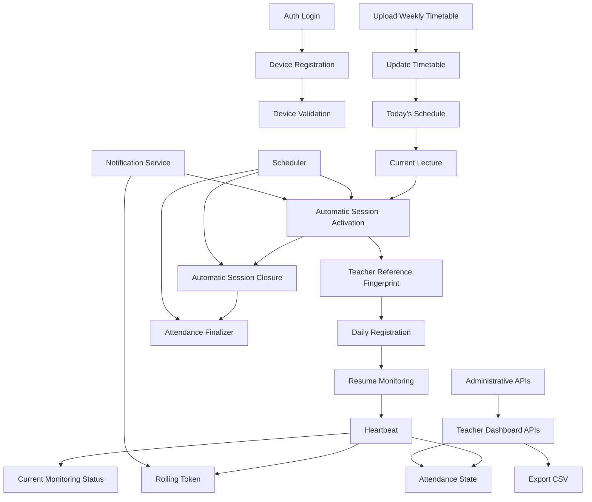

## API Call Sequence Diagrams

### Authentication Flow

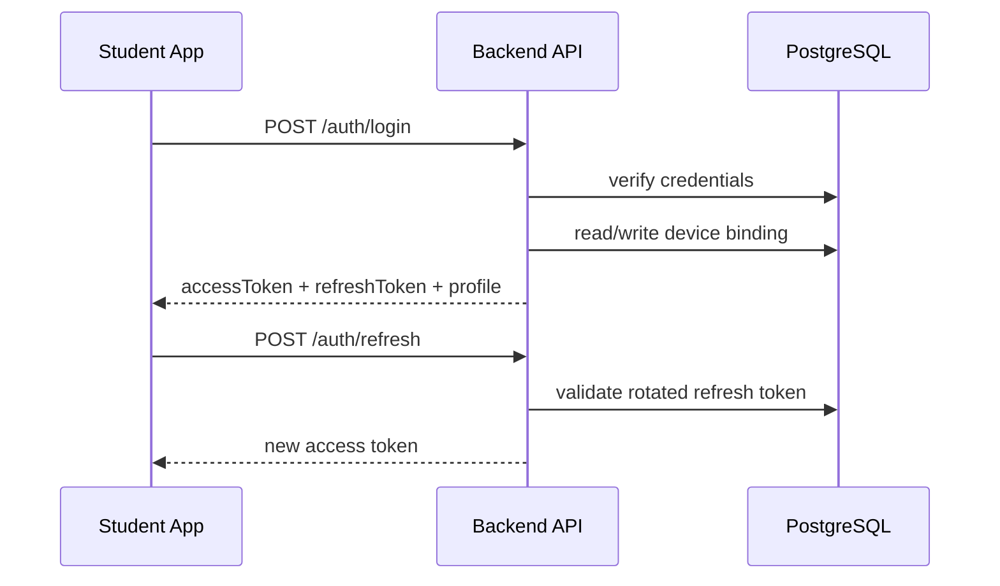

### Student Daily Flow

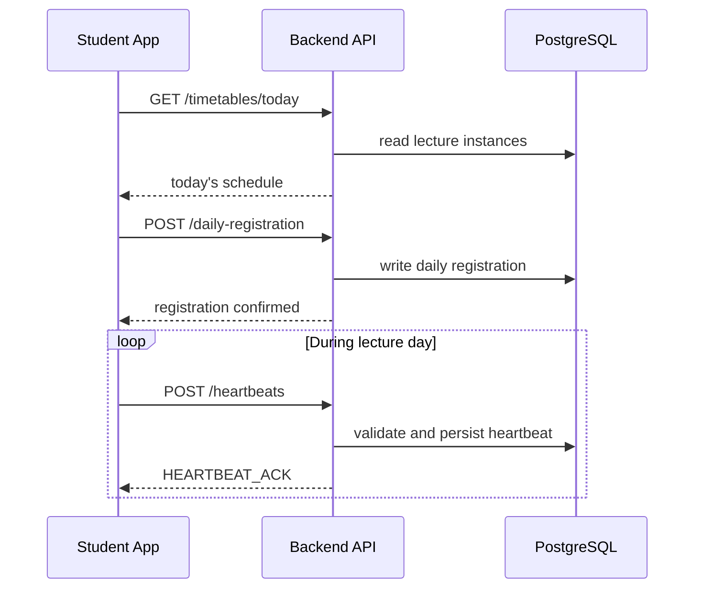

### Teacher Daily Flow

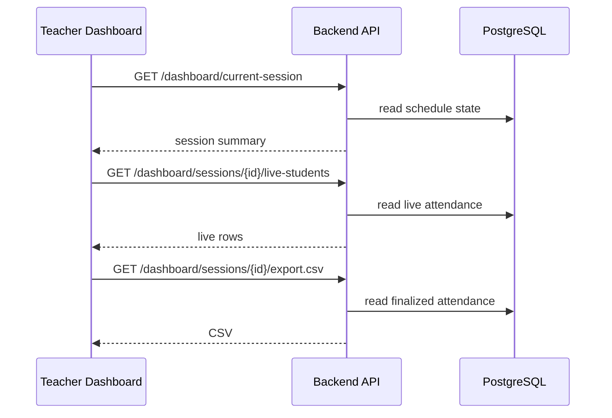

### Attendance Monitoring Flow

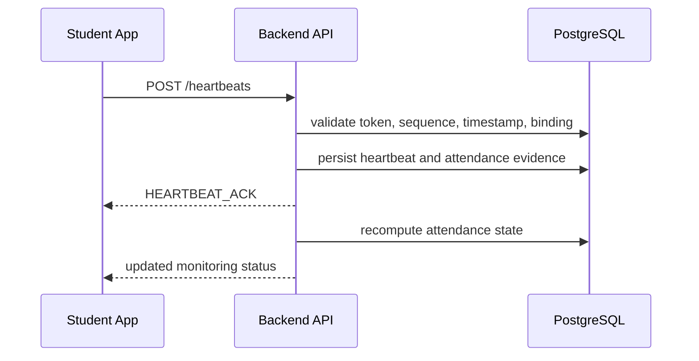

### Automatic Session Lifecycle

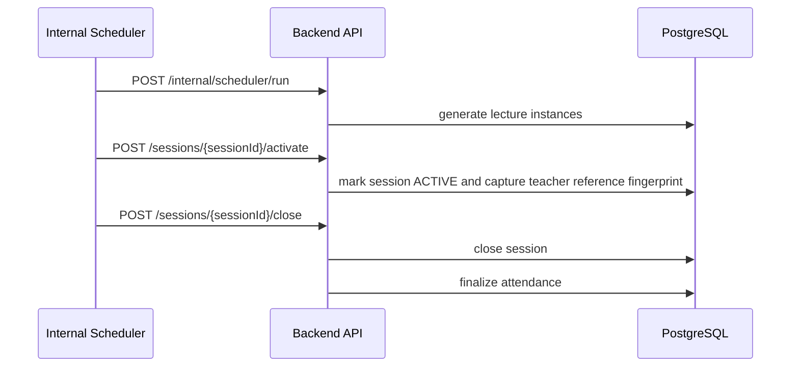

## Authentication Flow

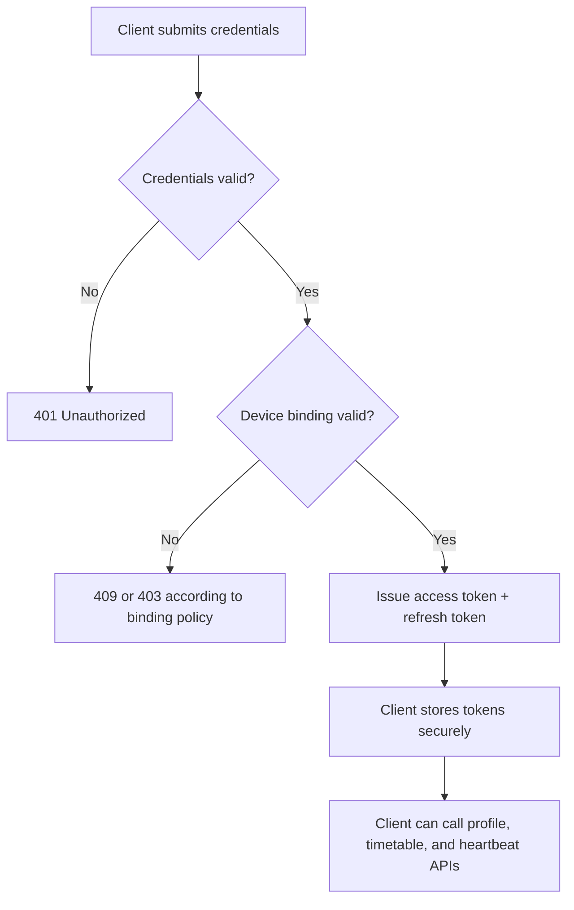

## Student Daily Flow

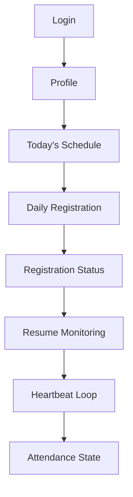

## Teacher Daily Flow

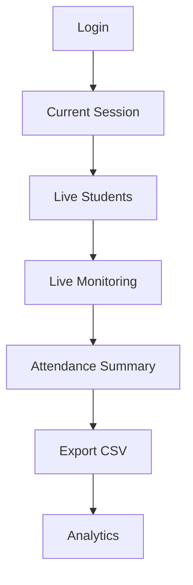

## Attendance Monitoring Flow

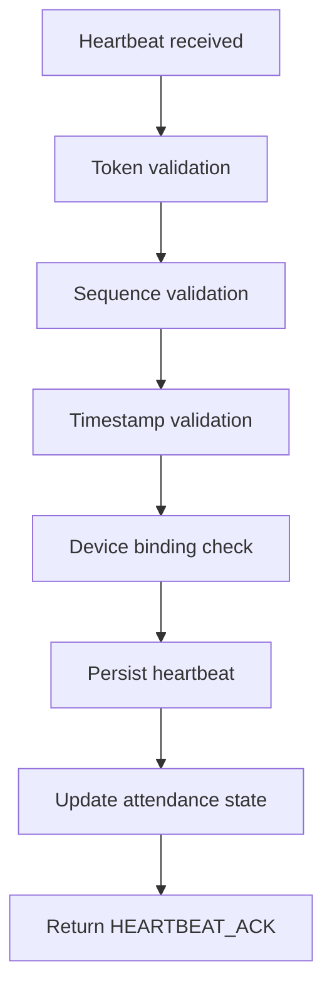

## Automatic Session Lifecycle

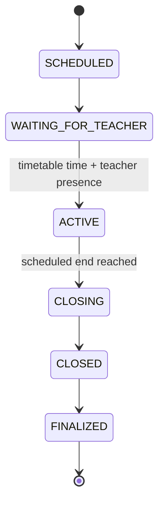

## Notes on Versioning

- This document is V2 because it intentionally removes the manual session-creation contract from the active design.
- Legacy APIs should be treated as compatibility only and excluded from new implementation work unless explicitly retained for migration.
- New endpoints should preserve envelope style, naming consistency, and phase metadata so future revisions can evolve without breaking the contract structure.
# API Contracts V2

This document defines the API surface for the redesigned timetable-driven Smart Attendance Registry.

It is a design-only contract document.

No implementation details, controllers, routes, migrations, or Android changes are included here.

## Scope

The new architecture is based on:

- Weekly timetable upload
- Automatic session creation
- Automatic session activation
- Teacher presence detection
- Daily student registration
- Continuous monitoring
- Automatic attendance generation

The old manual teacher-session workflow is intentionally excluded.

## Common Contract Rules

- All JSON request and response bodies use `application/json` unless explicitly stated otherwise.
- All write requests SHOULD include `X-Request-Id` for tracing.
- Idempotent write operations SHOULD include `X-Idempotency-Key` where stated.
- Read APIs MAY be cached on the client if the contract marks them as offline-supported.
- WebSocket events are part of the same logical contract even when the transport is not HTTP.

## Common Error Catalog

The following meanings are used consistently across APIs in this document:

- `400 Bad Request`: syntax is valid but the payload is malformed, incomplete, or fails a request-level validation rule.
- `401 Unauthorized`: the caller is missing authentication or the token is invalid, expired, or malformed.
- `403 Forbidden`: the caller is authenticated but not allowed to perform the action, or the request is blocked by a state rule.
- `404 Not Found`: the referenced resource does not exist.
- `409 Conflict`: the request clashes with an existing state, duplicate resource, or idempotency violation.
- `422 Unprocessable Entity`: the payload is structurally valid JSON but cannot be accepted because its semantic meaning is invalid.
- `500 Internal Server Error`: an unexpected server, database, or dependency failure occurred.

## Global Field Conventions

- `studentId`, `teacherId`, `adminId`, `sessionId`, `timetableId`, `registrationId`, and `bindingId` are UUIDs.
- `timestamp` fields are ISO 8601 strings in UTC unless a local academic date or local schedule time is explicitly required.
- `attendanceStatus` values are `PRESENT`, `PARTIAL`, `ABSENT`, `REJECTED`, or `PENDING` depending on the workflow stage.
- `sessionState` values are `PLANNED`, `INACTIVE`, `ACTIVE`, `CLOSED`, or `FINALIZED`.
- `deviceFingerprint` is a stable device identity string for student-device or teacher-device correlation.
- `teacherPresence` is a backend-derived boolean or presence state, not a manual teacher input.

## Authentication

### POST /auth/student/login

#### Purpose

Authenticate a student, issue access and refresh tokens, and bind or validate the device identity used for the login.

#### Authentication

None.

#### Request Headers

- `Content-Type: application/json`
- `X-Request-Id` recommended

#### Request Body

```json
{
  "email": "student@example.edu",
  "password": "Str0ngP@ssword!",
  "deviceFingerprint": "8e3f3c3a0d7f4f4cb9d3e1f2a7c4b8a1",
  "deviceName": "Pixel 8",
  "clientTimestamp": "2026-06-29T08:15:00Z"
}
```

Required fields:

- `email`
- `password`
- `deviceFingerprint`

Optional fields:

- `deviceName`
- `clientTimestamp`

Validation rules:

- `email` must be a valid email address.
- `password` must be non-empty.
- `deviceFingerprint` must be a non-empty stable identifier.
- `clientTimestamp` must be parseable when present.

#### Success Response

Status code: `200 OK`

```json
{
  "user": {
    "id": "1a2b3c4d-1111-2222-3333-444455556666",
    "role": "STUDENT",
    "name": "Asha Kumar"
  },
  "accessToken": "eyJhbGciOi...",
  "refreshToken": "rt_eyJhbGciOi...",
  "deviceBinding": {
    "status": "ACTIVE",
    "lastSeenAt": "2026-06-29T08:15:00Z"
  }
}
```

#### Error Responses

| Code | Meaning |
|---|---|
| `400` | The payload is missing required fields or the device fingerprint is malformed. |
| `401` | The email/password pair is invalid or the account credentials cannot be verified. |
| `403` | The account is blocked by policy, locked, or the caller is not allowed to authenticate as a student. |
| `404` | The student account does not exist. |
| `409` | The student has reached the active device-binding limit or the login collides with an enforced binding rule. |
| `422` | The payload is syntactically correct but semantically invalid, such as an unusable device fingerprint format. |
| `500` | Authentication, token issuance, or database persistence failed unexpectedly. |

#### Database Interaction

Reads:

- `students`
- `users`
- `device_bindings`
- `refresh_tokens`

Writes:

- `device_bindings`
- `refresh_tokens`
- login audit records if enabled

#### Business Rules

- A valid student login must return both access and refresh tokens.
- The device fingerprint is validated or bound during login.
- A student cannot exceed the active binding limit defined by policy.
- A successful login updates the device's last-seen timestamp.

#### Notes

- Future compatibility: teacher and admin login continue to share the same auth core.
- Versioning consideration: the device fingerprint shape may evolve, but the login contract must remain backward-compatible.

#### Metadata

| Field | Value |
|---|---|
| Current Phase | Phase 0 compatibility, existing auth surface |
| Future Phase | Phase 1 auth hardening and device correlation |
| Dependencies | User store, device binding store, refresh token store |
| Expected caller | Student |
| Idempotent? | No |
| Rate limited? | Yes |
| Retryable? | Yes, only after the caller confirms the request was not processed |
| Offline supported? | No |

### POST /auth/refresh

#### Purpose

Exchange a valid refresh token for a new access token without re-authentication.

#### Authentication

Refresh token in the request body or secure cookie depending on deployment policy.

#### Request Headers

- `Content-Type: application/json`
- `X-Request-Id` recommended

#### Request Body

```json
{
  "refreshToken": "rt_eyJhbGciOi..."
}
```

Required fields:

- `refreshToken`

Optional fields:

- `deviceFingerprint` if refresh is device-aware in a later phase

Validation rules:

- Token must be signed, unexpired, and not revoked.

#### Success Response

Status code: `200 OK`

```json
{
  "accessToken": "eyJhbGciOi...",
  "expiresInSeconds": 900
}
```

#### Error Responses

| Code | Meaning |
|---|---|
| `400` | The refresh token field is missing or malformed. |
| `401` | The refresh token is invalid, expired, revoked, or cannot be verified. |
| `403` | The refresh attempt is blocked by policy or role restrictions. |
| `404` | The session or token record cannot be found. |
| `409` | The refresh token has already been rotated or a token reuse conflict is detected. |
| `422` | The refresh token is structurally valid but semantically unusable. |
| `500` | Token rotation or database persistence failed unexpectedly. |

#### Database Interaction

Reads:

- `refresh_tokens`
- `users`

Writes:

- `refresh_tokens`
- token rotation audit data if enabled

#### Business Rules

- Refresh rotation MUST preserve session continuity.
- Reused or revoked refresh tokens MUST be rejected.
- The caller does not need to log in again if the refresh token is valid.

#### Notes

- Future compatibility: the refresh flow may later include device and session binding metadata.

#### Metadata

| Field | Value |
|---|---|
| Current Phase | Existing auth surface |
| Future Phase | Phase 1 auth hardening |
| Dependencies | Refresh token store, JWT signing keys |
| Expected caller | Student, Teacher, Admin |
| Idempotent? | No |
| Rate limited? | Yes |
| Retryable? | Yes if the client did not receive a response |
| Offline supported? | No |

### POST /auth/logout

#### Purpose

Revoke the caller's refresh token and end the current authentication session.

#### Authentication

Bearer access token.

#### Request Headers

- `Authorization: Bearer <accessToken>`
- `Content-Type: application/json`
- `X-Request-Id` recommended

#### Request Body

```json
{
  "refreshToken": "rt_eyJhbGciOi..."
}
```

Required fields:

- `refreshToken`

Optional fields:

- none

Validation rules:

- The refresh token must belong to the authenticated user.

#### Success Response

Status code: `200 OK`

```json
{
  "success": true,
  "message": "Logged out"
}
```

#### Error Responses

| Code | Meaning |
|---|---|
| `400` | The request body is missing the refresh token. |
| `401` | The access token or refresh token cannot be verified. |
| `403` | The caller is authenticated but not allowed to revoke this session. |
| `404` | The refresh token record does not exist. |
| `409` | The token was already revoked, so the request conflicts with current state. |
| `422` | The token format is structurally valid but does not map to a logout-able session. |
| `500` | Logout persistence or revocation failed unexpectedly. |

#### Database Interaction

Reads:

- `refresh_tokens`
- `users`

Writes:

- `refresh_tokens`

#### Business Rules

- Logout is safe to repeat from a user-experience perspective, but the backend may treat repeat revocations as a conflict.
- Revoking refresh tokens does not remove historical attendance data.

#### Notes

- Future compatibility: logout may later cascade to device binding revocation in special admin flows.

#### Metadata

| Field | Value |
|---|---|
| Current Phase | Existing auth surface |
| Future Phase | Phase 1 auth hardening |
| Dependencies | Refresh token store |
| Expected caller | Student, Teacher, Admin |
| Idempotent? | Yes, operationally |
| Rate limited? | No |
| Retryable? | Yes |
| Offline supported? | No |

### GET /auth/profile

#### Purpose

Return the authenticated user's profile, role, device-binding summary, and current enrollment context.

#### Authentication

Bearer access token.

#### Request Headers

- `Authorization: Bearer <accessToken>`
- `Accept: application/json`
- `X-Request-Id` recommended

#### Request Body

None.

#### Success Response

Status code: `200 OK`

```json
{
  "id": "1a2b3c4d-1111-2222-3333-444455556666",
  "role": "STUDENT",
  "name": "Asha Kumar",
  "email": "student@example.edu",
  "deviceBindings": [
    {
      "bindingId": "b1111111-2222-3333-4444-555555555555",
      "deviceFingerprint": "8e3f3c3a0d7f4f4cb9d3e1f2a7c4b8a1",
      "status": "ACTIVE"
    }
  ]
}
```

#### Error Responses

| Code | Meaning |
|---|---|
| `400` | The request is malformed, which is rare for a GET but still possible if custom headers are invalid. |
| `401` | The access token is missing, expired, or invalid. |
| `403` | The authenticated user is not allowed to view this profile. |
| `404` | The user record no longer exists. |
| `409` | The profile is temporarily inconsistent with a concurrent role or binding update. |
| `422` | The profile exists but cannot be serialized because of invalid stored state. |
| `500` | Profile lookup failed unexpectedly. |

#### Database Interaction

Reads:

- `users`
- `device_bindings`
- `teachers`
- `students`

Writes:

- none

#### Business Rules

- The profile response MUST reflect the authenticated identity only.
- Device bindings are summarized, not mutated, by this API.

#### Notes

- Future compatibility: additional claims may appear in the profile payload without breaking clients.

#### Metadata

| Field | Value |
|---|---|
| Current Phase | Existing auth surface |
| Future Phase | Phase 1 auth hardening |
| Dependencies | User store, device bindings |
| Expected caller | Student, Teacher, Admin |
| Idempotent? | Yes |
| Rate limited? | No |
| Retryable? | Yes |
| Offline supported? | Read-only cache allowed |

### POST /auth/device-registration

#### Purpose

Register or update the caller's device identity metadata for later validation.

#### Authentication

Bearer access token.

#### Request Headers

- `Authorization: Bearer <accessToken>`
- `Content-Type: application/json`
- `X-Request-Id` recommended

#### Request Body

```json
{
  "deviceFingerprint": "8e3f3c3a0d7f4f4cb9d3e1f2a7c4b8a1",
  "deviceName": "Pixel 8",
  "platform": "ANDROID",
  "platformVersion": "14",
  "enrollmentIdentifier": "enroll-2026-001",
  "secureInstallationIdentifier": "inst-7f2b5e3c"
}
```

Required fields:

- `deviceFingerprint`

Optional fields:

- `deviceName`
- `platform`
- `platformVersion`
- `enrollmentIdentifier`
- `secureInstallationIdentifier`

Validation rules:

- `deviceFingerprint` must be stable and non-empty.
- Platform metadata must be normalized when present.

#### Success Response

Status code: `200 OK`

```json
{
  "registered": true,
  "deviceFingerprint": "8e3f3c3a0d7f4f4cb9d3e1f2a7c4b8a1",
  "status": "ACTIVE"
}
```

#### Error Responses

| Code | Meaning |
|---|---|
| `400` | The registration payload is missing required identity fields. |
| `401` | The access token is invalid or expired. |
| `403` | The caller is not allowed to register a device identity. |
| `404` | The user or device record cannot be found. |
| `409` | The device identity conflicts with an existing active registration. |
| `422` | The payload is valid JSON but the identity data is semantically unusable. |
| `500` | Device registration persistence failed unexpectedly. |

#### Database Interaction

Reads:

- `device_bindings`
- `users`

Writes:

- `device_bindings`

#### Business Rules

- A device identity can be registered independently of session attendance.
- The registration must be reversible by later admin workflows.

#### Notes

- Future compatibility: teacher devices and student devices may eventually use different storage profiles.

#### Metadata

| Field | Value |
|---|---|
| Current Phase | Phase 1 auth hardening |
| Future Phase | Phase 5 teacher presence and device identity |
| Dependencies | Device binding store |
| Expected caller | Student, Teacher, Admin |
| Idempotent? | Yes if the same fingerprint is reused |
| Rate limited? | Yes |
| Retryable? | Yes |
| Offline supported? | No |

### POST /auth/device-validation

#### Purpose

Validate that the caller's device fingerprint matches an active binding and is eligible for the next workflow step.

#### Authentication

Bearer access token.

#### Request Headers

- `Authorization: Bearer <accessToken>`
- `Content-Type: application/json`
- `X-Request-Id` recommended

#### Request Body

```json
{
  "deviceFingerprint": "8e3f3c3a0d7f4f4cb9d3e1f2a7c4b8a1",
  "context": "LOGIN"
}
```

Required fields:

- `deviceFingerprint`

Optional fields:

- `context`

Validation rules:

- The fingerprint must map to an active binding for the authenticated user.

#### Success Response

Status code: `200 OK`

```json
{
  "valid": true,
  "bindingStatus": "ACTIVE"
}
```

#### Error Responses

| Code | Meaning |
|---|---|
| `400` | The fingerprint or context field is malformed. |
| `401` | The access token is invalid or missing. |
| `403` | The device is not allowed for the requested workflow or there are no active bindings. |
| `404` | No matching binding record exists. |
| `409` | The fingerprint is associated with a conflicting active binding state. |
| `422` | The device metadata is syntactically valid but semantically incompatible. |
| `500` | Device validation failed unexpectedly. |

#### Database Interaction

Reads:

- `device_bindings`
- `users`

Writes:

- device validation audit entry if enabled

#### Business Rules

- Validation may be used by login, heartbeat, or admin support flows.
- A mismatch can be flagged without always being a hard rejection in later stages.

#### Notes

- Future compatibility: this API may become an internal service call rather than a public endpoint.

#### Metadata

| Field | Value |
|---|---|
| Current Phase | Phase 1 auth hardening |
| Future Phase | Phase 6 continuous monitoring |
| Dependencies | Device binding store |
| Expected caller | Student, Teacher, Internal Service |
| Idempotent? | Yes |
| Rate limited? | Yes |
| Retryable? | Yes |
| Offline supported? | No |

## Timetable

### POST /timetables/weekly

#### Purpose

Upload the weekly timetable that the system will use to materialize lecture sessions automatically.

#### Authentication

Teacher or Admin.

#### Request Headers

- `Authorization: Bearer <accessToken>`
- `Content-Type: application/json`
- `X-Request-Id` recommended
- `X-Idempotency-Key` recommended

#### Request Body

```json
{
  "academicWeekStart": "2026-06-29",
  "timezone": "Asia/Kolkata",
  "entries": [
    {
      "dayOfWeek": "MONDAY",
      "courseName": "Data Structures",
      "teacherId": "11111111-2222-3333-4444-555555555555",
      "classroomId": "aaaaaaaa-bbbb-cccc-dddd-eeeeeeeeeeee",
      "startTime": "09:00",
      "endTime": "10:00",
      "lectureCode": "DS-101"
    }
  ]
}
```

Required fields:

- `academicWeekStart`
- `timezone`
- `entries`

Optional fields:

- `lectureCode`
- `courseName`

Validation rules:

- The timetable must contain at least one entry.
- `startTime` must be earlier than `endTime`.
- Entries must not overlap for the same classroom and time window.
- The upload must describe a weekly schedule, not a one-off manual session.

#### Success Response

Status code: `201 Created`

```json
{
  "timetableId": "t-12345678-1234-1234-1234-123456789abc",
  "status": "UPLOADED",
  "entryCount": 1
}
```

#### Error Responses

| Code | Meaning |
|---|---|
| `400` | The weekly timetable is structurally invalid or the entries overlap. |
| `401` | The caller is not authenticated. |
| `403` | The caller lacks timetable upload authority. |
| `404` | The referenced teacher or classroom cannot be found. |
| `409` | The upload collides with an existing active timetable version. |
| `422` | The payload is valid JSON but cannot be normalized into a timetable. |
| `500` | Timetable persistence or normalization failed unexpectedly. |

#### Database Interaction

Reads:

- `teachers`
- `classrooms`
- existing `timetable_uploads`

Writes:

- `timetable_uploads`
- `timetable_entries`

#### Business Rules

- Weekly timetable upload is the source of truth for lecture scheduling.
- A timetable upload should be versioned so later changes do not destroy historical sessions.
- The backend may materialize lecture instances from the uploaded timetable later in the day.

#### Notes

- Future compatibility: bulk CSV/Excel ingestion can be added later without changing the contract semantics.

#### Metadata

| Field | Value |
|---|---|
| Current Phase | Phase 3 Timetable Engine |
| Future Phase | Phase 3+ timetable versioning |
| Dependencies | Classroom store, teacher store |
| Expected caller | Teacher, Admin |
| Idempotent? | Yes with idempotency key |
| Rate limited? | Yes |
| Retryable? | Yes if the idempotency key is reused |
| Offline supported? | No |

### PATCH /timetables/:timetableId

#### Purpose

Update a previously uploaded weekly timetable without recreating the entire academic plan.

#### Authentication

Teacher or Admin.

#### Request Headers

- `Authorization: Bearer <accessToken>`
- `Content-Type: application/json`
- `X-Request-Id` recommended
- `X-Idempotency-Key` recommended

#### Request Body

```json
{
  "timezone": "Asia/Kolkata",
  "entries": [
    {
      "entryId": "entry-1",
      "dayOfWeek": "MONDAY",
      "courseName": "Data Structures",
      "teacherId": "11111111-2222-3333-4444-555555555555",
      "classroomId": "aaaaaaaa-bbbb-cccc-dddd-eeeeeeeeeeee",
      "startTime": "09:30",
      "endTime": "10:30"
    }
  ]
}
```

Required fields:

- `entries`

Optional fields:

- `timezone`

Validation rules:

- The timetable update must preserve a valid weekly schedule.
- If the timetable has already been partially materialized, edits must not invalidate completed session history.

#### Success Response

Status code: `200 OK`

```json
{
  "timetableId": "t-12345678-1234-1234-1234-123456789abc",
  "status": "UPDATED",
  "entryCount": 1
}
```

#### Error Responses

| Code | Meaning |
|---|---|
| `400` | The update payload contains invalid or overlapping entries. |
| `401` | The caller is not authenticated. |
| `403` | The caller lacks update authority for this timetable. |
| `404` | The timetable does not exist. |
| `409` | The timetable is locked because conflicting lecture instances already exist. |
| `422` | The update is semantically inconsistent with the active timetable model. |
| `500` | The timetable update failed unexpectedly. |

#### Database Interaction

Reads:

- `timetable_uploads`
- `timetable_entries`
- `lecture_instances`

Writes:

- `timetable_entries`
- `timetable_uploads`
- audit rows if enabled

#### Business Rules

- Existing historical sessions must remain valid.
- Updates should be limited to future or not-yet-materialized schedule windows when possible.

#### Notes

- Future compatibility: timetable version diffing can later be exposed to the dashboard.

#### Metadata

| Field | Value |
|---|---|
| Current Phase | Phase 3 Timetable Engine |
| Future Phase | Phase 3+ timetable maintenance |
| Dependencies | Timetable upload store, lecture materialization rules |
| Expected caller | Teacher, Admin |
| Idempotent? | Yes with idempotency key |
| Rate limited? | Yes |
| Retryable? | Yes |
| Offline supported? | No |

### DELETE /timetables/:timetableId

#### Purpose

Delete a timetable version before it is materialized into future sessions.

#### Authentication

Teacher or Admin.

#### Request Headers

- `Authorization: Bearer <accessToken>`
- `X-Request-Id` recommended

#### Request Body

None.

#### Success Response

Status code: `200 OK`

```json
{
  "deleted": true,
  "timetableId": "t-12345678-1234-1234-1234-123456789abc"
}
```

#### Error Responses

| Code | Meaning |
|---|---|
| `400` | The timetable ID is malformed. |
| `401` | The caller is not authenticated. |
| `403` | The caller cannot delete this timetable. |
| `404` | The timetable does not exist. |
| `409` | The timetable cannot be deleted because future sessions have already been materialized. |
| `422` | The delete request is valid but semantically blocked by schedule rules. |
| `500` | Timetable deletion failed unexpectedly. |

#### Database Interaction

Reads:

- `timetable_uploads`
- `timetable_entries`
- `lecture_instances`

Writes:

- `timetable_uploads` tombstone or deletion marker
- `timetable_entries` tombstone or deletion marker

#### Business Rules

- Only unfrozen timetable versions may be deleted.
- Deletion must not erase historical attendance data already produced from that timetable.

#### Notes

- Future compatibility: soft-delete is preferred so auditability is preserved.

#### Metadata

| Field | Value |
|---|---|
| Current Phase | Phase 3 Timetable Engine |
| Future Phase | Phase 3+ timetable retention |
| Dependencies | Timetable upload store, lecture instance store |
| Expected caller | Teacher, Admin |
| Idempotent? | Yes |
| Rate limited? | No |
| Retryable? | Yes |
| Offline supported? | No |

### GET /timetables/today

#### Purpose

Return the timetable entries and generated lecture plan for the current academic day.

#### Authentication

Student, Teacher, Admin.

#### Request Headers

- `Authorization: Bearer <accessToken>`
- `Accept: application/json`

#### Request Body

None.

#### Success Response

Status code: `200 OK`

```json
{
  "academicDate": "2026-06-29",
  "entries": [
    {
      "sessionId": "s-123",
      "courseName": "Data Structures",
      "classroomId": "aaaaaaaa-bbbb-cccc-dddd-eeeeeeeeeeee",
      "startTime": "09:00",
      "endTime": "10:00",
      "state": "INACTIVE"
    }
  ]
}
```

#### Error Responses

| Code | Meaning |
|---|---|
| `400` | The academic date or timezone context is invalid. |
| `401` | The caller is not authenticated. |
| `403` | The caller is not allowed to see timetable details for the requested scope. |
| `404` | No timetable exists for the requested day. |
| `409` | A concurrent timetable update is in progress and the view cannot be safely built. |
| `422` | The timetable exists but cannot be materialized into a daily view. |
| `500` | The timetable lookup failed unexpectedly. |

#### Database Interaction

Reads:

- `timetable_entries`
- `lecture_instances`
- `sessions`

Writes:

- none

#### Business Rules

- The response reflects the current academic day in the server's configured timezone policy.
- The daily view is the student's primary schedule feed.

#### Notes

- Future compatibility: the response may later include room maps and presence windows.

#### Metadata

| Field | Value |
|---|---|
| Current Phase | Phase 3 Timetable Engine |
| Future Phase | Phase 5 daily registration and schedule feed |
| Dependencies | Timetable entries, lecture instances |
| Expected caller | Student, Teacher, Admin |
| Idempotent? | Yes |
| Rate limited? | No |
| Retryable? | Yes |
| Offline supported? | Read-only cache allowed |

### GET /lectures/current

#### Purpose

Return the currently relevant lecture for the caller's timetable context.

#### Authentication

Student, Teacher, Admin.

#### Request Headers

- `Authorization: Bearer <accessToken>`
- `Accept: application/json`

#### Request Body

None.

#### Success Response

Status code: `200 OK`

```json
{
  "lecture": {
    "sessionId": "s-123",
    "courseName": "Data Structures",
    "state": "ACTIVE",
    "scheduledStartAt": "2026-06-29T03:30:00Z",
    "scheduledEndAt": "2026-06-29T04:30:00Z"
  }
}
```

#### Error Responses

| Code | Meaning |
|---|---|
| `400` | The current-date context is invalid. |
| `401` | The caller is not authenticated. |
| `403` | The caller cannot inspect the active lecture in this scope. |
| `404` | There is no current lecture. |
| `409` | The active lecture is still being materialized and is temporarily unavailable. |
| `422` | The current lecture exists but cannot be represented because schedule data is inconsistent. |
| `500` | The lecture lookup failed unexpectedly. |

#### Database Interaction

Reads:

- `lecture_instances`
- `sessions`
- `teacher_devices`

Writes:

- none

#### Business Rules

- The current lecture is computed from the timetable and activation state, not from manual teacher actions.

#### Notes

- Future compatibility: the payload may later include attendance summary snippets.

#### Metadata

| Field | Value |
|---|---|
| Current Phase | Phase 4 Automatic Session Lifecycle |
| Future Phase | Phase 6 continuous monitoring |
| Dependencies | Lecture instances, session state |
| Expected caller | Student, Teacher, Admin |
| Idempotent? | Yes |
| Rate limited? | No |
| Retryable? | Yes |
| Offline supported? | Read-only cache allowed |

### GET /lectures/next

#### Purpose

Return the next scheduled lecture after the current time.

#### Authentication

Student, Teacher, Admin.

#### Request Headers

- `Authorization: Bearer <accessToken>`
- `Accept: application/json`

#### Request Body

None.

#### Success Response

Status code: `200 OK`

```json
{
  "lecture": {
    "sessionId": "s-124",
    "courseName": "Operating Systems",
    "state": "PLANNED",
    "scheduledStartAt": "2026-06-29T05:00:00Z",
    "scheduledEndAt": "2026-06-29T06:00:00Z"
  }
}
```

#### Error Responses

| Code | Meaning |
|---|---|
| `400` | The current-time context is invalid. |
| `401` | The caller is not authenticated. |
| `403` | The caller cannot inspect the schedule in this scope. |
| `404` | No next lecture exists for the day. |
| `409` | The schedule is locked while a daily materialization job is running. |
| `422` | The schedule exists but cannot be resolved into a next lecture. |
| `500` | The next-lecture lookup failed unexpectedly. |

#### Database Interaction

Reads:

- `lecture_instances`
- `sessions`

Writes:

- none

#### Business Rules

- The next lecture is always derived from timetable data.

#### Notes

- Future compatibility: the client may use this response for prefetching monitoring state.

#### Metadata

| Field | Value |
|---|---|
| Current Phase | Phase 4 Automatic Session Lifecycle |
| Future Phase | Phase 6 continuous monitoring |
| Dependencies | Lecture instances |
| Expected caller | Student, Teacher, Admin |
| Idempotent? | Yes |
| Rate limited? | No |
| Retryable? | Yes |
| Offline supported? | Read-only cache allowed |

## Automatic Session Engine

### GET /sessions/current-active

#### Purpose

Return the current active lecture session for the caller's scope.

#### Authentication

Student, Teacher, Admin.

#### Request Headers

- `Authorization: Bearer <accessToken>`
- `Accept: application/json`

#### Request Body

None.

#### Success Response

Status code: `200 OK`

```json
{
  "session": {
    "sessionId": "s-123",
    "state": "ACTIVE",
    "courseName": "Data Structures",
    "teacherPresence": "DETECTED"
  }
}
```

#### Error Responses

| Code | Meaning |
|---|---|
| `400` | The scope or date context is invalid. |
| `401` | The caller is not authenticated. |
| `403` | The caller cannot view the active session. |
| `404` | There is no active session in the caller's scope. |
| `409` | The session is in a transition state and not yet readable. |
| `422` | The active session cannot be represented because of inconsistent state. |
| `500` | The active-session lookup failed unexpectedly. |

#### Database Interaction

Reads:

- `sessions`
- `teacher_devices`
- `lecture_instances`

Writes:

- none

#### Business Rules

- The active session is a backend-controlled state, not a manually opened session.

#### Notes

- Future compatibility: this endpoint may later expose activation reasons and teacher presence timestamps.

#### Metadata

| Field | Value |
|---|---|
| Current Phase | Phase 4 Automatic Session Lifecycle |
| Future Phase | Phase 6 continuous monitoring |
| Dependencies | Sessions, lecture instances, teacher presence |
| Expected caller | Student, Teacher, Admin |
| Idempotent? | Yes |
| Rate limited? | No |
| Retryable? | Yes |
| Offline supported? | Read-only cache allowed |

### GET /sessions/:sessionId/status

#### Purpose

Return the lifecycle state, activation reason, and current monitoring state for a specific session.

#### Authentication

Student, Teacher, Admin.

#### Request Headers

- `Authorization: Bearer <accessToken>`
- `Accept: application/json`

#### Request Body

None.

#### Success Response

Status code: `200 OK`

```json
{
  "sessionId": "s-123",
  "state": "ACTIVE",
  "activationReason": "SCHEDULE_AND_TEACHER_PRESENT",
  "monitoringState": "RUNNING"
}
```

#### Error Responses

| Code | Meaning |
|---|---|
| `400` | The session ID is malformed. |
| `401` | The caller is not authenticated. |
| `403` | The caller cannot inspect the requested session. |
| `404` | The session does not exist. |
| `409` | The session state is in transition and not yet stable for readback. |
| `422` | The session exists but has an internally inconsistent state model. |
| `500` | The status lookup failed unexpectedly. |

#### Database Interaction

Reads:

- `sessions`
- `session_activation_audit`

Writes:

- none

#### Business Rules

- Session status is derived from the automatic lifecycle engine.

#### Notes

- Future compatibility: status payload may later include attendance thresholds and timing windows.

#### Metadata

| Field | Value |
|---|---|
| Current Phase | Phase 4 Automatic Session Lifecycle |
| Future Phase | Phase 7 attendance finalization |
| Dependencies | Sessions, activation audit |
| Expected caller | Student, Teacher, Admin |
| Idempotent? | Yes |
| Rate limited? | No |
| Retryable? | Yes |
| Offline supported? | Read-only cache allowed |

### GET /sessions/:sessionId/teacher-presence

#### Purpose

Return the backend-detected teacher presence state for a session and the latest detection timestamp.

#### Authentication

Teacher, Admin, Internal Service.

#### Request Headers

- `Authorization: Bearer <accessToken>` or service auth for internal callers
- `Accept: application/json`

#### Request Body

None.

#### Success Response

Status code: `200 OK`

```json
{
  "sessionId": "s-123",
  "teacherPresence": "DETECTED",
  "lastDetectedAt": "2026-06-29T03:31:15Z",
  "source": "TEACHER_DEVICE"
}
```

#### Error Responses

| Code | Meaning |
|---|---|
| `400` | The session ID is malformed. |
| `401` | The caller is not authenticated. |
| `403` | The caller cannot inspect teacher-presence telemetry. |
| `404` | The session does not exist. |
| `409` | Presence detection is temporarily unavailable because the session has not reached its activation window. |
| `422` | Presence data exists but is semantically inconsistent. |
| `500` | Presence lookup failed unexpectedly. |

#### Database Interaction

Reads:

- `teacher_devices`
- `session_activation_audit`
- `sessions`

Writes:

- teacher-presence audit rows if enabled

#### Business Rules

- Teacher presence is a backend signal used to activate or sustain a session.
- This endpoint is read-only from the caller's perspective.

#### Notes

- Future compatibility: additional presence sources can be added later, such as BLE or device-telemetry enrichments.

#### Metadata

| Field | Value |
|---|---|
| Current Phase | Phase 5 teacher presence detection |
| Future Phase | Phase 8 teacher reference capture automation |
| Dependencies | Teacher device store, session state |
| Expected caller | Teacher, Admin, Internal Service |
| Idempotent? | Yes |
| Rate limited? | No |
| Retryable? | Yes |
| Offline supported? | Read-only cache allowed |

### POST /internal/sessions/:sessionId/activate

#### Purpose

Activate a pre-created lecture session when the schedule window and teacher presence conditions are both satisfied.

#### Authentication

Internal Service or Scheduler.

#### Request Headers

- `Authorization: Bearer <serviceToken>`
- `Content-Type: application/json`
- `X-Request-Id` recommended

#### Request Body

```json
{
  "reason": "SCHEDULE_AND_TEACHER_PRESENT",
  "triggeredAt": "2026-06-29T03:31:15Z"
}
```

Required fields:

- `reason`
- `triggeredAt`

Optional fields:

- `teacherPresenceSnapshot`

Validation rules:

- The session must already exist as a materialized lecture instance.
- The session must be within the allowed activation window.
- The teacher presence gate must be satisfied.

#### Success Response

Status code: `200 OK`

```json
{
  "sessionId": "s-123",
  "state": "ACTIVE",
  "activated": true
}
```

#### Error Responses

| Code | Meaning |
|---|---|
| `400` | The activation payload is missing the reason or timestamp. |
| `401` | The service token is missing or invalid. |
| `403` | The caller is not allowed to activate sessions. |
| `404` | The session does not exist. |
| `409` | The session is already active or cannot be activated due to current state. |
| `422` | The session exists but the activation preconditions are not semantically satisfied. |
| `500` | Session activation failed unexpectedly. |

#### Database Interaction

Reads:

- `sessions`
- `teacher_devices`
- `lecture_instances`

Writes:

- `sessions`
- `session_reference_fingerprints`
- `session_activation_audit`

#### Business Rules

- Activation must be atomic.
- Teacher reference fingerprint capture happens at activation time.
- A session cannot be activated if it has already moved past the eligible window.

#### Notes

- Future compatibility: the activation payload may later include richer evidence snapshots.

#### Metadata

| Field | Value |
|---|---|
| Current Phase | Phase 4 Automatic Session Lifecycle |
| Future Phase | Phase 8 reference fingerprint capture automation |
| Dependencies | Sessions, teacher presence, reference fingerprint store |
| Expected caller | Internal Service, Scheduler |
| Idempotent? | Yes if the session is already active |
| Rate limited? | No |
| Retryable? | Yes after a failed attempt if the session remains inactive |
| Offline supported? | No |

### POST /internal/sessions/:sessionId/close

#### Purpose

Close an active lecture session when the lecture window ends or when the scheduler determines the session should terminate.

#### Authentication

Internal Service or Scheduler.

#### Request Headers

- `Authorization: Bearer <serviceToken>`
- `Content-Type: application/json`
- `X-Request-Id` recommended

#### Request Body

```json
{
  "reason": "LECTURE_WINDOW_ENDED",
  "triggeredAt": "2026-06-29T04:30:00Z"
}
```

Required fields:

- `reason`
- `triggeredAt`

Optional fields:

- `attendanceFinalizationMode`

Validation rules:

- The session must be active or otherwise closable by lifecycle policy.

#### Success Response

Status code: `200 OK`

```json
{
  "sessionId": "s-123",
  "state": "CLOSED",
  "closed": true
}
```

#### Error Responses

| Code | Meaning |
|---|---|
| `400` | The close payload is missing the reason or timestamp. |
| `401` | The service token is missing or invalid. |
| `403` | The caller is not allowed to close sessions. |
| `404` | The session does not exist. |
| `409` | The session is already closed or cannot be closed from the current state. |
| `422` | The close request is semantically invalid for the current lifecycle stage. |
| `500` | Session closure failed unexpectedly. |

#### Database Interaction

Reads:

- `sessions`
- `attendance`
- `heartbeats`

Writes:

- `sessions`
- `session_activation_audit`
- attendance finalization markers

#### Business Rules

- Closure must stop new heartbeats from being accepted for the session.
- Closure should trigger or queue final attendance computation.

#### Notes

- Future compatibility: closure may later emit a richer shutdown reason for analytics.

#### Metadata

| Field | Value |
|---|---|
| Current Phase | Phase 4 Automatic Session Lifecycle |
| Future Phase | Phase 7 attendance finalization |
| Dependencies | Sessions, attendance, heartbeat store |
| Expected caller | Internal Service, Scheduler |
| Idempotent? | Yes if the session is already closed |
| Rate limited? | No |
| Retryable? | Yes |
| Offline supported? | No |

## Daily Registration

### POST /daily-registration

#### Purpose

Register a student once for the current academic day and associate that registration with the day's lecture set.

#### Authentication

Student.

#### Request Headers

- `Authorization: Bearer <accessToken>`
- `Content-Type: application/json`
- `X-Request-Id` recommended
- `X-Idempotency-Key` recommended

#### Request Body

```json
{
  "academicDate": "2026-06-29",
  "deviceFingerprint": "8e3f3c3a0d7f4f4cb9d3e1f2a7c4b8a1",
  "mode": "AUTO_MONITORING"
}
```

Required fields:

- `academicDate`
- `deviceFingerprint`

Optional fields:

- `mode`

Validation rules:

- A student may register only once per academic day.
- The device fingerprint must be valid for the student.

#### Success Response

Status code: `201 Created`

```json
{
  "registrationId": "r-12345678-1234-1234-1234-123456789abc",
  "registered": true,
  "monitoringState": "RUNNING"
}
```

#### Error Responses

| Code | Meaning |
|---|---|
| `400` | The academic date or device fingerprint is missing or malformed. |
| `401` | The student is not authenticated. |
| `403` | The student cannot register because the device is unbound or the account is blocked. |
| `404` | The student or schedule context cannot be found. |
| `409` | The student has already registered for the day. |
| `422` | The request is syntactically valid but semantically invalid for today's registration window. |
| `500` | Registration persistence or association failed unexpectedly. |

#### Database Interaction

Reads:

- `students`
- `device_bindings`
- `timetable_entries`
- `lecture_instances`

Writes:

- `daily_student_registrations`
- `attendance` seed rows or association rows

#### Business Rules

- Registration represents participation for all timetable sessions scheduled that day.
- Daily registration is the student's entry point into monitoring.
- The backend should associate future lecture sessions automatically.

#### Notes

- Future compatibility: registration can later include attendance-preference metadata or transport hints.

#### Metadata

| Field | Value |
|---|---|
| Current Phase | Phase 5 Daily Registration |
| Future Phase | Phase 6 continuous monitoring |
| Dependencies | Student auth, device bindings, timetable |
| Expected caller | Student |
| Idempotent? | Yes |
| Rate limited? | Yes |
| Retryable? | Yes |
| Offline supported? | No |

### GET /daily-registration/status

#### Purpose

Return whether the student is registered for the current day and whether monitoring is active.

#### Authentication

Student.

#### Request Headers

- `Authorization: Bearer <accessToken>`
- `Accept: application/json`

#### Request Body

None.

#### Success Response

Status code: `200 OK`

```json
{
  "academicDate": "2026-06-29",
  "registered": true,
  "registrationId": "r-12345678-1234-1234-1234-123456789abc",
  "monitoringState": "RUNNING"
}
```

#### Error Responses

| Code | Meaning |
|---|---|
| `400` | The date context is invalid. |
| `401` | The caller is not authenticated. |
| `403` | The student cannot view this registration context. |
| `404` | No registration exists for the day. |
| `409` | The registration is being finalized and the status is transient. |
| `422` | The registration exists but is not consistent with schedule state. |
| `500` | Registration lookup failed unexpectedly. |

#### Database Interaction

Reads:

- `daily_student_registrations`
- `attendance`

Writes:

- none

#### Business Rules

- This endpoint is the student-visible confirmation of the daily registration contract.

#### Notes

- Future compatibility: monitoring diagnostics may later be included.

#### Metadata

| Field | Value |
|---|---|
| Current Phase | Phase 5 Daily Registration |
| Future Phase | Phase 6 continuous monitoring |
| Dependencies | Daily registrations, attendance seeds |
| Expected caller | Student |
| Idempotent? | Yes |
| Rate limited? | No |
| Retryable? | Yes |
| Offline supported? | Read-only cache allowed |

### POST /daily-registration/resume-monitoring

#### Purpose

Resume monitoring after a temporary interruption without creating a new daily registration.

#### Authentication

Student.

#### Request Headers

- `Authorization: Bearer <accessToken>`
- `Content-Type: application/json`
- `X-Request-Id` recommended

#### Request Body

```json
{
  "registrationId": "r-12345678-1234-1234-1234-123456789abc",
  "reason": "NETWORK_RECOVERY"
}
```

Required fields:

- `registrationId`

Optional fields:

- `reason`

Validation rules:

- The registration must belong to the authenticated student.
- The session or daily monitoring context must still be open.

#### Success Response

Status code: `200 OK`

```json
{
  "registrationId": "r-12345678-1234-1234-1234-123456789abc",
  "monitoringState": "RUNNING"
}
```

#### Error Responses

| Code | Meaning |
|---|---|
| `400` | The registration ID or reason is malformed. |
| `401` | The caller is not authenticated. |
| `403` | The caller is not allowed to resume this registration. |
| `404` | The registration does not exist. |
| `409` | Monitoring is already running or the registration is locked. |
| `422` | The request is semantically invalid because the monitoring window has expired. |
| `500` | Monitoring resume failed unexpectedly. |

#### Database Interaction

Reads:

- `daily_student_registrations`
- `attendance`

Writes:

- monitoring state markers if stored separately

#### Business Rules

- Resuming monitoring does not create a second registration.
- This is used after transient recovery, not a full re-enrollment.

#### Notes

- Future compatibility: the resume flow may later be folded into reconnect handling.

#### Metadata

| Field | Value |
|---|---|
| Current Phase | Phase 5 Daily Registration |
| Future Phase | Phase 6 continuous monitoring |
| Dependencies | Registration store, attendance store |
| Expected caller | Student |
| Idempotent? | Yes |
| Rate limited? | No |
| Retryable? | Yes |
| Offline supported? | No |

### POST /daily-registration/cancel

#### Purpose

Cancel the student's monitoring state for the day without removing historical registration evidence.

#### Authentication

Student.

#### Request Headers

- `Authorization: Bearer <accessToken>`
- `Content-Type: application/json`
- `X-Request-Id` recommended

#### Request Body

```json
{
  "registrationId": "r-12345678-1234-1234-1234-123456789abc",
  "reason": "LEFT_CAMPUS"
}
```

Required fields:

- `registrationId`

Optional fields:

- `reason`

Validation rules:

- The registration must belong to the caller.
- Cancellation should not erase historical attendance data.

#### Success Response

Status code: `200 OK`

```json
{
  "registrationId": "r-12345678-1234-1234-1234-123456789abc",
  "monitoringState": "CANCELLED"
}
```

#### Error Responses

| Code | Meaning |
|---|---|
| `400` | The registration ID is malformed. |
| `401` | The caller is not authenticated. |
| `403` | The caller is not allowed to cancel the registration. |
| `404` | The registration does not exist. |
| `409` | The registration is already cancelled or finalized. |
| `422` | The cancellation is semantically invalid because the day has already closed. |
| `500` | Registration cancellation failed unexpectedly. |

#### Database Interaction

Reads:

- `daily_student_registrations`
- `attendance`

Writes:

- monitoring state markers if stored separately

#### Business Rules

- Cancellation is a workflow control, not a deletion of attendance history.

#### Notes

- Future compatibility: cancellation may later be replaced by stronger leave-state modelling.

#### Metadata

| Field | Value |
|---|---|
| Current Phase | Phase 5 Daily Registration |
| Future Phase | Phase 6 continuous monitoring |
| Dependencies | Registration store |
| Expected caller | Student |
| Idempotent? | Yes |
| Rate limited? | No |
| Retryable? | Yes |
| Offline supported? | No |

## Attendance Monitoring

### POST /heartbeats

#### Purpose

Submit a heartbeat containing the student's Wi-Fi fingerprint, token proof, sequence number, and timestamp.

#### Authentication

Student.

#### Request Headers

- `Authorization: Bearer <accessToken>` or a session-scoped auth token
- `Content-Type: application/json`
- `X-Request-Id` recommended

#### Request Body

```json
{
  "studentId": "1a2b3c4d-1111-2222-3333-444455556666",
  "sessionId": "s-123",
  "sequenceNumber": 7,
  "tokenHmac": "b2b6f4d2f3d5a7f4f1c4a92b2d1e7f3a",
  "fingerprintData": [
    {
      "bssid": "AA:BB:CC:DD:EE:FF",
      "ssid": "CampusWiFi",
      "rssi": -58
    }
  ],
  "timestamp": "2026-06-29T03:31:45Z",
  "deviceFingerprint": "8e3f3c3a0d7f4f4cb9d3e1f2a7c4b8a1"
}
```

Required fields:

- `studentId`
- `sessionId`
- `sequenceNumber`
- `tokenHmac`
- `timestamp`
- `deviceFingerprint`

Optional fields:

- `fingerprintData`

Validation rules:

- The token HMAC must match the current or immediately preceding rolling token for the session.
- `sequenceNumber` must move forward according to the gap-tolerant rules defined by the monitoring engine.
- The timestamp must fall inside the accepted clock window.
- The device fingerprint must match an active binding or an allowed mismatch policy path.

#### Success Response

Status code: `200 OK`

```json
{
  "ack": "HEARTBEAT_ACK",
  "studentId": "1a2b3c4d-1111-2222-3333-444455556666",
  "sequenceNumber": 7,
  "serverTimestamp": "2026-06-29T03:31:45Z",
  "fingerprintResult": "INSIDE_CLASSROOM"
}
```

#### Error Responses

| Code | Meaning |
|---|---|
| `400` | The heartbeat payload is malformed, out of sequence, or timestamp-invalid. |
| `401` | The rolling token proof fails validation or the heartbeat references an invalidated token. |
| `403` | The student is not allowed to send heartbeats for this session, or the session is DISCONNECTED. |
| `404` | The session or student-session pairing cannot be found. |
| `409` | The sequence number conflicts with a newer accepted heartbeat or a duplicate state. |
| `422` | The heartbeat is structurally valid but semantically inconsistent with the current session state. |
| `500` | Heartbeat persistence, classification, or attendance update failed unexpectedly. |

#### Database Interaction

Reads:

- `sessions`
- `tokens`
- `device_bindings`
- `lecture_instances`
- `daily_student_registrations`

Writes:

- `heartbeats`
- `attendance`
- `sequence_gaps`
- `session_activation_audit` if monitoring events are stored there

#### Business Rules

- Heartbeats are the core monitoring signal.
- The backend must persist accepted and rejected heartbeats for audit purposes.
- Heartbeat validation is ordered, and the first failing check determines the response.

#### Notes

- Future compatibility: Wi-Fi fingerprint classification may later be enhanced with a dedicated matching service.

#### Metadata

| Field | Value |
|---|---|
| Current Phase | Phase 6 Continuous Monitoring |
| Future Phase | Phase 7 attendance generation and confidence scoring |
| Dependencies | Rolling tokens, session state, device bindings, Wi-Fi scans |
| Expected caller | Student |
| Idempotent? | No |
| Rate limited? | Yes |
| Retryable? | Yes only when the server explicitly indicates the heartbeat was not accepted |
| Offline supported? | No |

### GET /rolling-token/current

#### Purpose

Return the current rolling token metadata for the active session so the client can prepare the next heartbeat proof.

#### Authentication

Student or Internal Service.

#### Request Headers

- `Authorization: Bearer <accessToken>`
- `Accept: application/json`

#### Request Body

None.

#### Success Response

Status code: `200 OK`

```json
{
  "sessionId": "s-123",
  "sequenceNumber": 7,
  "tokenIssuedAt": "2026-06-29T03:31:30Z",
  "overlapWindowSeconds": 5
}
```

#### Error Responses

| Code | Meaning |
|---|---|
| `400` | The session context is malformed. |
| `401` | The caller is not authenticated. |
| `403` | The caller cannot view the current token for this session. |
| `404` | The active session or token record does not exist. |
| `409` | The session is transitioning and the token is not yet stable. |
| `422` | The token metadata exists but is semantically inconsistent. |
| `500` | Token lookup failed unexpectedly. |

#### Database Interaction

Reads:

- `tokens`
- `sessions`

Writes:

- none

#### Business Rules

- The raw rolling token is never returned to normal clients unless a later design explicitly permits it.
- The metadata view helps clients align heartbeat sequence state.

#### Notes

- Future compatibility: the contract may later become a WebSocket-only event feed.

#### Metadata

| Field | Value |
|---|---|
| Current Phase | Phase 6 Continuous Monitoring |
| Future Phase | Phase 6+ reconnect support |
| Dependencies | Rolling token store |
| Expected caller | Student, Internal Service |
| Idempotent? | Yes |
| Rate limited? | No |
| Retryable? | Yes |
| Offline supported? | Read-only cache allowed |

### GET /monitoring/status

#### Purpose

Return the current monitoring state for the active student-session pair.

#### Authentication

Student.

#### Request Headers

- `Authorization: Bearer <accessToken>`
- `Accept: application/json`

#### Request Body

None.

#### Success Response

Status code: `200 OK`

```json
{
  "sessionId": "s-123",
  "monitoringState": "RUNNING",
  "lastHeartbeatAt": "2026-06-29T03:31:45Z",
  "missedHeartbeatCount": 0
}
```

#### Error Responses

| Code | Meaning |
|---|---|
| `400` | The session context is malformed. |
| `401` | The caller is not authenticated. |
| `403` | The caller cannot inspect this monitoring state. |
| `404` | No monitoring context exists. |
| `409` | The monitoring state is transitioning and cannot yet be displayed. |
| `422` | The monitoring state is semantically inconsistent. |
| `500` | Monitoring status lookup failed unexpectedly. |

#### Database Interaction

Reads:

- `attendance`
- `heartbeats`
- `sequence_gaps`

Writes:

- none

#### Business Rules

- Monitoring status is a live operational view, not the final attendance result.

#### Notes

- Future compatibility: more granular connectivity sub-states can be added later.

#### Metadata

| Field | Value |
|---|---|
| Current Phase | Phase 6 Continuous Monitoring |
| Future Phase | Phase 6+ fault tolerance |
| Dependencies | Heartbeats, attendance, sequence gaps |
| Expected caller | Student |
| Idempotent? | Yes |
| Rate limited? | No |
| Retryable? | Yes |
| Offline supported? | Read-only cache allowed |

### GET /attendance/state

#### Purpose

Return the current attendance state for the active session, including live confidence and classification data.

#### Authentication

Student, Teacher, Admin.

#### Request Headers

- `Authorization: Bearer <accessToken>`
- `Accept: application/json`

#### Request Body

None.

#### Success Response

Status code: `200 OK`

```json
{
  "sessionId": "s-123",
  "studentId": "1a2b3c4d-1111-2222-3333-444455556666",
  "attendanceStatus": "PARTIAL",
  "presenceConfidenceScore": 72,
  "breakdown": {
    "fingerprintScore": 70,
    "continuityScore": 75,
    "packetStability": 80,
    "joinScore": 60
  }
}
```

#### Error Responses

| Code | Meaning |
|---|---|
| `400` | The session or student context is malformed. |
| `401` | The caller is not authenticated. |
| `403` | The caller cannot inspect attendance state. |
| `404` | No attendance state exists for the requested context. |
| `409` | The attendance record is still being finalized. |
| `422` | The attendance state exists but the computed score is semantically inconsistent. |
| `500` | Attendance state lookup failed unexpectedly. |

#### Database Interaction

Reads:

- `attendance`
- `heartbeats`
- `sessions`

Writes:

- none

#### Business Rules

- This is the live attendance view used by the client and dashboard.

#### Notes

- Future compatibility: the breakdown may later include fingerprint metadata confidence fields.

#### Metadata

| Field | Value |
|---|---|
| Current Phase | Phase 7 Attendance Generation |
| Future Phase | Phase 7+ confidence model evolution |
| Dependencies | Attendance, heartbeats, session thresholds |
| Expected caller | Student, Teacher, Admin |
| Idempotent? | Yes |
| Rate limited? | No |
| Retryable? | Yes |
| Offline supported? | Read-only cache allowed |

### POST /attendance/reconnect

#### Purpose

Allow the student to resume attendance monitoring after a temporary connection loss without creating a new registration.

#### Authentication

Student.

#### Request Headers

- `Authorization: Bearer <accessToken>`
- `Content-Type: application/json`
- `X-Request-Id` recommended

#### Request Body

```json
{
  "sessionId": "s-123",
  "reason": "WS_RECONNECTED"
}
```

Required fields:

- `sessionId`

Optional fields:

- `reason`

Validation rules:

- The session must still be within the monitoring window.

#### Success Response

Status code: `200 OK`

```json
{
  "sessionId": "s-123",
  "monitoringState": "RUNNING",
  "reconnected": true
}
```

#### Error Responses

| Code | Meaning |
|---|---|
| `400` | The session ID or reason is malformed. |
| `401` | The caller is not authenticated. |
| `403` | The caller cannot resume monitoring for this session. |
| `404` | The session does not exist or cannot be resumed. |
| `409` | The session is already active or the reconnect conflicts with the current state. |
| `422` | The reconnect request is semantically invalid because the session has expired. |
| `500` | Reconnect handling failed unexpectedly. |

#### Database Interaction

Reads:

- `attendance`
- `heartbeats`
- `sessions`

Writes:

- monitoring recovery markers if stored separately

#### Business Rules

- Reconnect resumes monitoring; it does not create a second session.

#### Notes

- Future compatibility: reconnect may later become a WebSocket-first flow.

#### Metadata

| Field | Value |
|---|---|
| Current Phase | Phase 6 Continuous Monitoring |
| Future Phase | Phase 6+ reconnect recovery |
| Dependencies | Attendance, sessions, heartbeats |
| Expected caller | Student |
| Idempotent? | Yes |
| Rate limited? | No |
| Retryable? | Yes |
| Offline supported? | No |

## Wi-Fi Fingerprinting

### POST /fingerprints/teacher-reference

#### Purpose

Capture and store the teacher's classroom reference fingerprint for a session when the session activates.

#### Authentication

Teacher or Internal Service.

#### Request Headers

- `Authorization: Bearer <accessToken>`
- `Content-Type: application/json`
- `X-Request-Id` recommended

#### Request Body

```json
{
  "sessionId": "s-123",
  "classroomId": "aaaaaaaa-bbbb-cccc-dddd-eeeeeeeeeeee",
  "capturedAt": "2026-06-29T03:31:15Z",
  "sampleType": "TEACHER_REFERENCE",
  "wifiFingerprint": [
    {
      "bssid": "AA:BB:CC:DD:EE:FF",
      "ssid": "CampusWiFi",
      "rssi": -58
    }
  ]
}
```

Required fields:

- `sessionId`
- `classroomId`
- `capturedAt`
- `wifiFingerprint`

Optional fields:

- `sampleType`

Validation rules:

- The session must be active or in the activation boundary.
- The fingerprint must be captured from the correct classroom context.
- Access point entries must satisfy MAC and RSSI validation rules.

#### Success Response

Status code: `201 Created`

```json
{
  "stored": true,
  "sessionId": "s-123",
  "referenceFingerprintId": "f-12345678-1234-1234-1234-123456789abc"
}
```

#### Error Responses

| Code | Meaning |
|---|---|
| `400` | The fingerprint payload is malformed or contains invalid access points. |
| `401` | The caller is not authenticated. |
| `403` | The caller cannot capture a teacher reference fingerprint. |
| `404` | The session or classroom cannot be found. |
| `409` | A reference fingerprint already exists for the session and the write conflicts with current state. |
| `422` | The sample is valid JSON but cannot be accepted as a teacher reference capture. |
| `500` | Fingerprint persistence failed unexpectedly. |

#### Database Interaction

Reads:

- `sessions`
- `classrooms`
- `fingerprints`

Writes:

- `session_reference_fingerprints`
- `fingerprints` if sample history is retained there

#### Business Rules

- A teacher reference fingerprint is session-scoped.
- Automatic session activation should trigger this capture path.

#### Notes

- Future compatibility: the reference capture may later store richer AP metadata.

#### Metadata

| Field | Value |
|---|---|
| Current Phase | Phase 8 Reference Fingerprint Capture Automation |
| Future Phase | Phase 8+ fingerprint matching |
| Dependencies | Sessions, classrooms, fingerprint store |
| Expected caller | Teacher, Internal Service |
| Idempotent? | Yes if the same session reference is re-submitted |
| Rate limited? | Yes |
| Retryable? | Yes |
| Offline supported? | No |

### POST /fingerprints/student-scan

#### Purpose

Submit or stage a student Wi-Fi fingerprint scan for monitoring or later matching.

#### Authentication

Student.

#### Request Headers

- `Authorization: Bearer <accessToken>`
- `Content-Type: application/json`
- `X-Request-Id` recommended

#### Request Body

```json
{
  "sessionId": "s-123",
  "capturedAt": "2026-06-29T03:31:45Z",
  "wifiFingerprint": [
    {
      "bssid": "AA:BB:CC:DD:EE:FF",
      "ssid": "CampusWiFi",
      "rssi": -61
    }
  ],
  "deviceFingerprint": "8e3f3c3a0d7f4f4cb9d3e1f2a7c4b8a1"
}
```

Required fields:

- `sessionId`
- `capturedAt`
- `wifiFingerprint`
- `deviceFingerprint`

Optional fields:

- none

Validation rules:

- The scan must belong to an active or soon-to-be-active session context.
- The scan payload must contain valid access points if present.

#### Success Response

Status code: `200 OK`

```json
{
  "stored": true,
  "scanId": "scan-12345678-1234-1234-1234-123456789abc"
}
```

#### Error Responses

| Code | Meaning |
|---|---|
| `400` | The scan payload is malformed or contains invalid AP entries. |
| `401` | The caller is not authenticated. |
| `403` | The caller cannot submit scan data for this session. |
| `404` | The session cannot be found. |
| `409` | The scan conflicts with a current session state or duplicate submission. |
| `422` | The scan is valid JSON but cannot be staged for this workflow. |
| `500` | Scan persistence or staging failed unexpectedly. |

#### Database Interaction

Reads:

- `sessions`
- `device_bindings`
- `daily_student_registrations`

Writes:

- `heartbeats`
- `fingerprints` if scan history is retained separately

#### Business Rules

- Student fingerprint scans are part of the monitoring pipeline.
- The scan may later feed a dedicated matching engine.

#### Notes

- Future compatibility: this endpoint may become an internal-only ingestion path once heartbeat submission is fully authoritative.

#### Metadata

| Field | Value |
|---|---|
| Current Phase | Phase 6 Continuous Monitoring |
| Future Phase | Future matching pipeline |
| Dependencies | Sessions, device bindings, registrations |
| Expected caller | Student |
| Idempotent? | No |
| Rate limited? | Yes |
| Retryable? | Yes, but duplicates should be deduplicated server-side if possible |
| Offline supported? | No |

### GET /fingerprints/metadata

#### Purpose

Return metadata about stored teacher and student fingerprint captures.

#### Authentication

Teacher, Admin, Internal Service.

#### Request Headers

- `Authorization: Bearer <accessToken>`
- `Accept: application/json`

#### Request Body

None.

#### Success Response

Status code: `200 OK`

```json
{
  "sessionId": "s-123",
  "teacherReferenceCaptured": true,
  "lastCapturedAt": "2026-06-29T03:31:15Z",
  "apCount": 12,
  "source": "SESSION_REFERENCE"
}
```

#### Error Responses

| Code | Meaning |
|---|---|
| `400` | The fingerprint scope is malformed. |
| `401` | The caller is not authenticated. |
| `403` | The caller cannot inspect fingerprint metadata. |
| `404` | No metadata exists for the requested scope. |
| `409` | Metadata is being refreshed and is temporarily inconsistent. |
| `422` | The fingerprint metadata exists but is semantically invalid. |
| `500` | Metadata lookup failed unexpectedly. |

#### Database Interaction

Reads:

- `fingerprints`
- `session_reference_fingerprints`
- `sessions`

Writes:

- none

#### Business Rules

- Metadata is read-only and intended for diagnostics and dashboard display.

#### Notes

- Future compatibility: metadata may later include training quality and confidence hints.

#### Metadata

| Field | Value |
|---|---|
| Current Phase | Phase 8 Fingerprint Capture Automation |
| Future Phase | Future matching pipeline |
| Dependencies | Fingerprint tables |
| Expected caller | Teacher, Admin, Internal Service |
| Idempotent? | Yes |
| Rate limited? | No |
| Retryable? | Yes |
| Offline supported? | Read-only cache allowed |

### POST /fingerprints/match

#### Purpose

Document-only future matching endpoint for comparing a student scan against the reference fingerprint.

#### Authentication

Internal Service.

#### Request Headers

- `Authorization: Bearer <serviceToken>`
- `Content-Type: application/json`

#### Request Body

```json
{
  "sessionId": "s-123",
  "studentScanId": "scan-12345678-1234-1234-1234-123456789abc"
}
```

Required fields:

- `sessionId`
- `studentScanId`

Optional fields:

- none

Validation rules:

- The matching request is only valid after the session reference fingerprint exists.

#### Success Response

Status code: `200 OK`

```json
{
  "classification": "INSIDE_CLASSROOM",
  "matchConfidence": 87,
  "matchedAt": "2026-06-29T03:31:45Z"
}
```

#### Error Responses

| Code | Meaning |
|---|---|
| `400` | The matching request is malformed. |
| `401` | The service token is invalid. |
| `403` | The caller is not allowed to invoke fingerprint matching. |
| `404` | The session or scan does not exist. |
| `409` | The matching request conflicts with a session state transition. |
| `422` | The reference and student scan are semantically incompatible for matching. |
| `500` | Matching failed unexpectedly. |

#### Database Interaction

Reads:

- `session_reference_fingerprints`
- `fingerprints`
- `heartbeats`

Writes:

- match result audit rows if enabled

#### Business Rules

- This endpoint is document-only and reserved for future matching logic.
- The final matching model will be defined in a later phase.

#### Notes

- Future compatibility: the endpoint may later be folded into heartbeat validation.

#### Metadata

| Field | Value |
|---|---|
| Current Phase | Future only |
| Future Phase | Later matching phase |
| Dependencies | Teacher reference fingerprints, student scans |
| Expected caller | Internal Service |
| Idempotent? | Yes |
| Rate limited? | No |
| Retryable? | Yes |
| Offline supported? | No |

## Attendance

### GET /attendance/current

#### Purpose

Return the current attendance state for the authenticated caller within the active session.

#### Authentication

Student, Teacher, Admin.

#### Request Headers

- `Authorization: Bearer <accessToken>`
- `Accept: application/json`

#### Request Body

None.

#### Success Response

Status code: `200 OK`

```json
{
  "sessionId": "s-123",
  "studentId": "1a2b3c4d-1111-2222-3333-444455556666",
  "attendanceStatus": "PARTIAL",
  "currentScore": 72
}
```

#### Error Responses

| Code | Meaning |
|---|---|
| `400` | The attendance context is malformed. |
| `401` | The caller is not authenticated. |
| `403` | The caller cannot inspect the current attendance record. |
| `404` | The attendance record does not exist. |
| `409` | The attendance record is being updated concurrently. |
| `422` | The attendance state exists but cannot be rendered because of invalid component values. |
| `500` | Attendance lookup failed unexpectedly. |

#### Database Interaction

Reads:

- `attendance`
- `sessions`

Writes:

- none

#### Business Rules

- This endpoint returns the live attendance view, not the finalized result.

#### Notes

- Future compatibility: it may later include override metadata and confidence breakdowns.

#### Metadata

| Field | Value |
|---|---|
| Current Phase | Phase 7 Attendance Generation |
| Future Phase | Phase 7+ dashboard display |
| Dependencies | Attendance table, session state |
| Expected caller | Student, Teacher, Admin |
| Idempotent? | Yes |
| Rate limited? | No |
| Retryable? | Yes |
| Offline supported? | Read-only cache allowed |

### GET /attendance/history

#### Purpose

Return the caller's attendance history across past sessions.

#### Authentication

Student, Teacher, Admin.

#### Request Headers

- `Authorization: Bearer <accessToken>`
- `Accept: application/json`

#### Request Body

None.

#### Success Response

Status code: `200 OK`

```json
{
  "items": [
    {
      "sessionId": "s-122",
      "courseName": "Data Structures",
      "attendanceStatus": "PRESENT",
      "confidenceScore": 88,
      "sessionDate": "2026-06-26"
    }
  ]
}
```

#### Error Responses

| Code | Meaning |
|---|---|
| `400` | The filter or pagination parameters are malformed. |
| `401` | The caller is not authenticated. |
| `403` | The caller cannot access history for this scope. |
| `404` | No history exists for the requested filter set. |
| `409` | A concurrent export or summary job is reading the same dataset. |
| `422` | The history can be queried but not fully rendered because of invalid stored data. |
| `500` | History lookup failed unexpectedly. |

#### Database Interaction

Reads:

- `attendance`
- `sessions`
- `lecture_instances`

Writes:

- none

#### Business Rules

- History is immutable except where administrative overrides have been recorded.

#### Notes

- Future compatibility: paging and filtering can be expanded later without changing the core contract.

#### Metadata

| Field | Value |
|---|---|
| Current Phase | Phase 7 Attendance Generation |
| Future Phase | Phase 8 analytics and reporting |
| Dependencies | Attendance history, sessions |
| Expected caller | Student, Teacher, Admin |
| Idempotent? | Yes |
| Rate limited? | No |
| Retryable? | Yes |
| Offline supported? | Read-only cache allowed |

### GET /attendance/today

#### Purpose

Return today\'s attendance summary for the caller.

#### Authentication

Student, Teacher, Admin.

#### Request Headers

- `Authorization: Bearer <accessToken>`
- `Accept: application/json`

#### Request Body

None.

#### Success Response

Status code: `200 OK`

```json
{
  "academicDate": "2026-06-29",
  "present": 4,
  "partial": 1,
  "absent": 0,
  "registered": true
}
```

#### Error Responses

| Code | Meaning |
|---|---|
| `400` | The academic date context is malformed. |
| `401` | The caller is not authenticated. |
| `403` | The caller cannot access today\'s attendance summary. |
| `404` | There is no attendance context for today. |
| `409` | Today\'s attendance is still being computed and the view is transient. |
| `422` | The summary can be generated but cannot be trusted because of invalid state. |
| `500` | Summary generation failed unexpectedly. |

#### Database Interaction

Reads:

- `attendance`
- `daily_student_registrations`
- `sessions`

Writes:

- none

#### Business Rules

- The summary reflects the live or finalized state depending on the time of day.

#### Notes

- Future compatibility: the payload may later include per-session totals and trend data.

#### Metadata

| Field | Value |
|---|---|
| Current Phase | Phase 7 Attendance Generation |
| Future Phase | Phase 8 analytics and reporting |
| Dependencies | Daily registration, attendance, sessions |
| Expected caller | Student, Teacher, Admin |
| Idempotent? | Yes |
| Rate limited? | No |
| Retryable? | Yes |
| Offline supported? | Read-only cache allowed |

### GET /attendance/sessions/:sessionId

#### Purpose

Return the attendance records for one specific session.

#### Authentication

Teacher, Admin, Student if the session belongs to the student.

#### Request Headers

- `Authorization: Bearer <accessToken>`
- `Accept: application/json`

#### Request Body

None.

#### Success Response

Status code: `200 OK`

```json
{
  "sessionId": "s-123",
  "records": [
    {
      "studentId": "1a2b3c4d-1111-2222-3333-444455556666",
      "attendanceStatus": "PRESENT",
      "confidenceScore": 88,
      "lastHeartbeatAt": "2026-06-29T03:31:45Z"
    }
  ]
}
```

#### Error Responses

| Code | Meaning |
|---|---|
| `400` | The session ID is malformed. |
| `401` | The caller is not authenticated. |
| `403` | The caller cannot inspect this session. |
| `404` | The session does not exist. |
| `409` | The session is still being finalized. |
| `422` | The session records exist but contain invalid data that blocks a normal response. |
| `500` | Session attendance lookup failed unexpectedly. |

#### Database Interaction

Reads:

- `attendance`
- `heartbeats`
- `sessions`

Writes:

- none

#### Business Rules

- This is the per-session attendance view used by dashboard and admin workflows.

#### Notes

- Future compatibility: override annotations can be merged into this response later.

#### Metadata

| Field | Value |
|---|---|
| Current Phase | Phase 7 Attendance Generation |
| Future Phase | Phase 8 dashboard and admin views |
| Dependencies | Attendance, heartbeats, sessions |
| Expected caller | Student, Teacher, Admin |
| Idempotent? | Yes |
| Rate limited? | No |
| Retryable? | Yes |
| Offline supported? | Read-only cache allowed |

### GET /attendance/sessions/:sessionId/final

#### Purpose

Return the final attendance result for a closed session.

#### Authentication

Teacher, Admin, Student if authorized for that session.

#### Request Headers

- `Authorization: Bearer <accessToken>`
- `Accept: application/json`

#### Request Body

None.

#### Success Response

Status code: `200 OK`

```json
{
  "sessionId": "s-123",
  "finalized": true,
  "records": [
    {
      "studentId": "1a2b3c4d-1111-2222-3333-444455556666",
      "attendanceStatus": "PARTIAL",
      "confidenceScore": 72
    }
  ]
}
```

#### Error Responses

| Code | Meaning |
|---|---|
| `400` | The session ID is malformed. |
| `401` | The caller is not authenticated. |
| `403` | The caller cannot inspect the final result. |
| `404` | The session does not exist. |
| `409` | The session is not yet finalized. |
| `422` | The final attendance exists but contains invalid data. |
| `500` | Final attendance lookup failed unexpectedly. |

#### Database Interaction

Reads:

- `attendance`
- `sessions`

Writes:

- none

#### Business Rules

- Final attendance is the authoritative post-closure result.

#### Notes

- Future compatibility: the final response may later include audit and override summaries.

#### Metadata

| Field | Value |
|---|---|
| Current Phase | Phase 7 Attendance Generation |
| Future Phase | Phase 9 finalization and audit |
| Dependencies | Attendance, sessions |
| Expected caller | Teacher, Admin, Student |
| Idempotent? | Yes |
| Rate limited? | No |
| Retryable? | Yes |
| Offline supported? | Read-only cache allowed |

## Teacher Dashboard

### GET /dashboard/current-session

#### Purpose

Return the current session visible on the dashboard, including its state and timetable context.

#### Authentication

Teacher, Admin.

#### Request Headers

- `Authorization: Bearer <accessToken>`
- `Accept: application/json`

#### Request Body

None.

#### Success Response

Status code: `200 OK`

```json
{
  "sessionId": "s-123",
  "courseName": "Data Structures",
  "state": "ACTIVE",
  "startTime": "2026-06-29T03:30:00Z"
}
```

#### Error Responses

| Code | Meaning |
|---|---|
| `400` | The dashboard context is malformed. |
| `401` | The caller is not authenticated. |
| `403` | The caller does not have dashboard access. |
| `404` | No current session exists. |
| `409` | The dashboard session summary is transient while the active session is switching state. |
| `422` | The session exists but cannot be rendered because of invalid state. |
| `500` | Dashboard summary lookup failed unexpectedly. |

#### Database Interaction

Reads:

- `sessions`
- `lecture_instances`
- `attendance`

Writes:

- none

#### Business Rules

- The dashboard shows the automatic session lifecycle, not manual session control.

#### Notes

- Future compatibility: dashboard cards may later show room maps or router presence hints.

#### Metadata

| Field | Value |
|---|---|
| Current Phase | Phase 8 Dashboard Visibility |
| Future Phase | Phase 8+ admin views |
| Dependencies | Sessions, lecture instances |
| Expected caller | Teacher, Admin |
| Idempotent? | Yes |
| Rate limited? | No |
| Retryable? | Yes |
| Offline supported? | Read-only cache allowed |

### GET /dashboard/live-students

#### Purpose

Return the live list of students currently being monitored in the active session.

#### Authentication

Teacher, Admin.

#### Request Headers

- `Authorization: Bearer <accessToken>`
- `Accept: application/json`

#### Request Body

None.

#### Success Response

Status code: `200 OK`

```json
{
  "sessionId": "s-123",
  "students": [
    {
      "studentId": "1a2b3c4d-1111-2222-3333-444455556666",
      "name": "Asha Kumar",
      "attendanceStatus": "PRESENT",
      "confidenceScore": 88,
      "lastHeartbeatAt": "2026-06-29T03:31:45Z"
    }
  ]
}
```

#### Error Responses

| Code | Meaning |
|---|---|
| `400` | The dashboard context is malformed. |
| `401` | The caller is not authenticated. |
| `403` | The caller cannot view live student data. |
| `404` | No active session or student list exists. |
| `409` | The student list is transient while the session is rebalancing. |
| `422` | The live roster exists but cannot be rendered because of invalid state. |
| `500` | Live student lookup failed unexpectedly. |

#### Database Interaction

Reads:

- `attendance`
- `heartbeats`
- `students`

Writes:

- none

#### Business Rules

- The roster reflects the current automatic monitoring state.

#### Notes

- Future compatibility: this view may later merge teacher presence and classroom diagnostics.

#### Metadata

| Field | Value |
|---|---|
| Current Phase | Phase 8 Dashboard Visibility |
| Future Phase | Phase 8+ live monitoring |
| Dependencies | Attendance, heartbeats, students |
| Expected caller | Teacher, Admin |
| Idempotent? | Yes |
| Rate limited? | No |
| Retryable? | Yes |
| Offline supported? | Read-only cache allowed |

### GET /dashboard/live-monitoring

#### Purpose

Return live monitoring metrics for the current session, including connectivity and presence state.

#### Authentication

Teacher, Admin.

#### Request Headers

- `Authorization: Bearer <accessToken>`
- `Accept: application/json`

#### Request Body

None.

#### Success Response

Status code: `200 OK`

```json
{
  "sessionId": "s-123",
  "monitoringState": "RUNNING",
  "teacherPresence": "DETECTED",
  "studentConnectivity": "STABLE"
}
```

#### Error Responses

| Code | Meaning |
|---|---|
| `400` | The monitoring context is malformed. |
| `401` | The caller is not authenticated. |
| `403` | The caller cannot inspect monitoring telemetry. |
| `404` | No live monitoring context exists. |
| `409` | Monitoring is updating and the telemetry is temporarily inconsistent. |
| `422` | The telemetry exists but cannot be rendered because of inconsistent state. |
| `500` | Monitoring telemetry lookup failed unexpectedly. |

#### Database Interaction

Reads:

- `attendance`
- `heartbeats`
- `teacher_devices`

Writes:

- none

#### Business Rules

- Live monitoring is a read-only operational display.

#### Notes

- Future compatibility: latency, signal quality, and continuity graphs may be added later.

#### Metadata

| Field | Value |
|---|---|
| Current Phase | Phase 8 Dashboard Visibility |
| Future Phase | Phase 8+ analytics |
| Dependencies | Attendance, heartbeats, teacher presence |
| Expected caller | Teacher, Admin |
| Idempotent? | Yes |
| Rate limited? | No |
| Retryable? | Yes |
| Offline supported? | Read-only cache allowed |

### GET /dashboard/attendance-summary

#### Purpose

Return a compact summary of attendance for the active or selected session.

#### Authentication

Teacher, Admin.

#### Request Headers

- `Authorization: Bearer <accessToken>`
- `Accept: application/json`

#### Request Body

None.

#### Success Response

Status code: `200 OK`

```json
{
  "sessionId": "s-123",
  "present": 20,
  "partial": 3,
  "absent": 1,
  "registered": 24
}
```

#### Error Responses

| Code | Meaning |
|---|---|
| `400` | The session or filter context is malformed. |
| `401` | The caller is not authenticated. |
| `403` | The caller cannot inspect the summary. |
| `404` | The session does not exist. |
| `409` | The summary is transient while finalization is in progress. |
| `422` | The summary exists but cannot be trusted because of invalid state. |
| `500` | Attendance summary generation failed unexpectedly. |

#### Database Interaction

Reads:

- `attendance`
- `sessions`

Writes:

- none

#### Business Rules

- The summary is derived from automatic attendance generation.

#### Notes

- Future compatibility: the summary may later include export and analytics links.

#### Metadata

| Field | Value |
|---|---|
| Current Phase | Phase 8 Dashboard Visibility |
| Future Phase | Phase 8+ analytics |
| Dependencies | Attendance, sessions |
| Expected caller | Teacher, Admin |
| Idempotent? | Yes |
| Rate limited? | No |
| Retryable? | Yes |
| Offline supported? | Read-only cache allowed |

### GET /dashboard/export-csv

#### Purpose

Export attendance data for a completed session as CSV.

#### Authentication

Teacher, Admin.

#### Request Headers

- `Authorization: Bearer <accessToken>`
- `Accept: text/csv`

#### Request Body

None.

#### Success Response

Status code: `200 OK`

CSV columns:

- `studentName`
- `studentId`
- `attendanceStatus`
- `confidenceScore`
- `joinTime`
- `lastHeartbeatTime`

#### Error Responses

| Code | Meaning |
|---|---|
| `400` | The session ID or export filter is malformed. |
| `401` | The caller is not authenticated. |
| `403` | The caller cannot export this session. |
| `404` | The completed session does not exist. |
| `409` | The session is not finalized yet, so the export would be incomplete. |
| `422` | The export is semantically invalid because of partial data corruption. |
| `500` | CSV generation or retrieval failed unexpectedly. |

#### Database Interaction

Reads:

- `attendance`
- `students`
- `sessions`

Writes:

- none

#### Business Rules

- CSV export is allowed only for completed sessions.
- The export must reflect the finalized attendance state.

#### Notes

- Future compatibility: additional export formats may be added later.

#### Metadata

| Field | Value |
|---|---|
| Current Phase | Phase 8 Dashboard Visibility |
| Future Phase | Phase 8+ reporting |
| Dependencies | Final attendance, students, sessions |
| Expected caller | Teacher, Admin |
| Idempotent? | Yes |
| Rate limited? | No |
| Retryable? | Yes |
| Offline supported? | No |

### GET /dashboard/analytics

#### Purpose

Return aggregated attendance analytics for filtered sessions or students.

#### Authentication

Teacher, Admin.

#### Request Headers

- `Authorization: Bearer <accessToken>`
- `Accept: application/json`

#### Request Body

None.

#### Success Response

Status code: `200 OK`

```json
{
  "attendanceRate": 91.4,
  "averageConfidenceScore": 84,
  "sessionCount": 32
}
```

#### Error Responses

| Code | Meaning |
|---|---|
| `400` | The analytics filters are malformed. |
| `401` | The caller is not authenticated. |
| `403` | The caller cannot inspect analytics for this scope. |
| `404` | No analytics data exists for the filter set. |
| `409` | The analytics view is still being recomputed. |
| `422` | The query is valid but the data cannot be trusted because of invalid inputs. |
| `500` | Analytics computation failed unexpectedly. |

#### Database Interaction

Reads:

- `attendance`
- `sessions`
- `lecture_instances`

Writes:

- analytics cache rows if enabled

#### Business Rules

- Analytics are derived from finalized attendance and filtered historical sessions.

#### Notes

- Future compatibility: trend charts and cohort views can be added later.

#### Metadata

| Field | Value |
|---|---|
| Current Phase | Phase 8 Dashboard Visibility |
| Future Phase | Phase 8+ analytics |
| Dependencies | Attendance history, session history |
| Expected caller | Teacher, Admin |
| Idempotent? | Yes |
| Rate limited? | No |
| Retryable? | Yes |
| Offline supported? | Read-only cache allowed |

### POST /admin/sessions/:sessionId/attendance/:studentId/override

#### Purpose

Apply a manual attendance override with a complete audit trail.

#### Authentication

Admin.

#### Request Headers

- `Authorization: Bearer <accessToken>`
- `Content-Type: application/json`
- `X-Request-Id` recommended
- `X-Idempotency-Key` recommended

#### Request Body

```json
{
  "overrideStatus": "PRESENT",
  "justification": "Student was present for the majority of the lecture but had a connectivity issue.",
  "overrideReasonCode": "MANUAL_REVIEW"
}
```

Required fields:

- `overrideStatus`
- `justification`

Optional fields:

- `overrideReasonCode`

Validation rules:

- The session must be closed before an override can be applied.
- `justification` must be non-empty.
- `overrideStatus` must be a valid attendance status.

#### Success Response

Status code: `200 OK`

```json
{
  "overrideId": "o-12345678-1234-1234-1234-123456789abc",
  "sessionId": "s-123",
  "studentId": "1a2b3c4d-1111-2222-3333-444455556666",
  "originalStatus": "ABSENT",
  "overrideStatus": "PRESENT"
}
```

#### Error Responses

| Code | Meaning |
|---|---|
| `400` | The override payload is malformed or the justification is missing. |
| `401` | The caller is not authenticated. |
| `403` | The caller is not an admin. |
| `404` | The session or student attendance record does not exist. |
| `409` | The session is active, already overridden, or otherwise locked against manual changes. |
| `422` | The override request is valid JSON but semantically invalid for the session state. |
| `500` | Override persistence or attendance update failed unexpectedly. |

#### Database Interaction

Reads:

- `attendance`
- `sessions`

Writes:

- `attendance_overrides`
- `attendance`

#### Business Rules

- Overrides are admin-only and fully audited.
- The original automated result must remain visible in the audit record.

#### Notes

- Future compatibility: override reason codes can later be normalized into a controlled vocabulary.

#### Metadata

| Field | Value |
|---|---|
| Current Phase | Phase 9 Administrative Review |
| Future Phase | Phase 9+ audit and reporting |
| Dependencies | Attendance finalization, admin role, audit table |
| Expected caller | Admin |
| Idempotent? | No |
| Rate limited? | Yes |
| Retryable? | Yes only after checking whether the first request succeeded |
| Offline supported? | No |

## Administrative APIs

### GET /admin/weights

#### Purpose

Return the currently configured attendance weight model.

#### Authentication

Admin.

#### Request Headers

- `Authorization: Bearer <accessToken>`
- `Accept: application/json`

#### Request Body

None.

#### Success Response

Status code: `200 OK`

```json
{
  "fingerprintWeight": 50,
  "continuityWeight": 30,
  "packetStabilityWeight": 10,
  "joinWeight": 10
}
```

#### Error Responses

| Code | Meaning |
|---|---|
| `400` | The request context is malformed. |
| `401` | The caller is not authenticated. |
| `403` | The caller is not an admin. |
| `404` | The configured weights cannot be found. |
| `409` | The weights are being updated concurrently. |
| `422` | The weights exist but are semantically invalid. |
| `500` | Weight lookup failed unexpectedly. |

#### Database Interaction

Reads:

- `attendance_weights`

Writes:

- none

#### Business Rules

- Weight configuration is used by the attendance confidence engine.

#### Notes

- Future compatibility: the model may later become session-specific or course-specific.

#### Metadata

| Field | Value |
|---|---|
| Current Phase | Phase 9 Administrative Review |
| Future Phase | Phase 9+ scoring controls |
| Dependencies | Attendance weights |
| Expected caller | Admin |
| Idempotent? | Yes |
| Rate limited? | No |
| Retryable? | Yes |
| Offline supported? | Read-only cache allowed |

### PUT /admin/weights

#### Purpose

Update the global attendance scoring weights.

#### Authentication

Admin.

#### Request Headers

- `Authorization: Bearer <accessToken>`
- `Content-Type: application/json`
- `X-Request-Id` recommended

#### Request Body

```json
{
  "fingerprintWeight": 50,
  "continuityWeight": 30,
  "packetStabilityWeight": 10,
  "joinWeight": 10
}
```

Required fields:

- all four weight values

Optional fields:

- none

Validation rules:

- Weights must be integers.
- The weights must sum to 100.
- Negative values are not allowed.

#### Success Response

Status code: `200 OK`

```json
{
  "updated": true,
  "weights": {
    "fingerprintWeight": 50,
    "continuityWeight": 30,
    "packetStabilityWeight": 10,
    "joinWeight": 10
  }
}
```

#### Error Responses

| Code | Meaning |
|---|---|
| `400` | The weights are malformed or do not sum to 100. |
| `401` | The caller is not authenticated. |
| `403` | The caller is not an admin. |
| `404` | The current weights record cannot be found. |
| `409` | Another weight update is already in progress. |
| `422` | The payload is valid JSON but cannot be accepted as a scoring model. |
| `500` | Weight update failed unexpectedly. |

#### Database Interaction

Reads:

- `attendance_weights`

Writes:

- `attendance_weights`

#### Business Rules

- Weight updates affect future score calculations.
- Historical finalized attendance should remain auditable under the weights used at the time.

#### Notes

- Future compatibility: weights may later become per-course or per-session defaults.

#### Metadata

| Field | Value |
|---|---|
| Current Phase | Phase 9 Administrative Review |
| Future Phase | Phase 9+ scoring controls |
| Dependencies | Attendance weights |
| Expected caller | Admin |
| Idempotent? | Yes |
| Rate limited? | No |
| Retryable? | Yes |
| Offline supported? | No |

### GET /admin/thresholds

#### Purpose

Return the configured presence thresholds used by the automatic attendance engine.

#### Authentication

Admin.

#### Request Headers

- `Authorization: Bearer <accessToken>`
- `Accept: application/json`

#### Request Body

None.

#### Success Response

Status code: `200 OK`

```json
{
  "presenceThresholdPresent": 85,
  "presenceThresholdPartial": 60
}
```

#### Error Responses

| Code | Meaning |
|---|---|
| `400` | The request context is malformed. |
| `401` | The caller is not authenticated. |
| `403` | The caller is not an admin. |
| `404` | No threshold configuration exists. |
| `409` | Threshold configuration is being updated concurrently. |
| `422` | The stored thresholds are semantically invalid. |
| `500` | Threshold lookup failed unexpectedly. |

#### Database Interaction

Reads:

- `sessions`

Writes:

- none

#### Business Rules

- Session-specific thresholds are preferred over global defaults when both exist.

#### Notes

- Future compatibility: threshold defaults may later be scoped by course or timetable block.

#### Metadata

| Field | Value |
|---|---|
| Current Phase | Phase 9 Administrative Review |
| Future Phase | Phase 9+ thresholds |
| Dependencies | Sessions table |
| Expected caller | Admin |
| Idempotent? | Yes |
| Rate limited? | No |
| Retryable? | Yes |
| Offline supported? | Read-only cache allowed |

### PUT /admin/thresholds

#### Purpose

Update default or global presence thresholds used by the automatic attendance engine.

#### Authentication

Admin.

#### Request Headers

- `Authorization: Bearer <accessToken>`
- `Content-Type: application/json`
- `X-Request-Id` recommended

#### Request Body

```json
{
  "presenceThresholdPresent": 85,
  "presenceThresholdPartial": 60
}
```

Required fields:

- `presenceThresholdPresent`
- `presenceThresholdPartial`

Optional fields:

- none

Validation rules:

- `presenceThresholdPartial` must be strictly less than `presenceThresholdPresent`.
- The values must fit the configured numeric range.

#### Success Response

Status code: `200 OK`

```json
{
  "updated": true,
  "presenceThresholdPresent": 85,
  "presenceThresholdPartial": 60
}
```

#### Error Responses

| Code | Meaning |
|---|---|
| `400` | The threshold values are malformed or violate ordering rules. |
| `401` | The caller is not authenticated. |
| `403` | The caller is not an admin. |
| `404` | No threshold configuration record exists. |
| `409` | Another threshold update is in progress. |
| `422` | The payload is valid JSON but cannot be accepted as a threshold model. |
| `500` | Threshold update failed unexpectedly. |

#### Database Interaction

Reads:

- `sessions`

Writes:

- `sessions` default threshold columns if the design uses them as the storage point

#### Business Rules

- Thresholds shape final attendance state at session end.
- Session-specific thresholds take precedence over defaults.

#### Notes

- Future compatibility: threshold updates may later be split into global and course-level configuration.

#### Metadata

| Field | Value |
|---|---|
| Current Phase | Phase 9 Administrative Review |
| Future Phase | Phase 9+ thresholds |
| Dependencies | Sessions table |
| Expected caller | Admin |
| Idempotent? | Yes |
| Rate limited? | No |
| Retryable? | Yes |
| Offline supported? | No |

### GET /admin/timetables

#### Purpose

Return timetable administration views for administrative oversight.

#### Authentication

Admin.

#### Request Headers

- `Authorization: Bearer <accessToken>`
- `Accept: application/json`

#### Request Body

None.

#### Success Response

Status code: `200 OK`

```json
{
  "items": [
    {
      "timetableId": "t-12345678-1234-1234-1234-123456789abc",
      "academicWeekStart": "2026-06-29",
      "status": "UPLOADED"
    }
  ]
}
```

#### Error Responses

| Code | Meaning |
|---|---|
| `400` | The admin filter context is malformed. |
| `401` | The caller is not authenticated. |
| `403` | The caller is not an admin. |
| `404` | No timetables exist for the requested filter set. |
| `409` | The timetable list is being updated concurrently. |
| `422` | The timetable data exists but cannot be rendered safely. |
| `500` | Timetable listing failed unexpectedly. |

#### Database Interaction

Reads:

- `timetable_uploads`
- `timetable_entries`

Writes:

- none

#### Business Rules

- Admin timetable views are oversight-only and do not change the schedule.

#### Notes

- Future compatibility: operational audit markers may later appear here.

#### Metadata

| Field | Value |
|---|---|
| Current Phase | Phase 9 Administrative Review |
| Future Phase | Phase 9+ timetable governance |
| Dependencies | Timetable store |
| Expected caller | Admin |
| Idempotent? | Yes |
| Rate limited? | No |
| Retryable? | Yes |
| Offline supported? | Read-only cache allowed |

### POST /admin/timetables

#### Purpose

Create or import a timetable through the administrative workflow.

#### Authentication

Admin.

#### Request Headers

- `Authorization: Bearer <accessToken>`
- `Content-Type: application/json`
- `X-Request-Id` recommended
- `X-Idempotency-Key` recommended

#### Request Body

```json
{
  "academicWeekStart": "2026-06-29",
  "timezone": "Asia/Kolkata",
  "entries": []
}
```

Required fields:

- same as weekly timetable upload

Optional fields:

- import metadata fields such as `sourceFilename` or `uploadedBy`

Validation rules:

- Must obey the same timetable normalization rules as the public timetable upload endpoint.

#### Success Response

Status code: `201 Created`

```json
{
  "timetableId": "t-12345678-1234-1234-1234-123456789abc",
  "status": "UPLOADED"
}
```

#### Error Responses

| Code | Meaning |
|---|---|
| `400` | The timetable payload is malformed. |
| `401` | The caller is not authenticated. |
| `403` | The caller is not an admin. |
| `404` | The import target cannot be found. |
| `409` | The timetable conflicts with an existing administrative plan. |
| `422` | The timetable can be parsed but not normalized. |
| `500` | Administrative timetable import failed unexpectedly. |

#### Database Interaction

Reads:

- `timetable_uploads`
- `timetable_entries`

Writes:

- `timetable_uploads`
- `timetable_entries`

#### Business Rules

- Admin timetable creation follows the same validation model as teacher timetable upload.

#### Notes

- Future compatibility: import may later support bulk validation previews.

#### Metadata

| Field | Value |
|---|---|
| Current Phase | Phase 9 Administrative Review |
| Future Phase | Phase 9+ timetable governance |
| Dependencies | Timetable tables |
| Expected caller | Admin |
| Idempotent? | Yes with idempotency key |
| Rate limited? | Yes |
| Retryable? | Yes |
| Offline supported? | No |

### DELETE /admin/timetables/:timetableId

#### Purpose

Delete an administrative timetable version.

#### Authentication

Admin.

#### Request Headers

- `Authorization: Bearer <accessToken>`
- `X-Request-Id` recommended

#### Request Body

None.

#### Success Response

Status code: `200 OK`

```json
{
  "deleted": true,
  "timetableId": "t-12345678-1234-1234-1234-123456789abc"
}
```

#### Error Responses

| Code | Meaning |
|---|---|
| `400` | The timetable ID is malformed. |
| `401` | The caller is not authenticated. |
| `403` | The caller is not an admin. |
| `404` | The timetable does not exist. |
| `409` | The timetable cannot be deleted because future sessions have already been generated. |
| `422` | The delete request is semantically invalid for the current timetable state. |
| `500` | Administrative timetable deletion failed unexpectedly. |

#### Database Interaction

Reads:

- `timetable_uploads`
- `timetable_entries`
- `lecture_instances`

Writes:

- timetable deletion markers

#### Business Rules

- Admin deletion must preserve attendance history.

#### Notes

- Future compatibility: administrative soft-delete is preferred.

#### Metadata

| Field | Value |
|---|---|
| Current Phase | Phase 9 Administrative Review |
| Future Phase | Phase 9+ timetable governance |
| Dependencies | Timetable and lecture instance stores |
| Expected caller | Admin |
| Idempotent? | Yes |
| Rate limited? | No |
| Retryable? | Yes |
| Offline supported? | No |

### GET /admin/devices

#### Purpose

List active and revoked device bindings for administrative review.

#### Authentication

Admin.

#### Request Headers

- `Authorization: Bearer <accessToken>`
- `Accept: application/json`

#### Request Body

None.

#### Success Response

Status code: `200 OK`

```json
{
  "items": [
    {
      "bindingId": "b-123",
      "studentId": "1a2b3c4d-1111-2222-3333-444455556666",
      "deviceFingerprint": "8e3f3c3a0d7f4f4cb9d3e1f2a7c4b8a1",
      "status": "ACTIVE"
    }
  ]
}
```

#### Error Responses

| Code | Meaning |
|---|---|
| `400` | The request filter is malformed. |
| `401` | The caller is not authenticated. |
| `403` | The caller is not an admin. |
| `404` | No bindings exist for the filter set. |
| `409` | Device records are being updated concurrently. |
| `422` | The device data exists but cannot be rendered safely. |
| `500` | Device listing failed unexpectedly. |

#### Database Interaction

Reads:

- `device_bindings`

Writes:

- none

#### Business Rules

- Admin review must show active and revoked states.

#### Notes

- Future compatibility: additional device provenance data may be added later.

#### Metadata

| Field | Value |
|---|---|
| Current Phase | Phase 9 Administrative Review |
| Future Phase | Phase 9+ device management |
| Dependencies | Device bindings |
| Expected caller | Admin |
| Idempotent? | Yes |
| Rate limited? | No |
| Retryable? | Yes |
| Offline supported? | Read-only cache allowed |

### DELETE /admin/devices/:bindingId

#### Purpose

Revoke a device binding so it can no longer be used for future validation.

#### Authentication

Admin.

#### Request Headers

- `Authorization: Bearer <accessToken>`
- `X-Request-Id` recommended

#### Request Body

None.

#### Success Response

Status code: `200 OK`

```json
{
  "bindingId": "b-123",
  "status": "REVOKED"
}
```

#### Error Responses

| Code | Meaning |
|---|---|
| `400` | The binding ID is malformed. |
| `401` | The caller is not authenticated. |
| `403` | The caller is not an admin. |
| `404` | The binding does not exist. |
| `409` | The binding is already revoked or locked. |
| `422` | The binding exists but cannot be revoked because of inconsistent state. |
| `500` | Device revocation failed unexpectedly. |

#### Database Interaction

Reads:

- `device_bindings`

Writes:

- `device_bindings`
- `refresh_tokens` if revocation cascades are enabled

#### Business Rules

- Revocation must preserve audit history.
- Revocation does not delete attendance history.

#### Notes

- Future compatibility: device revocation can later trigger session-specific safety workflows.

#### Metadata

| Field | Value |
|---|---|
| Current Phase | Phase 9 Administrative Review |
| Future Phase | Phase 9+ device management |
| Dependencies | Device bindings |
| Expected caller | Admin |
| Idempotent? | Yes |
| Rate limited? | No |
| Retryable? | Yes |
| Offline supported? | No |

## Internal APIs

### POST /internal/scheduler/run

#### Purpose

Run the daily scheduler that materializes lecture sessions from timetable entries.

#### Authentication

Scheduler.

#### Request Headers

- `Authorization: Bearer <serviceToken>`
- `Content-Type: application/json`
- `X-Request-Id` recommended

#### Request Body

```json
{
  "runDate": "2026-06-29",
  "timezone": "Asia/Kolkata"
}
```

Required fields:

- `runDate`

Optional fields:

- `timezone`

Validation rules:

- The scheduler run must be bound to one academic day.
- Re-running the same day must not duplicate sessions.

#### Success Response

Status code: `200 OK`

```json
{
  "scheduled": true,
  "lectureInstanceCount": 6
}
```

#### Error Responses

| Code | Meaning |
|---|---|
| `400` | The scheduler date or timezone is malformed. |
| `401` | The service token is missing or invalid. |
| `403` | The caller is not allowed to run scheduling. |
| `404` | No timetable exists for the requested day. |
| `409` | The day has already been scheduled or a conflicting run is in progress. |
| `422` | The scheduler request is valid but semantically unsuitable for this date. |
| `500` | Scheduler execution failed unexpectedly. |

#### Database Interaction

Reads:

- `timetable_entries`
- `lecture_instances`

Writes:

- `lecture_instances`
- `sessions`
- `session_activation_audit` if audit logging is enabled

#### Business Rules

- The scheduler creates pre-existing lecture sessions before the day begins or at the configured run time.
- Duplicate runs must be safe.

#### Notes

- Future compatibility: the scheduler may later support catch-up materialization for missed runs.

#### Metadata

| Field | Value |
|---|---|
| Current Phase | Phase 10 Internal Automation |
| Future Phase | Phase 10+ scheduler resilience |
| Dependencies | Timetable engine, lecture instance store |
| Expected caller | Scheduler |
| Idempotent? | Yes |
| Rate limited? | No |
| Retryable? | Yes |
| Offline supported? | No |

### POST /internal/sessions/generate

#### Purpose

Generate lecture sessions from timetable rows for a specific date or window.

#### Authentication

Internal Service.

#### Request Headers

- `Authorization: Bearer <serviceToken>`
- `Content-Type: application/json`
- `X-Request-Id` recommended

#### Request Body

```json
{
  "academicDate": "2026-06-29",
  "timetableId": "t-12345678-1234-1234-1234-123456789abc"
}
```

Required fields:

- `academicDate`

Optional fields:

- `timetableId`

Validation rules:

- A given timetable/date pair should materialize only once unless an explicit rebuild policy exists.

#### Success Response

Status code: `200 OK`

```json
{
  "generated": true,
  "sessionCount": 6
}
```

#### Error Responses

| Code | Meaning |
|---|---|
| `400` | The generation payload is malformed. |
| `401` | The service token is invalid. |
| `403` | The caller is not allowed to generate sessions. |
| `404` | The timetable or academic date cannot be found. |
| `409` | Sessions for this window already exist. |
| `422` | The timetable/date pair is semantically invalid. |
| `500` | Session generation failed unexpectedly. |

#### Database Interaction

Reads:

- `timetable_entries`
- `lecture_instances`

Writes:

- `lecture_instances`
- `sessions`

#### Business Rules

- This endpoint is the canonical materialization step for lecture sessions.

#### Notes

- Future compatibility: the endpoint may later accept rebuild policies for timetable corrections.

#### Metadata

| Field | Value |
|---|---|
| Current Phase | Phase 10 Internal Automation |
| Future Phase | Phase 10+ scheduler resilience |
| Dependencies | Timetable entries, lecture instances |
| Expected caller | Internal Service |
| Idempotent? | Yes |
| Rate limited? | No |
| Retryable? | Yes |
| Offline supported? | No |

### POST /internal/attendance/finalize

#### Purpose

Finalize attendance for closed sessions after the monitoring window ends.

#### Authentication

Internal Service.

#### Request Headers

- `Authorization: Bearer <serviceToken>`
- `Content-Type: application/json`
- `X-Request-Id` recommended

#### Request Body

```json
{
  "sessionId": "s-123",
  "finalizedAt": "2026-06-29T04:31:00Z"
}
```

Required fields:

- `sessionId`
- `finalizedAt`

Optional fields:

- `finalizationReason`

Validation rules:

- The session must be closed before finalization begins.

#### Success Response

Status code: `200 OK`

```json
{
  "sessionId": "s-123",
  "finalized": true
}
```

#### Error Responses

| Code | Meaning |
|---|---|
| `400` | The finalization payload is malformed. |
| `401` | The service token is invalid. |
| `403` | The caller is not allowed to finalize attendance. |
| `404` | The session does not exist. |
| `409` | The session is still active or already finalized. |
| `422` | The finalization request is semantically invalid because the attendance state is inconsistent. |
| `500` | Finalization failed unexpectedly. |

#### Database Interaction

Reads:

- `sessions`
- `attendance`
- `heartbeats`
- `session_reference_fingerprints`

Writes:

- `attendance`
- `sessions`

#### Business Rules

- Finalization should be deterministic from the stored evidence.
- Session-specific thresholds must be honored during final status computation.

#### Notes

- Future compatibility: finalization may later produce additional summary artifacts.

#### Metadata

| Field | Value |
|---|---|
| Current Phase | Phase 10 Internal Automation |
| Future Phase | Phase 10+ finalization pipeline |
| Dependencies | Sessions, attendance, heartbeats, reference fingerprints |
| Expected caller | Internal Service |
| Idempotent? | Yes |
| Rate limited? | No |
| Retryable? | Yes |
| Offline supported? | No |

### POST /internal/notifications/send

#### Purpose

Send internal notifications when sessions activate, close, or require attention.

#### Authentication

Internal Service.

#### Request Headers

- `Authorization: Bearer <serviceToken>`
- `Content-Type: application/json`
- `X-Request-Id` recommended

#### Request Body

```json
{
  "eventType": "SESSION_ACTIVATED",
  "sessionId": "s-123",
  "targets": ["TEACHER", "ADMIN"],
  "message": "Session activated automatically"
}
```

Required fields:

- `eventType`
- `sessionId`
- `targets`

Optional fields:

- `message`

Validation rules:

- Notification payloads must be scoped to the current session lifecycle.

#### Success Response

Status code: `200 OK`

```json
{
  "queued": true,
  "deliveryStatus": "PENDING"
}
```

#### Error Responses

| Code | Meaning |
|---|---|
| `400` | The notification payload is malformed. |
| `401` | The service token is invalid. |
| `403` | The caller is not allowed to send notifications. |
| `404` | The target session cannot be found. |
| `409` | A notification for the same event is already queued. |
| `422` | The event is valid JSON but semantically unsuitable for notification. |
| `500` | Notification enqueueing failed unexpectedly. |

#### Database Interaction

Reads:

- `sessions`

Writes:

- notification queue if stored in the database

#### Business Rules

- Notifications are advisory and must not alter attendance state.

#### Notes

- Future compatibility: notification channels can later include push, email, or WebSocket-only variants.

#### Metadata

| Field | Value |
|---|---|
| Current Phase | Phase 10 Internal Automation |
| Future Phase | Phase 10+ notifications |
| Dependencies | Sessions, notification queue |
| Expected caller | Internal Service |
| Idempotent? | Yes if the same event key is reused |
| Rate limited? | No |
| Retryable? | Yes |
| Offline supported? | No |

## Complete API Dependency Diagram

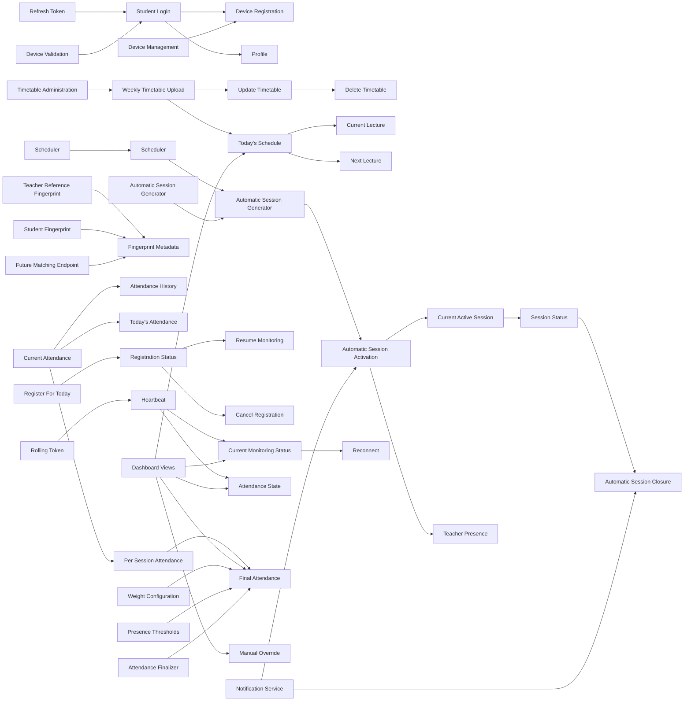

## API Call Sequence Diagrams

### Authentication Flow

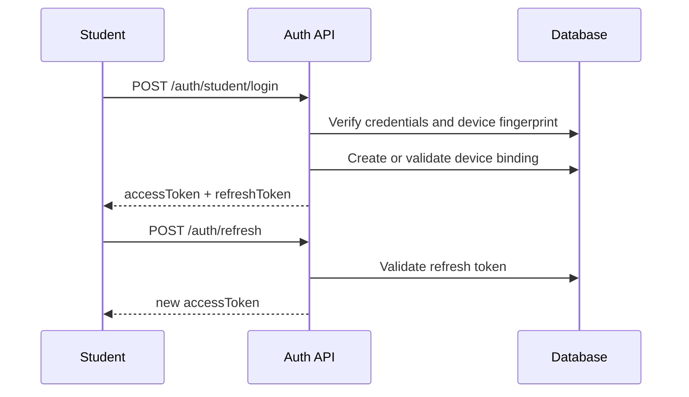

### Student Daily Flow

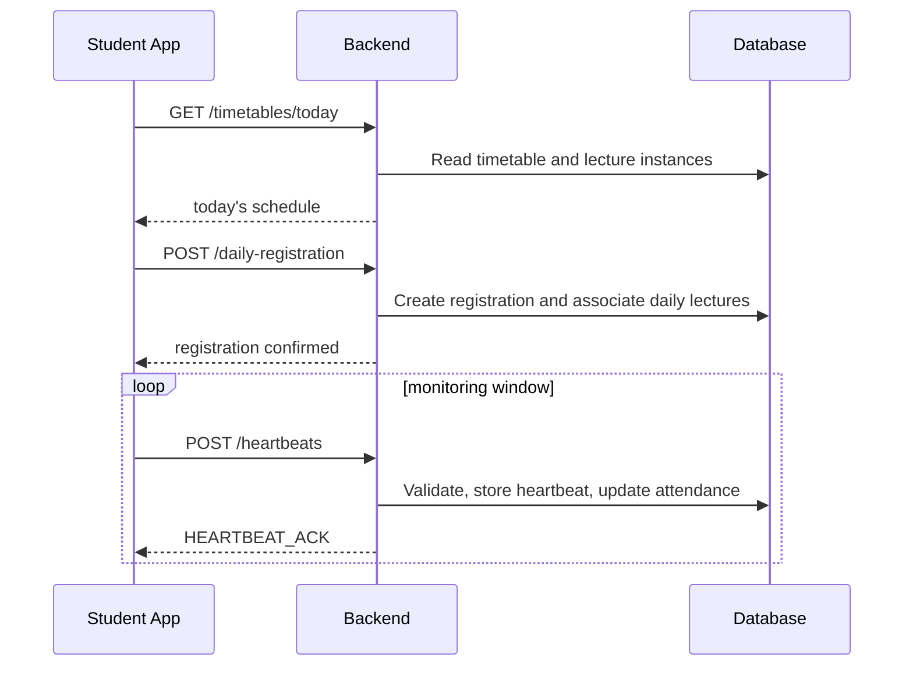

### Teacher Daily Flow

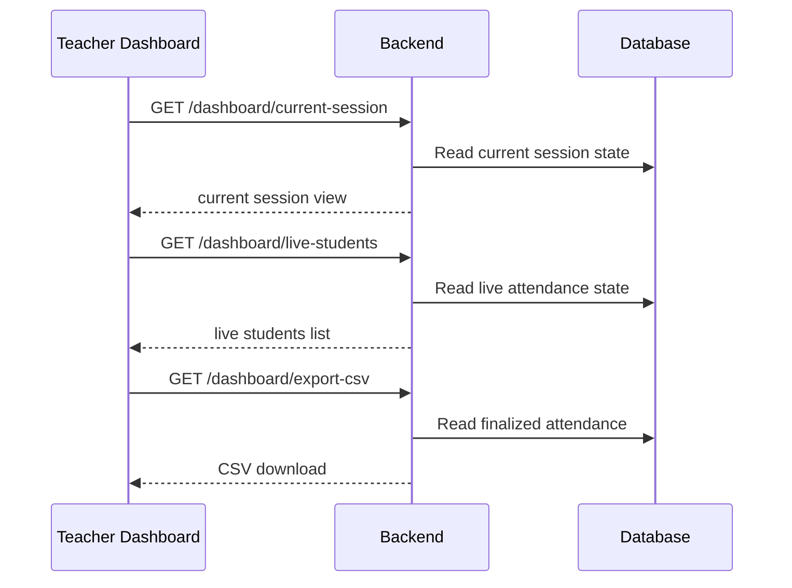

### Attendance Monitoring Flow

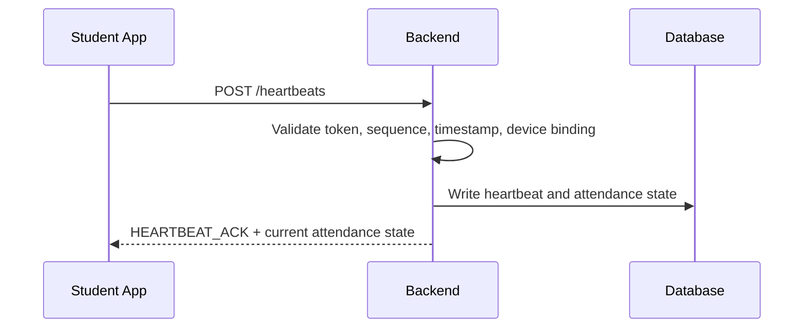

### Automatic Session Lifecycle

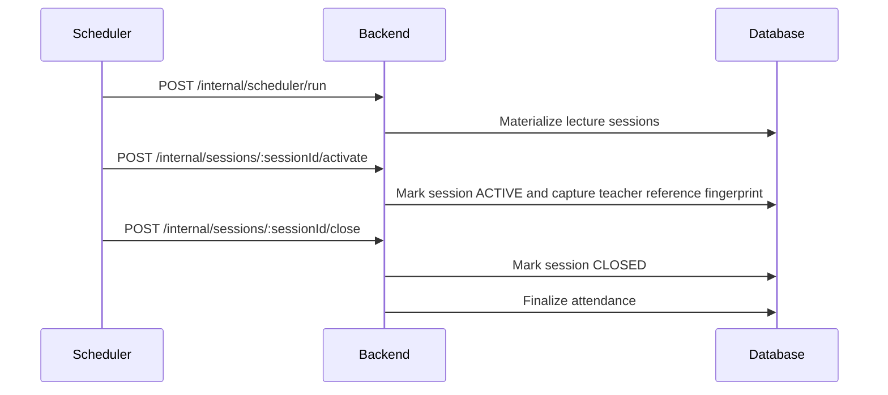

## Final Notes

- This document is intentionally aligned only with the new timetable-driven architecture.
- Manual teacher-created attendance sessions are not part of the contract surface.
- The endpoint set is designed to support later implementation phases without another architecture rewrite.