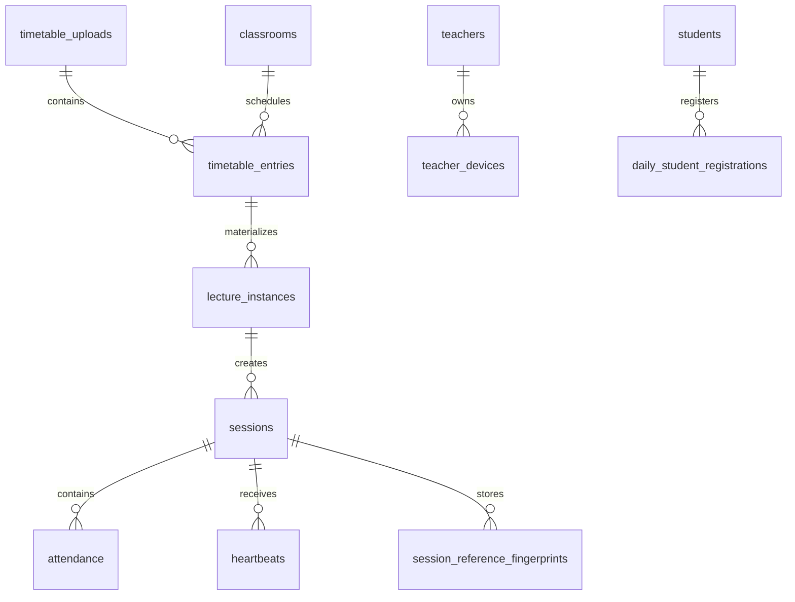

# Database Redesign

This document describes the database changes required for the timetable-driven architecture. It is design-only and does not include SQL.

## Existing Tables

- `students`
- `teachers`
- `classrooms`
- `fingerprints`
- `sessions`
- `tokens`
- `attendance_weights`
- `attendance`
- `heartbeats`
- `sequence_gaps`
- `refresh_tokens`
- `device_bindings`
- `attendance_overrides`
- `session_reference_fingerprints`
- `schema_migrations`

## New Tables Required

### timetable_uploads
Stores one weekly timetable upload event and its metadata.

Suggested fields:
- `id`
- `uploaded_by`
- `academic_week_start`
- `source_filename`
- `checksum`
- `uploaded_at`
- `status`

### timetable_entries
Stores normalized weekly lecture definitions.

Suggested fields:
- `id`
- `timetable_upload_id`
- `day_of_week`
- `classroom_id`
- `course_name`
- `start_time_local`
- `end_time_local`
- `lecture_duration_minutes`
- `join_window_minutes`
- `teacher_id`
- `active_flag`

### lecture_instances
Stores daily lecture materializations derived from timetable entries.

Suggested fields:
- `id`
- `timetable_entry_id`
- `session_id` or `materialized_session_id`
- `lecture_date`
- `scheduled_start_at`
- `scheduled_end_at`
- `activation_state`
- `activation_reason`

### daily_student_registrations
Stores one registration event per student per day.

Suggested fields:
- `id`
- `student_id`
- `academic_date`
- `registered_at`
- `device_binding_id`
- `registration_state`
- `source`

### teacher_devices
Stores teacher device identity data for automatic classroom presence detection.

Suggested fields:
- `id`
- `teacher_id`
- `device_profile_jsonb`
- `android_id_hash`
- `enrollment_identifier`
- `secure_installation_identifier`
- `status`
- `last_seen_at`
- `created_at`

### session_activation_audit
Optional audit table for automatic session activation and deactivation events.

Suggested fields:
- `id`
- `session_id`
- `event_type`
- `event_time`
- `reason`
- `metadata`

## Modified Tables

### sessions
Use the sessions table as the materialized lecture instance store.

Recommended changes:
- link each session to a timetable entry
- add schedule metadata (`scheduled_start_at`, `scheduled_end_at`, `lecture_date`)
- add activation state fields if needed
- keep `status` for the lecture lifecycle

### attendance
Use the attendance table as the per-student daily lecture record.

Recommended changes:
- ensure one row per student per lecture instance
- support daily registration association
- preserve finalization fields for later phases

### heartbeats
Keep the heartbeat table as the live observation log.

Recommended changes:
- continue storing Wi-Fi fingerprints and device binding context
- support multiple lecture instances per day

### device_bindings
Modify or supplement to support structured device identity rather than request-characteristic fingerprinting.

Recommended changes:
- add device profile fields or a JSONB profile column
- preserve active/revoked semantics
- support both student and teacher device identity patterns if needed

### session_reference_fingerprints
Keep as the session-scoped teacher reference store.

Recommended changes:
- continue one reference fingerprint per session
- automatic capture on activation

## Relationships

## Timetable Tables

The timetable layer should represent recurring lectures separately from the materialized session rows.

- `timetable_uploads` handles the upload event.
- `timetable_entries` stores the weekly pattern.
- `lecture_instances` stores the day-specific realization of each entry.

This separation allows timetable edits without destroying the already materialized session history.

## Daily Registration

Daily registration should be one record per student per academic date.

Behavior:
- student registers once at the start of the day
- backend marks the student as available for all lectures on that day
- duplicate registration is rejected or idempotently merged depending on the final API policy

## Automatic Sessions

Automatic sessions are lecture instances created from timetable entries.

Behavior:
- created ahead of the academic day
- activated only when time and teacher-device presence both match
- closed automatically when the scheduled lecture ends or the scheduler decides the window has expired

## Teacher Devices

Teacher devices are a separate identity layer from student devices.

Reason:
- teacher-device presence is an activation gate
- teacher-device capture needs stable device metadata
- teacher and student identity drift should not share the same lifecycle rules

## Student Devices

Student device identity should evolve from the current binding model to a more structured fingerprint model.

Reason:
- current request-characteristic binding is not stable enough for the new architecture
- the new design needs Android ID plus hardware/app metadata for identity correlation

## Attendance Lifecycle

1. Day begins with student registration.
2. Timetable entries materialize into lecture sessions.
3. Session becomes ACTIVE when time and teacher presence align.
4. Attendance rows are associated with registered students.
5. Heartbeats update live attendance evidence.
6. Session closes automatically when the lecture ends.
7. Final attendance is computed from the accumulated evidence.

## State Transitions

- timetable uploaded -> timetable normalized
- timetable normalized -> lecture instance created
- lecture instance created -> waiting for activation
- waiting for activation -> active
- active -> closed
- closed -> finalized
- student unregistered -> registered
- registered -> associated with lecture
- associated -> monitoring
- monitoring -> late / present / partial / absent depending on evidence
