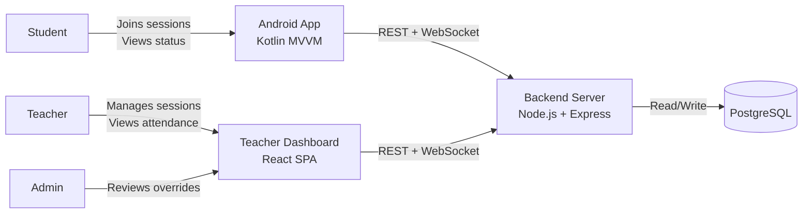
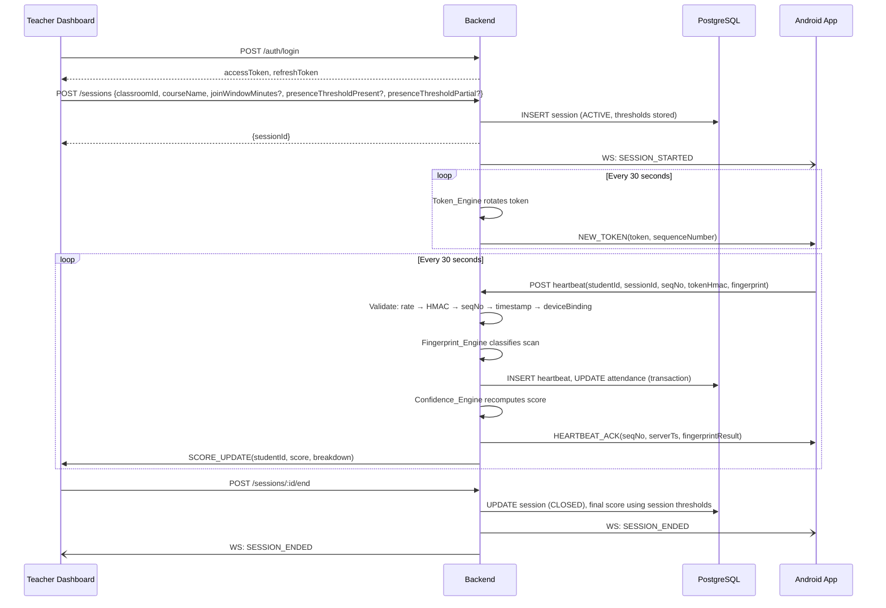
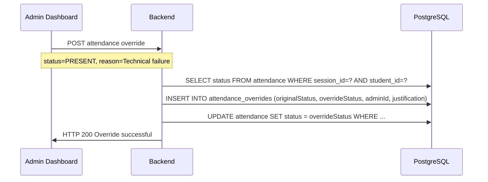
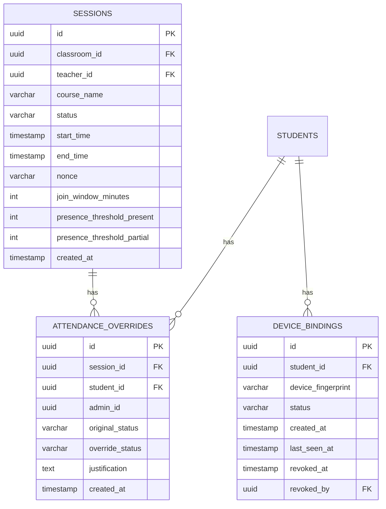

## SECTION 12: Updated Design Document

# Design Document — Smart Attendance Registry (v2.0)

## Overview

The Smart Attendance Registry verifies student physical presence using Wi-Fi fingerprinting and rolling cryptographic tokens. Three features from teammate review have been incorporated into this design:

1. **Device Enrollment Binding** — softened from the friend's permanent-irrevocable model to a 2-binding-per-student, admin-revocable model.
2. **Configurable Presence Thresholds** — session-level PRESENT/PARTIAL score thresholds (default 85/60).
3. **Administrative Override Interface** — manual attendance correction with full audit trail.

All other architectural decisions from v1.0 are retained unchanged. IMU, GPS geofencing, and BLE features are explicitly deferred to Future Work.

### Design Goals (unchanged)
- Tamper-resistance: Rolling tokens + sequence numbers + timestamp windows make replay attacks computationally infeasible.
- Fault tolerance: Up to 3 consecutive missed heartbeats are recoverable.
- Real-time feedback: Teachers see live score updates within 5 seconds.
- Horizontal scalability: Stateless REST + Redis-upgradeable WebSocket tier.
- Operational simplicity: `docker compose up`.

### Technology Choices (unchanged from v1.0)

| Layer | Technology | Rationale |
|---|---|---|
| Backend API | Node.js 20 LTS + Express.js | Non-blocking I/O for high-frequency heartbeat ingestion |
| WebSocket | `ws` library | Low overhead |
| Database | PostgreSQL 16 | ACID, JSONB, mature indexing |
| ORM / Query | `pg` raw SQL | Full query control |
| Android | Kotlin + MVVM + Jetpack | Native APIs for reliable background service |
| Teacher UI | React 18 + Vite + TanStack Query | Fast SPA |
| Auth | JWT (15 min) + refresh tokens | Stateless RBAC |
| Containerisation | Docker Compose | Single-command deployment |

---

## Architecture

### System Context




### Component Interaction (Updated Sequence)



---

## New Components

### 10. Device Binding Service (New)

Manages the `device_bindings` table. Called by Auth Service on every student login.

**Endpoints**

| Method | Path | Auth | Description |
|---|---|---|---|
| GET | `/auth/devices` | STUDENT JWT | List student's active device bindings |
| DELETE | `/admin/devices/:bindingId` | ADMIN JWT | Revoke a device binding |

**Binding Logic**

```
On Student Login:
  existing = SELECT * FROM device_bindings WHERE studentId = ? AND status = 'ACTIVE'
  if exists(deviceFingerprint in existing):
    → update last_seen_at, continue
  elif count(existing) < 2:
    → INSERT new binding, continue
  else:
    → HTTP 409 DEVICE_LIMIT_REACHED
```

**`device_bindings` Table**

```sql
CREATE TABLE device_bindings (
  id UUID PRIMARY KEY DEFAULT gen_random_uuid(),
  student_id UUID NOT NULL REFERENCES students(id),
  device_fingerprint VARCHAR(255) NOT NULL,
  status VARCHAR(20) NOT NULL DEFAULT 'ACTIVE',  -- ACTIVE | REVOKED
  created_at TIMESTAMP NOT NULL DEFAULT NOW(),
  last_seen_at TIMESTAMP,
  revoked_at TIMESTAMP,
  revoked_by UUID REFERENCES teachers(id),
  UNIQUE(student_id, device_fingerprint)
);
CREATE INDEX idx_device_bindings_student ON device_bindings(student_id, status);
```

**Heartbeat Device Check**

The Heartbeat_Processor adds a step 5b after session state check:

```
5b. Device binding check:
    bindings = SELECT * FROM device_bindings WHERE studentId = ? AND status = 'ACTIVE'
    if count(bindings) == 0:
      → HTTP 403 NO_DEVICE_BINDING
    if deviceFingerprint NOT IN bindings:
      → INSERT INTO audit_log (DEVICE_BINDING_MISMATCH), continue (do NOT reject)
```

The mismatch is logged but not a hard rejection — this avoids false positives from device fingerprint drift.

---

### 11. Administrative Override Service (New)

**Endpoints**

| Method | Path | Auth | Description |
|---|---|---|---|
| GET | `/admin/sessions/:id/attendance` | ADMIN JWT | View all attendance records for session |
| POST | `/admin/sessions/:sessionId/attendance/:studentId/override` | ADMIN JWT | Override attendance status |
| GET | `/admin/overrides` | ADMIN JWT | List all overrides (audit log) |

**Override Flow**



**`attendance_overrides` Table**

```sql
CREATE TABLE attendance_overrides (
  id UUID PRIMARY KEY DEFAULT gen_random_uuid(),
  session_id UUID NOT NULL REFERENCES sessions(id),
  student_id UUID NOT NULL REFERENCES students(id),
  admin_id UUID NOT NULL,  -- references teachers(id) where role=ADMIN
  original_status VARCHAR(20) NOT NULL,
  override_status VARCHAR(20) NOT NULL,
  justification TEXT NOT NULL,
  created_at TIMESTAMP NOT NULL DEFAULT NOW()
);
CREATE INDEX idx_overrides_session ON attendance_overrides(session_id);
CREATE INDEX idx_overrides_student ON attendance_overrides(student_id);
```

---

## Updated Data Models

### Sessions Table (Updated)

```sql
-- Additional columns added to sessions table
ALTER TABLE sessions ADD COLUMN presence_threshold_present INT DEFAULT 85;
ALTER TABLE sessions ADD COLUMN presence_threshold_partial INT DEFAULT 60;
-- Constraint: threshold_partial < threshold_present
ALTER TABLE sessions ADD CONSTRAINT chk_thresholds
  CHECK (presence_threshold_partial < presence_threshold_present);
```

### Updated Entity-Relationship Diagram

*(All original tables retained. New tables added below.)*



---

## Updated Confidence Engine

### Configurable Thresholds

```javascript
// In confidence.service.ts — final status assignment
async function assignAttendanceStatus(sessionId, studentId, score) {
  const session = await getSession(sessionId);
  const thresholdPresent  = session.presenceThresholdPresent ?? 85;
  const thresholdPartial  = session.presenceThresholdPartial ?? 60;

  if (score >= thresholdPresent) return 'PRESENT';
  if (score >= thresholdPartial) return 'PARTIAL';
  return 'ABSENT';
}
```

### Updated Heartbeat Validation Pipeline (v2.0)

```
1. Rate limit check          → HTTP 429 if > 4 heartbeats/60s
2. HMAC token validity       → HTTP 401 if tokenHmac invalid
3. Sequence number check     → HTTP 400 if seqNo ≤ lastAccepted
4. Timestamp window          → HTTP 400 if |clientTs - serverTs| > 60s
5. Session state check       → HTTP 403 if REJECTED or DISCONNECTED
6. Device binding check      → HTTP 403 if no active bindings; LOG if fingerprint mismatch
```

---

## Updated Correctness Properties

*(All 11 original properties retained. Two new properties added.)*

### Property 12: Device Binding Limit Enforcement

*For any* student who already has 2 active device bindings, a login attempt from a third distinct device SHALL return HTTP 409 with code `DEVICE_LIMIT_REACHED` and SHALL NOT create a new binding record.

**Validates: Requirement 1.11**

---

### Property 13: Override Audit Completeness

*For any* administrative override of an attendance record, the system SHALL create an `attendance_overrides` record containing the original status, override status, admin ID, justification, and timestamp; the `attendance.status` field SHALL reflect the override value; and the original value SHALL be recoverable from the `attendance_overrides` record.

**Validates: Requirement 15.2, 15.5**

---

## Updated Error Code Registry

*(All original error codes retained. New codes added.)*

| HTTP Status | Code | Trigger |
|---|---|---|
| 403 | `NO_DEVICE_BINDING` | Student has zero active device bindings |
| 409 | `DEVICE_LIMIT_REACHED` | Student already has 2 active device bindings |
| 409 | `CANNOT_OVERRIDE_ACTIVE_SESSION` | Override attempted on ACTIVE session |

---

## Testing Strategy Updates

### New Unit Tests

- Device Binding Service: First login creates binding; second new device creates second binding; third device returns 409; admin revoke sets status REVOKED; login after revoke creates new binding.
- Override Service: Valid override updates attendance.status and creates override record; override on ACTIVE session returns 409; non-admin call returns 403; justification field required (400 if absent).
- Confidence Engine: Session with custom thresholds (75/50) assigns PRESENT at 75, PARTIAL at 50, ABSENT below 50; session with default thresholds uses 85/60.

### New Property Tests

- **P12**: Generate random students with 0, 1, 2 active bindings; verify 3rd-device login returns 409 exactly when count = 2.
- **P13**: Generate random override requests; verify `attendance_overrides` record is created with all required fields for every successful override.

### New Integration Tests

- Full override flow: Create session → join → send heartbeats → end session → verify ABSENT → admin overrides to PRESENT → verify attendance.status = PRESENT → verify override record in DB.
- Device binding flow: Student logs in from device A → binding created → logs in from device B → second binding created → logs in from device C → HTTP 409.
