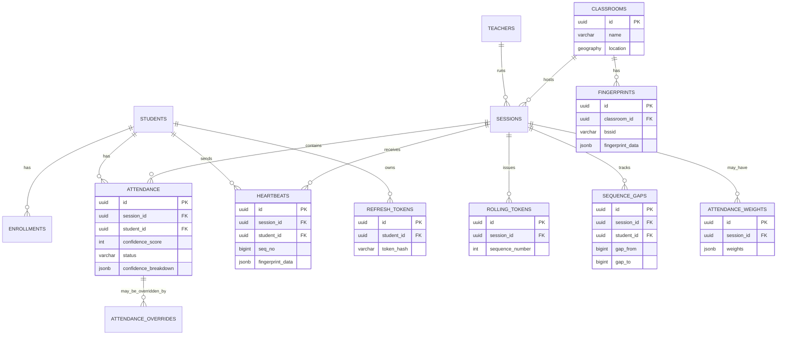

## ER Diagram (Phase 2)

The following Mermaid ER diagram describes the main entities and relationships introduced or used in Phase 2.

Notes:
- `enrollments` is preserved and not shown in full detail here; it remains part of the schema and is left untouched.
- The diagram is simplified for readability; see `docs/DATABASE_DESIGN.md` for full column definitions and constraints.
