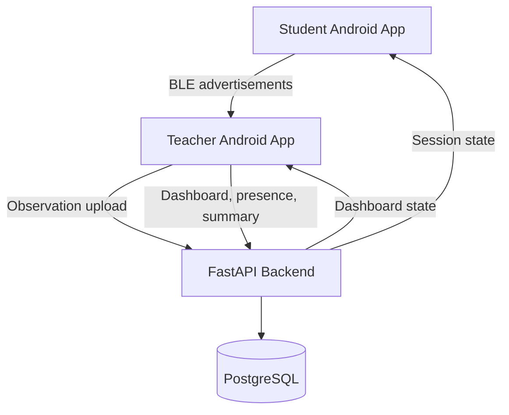
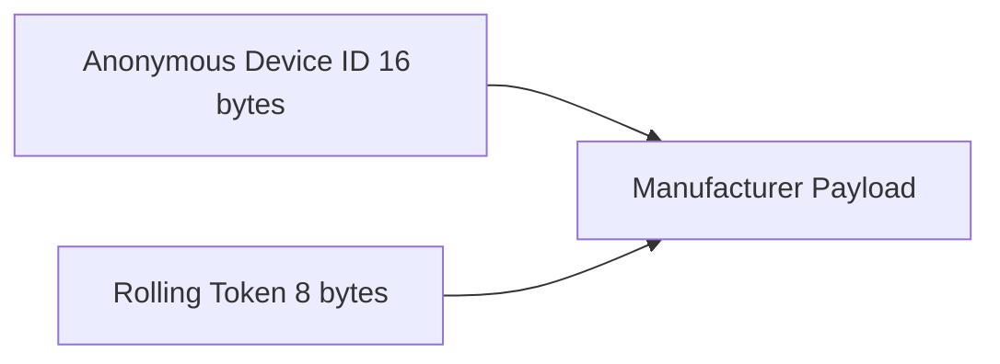
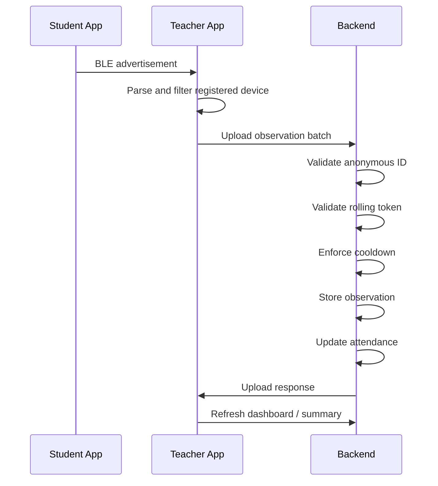
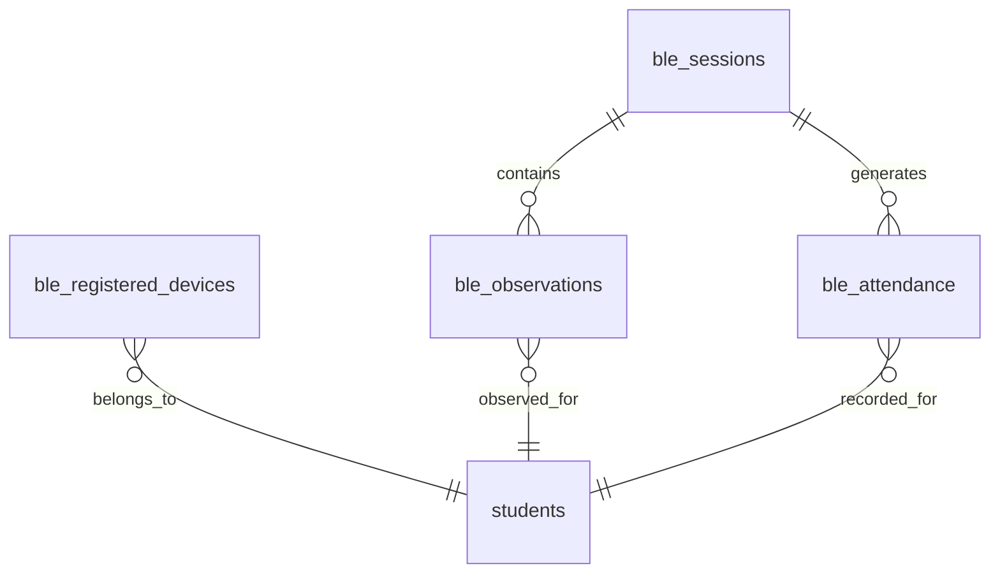
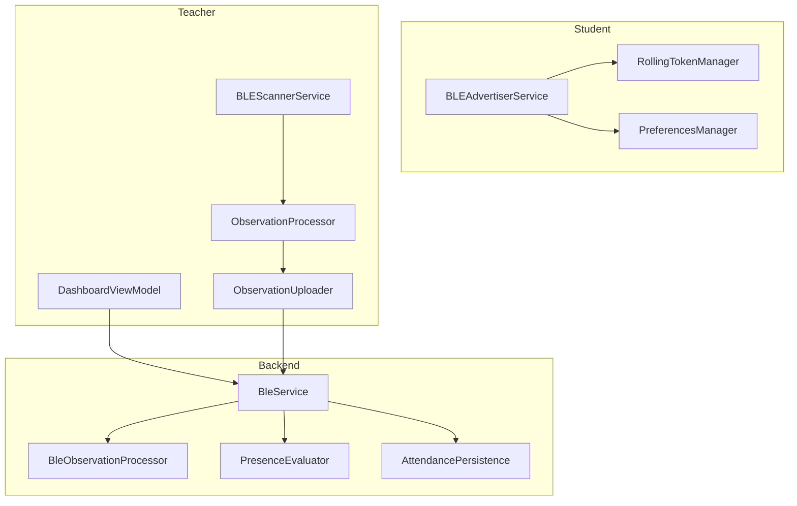

# Final Demo Documentation

## System Architecture

## BLE Packet Structure

- The packet format is fixed-width and binary.
- Anonymous Device ID is used for registered-device resolution.
- Rolling Token is used for replay protection and freshness validation.
- Timestamp and HMAC are added by the teacher scanner during upload, not broadcast over BLE.

## Attendance Flow

## Anonymous ID Flow

1. Student device registers a BLE identity with the backend.
2. The backend stores the anonymous identifier against the student record.
3. The student app advertises only the anonymous identifier and rolling token.
4. The teacher scanner resolves the anonymous identifier against registered devices.
5. Unregistered devices are ignored before upload or persistence.

## Rolling Token Flow

1. Student app generates a rolling token from the current time window.
2. The token is embedded in the BLE advertisement.
3. The teacher scanner uploads the raw token with scan metadata.
4. The backend validates the token for the active session window.
5. The backend rejects replayed or stale observations.

## RSSI Collection

- RSSI is captured by the teacher scanner from the BLE scan result.
- RSSI is stored with the observation metadata.
- RSSI contributes to attendance confidence and the final summary logs.
- Lower RSSI values typically indicate weaker proximity or less stable detection.

## BLE Observation Processing

- Packet structure is validated first.
- Anonymous ID is resolved against the registered device table.
- Session activity is checked before persistence.
- Cooldown is enforced per student per session.
- Accepted packets are stored and forwarded into attendance generation.

## Cooldown Logic

- Cooldown is 120 seconds per student per session.
- The first valid observation within the window is accepted.
- Subsequent observations inside the window are ignored.
- Ignored packets still appear in logs for demonstration clarity.

## Attendance Decision Pipeline

1. Receive upload batch.
2. Validate packet structure.
3. Resolve registered device.
4. Check token and freshness.
5. Enforce cooldown.
6. Persist accepted observation.
7. Recompute attendance state.
8. Return upload summary.

## Dashboard Metrics

- Active Session
- Teacher
- Course
- Room
- Session Duration
- Registered Devices
- Students Seen
- Packets Received
- Packets Accepted
- Cooldown Interval
- Last Packet Received Time

## Battery Optimization

- Student advertising is session-aware and remains idle when no session is active.
- Heartbeat submission is skipped when the active session is not running.
- Teacher scanning runs as a foreground service so the app remains stable during attendance.
- BLE work is tied to the session lifecycle instead of continuous background polling.

## Session Lifecycle

- Session Started: backend session is created and the apps move into attendance mode.
- Active Session: student advertising and teacher scanning run.
- Session Ended: the backend finalizes attendance and the student app returns to idle.
- Session Summary: the backend prints a demo-friendly lifecycle summary.

## Proxy Prevention Features

- Anonymous Device ID verification
- Rolling token verification
- Session-specific cooldown
- Registered-device filtering
- Backend validation before persistence

## Security Features

- No pairing required for attendance participation
- Raw identifiers are replaced with anonymous device IDs
- Tokens are time-window based
- HMAC metadata is validated in the upload pipeline
- Replay attempts are rejected by validation and cooldown rules

## Database Flow

- `ble_sessions` stores the BLE session lifecycle.
- `ble_registered_devices` stores anonymous BLE bindings.
- `ble_observations` stores accepted scan uploads.
- `ble_attendance` stores the derived attendance result.

## Component Diagram

