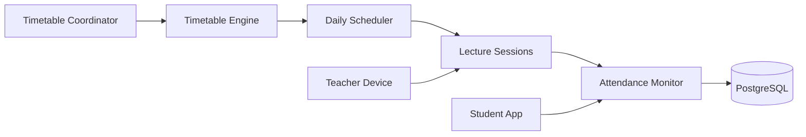
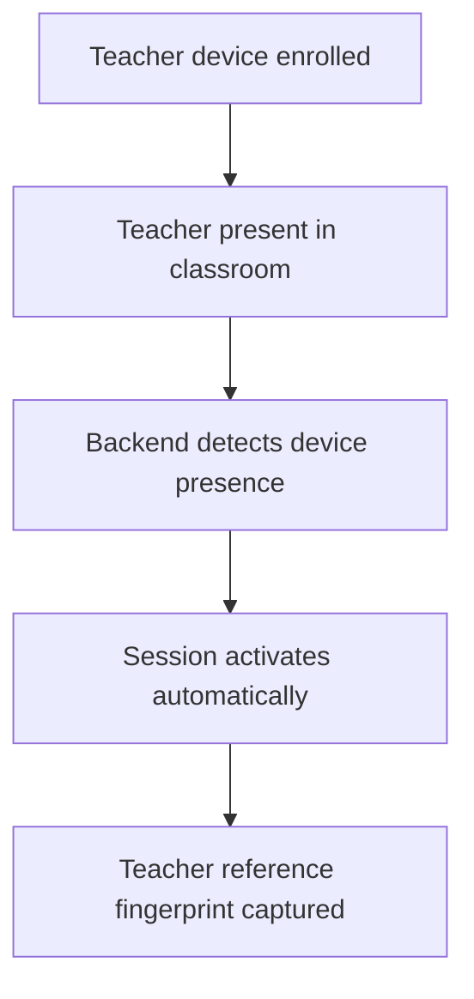
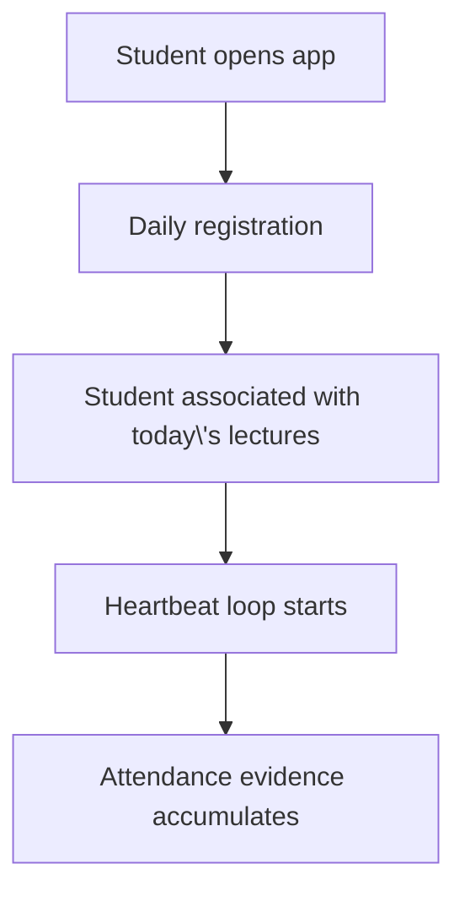
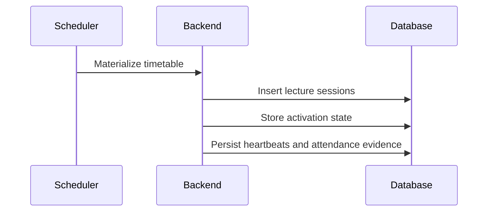
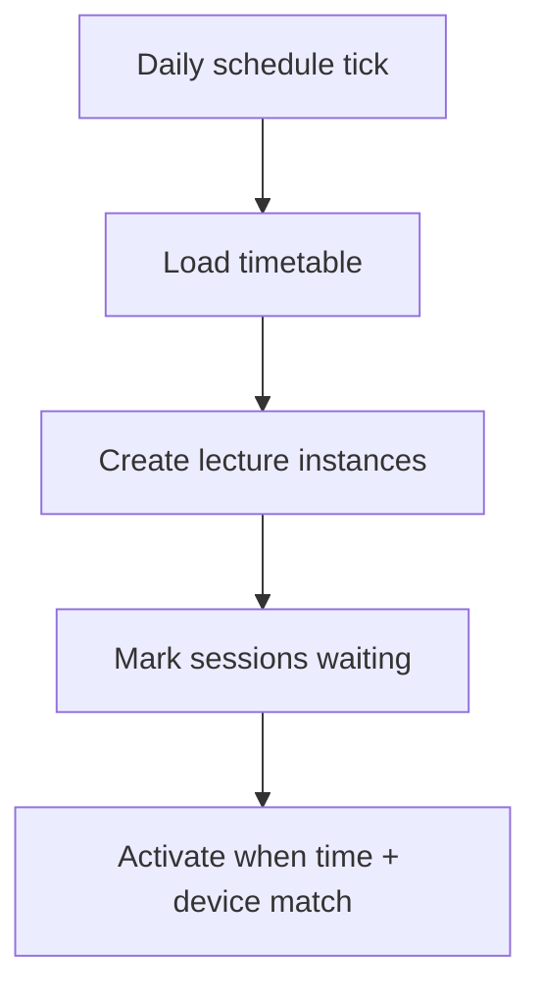
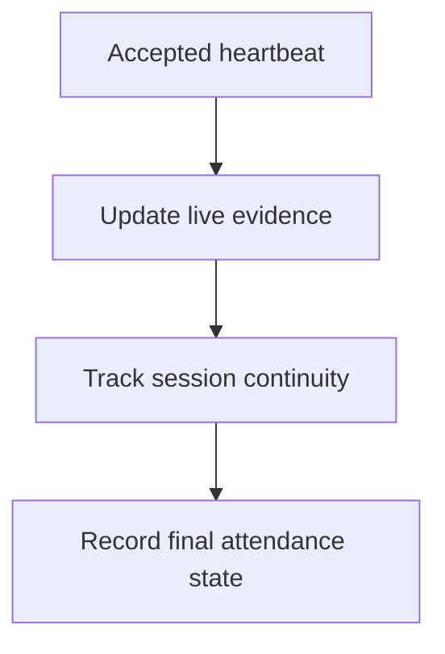
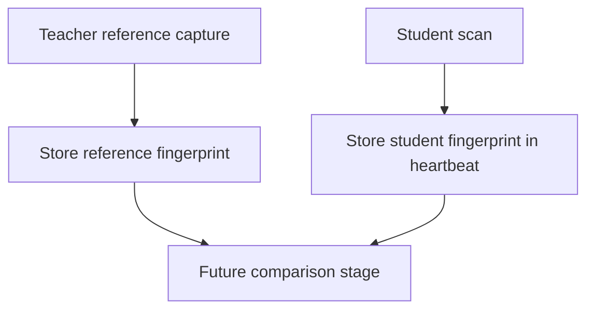
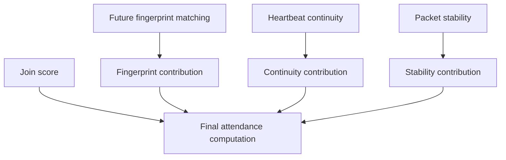
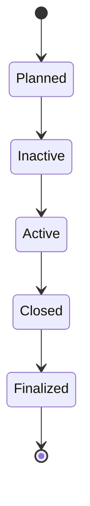
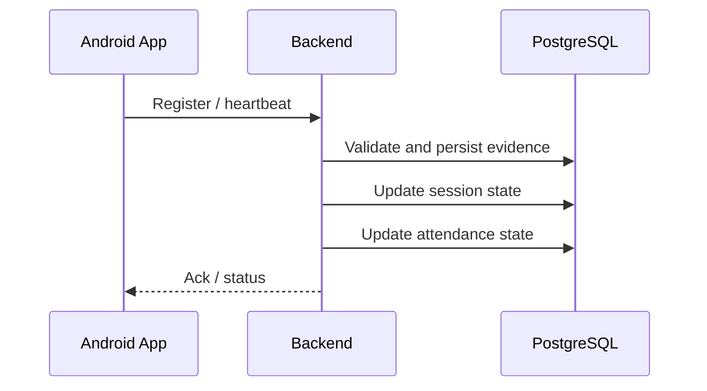

# Flow Diagrams

## System Overview

## Teacher Workflow

## Student Workflow

## Backend Workflow

## Scheduler Workflow

## Attendance Engine

## Wi-Fi Fingerprinting Pipeline

## Confidence Engine

## Automatic Session Lifecycle

## Database Interaction Flow

