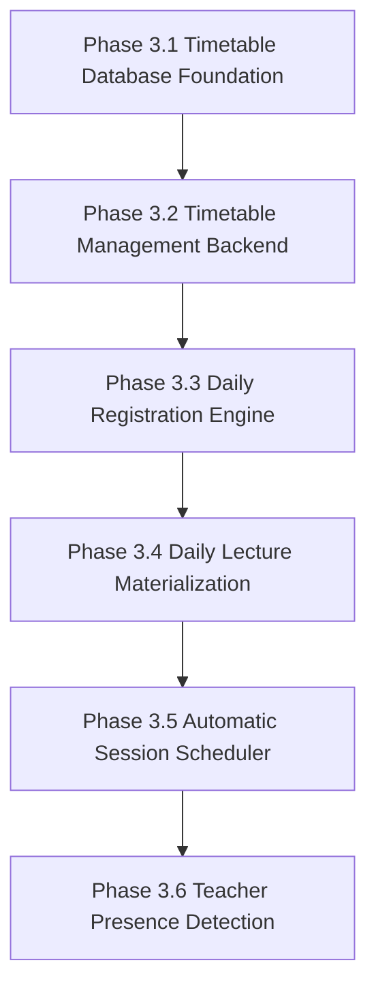
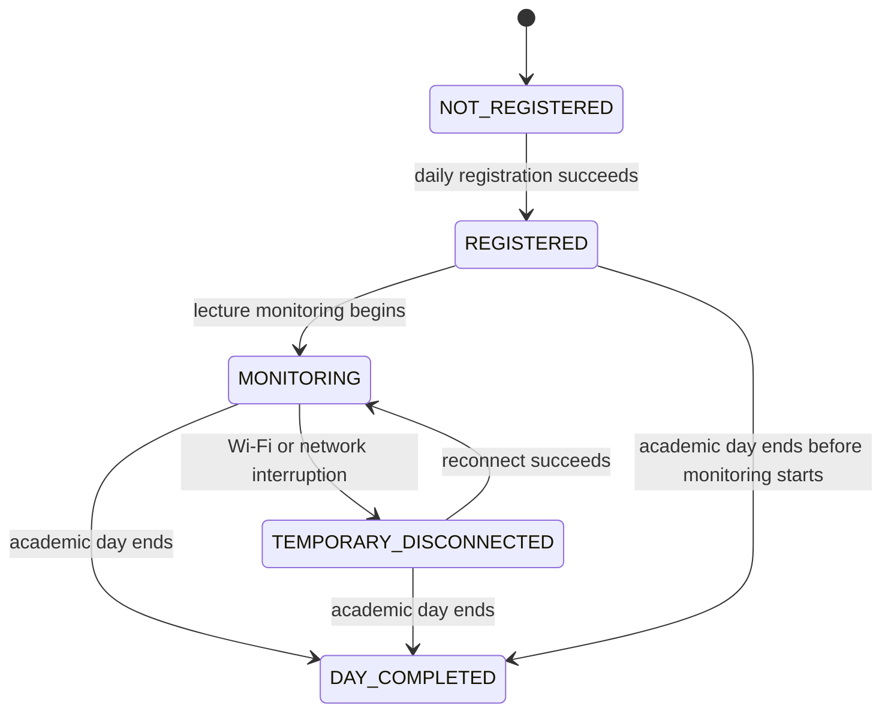
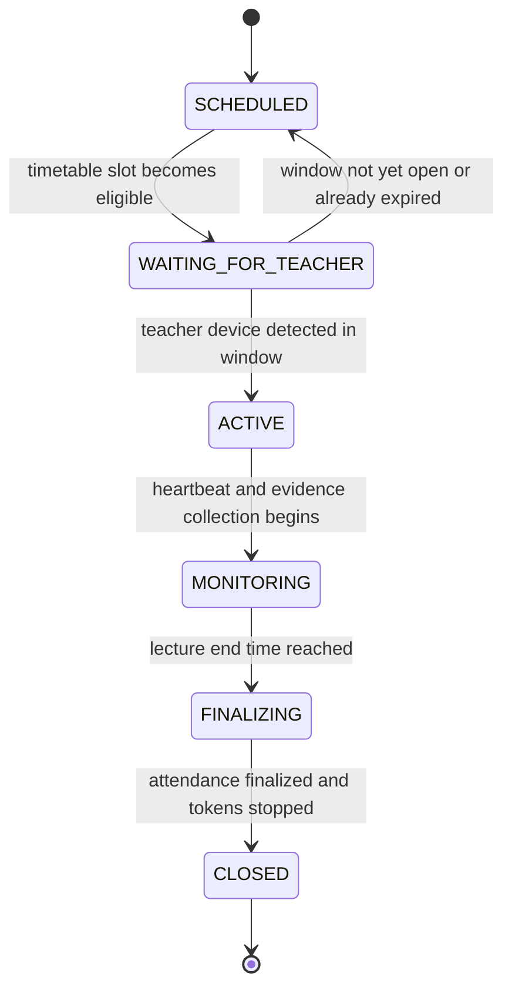

# Phase 3 Implementation Guide

This document is the execution blueprint for Phase 3 of the timetable-driven redesign. It is intentionally implementation-focused and does not define new architecture. Use only the frozen design documents listed below when building Phase 3.

## Authoritative Design Sources

- Requirements.md
- Tasks.md
- SYSTEM_ARCHITECTURE_V2.md
- DATABASE_REDESIGN.md
- DATABASE_CHANGE_PLAN.md
- API_CONTRACTS_V2.md
- STATE_MACHINE.md
- SYSTEM_WORKFLOWS.md
- FLOW_DIAGRAMS.md
- IMPLEMENTATION_PLAN_V3.md
- ARCHITECTURE_DECISIONS.md
- SECURITY_REVIEW.md
- Design.md
- PROJECT_STRUCTURE.md
- TRACEABILITY_MATRIX.md

## Implementation Rules

- Build one sub-phase at a time.
- Do not start a later sub-phase until the earlier sub-phase compiles, passes its tests, and satisfies its acceptance criteria.
- Keep each sub-phase small enough to implement, review, test, and commit independently.
- Do not merge database foundation, scheduler behavior, and teacher-presence logic into one patch.
- Do not reintroduce manual session start, manual session end, or per-session student join behavior.
- Treat any legacy references in historical documents as non-authoritative.

## Dependency Graph



No later phase may depend on an unfinished earlier phase.

---

## Phase 3.1 - Timetable Database Foundation

### Goal
Create the database foundation required to store uploaded weekly timetables, normalized timetable entries, and materialized lecture instances.

### Why this phase exists
The rest of the timetable engine depends on a stable schema. Without the timetable tables, later phases cannot import schedules, generate lecture instances, or reason about automatic activation.

### Objective
Persist timetable data in a normalized structure that can support weekly imports, conflict checking, daily expansion, and later session materialization.

### Scope
- Add the timetable upload and normalization tables.
- Add the lecture-instance storage needed for daily materialization.
- Add the minimum indexes and constraints required for integrity and lookup performance.
- Update existing session-related tables only where linkage to timetable data is required.

### Design documents it depends on
- Requirements.md
- SYSTEM_ARCHITECTURE_V2.md
- DATABASE_REDESIGN.md
- DATABASE_CHANGE_PLAN.md
- IMPLEMENTATION_PLAN_V3.md
- ARCHITECTURE_DECISIONS.md
- TRACEABILITY_MATRIX.md

### Files to create
- Migration file for timetable tables.
- Migration file for timetable indexes and constraints if the project separates schema and index changes.
- Optional SQL fixture or seed file for timetable-related test data.

### Files to modify
- Existing schema migrations that define session linkage.
- Database test fixtures and schema snapshots.
- Any database documentation that enumerates the current canonical tables.

### Database changes
#### Tables
- `timetable_uploads`
- `timetable_entries`
- `lecture_instances`

#### Indexes
- `timetable_uploads(checksum)` for duplicate-upload detection.
- `timetable_entries(timetable_upload_id, day_of_week)` for weekly lookup.
- `timetable_entries(classroom_id, teacher_id, day_of_week)` for conflict checks.
- `lecture_instances(lecture_date, scheduled_start_at)` for daily scheduler queries.
- Session-link indexes only if the session table stores timetable linkage.

#### Constraints
- Upload checksum must be unique.
- Timetable entry times must be valid and ordered.
- Lecture duration must be positive.
- Join window must stay within the configured allowed bounds.
- Foreign keys must enforce timetable upload ownership and lecture-instance referential integrity.

#### Validation rules
- Weekly timetable payloads must include one or more valid lecture rows.
- Day-of-week values must be normalized.
- Start and end times must be parseable and logically consistent.
- Classroom and teacher identifiers must exist before persistence.
- Duplicate weekly rows must be rejected or normalized according to the documented policy.

### Backend changes
- Add schema-aware database access for timetable records.
- Add repository support for inserting and querying timetable uploads and entries.
- Add model mapping for lecture-instance rows.
- Prepare the session store for timetable linkage if the architecture stores materialized sessions there.

### Android changes
- None.

### APIs implemented
- None public in this sub-phase.
- Only database-backed helpers needed by later timetable APIs.

### Tests required
#### Unit tests
- Schema migration verification.
- Index presence checks.
- Constraint violation tests for invalid timetable rows.

#### Integration tests
- Migration applies cleanly on a fresh database.
- Duplicate upload checksum is rejected.
- Valid timetable upload persists normalized rows.

#### Manual validation
- Inspect the migrated schema.
- Verify table names and foreign keys match the frozen design.
- Confirm seed data or fixtures can insert a representative weekly timetable.

### Expected database state
- New timetable tables exist.
- Lecture-instance storage is available for daily expansion.
- Database can represent weekly schedules without using manual session creation rows.

### Expected UI behaviour
- No UI changes in this phase.

### SQL verification queries
```sql
SELECT table_name
FROM information_schema.tables
WHERE table_schema = 'public'
  AND table_name IN ('timetable_uploads', 'timetable_entries', 'lecture_instances');

SELECT indexname
FROM pg_indexes
WHERE tablename IN ('timetable_uploads', 'timetable_entries', 'lecture_instances');
```

### Acceptance criteria
- Timetable tables are present and queryable.
- Core constraints prevent invalid timetable rows.
- Required indexes exist.
- Migration tests pass independently.

### Deliverables
- Timetable schema migration.
- Schema verification tests.
- Updated database documentation if needed.

### Risks
- Over-constraining the schema before import rules are finalized.
- Missing an index that later phases depend on for scheduler performance.
- Creating table shapes that do not support daily materialization cleanly.

### Estimated implementation size
- Small.

### Estimated implementation complexity
- Low.

### Recommended commit message
- `phase 3.1: add timetable database foundation`

---

## Phase 3.2 - Timetable Management Backend

### Goal
Implement the backend workflow that uploads, validates, stores, updates, and removes weekly timetables.

### Why this phase exists
The system needs a supported way to import timetable data before daily lecture materialization can happen.

### Objective
Provide a backend timetable-management surface that can accept weekly uploads, normalize rows, detect conflicts, and expose CRUD operations for timetable maintenance.

### Scope
- Add timetable CRUD APIs.
- Implement timetable payload validation.
- Implement weekly timetable upload parsing and normalization.
- Add timetable conflict detection for classroom, teacher, and time overlaps.
- Wire timetable repository and service methods into the existing backend structure.

### Design documents it depends on
- Requirements.md
- API_CONTRACTS_V2.md
- SYSTEM_ARCHITECTURE_V2.md
- DATABASE_REDESIGN.md
- DATABASE_CHANGE_PLAN.md
- IMPLEMENTATION_PLAN_V3.md
- ARCHITECTURE_DECISIONS.md
- SYSTEM_WORKFLOWS.md
- TRACEABILITY_MATRIX.md

### Files to create
- Timetable service module.
- Timetable repository module.
- Timetable route/controller module.
- Validation helpers for timetable payloads.
- Optional timetable import parser module.

### Files to modify
- Backend route registration.
- Dependency injection or service wiring.
- Existing database access helpers.
- Backend tests for route and service coverage.

### Database changes
- Write to `timetable_uploads`.
- Write to `timetable_entries`.
- Read classroom, teacher, and schedule metadata for validation.

### Backend changes
- Implement create, read, update, and delete operations for timetable entities.
- Parse weekly timetable uploads into normalized rows.
- Reject invalid imports before persistence.
- Detect time conflicts before saving schedule rows.
- Persist upload metadata and normalization status.

### Android changes
- None.

### APIs implemented
- Weekly timetable upload.
- Timetable upload listing and detail retrieval.
- Timetable entry read/update/delete operations.
- Conflict validation response handling.

### Tests required
#### Unit tests
- Payload schema validation.
- Normalization logic.
- Conflict detection logic.
- CRUD service methods.

#### Integration tests
- Upload a valid timetable and retrieve normalized rows.
- Reject overlapping classroom or teacher schedules.
- Confirm delete/update behavior is reflected in the database.

#### Manual validation
- Upload one valid weekly timetable.
- Verify the normalized rows match the source file.
- Attempt an overlapping import and confirm the API rejects it.

### Expected database state
- One upload row per timetable import.
- One normalized entry row per lecture slot.
- Conflicting rows do not persist.

### Expected UI behaviour
- Backend responses are stable enough for future admin UI or import tooling.
- No direct UI work is required in this phase.

### SQL verification queries
```sql
SELECT COUNT(*)
FROM timetable_uploads;

SELECT day_of_week, classroom_id, teacher_id, start_time_local, end_time_local
FROM timetable_entries
ORDER BY day_of_week, classroom_id, start_time_local;
```

### Acceptance criteria
- Weekly timetable CRUD works through the backend.
- Imports are normalized and validated.
- Conflicts are detected before persistence.
- Route and service tests pass independently.

### Deliverables
- Timetable management backend.
- Import and validation tests.
- Conflict detection coverage.

### Risks
- Ambiguous schedule-source parsing.
- Conflict rules drifting from the frozen requirements.
- Overly broad import logic that accepts malformed rows.

### Estimated implementation size
- Medium.

### Estimated implementation complexity
- Medium.

### Recommended commit message
- `phase 3.2: implement timetable management backend`

---

## Phase 3.3 - Daily Registration Engine

### Goal
Create the day-scoped registration engine that anchors one registration per student per academic day.

### Why this phase exists
The timetable system needs a durable daily participation record before lecture materialization, scheduler activation, and reconnect recovery can operate correctly.

### Objective
Register each student once per academic day, keep that registration valid across lunch and reconnect events, and prevent duplicate registrations after temporary disconnects.

### Responsibilities
- Create exactly one registration record per student per academic day.
- Prevent duplicate registration attempts.
- Keep the registration valid throughout the academic day.
- Preserve the registration across lunch breaks and reconnects.
- Allow late-arriving students to register once and join later lectures.
- Expire the registration only at end of day.

### Database interactions
- Read and write `daily_student_registrations`.
- Read student identity and device-binding context before registration.
- Link the day registration to all lecture instances materialized for that date.
- Keep the registration row stable across retries and reconnects.

### Files to create
- Daily registration service.
- Daily registration repository or data-access helper.
- Registration validation helper.
- Registration lifecycle test fixtures.

### Files to modify
- Student authentication or bootstrap flow that starts daily registration.
- Backend route registration for the daily registration endpoint.
- Attendance association logic.
- Backend tests covering registration, duplicate prevention, and reconnect behavior.

### Expected APIs
- Daily registration create endpoint.
- Daily registration lookup endpoint.
- Daily registration expiry or day-close handling via the existing daily lifecycle.

### Tests
#### Unit tests
- One registration per academic day.
- Duplicate registration prevention.
- Registration persistence through lunch and reconnects.
- Late-arrival registration behavior.

#### Integration tests
- Register once and confirm subsequent requests reuse the same day anchor.
- Simulate temporary Wi-Fi disconnect and confirm no second registration is created.
- Confirm the day registration expires only when the academic day ends.

#### Manual validation
- Register a test student once and verify the same day record is reused after reconnect.
- Confirm a second same-day registration request is rejected or idempotent according to the frozen policy.

### Acceptance criteria
- One registration per academic day is enforced.
- Duplicate registration is prevented.
- Registration persists across lunch and Wi-Fi reconnects.
- Registration expires only at the end of the academic day.
- Late-arriving students can still register and participate in remaining lectures.

### Out-of-scope items
- Per-session student joins.
- Manual re-registration after temporary Wi-Fi disconnect.
- Teacher-presence gating.
- Lecture scoring and attendance finalization.

### Implementation notes
- Treat the daily registration as the root attendance anchor for all lecture monitoring on that date.
- Reconnect logic must resume against the existing registration rather than create a new one.
- Keep this phase independent from lecture materialization so it can be reviewed and committed separately.

### Design documents it depends on
- Requirements.md
- SYSTEM_ARCHITECTURE_V2.md
- DATABASE_REDESIGN.md
- DATABASE_CHANGE_PLAN.md
- IMPLEMENTATION_PLAN_V3.md
- ARCHITECTURE_DECISIONS.md
- STATE_MACHINE.md
- SYSTEM_WORKFLOWS.md

### Database changes
- Insert and query `daily_student_registrations`.
- Associate day registrations with lecture instances materialized for that date.

### Backend changes
- Implement daily registration creation and lookup.
- Prevent duplicate registrations and preserve existing records.
- Resume monitoring from the same registration after reconnects.

### Android changes
- Keep the student client aligned with day-scoped registration behavior.
- Do not introduce session join behavior.

### APIs implemented
- None new beyond the frozen registration surface.
- Any registration status or lookup endpoint already defined in the frozen API contract.

### Expected database state
- One active registration per student per academic day.
- Registration rows remain stable across lunch, reconnects, and late arrival.

### Expected UI behaviour
- The student UI should confirm registration status for the day, not ask the user to join a session.

### SQL verification queries
```sql
SELECT student_id, academic_date, registration_state, registered_at
FROM daily_student_registrations
ORDER BY academic_date DESC, registered_at DESC;
```

### Deliverables
- Daily registration engine.
- Registration tests and fixtures.
- Daily registration validation queries.

### Risks
- Duplicate registration writes.
- Wrong academic-day boundaries.
- Reconnect flow creating a second registration.

### Estimated implementation size
- Medium.

### Estimated implementation complexity
- Medium.

### Recommended commit message
- `phase 3.3: add daily registration engine`

---

## Phase 3.4 - Daily Lecture Materialization

### Goal
Expand weekly timetable entries into concrete lecture instances for the current day.

### Why this phase exists
The scheduler cannot activate or close lectures until the timetable has been expanded into day-specific lecture records.

### Objective
Generate daily lecture instances in an idempotent way so the system can reason about today’s lectures without duplicating rows on repeated runs.

### Scope
- Generate lecture instances from normalized timetable entries.
- Handle lecture-date calculation and weekday mapping.
- Handle holidays, non-teaching days, and excluded dates.
- Persist lecture-instance metadata needed by later activation and closure phases.
- Make the materialization job safe to rerun.

### Design documents it depends on
- SYSTEM_WORKFLOWS.md
- STATE_MACHINE.md
- FLOW_DIAGRAMS.md
- DATABASE_REDESIGN.md
- IMPLEMENTATION_PLAN_V3.md
- ARCHITECTURE_DECISIONS.md
- Requirements.md

### Files to create
- Daily lecture materialization service.
- Scheduler job or job handler for lecture expansion.
- Holiday/exclusion helper.
- Idempotency guard or repository helper if needed.

### Files to modify
- Scheduler bootstrap or background-job registration.
- Session materialization repository or lecture-instance repository.
- Backend tests for materialization behavior.

### Database changes
- Insert and update `lecture_instances` rows.
- Link lecture instances to timetable entries and materialized sessions.
- Store scheduled start and end timestamps for the current academic date.

### Backend changes
- Expand timetable rows into lecture instances for the active day.
- Skip dates that are holidays or otherwise excluded.
- Prevent duplicate lecture-instance creation on repeated scheduler runs.
- Preserve the mapping from timetable entry to lecture instance.

### Android changes
- None.

### APIs implemented
- None public.
- Internal materialization job handler only.

### Tests required
#### Unit tests
- Date expansion logic.
- Holiday skipping logic.
- Duplicate-run idempotency logic.
- Lecture-instance payload creation.

#### Integration tests
- Run materialization twice and verify row counts do not duplicate.
- Verify holiday dates do not create lecture instances.
- Verify lecture instances contain the correct schedule timestamps.

#### Manual validation
- Run the materializer against a sample weekly timetable.
- Confirm the generated lecture instances match the current date.
- Re-run the job and confirm no duplicates appear.

### Expected database state
- Daily lecture instances exist for the current schedule date.
- Holiday or excluded dates produce no lecture instances.
- Repeated runs keep the same final row set.

### Expected UI behaviour
- No direct UI changes.
- Downstream dashboards should eventually show lecture instances rather than raw timetable rows.

### SQL verification queries
```sql
SELECT lecture_date, COUNT(*) AS lecture_count
FROM lecture_instances
GROUP BY lecture_date
ORDER BY lecture_date DESC;

SELECT timetable_entry_id, lecture_date, scheduled_start_at, scheduled_end_at
FROM lecture_instances
WHERE lecture_date = CURRENT_DATE;
```

### Acceptance criteria
- Timetable entries expand into lecture instances correctly.
- Holiday handling works.
- Materialization is idempotent.
- Tests pass without requiring later scheduler logic.

### Deliverables
- Daily materialization service.
- Idempotency tests.
- Holiday-handling tests.

### Risks
- Timezone mistakes.
- Duplicate materialization on retries.
- Incorrect holiday or academic-calendar exclusions.

### Estimated implementation size
- Medium.

### Estimated implementation complexity
- Medium.

### Recommended commit message
- `phase 3.4: add daily lecture materialization`

---

## Phase 3.5 - Automatic Session Scheduler

### Goal
Automatically transition lecture instances through activation and closure based on time and scheduler state.

### Why this phase exists
The timetable engine must drive lecture lifecycle state changes without manual teacher session control.

### Objective
Run a scheduler that checks lecture timing, activates sessions at the correct time, and closes them automatically at the end of the lecture window.

### Scope
- Implement the scheduler service.
- Implement activation timing checks.
- Implement lecture state transitions.
- Implement automatic closure.
- Implement retry and failure handling for scheduler runs.

### Design documents it depends on
- SYSTEM_WORKFLOWS.md
- STATE_MACHINE.md
- FLOW_DIAGRAMS.md
- API_CONTRACTS_V2.md
- SYSTEM_ARCHITECTURE_V2.md
- ARCHITECTURE_DECISIONS.md
- SECURITY_REVIEW.md
- IMPLEMENTATION_PLAN_V3.md

### Files to create
- Scheduler service module.
- Scheduler job runner or background task.
- Lecture lifecycle transition helper.
- Retry/failure bookkeeping helper if needed.

### Files to modify
- Backend bootstrap for scheduler registration.
- Session lifecycle service.
- Logging and audit hooks for activation and closure.
- Scheduler-related tests.

### Database changes
- Update `sessions` status and lifecycle timestamps.
- Optionally write `session_activation_audit` rows.
- Persist closure metadata where required by the frozen schema.

### Backend changes
- Scan for lectures that are ready for activation.
- Validate lecture time windows before changing state.
- Close active lectures when the scheduled end is reached.
- Retry failed scheduler work safely without duplicating side effects.
- Record failures for later inspection.

### Android changes
- Keep Android aligned with the lecture lifecycle events, but do not add new UI in this phase.

### APIs implemented
- Internal scheduler trigger or job handler.
- Internal activation and closure orchestration calls.
- No new public user-facing endpoints are required unless already defined in the frozen API contract.

### Tests required
#### Unit tests
- Activation window checks.
- Closure timing checks.
- Retry decision logic.
- State-transition rules.

#### Integration tests
- Lecture activates only when the scheduler conditions are satisfied.
- Lecture closes automatically at the scheduled end.
- Retry after a transient failure does not create duplicate transitions.

#### Manual validation
- Simulate one lecture window and verify activation then closure.
- Confirm a failed scheduler run can be retried cleanly.
- Inspect audit logs after activation and closure.

### Expected database state
- Session rows move through the correct lifecycle states.
- Closure timestamps are populated.
- Failed attempts are visible in audit logs where applicable.

### Expected UI behaviour
- Teacher and student views should reflect automatic lecture state changes once the scheduler runs.
- No manual start or end controls are introduced.

### SQL verification queries
```sql
SELECT id, status, scheduled_start_at, scheduled_end_at, lecture_date
FROM sessions
WHERE lecture_date = CURRENT_DATE
ORDER BY scheduled_start_at;

SELECT event_type, event_time, reason
FROM session_activation_audit
ORDER BY event_time DESC;
```

### Acceptance criteria
- Activation happens automatically and only in valid windows.
- Closure happens automatically at the correct time.
- Retries are safe and idempotent.
- Scheduler tests pass independently of the materialization tests.

### Deliverables
- Scheduler service.
- Activation and closure tests.
- Retry and failure-handling coverage.

### Risks
- Scheduler drift or missed runs.
- Time validation errors.
- Duplicate activation or duplicate closure under retry.

### Estimated implementation size
- Medium.

### Estimated implementation complexity
- High.

### Recommended commit message
- `phase 3.5: add automatic session scheduler`

---

## Phase 3.6 - Teacher Presence Detection

### Goal
Use teacher-device presence as the activation gate for lecture sessions.

### Why this phase exists
The timetable is not enough by itself. The system also needs a reliable teacher-presence signal to avoid activating a lecture when the teacher is not actually in the classroom.

### Objective
Implement teacher-device lookup, verification, and presence evaluation so automatic activation can depend on classroom reality.

### Scope
- Implement teacher device lookup.
- Implement teacher device verification.
- Evaluate teacher presence for activation and deactivation decisions.
- Handle negative and failure scenarios explicitly.
- Ensure the scheduler can consume the presence result safely.

### Design documents it depends on
- SYSTEM_ARCHITECTURE_V2.md
- DATABASE_REDESIGN.md
- DATABASE_CHANGE_PLAN.md
- API_CONTRACTS_V2.md
- STATE_MACHINE.md
- SYSTEM_WORKFLOWS.md
- FLOW_DIAGRAMS.md
- ARCHITECTURE_DECISIONS.md
- SECURITY_REVIEW.md

### Files to create
- Teacher presence service.
- Teacher device lookup helper.
- Presence-evaluation helper or policy module.
- Failure/audit helper if needed.

### Files to modify
- Scheduler activation logic.
- Teacher-device repository or identity access layer.
- Backend tests that cover activation gating.
- Any audit logging that records activation decisions.

### Database changes
- Read from `teacher_devices`.
- Optionally write to `session_activation_audit` for activation decisions and failures.
- Preserve any session-level activation metadata needed by the scheduler.

### Backend changes
- Look up the teacher device bound to the teacher.
- Verify the device is associated with the current classroom context.
- Return a presence signal that the scheduler can use for activation.
- Handle absent, revoked, stale, or mismatched device identity cleanly.
- Support automatic deactivation or non-activation decisions when presence is not confirmed.

### Android changes
- Teacher-device presence agent support may be required later, but this phase should stay backend-first unless the frozen design explicitly requires Android coordination.
- Do not add unrelated Android UI work here.

### APIs implemented
- Internal teacher-presence lookup and verification hooks.
- Internal activation gate consumed by the scheduler.
- No new public user-facing APIs unless already defined in the frozen contract.

### Tests required
#### Unit tests
- Teacher device lookup succeeds for valid registrations.
- Verification fails for revoked or mismatched devices.
- Presence evaluation returns the expected activation gate result.

#### Integration tests
- A lecture does not activate without teacher presence.
- A valid teacher device allows activation when the timetable window is open.
- Presence failures are logged or surfaced according to the frozen workflow.

#### Manual validation
- Register a teacher device in test data.
- Confirm the scheduler accepts valid presence and rejects invalid presence.
- Inspect activation audit output for the expected decision path.

### Expected database state
- Teacher-device records are queryable and support activation checks.
- Activation decisions can be audited where the schema requires it.

### Expected UI behaviour
- No direct UI is required in this phase.
- Later dashboard or admin views may consume presence state, but this phase does not own that UI.

### SQL verification queries
```sql
SELECT id, teacher_id, status, last_seen_at
FROM teacher_devices
ORDER BY last_seen_at DESC;

SELECT session_id, event_type, reason, event_time
FROM session_activation_audit
ORDER BY event_time DESC;
```

### Acceptance criteria
- Teacher presence can be verified from the backend.
- Automatic activation only succeeds when presence is valid.
- Invalid, stale, or revoked device states do not incorrectly activate lectures.
- Presence tests pass independently.

### Deliverables
- Teacher presence service.
- Presence verification tests.
- Activation-gate coverage.

### Risks
- Device identity instability.
- False-positive classroom presence.
- Overcoupling the presence decision to scheduler internals.

### Estimated implementation size
- Medium.

### Estimated implementation complexity
- Medium.

### Recommended commit message
- `phase 3.6: add teacher presence detection`

---

## Phase 3 Completion Checklist

Before Phase 4 begins, all of the following must be true:

- [ ] Database complete
- [ ] Backend complete
- [ ] Scheduler complete
- [ ] Teacher presence complete
- [ ] Tests passing
- [ ] Documentation updated
- [ ] Architecture unchanged
- [ ] All acceptance criteria satisfied

## Phase 3 Handoff Rule

Only move to Phase 4 after Phase 3.1 through Phase 3.6 are independently complete, validated, and committed.

---

## Phase 3 Architecture Alignment Addendum

The following implementation details are required by the frozen professor-approved requirements and are intentionally documented here without changing the Phase 3.1 to Phase 3.6 execution order.

### 1. Daily Registration Model

**Responsible sub-phase:** Phase 3.3 - Daily Registration Engine

Phase 3 must preserve the day-scoped attendance model that later student-registration work consumes. The timetable engine must produce a lecture-day anchor that allows one registration to remain valid for the entire academic day.

Implementation requirements:

- Students register once at the beginning of the academic day.
- Registration remains valid for every lecture instance materialized for that same day.
- Students must never be forced to register again after a temporary Wi-Fi disconnection.
- Registration must survive lunch breaks and Wi-Fi reconnects.
- Registration expires only when the academic day ends.

Implementation notes:

- The timetable engine must create lecture instances that span the full academic day so later registration logic can associate them as a single day-scoped set.
- Daily registration should be modeled as a durable day anchor, not as a lecture-specific event.
- Reconnect handling must resume monitoring against the existing day anchor rather than opening a second registration record.

### 2. Automatic Lecture Activation

**Responsible sub-phase:** Phase 3.5 - Automatic Session Scheduler

Lecture activation requires both timetable eligibility and teacher-device presence. Neither signal is sufficient by itself.

Scheduler decision logic:

1. Load the lecture instance for the current time window.
2. Verify that the current time falls inside the lecture's scheduled slot.
3. Verify that the lecture has a registered teacher device associated with the assigned teacher.
4. Verify that the enrolled teacher device is physically present in the classroom.
5. Activate the lecture only when both the timetable condition and the teacher-presence condition are true.
6. Keep the lecture inactive when time is valid but the teacher is absent.
7. Keep the lecture inactive when the teacher is present but the timetable slot is not active or has already expired.

Activation guardrails:

- Teacher presence alone must never activate a lecture.
- Timetable eligibility alone must never activate a lecture.
- The scheduler must treat both conditions as mandatory and evaluate them in every activation run.

### 3. Student Attendance Lifecycle

**Responsible sub-phase:** Phase 3.3 for daily registration, Phase 3.4 for lecture materialization, Phase 3.5 for activation and closure, and the downstream student-registration phase that consumes the day-scoped model.

The student lifecycle must support the full academic-day flow:

Morning registration

↓

Automatic lecture monitoring

↓

Lecture transitions

↓

Lunch break

↓

Reconnect after lunch

↓

Continue monitoring

↓

End-of-day completion

Implementation requirements:

- Morning registration creates the single valid day anchor.
- Automatic lecture monitoring begins once the first eligible lecture activates.
- Lecture transitions must preserve the same student day anchor across multiple lectures.
- Lunch break must not trigger a new registration record.
- Reconnect after lunch must resume from the existing daily registration.
- End-of-day completion must close the registration lifecycle and prevent further lecture association for that academic date.

### 4. Half-Day Attendance Scenarios

**Responsible sub-phase:** Phase 3.3, Phase 3.4, and Phase 3.5, with the day-scoped registration model consumed by later student flows.

#### Student arrives after the first lecture

- Expected database behaviour: the day registration is created when the student arrives; earlier lecture instances remain unassociated for that student.
- Expected monitoring behaviour: monitoring begins only for the lectures that are still active or scheduled later in the day.
- Expected attendance outcome: the first lecture may finalize as ABSENT or not-attempted according to the frozen attendance rules; later lectures can still be monitored normally.

#### Student leaves after lunch

- Expected database behaviour: the existing day registration remains valid; no second registration is written after lunch.
- Expected monitoring behaviour: monitoring pauses while the student is absent and resumes automatically if the student reconnects before the day ends.
- Expected attendance outcome: morning lectures remain eligible for present/partial scoring; afternoon lectures may finalize as ABSENT if no evidence is collected.

#### Student leaves before the last lecture

- Expected database behaviour: the day registration stays active until academic-day completion.
- Expected monitoring behaviour: earlier lectures continue to use the existing evidence stream; later lecture instances may remain unmonitored after departure.
- Expected attendance outcome: earlier lectures can finalize as PRESENT or PARTIAL; the final lecture can finalize as ABSENT if no evidence is collected.

#### Student attends only morning lectures

- Expected database behaviour: one valid day registration covers all morning lecture instances.
- Expected monitoring behaviour: monitoring ends naturally when the student leaves after the morning block.
- Expected attendance outcome: morning lectures may finalize as PRESENT or PARTIAL; afternoon lectures may finalize as ABSENT.

#### Student attends only afternoon lectures

- Expected database behaviour: day registration can occur after the morning block and still attach to remaining lecture instances.
- Expected monitoring behaviour: morning lectures remain unaffected; afternoon monitoring starts when the student registers and is present.
- Expected attendance outcome: morning lectures may finalize as ABSENT; afternoon lectures may finalize as PRESENT or PARTIAL.

### 5. Mid-Day Bunk Scenario

**Responsible sub-phase:** Phase 3.4 for lecture materialization, Phase 3.5 for lecture transitions and final closure, and Phase 3.3 for preserving the lecture-day association.

Scenario:

- Attends Lecture 1
- Attends Lecture 2
- Misses Lecture 3
- Returns for Lecture 4

Implementation requirements:

- Lecture 3 becomes the ABSENT lecture if no valid evidence is recorded for that lecture window.
- Lectures 1, 2, and 4 continue monitoring independently of Lecture 3's absence.
- The scheduler must not collapse the entire day into a single binary result; each lecture instance finalizes independently.
- Attendance is finalized per lecture instance, not per day as a single pass/fail event.

### 6. Wi-Fi Disconnect/Reconnect Behaviour

**Responsible sub-phase:** Phase 3.3 for day registration continuity and Phase 3.5 for scheduler lifecycle continuity.

Implementation requirements:

- If a student disconnects from campus Wi-Fi, the system must retain the existing daily registration record.
- If the student reconnects later, the system must resume monitoring automatically.
- The student must not perform daily registration again after reconnecting.
- Rolling-token state should continue where appropriate for the existing lecture session rather than starting a new daily registration.

Failure cases:

- A temporary Wi-Fi outage must not invalidate the daily registration.
- A reconnect after lecture closure must not reopen a closed lecture.
- A reconnect after the academic day has ended must wait for the next day’s registration.

### 7. Teacher Device Verification

**Responsible sub-phase:** Phase 3.6 - Teacher Presence Detection

Teacher presence verification uses the enrolled teacher device and is the activation gate for the lecture scheduler. Future device fingerprinting enhancements are outside Phase 3, but the verification flow must already be structured so those enhancements can be plugged in later.

The teacher device must:

- Belong to the assigned teacher.
- Be enrolled.
- Be detected during the scheduled lecture window.

Implementation requirements:

- Verification should reject devices that do not belong to the assigned teacher.
- Verification should reject devices that are not enrolled or have been revoked.
- Verification should only succeed when the device is visible inside the lecture window.

### 8. Automatic Lecture Closure

**Responsible sub-phase:** Phase 3.5 - Automatic Session Scheduler

The lecture shutdown flow must follow this sequence:

Lecture end time

↓

Scheduler closes lecture

↓

Stop rolling tokens

↓

Stop heartbeat collection

↓

Finalize attendance

↓

Prepare next lecture

Implementation requirements:

- The scheduler must close the lecture when the scheduled end time is reached.
- Rolling tokens must stop when closure begins.
- Heartbeat collection must stop after closure is committed.
- Attendance finalization must run after evidence collection stops.
- The scheduler must then prepare the next lecture window without re-opening the closed one.

### 9. Improved Device Fingerprinting Dependency

**Responsible sub-phase:** Not in Phase 3; this is a future dependency that Phase 3 must not implement.

The current HTTP-based device binding model is temporary. Future phases will replace it with Android-specific device fingerprinting using:

- Enrollment ID
- Device model
- Manufacturer
- Android version
- Secure device identifiers where appropriate
- Additional non-personal device characteristics

Phase 3 must remain compatible with this future direction by keeping device mismatch detection structured around a pluggable identity layer. The stronger device-fingerprint model is a dependency for later mismatch detection improvements, but it is outside the Phase 3 implementation scope.

### 10. Teacher Reference Fingerprint Dependency

**Responsible sub-phase:** Not Phase 3; teacher reference fingerprints are already stored by Phase 11A and later teacher-facing work.

Phase 3 only prepares the timetable engine and the lecture lifecycle that will eventually consume teacher reference fingerprints.

Implementation requirements:

- Phase 3 must not attempt to implement Wi-Fi fingerprint similarity scoring.
- Phase 3 must only ensure the lecture lifecycle produces the data points later fingerprint phases require.
- Actual Wi-Fi fingerprint matching and similarity scoring are deferred to later phases.

### 11. Student Attendance State Machine



The student state machine is controlled by the daily registration engine and the scheduler-driven lecture flow.

Entry conditions:

- `NOT_REGISTERED` is the initial state before daily registration succeeds.
- `REGISTERED` begins when the student completes the one-per-day registration.
- `MONITORING` begins when at least one eligible lecture is active and the student is associated with the day.
- `TEMPORARY_DISCONNECTED` begins when monitoring is interrupted by Wi-Fi or network loss.
- `DAY_COMPLETED` begins when the academic day ends and the registration expires.

Exit conditions:

- `NOT_REGISTERED` exits only when registration succeeds.
- `REGISTERED` exits when monitoring begins or when the academic day ends before the student participates.
- `MONITORING` exits when a temporary disconnect occurs or when the day ends.
- `TEMPORARY_DISCONNECTED` exits when reconnect succeeds or the day ends.
- `DAY_COMPLETED` is terminal for the current academic date.

Transitions:

- Registration engine moves the student from `NOT_REGISTERED` to `REGISTERED`.
- Scheduler and attendance monitor move the student from `REGISTERED` to `MONITORING` once a lecture activates.
- Wi-Fi loss or transport failure moves the student from `MONITORING` to `TEMPORARY_DISCONNECTED`.
- Reconnect logic returns the student to `MONITORING` without creating a second registration.
- End-of-day completion closes the state into `DAY_COMPLETED`.

Invalid transitions:

- `NOT_REGISTERED` cannot transition directly to `MONITORING`.
- `DAY_COMPLETED` cannot transition back to any active state on the same academic date.
- `TEMPORARY_DISCONNECTED` cannot create a new registration record.
- `REGISTERED` cannot skip directly to `DAY_COMPLETED` if active monitoring evidence still exists and the day has not ended.

Failure handling:

- Duplicate registration attempts remain in `REGISTERED` or are rejected as no-ops according to the frozen API policy.
- Temporary disconnects are treated as recoverable, not terminal.
- If reconnect happens after day completion, the state remains `DAY_COMPLETED` until the next academic date.

Scheduler interaction:

- The scheduler activates lectures only after the student is in the registered state for the day.
- The registration engine does not create lecture-specific joins; it only prepares the student for monitoring.
- Reconnect handling must resume with the existing registration state, not a new enrollment.

### 12. Lecture Lifecycle State Machine



The lecture lifecycle is owned by the scheduler and guarded by teacher presence.

Scheduler responsibilities:

- Move lectures from `SCHEDULED` to `WAITING_FOR_TEACHER` when the timetable slot is approaching.
- Evaluate teacher-device presence at each scheduler run.
- Activate lectures only when both the timetable window and teacher presence are satisfied.
- Close lectures when the scheduled lecture window ends.
- Coordinate finalization after monitoring stops.

Teacher presence gating:

- Teacher presence is required for activation.
- Timetable readiness alone is insufficient.
- Teacher presence outside the active time window must not activate a lecture.

Activation conditions:

- Scheduled lecture window is open.
- Teacher device is enrolled and detected in the classroom.
- Scheduler state indicates the lecture has not already been closed.

Closure conditions:

- Lecture end time is reached.
- Scheduler confirms the lecture is still open.
- Rolling tokens and heartbeats are stopped before finalization begins.

Attendance finalization:

- Finalization consumes the accumulated evidence from monitoring.
- The lecture transitions from `FINALIZING` to `CLOSED` only after attendance persistence succeeds.

Retry behaviour:

- Activation and closure runs must be idempotent.
- A retry after a partial failure must not create duplicate activation or closure records.
- If finalization fails, the scheduler must retry according to the execution policy without reopening the lecture.

### 13. Scheduler Execution Policy

The scheduler must run often enough to respect lecture boundaries while remaining stable under retry and recovery conditions.

Scheduler frequency:

- Recommended polling interval: 30 seconds.
- Retry interval after transient failure: 15 seconds.
- Timeouts should be short enough to avoid overlapping scheduler runs while still allowing each run to finish cleanly.

Trade-off analysis:

- 15 seconds gives faster activation and closure detection, but it increases database and scheduler load and makes overlapping runs more likely.
- 30 seconds balances acceptable activation latency with lower load and simpler idempotency management.
- 60 seconds reduces load further but increases the chance of missing short timing windows or delaying lecture transitions too much.

Recommendation:

- Use a 30-second polling interval for this project.
- This interval matches the timetable-driven lecture lifecycle, keeps activation and closure latency acceptable, and aligns with the existing heartbeat cadence and monitoring expectations.

Timeout policy:

- The scheduler run should be bounded so a new run cannot begin while the previous one is still processing the same lecture set.
- If a run exceeds its safe window, the next run should treat the current state as potentially partial and re-evaluate idempotently.

Failure recovery:

- Transient database, network, or lock errors should be retried on the next scheduler cycle.
- A failure to activate one lecture must not block unrelated lectures.
- A failure to close one lecture must not block the next scheduled lecture from being evaluated.

Idempotency requirements:

- Repeated scheduler runs must not create duplicate lecture instances, duplicate activations, or duplicate closures.
- The scheduler must always re-check persisted state before writing new transitions.

Clock synchronization assumptions:

- The backend scheduler assumes backend time is the authoritative source for lecture activation and closure decisions.
- Minor drift between clients and server must not affect state transitions because the backend decides all lifecycle boundaries.

Startup behaviour:

- On startup, the scheduler should scan the current academic day and resume any open lecture lifecycle decisions.
- Startup recovery must be safe even if the previous run ended unexpectedly.

Shutdown behaviour:

- On shutdown, the scheduler should stop accepting new work and allow in-flight work to finish if possible.
- Shutdown must not leave lecture state half-transitioned without a persisted record.

### 14. Expanded Phase 3 Completion Checklist

Before Phase 4 begins, all of the following must be true:

- [ ] Timetable upload complete
- [ ] Daily registration model complete
- [ ] Daily lecture materialization complete
- [ ] Automatic scheduler complete
- [ ] Teacher presence verification complete
- [ ] Student lifecycle complete
- [ ] Lecture lifecycle complete
- [ ] Wi-Fi reconnect handling complete
- [ ] Half-day scenarios covered
- [ ] Mid-day bunk handling covered
- [ ] Attendance mapping validated
- [ ] SQL verification complete
- [ ] Unit tests passing
- [ ] Integration tests passing
- [ ] Documentation review complete
- [ ] Architecture unchanged
- [ ] All acceptance criteria satisfied

