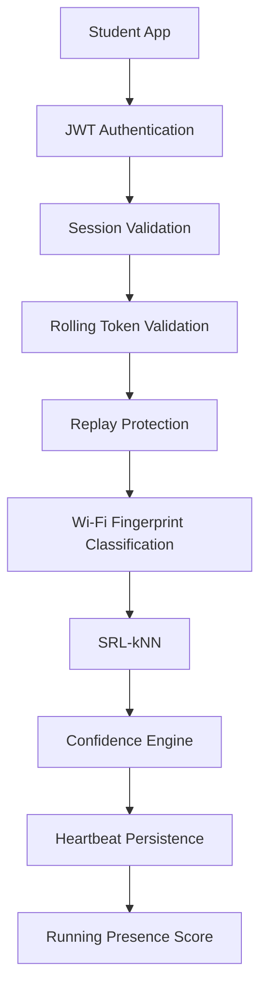

# Phase 7 Report — Heartbeat Engine

## Phase 7 Objectives
- Implement student-side heartbeat ingestion on the backend.
- Validate sessions and rolling tokens, prevent replay attacks.
- Classify Wi‑Fi fingerprints using SRL‑kNN and compute confidence.
- Persist heartbeats and update running presence scores for attendance.
- Provide student-first APIs and keep teacher endpoints deferred.

## Scope of Implementation
- Backend-only: POST /heartbeats and supporting services.
- No frontend or Android client code included in this phase.
- Additive DB migration applied (migration 107) to support heartbeat persistence allowances.

## Student-first Roadmap Alignment
- Keeps public surface focused on student flows: session discovery/join and heartbeat ingestion.
- Teacher operations remain deferred (501 responses) to maintain student-first delivery.

## APIs Added
- POST /heartbeats — authenticated endpoint accepting heartbeat payloads from student devices.

## Services Added
- `heartbeatService` — validates sequence progression, verifies rolling token, classifies fingerprint, persists heartbeat, records sequence gaps, updates running presence score.

## Middleware Used
- Existing JWT authentication middleware (auth middleware) to enforce student identity and session membership.

## Database Tables Involved
- `heartbeats` (persisted heartbeat records)
- `rolling_tokens` (lookup for token validation by time window)
- `sequence_gaps` (replay protection record-keeping)
- `attendance` (updated running presence score and progress)

## Migration Usage
- `migrations/107_phase7_heartbeat_engine.sql` — additive migration enabling heartbeat persistence semantics and nullable token_hmac handling for rejected records.

## Files Created
- `backend/src/services/heartbeatService.ts` — heartbeat pipeline and helpers.
- `backend/src/routes/heartbeatRoutes.ts` — route registration for POST /heartbeats.
- `migrations/107_phase7_heartbeat_engine.sql` — migration file.

## Files Modified
- `backend/src/index.ts` — route registration to include heartbeat routes (no behavioral changes to frozen phases).

## Folder Structure Changes
- `backend/src/services/` — new service file added.
- `backend/src/routes/` — new heartbeat route file added.
- `migrations/` — new migration file added.

## Unit Tests Added
- `backend/tests/heartbeat.unit.test.ts` — sequence validation and classification unit tests.

## Integration Tests Added
- `backend/tests/heartbeat.routes.test.ts` — end-to-end route tests for heartbeat ingestion and rejection cases.

## Build Results
- `npm run build` completed successfully (TypeScript compiled without errors).

## Test Results
- `npm test` passed.

Final Test Output (abridged):

PASS tests/auth.integration.test.ts
PASS tests/heartbeat.routes.test.ts
PASS tests/password.test.ts
PASS tests/heartbeat.unit.test.ts
PASS tests/session.routes.test.ts
PASS tests/session.unit.test.ts
PASS tests/fingerprint.unit.test.ts

Test Suites: 7 passed, 7 total
Tests: 46 passed, 46 total

## Requirement Traceability
- Rolling token validation: Implemented — `heartbeatService` verifies token by HMAC/time window. (see tests in `heartbeat.routes.test.ts`)
- Replay protection (sequence gaps): Implemented — sequence progression validated and gaps recorded to `sequence_gaps`.
- Wi‑Fi fingerprint classification (SRL‑kNN + Confidence): Implemented via integration with `matchingService` and `confidenceService` used by `heartbeatService`.

## Known Limitations
- Client-side (Android) foreground service and Wi‑Fi scanning are not part of this phase.
- Real-time token delivery via WebSocket and token engine broadcaster are deferred to Phase 8.
- Final, authoritative attendance computation (end-of-session aggregation) is deferred.

## Future Dependencies
- Phase 8: WebSocket Token Engine + Client Rolling Token Broadcast.
- Android: Foreground service, Wi‑Fi scanning, and token generation on-device.
- Final attendance aggregation service and reporting UI.

## End-to-end Heartbeat Workflow

---

Generated from the implemented Phase 7 backend state. No application code modified to produce this report.
