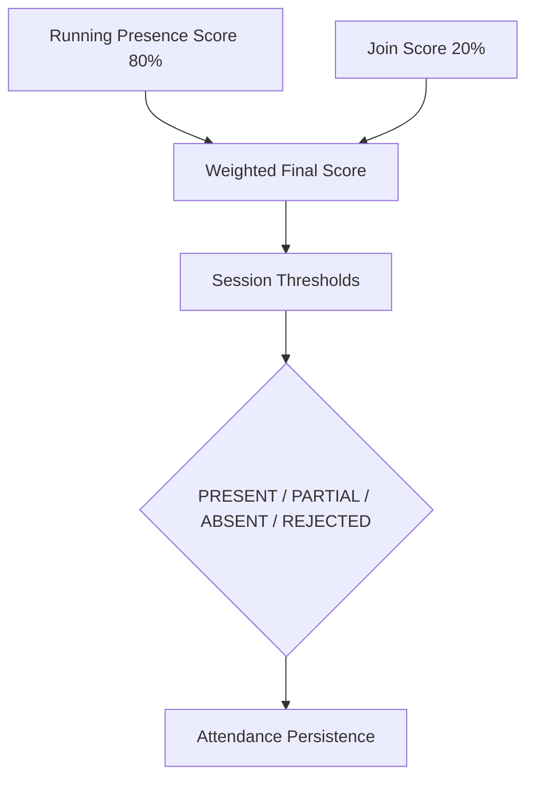

# Phase 8 Report — Attendance Finalization Refinement

## Phase 8 Objectives
- Finalize student attendance when a session closes.
- Replace the temporary score formula with the approved weighted formula.
- Keep REJECTED attendance rows unchanged.
- Trigger finalization automatically from the backend session-closure service.

## Final Attendance Computation Formula
- `finalScore = clamp(round((runningPresenceScore × 0.80) + (joinScore × 0.20)), 0, 100)`

## Why This Formula Was Selected
- It gives the running presence score the dominant weight because it reflects the full heartbeat history.
- It still preserves join behavior by retaining a smaller join-time contribution.
- It produces stable, bounded scores that map cleanly to session thresholds.

## Status Rules
- `PRESENT` when `finalScore >= presenceThresholdPresent`
- `PARTIAL` when `finalScore >= presenceThresholdPartial` and `finalScore < presenceThresholdPresent`
- `ABSENT` when `finalScore < presenceThresholdPartial`
- `REJECTED` remains unchanged

## Scope of Implementation
- Backend service refinement only.
- No Android frontend work.
- No teacher dashboard UI.
- No WebSockets, notifications, analytics, or admin features.

## Files Created
- `backend/src/services/attendanceFinalizationService.ts`
- `migrations/108_phase8_attendance_finalization.sql`
- `backend/tests/finalization.unit.test.ts`
- `backend/tests/finalization.routes.test.ts`
- `backend/tests/session.end.test.ts`

## Files Modified
- `backend/src/services/sessionService.ts`

## Services Added
- `attendanceFinalizationService.finalizeAttendanceForSession(sessionId)`
- `attendanceFinalizationService.computeFinalAttendanceScore(runningPresenceScore, joinScore)`
- `attendanceFinalizationService.classifyFinalAttendanceStatus(finalScore, presenceThresholdPresent, presenceThresholdPartial)`

## Session Closure Integration
- `sessionService.endSession(sessionId)` now closes the session and invokes finalization from the backend service layer.
- Repeated closure attempts are blocked because non-ACTIVE sessions are rejected before finalization runs.
- Teacher routes remain deferred and unchanged.

## Migration 108 Details
- Adds `final_score` to `attendance`.
- Adds `finalized_at` to `attendance`.
- Enables persistence of finalized attendance output without changing the frozen session schema.

## Database Tables Used
- `sessions`
- `attendance`

## Tests Added or Updated
- Unit tests for weighted scoring, PRESENT/PARTIAL/ABSENT classification, REJECTED preservation, threshold boundaries, and finalized-row idempotence.
- Integration tests for session closure finalization, persistence, session-specific thresholds, and duplicate closure protection.

## Build Results
- `npm run build` passed.

## Test Results
- Historical Phase 8 baseline: `50/50` tests passed.
- Final refined backend validation: `58/58` tests passed.

## Requirement Traceability
- Final attendance computation: implemented.
- Automatic finalization on session closure: implemented.
- REJECTED preservation: implemented.
- Threshold-based status mapping: implemented.
- Persistence of final score and finalization timestamp: implemented.

## Known Limitations
- Android client work is still outside Phase 8.
- Teacher dashboard UI remains deferred.
- Phase 9 items are intentionally out of scope.

## Future Dependencies
- Android foreground service and client-side heartbeat emission.
- End-to-end device validation against the production-like environment.
- Any future reporting or analytics layers.

## End-to-end Attendance Computation Flow

---

Generated from the finalized Phase 8 backend state. No application code was modified to produce this report.
