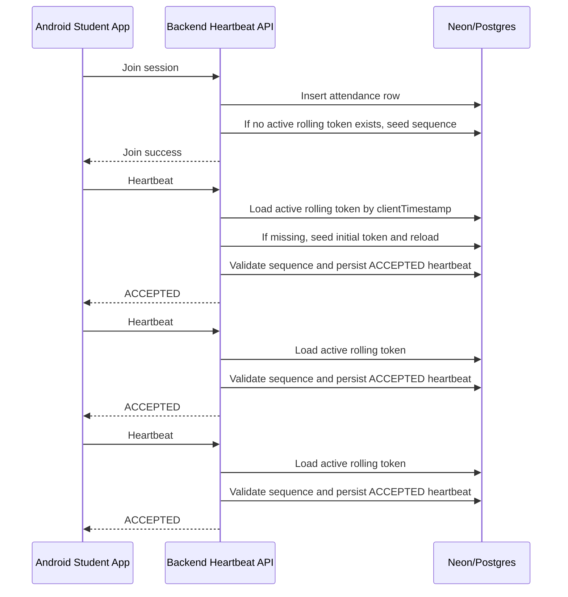

# Phase 9.6 Rolling Token Stabilization Report

**Date:** 2026-06-22  
**Status:** Fixed and validated in backend test suite  
**Scope:** Rolling-token initialization only. No protocol redesign.

## Root Cause

The first heartbeat was being validated before any active rolling-token row existed for the session timestamp.

In `backend/src/services/heartbeatService.ts`, the heartbeat path did this:

1. Load session and attendance.
2. Validate device binding and session status.
3. Query `rolling_tokens` for an active row matching `clientTimestamp`.
4. Reject with `ROLLING_TOKEN_INVALID` if no row existed.

The missing step was initialization of the initial rolling token before that validation branch ran. As a result, the first heartbeat for a valid joined student could hit the rejection path even though the rest of the heartbeat pipeline was working.

## Fix Applied

Smallest possible change:

- Added `ensureInitialRollingToken(client, sessionId, clientTimestamp)` in `backend/src/services/heartbeatService.ts`.
- If `loadActiveRollingToken(...)` returns `null`, the backend now seeds an initial rolling-token row for that session using the current heartbeat timestamp.
- The new row uses:
  - `sequence_number = 1`
  - `valid_from = clientTimestamp`
  - `valid_to = clientTimestamp + 60 seconds`
  - SHA-256 token hash derived from `sessionId` and `clientTimestamp`
- The existing validation and persistence flow remains unchanged after initialization.

No Android protocol changes were required for this stabilization step.

## Files Modified

- [backend/src/services/heartbeatService.ts](../backend/src/services/heartbeatService.ts)
- [backend/tests/heartbeat.routes.test.ts](../backend/tests/heartbeat.routes.test.ts)
- [docs/PHASE9_6_ROLLING_TOKEN_REPORT.md](PHASE9_6_ROLLING_TOKEN_REPORT.md)

## Test Evidence

Backend test suite after the fix:

```text
PASS  tests/auth.integration.test.ts
PASS  tests/session.routes.test.ts
PASS  tests/password.test.ts
PASS  tests/finalization.routes.test.ts
PASS  tests/session.unit.test.ts
PASS  tests/finalization.unit.test.ts
PASS  tests/session.end.test.ts
PASS  tests/fingerprint.unit.test.ts
PASS  tests/heartbeat.unit.test.ts
PASS  tests/heartbeat.routes.test.ts

Test Suites: 10 passed, 10 total
Tests:       58 passed, 58 total
```

Targeted route test now verifies that the first heartbeat is accepted after the initial rolling token is seeded.

## Payload Example

Current heartbeat request shape used by the Android client:

```json
{
  "sessionId": "session-1",
  "wifiFingerprint": [
    { "bssid": "AA:BB:CC:DD:EE:FF", "ssid": "Room", "rssi": -55 }
  ],
  "sequenceNumber": 1,
  "deviceFingerprint": "device-1",
  "timestamp": "2026-06-16T10:00:30.000Z"
}
```

Accepted heartbeat response example:

```json
{
  "accepted": true,
  "statusCode": 200,
  "heartbeat": {
    "id": "heartbeat-1",
    "sessionId": "session-1",
    "studentId": "student-1",
    "sequenceNumber": 1,
    "status": "ACCEPTED"
  },
  "runningPresenceScore": 92,
  "confidenceScore": 92,
  "classificationResult": "INSIDE_CLASSROOM"
}
```

## Database Verification Queries

Use these queries in Neon or the connected Postgres instance to confirm the stabilized lifecycle:

```sql
-- Verify the initial rolling token exists for the session
SELECT id, session_id, sequence_number, valid_from, valid_to, token_hash
FROM rolling_tokens
WHERE session_id = 'SESSION_ID'
ORDER BY sequence_number ASC;

-- Verify accepted heartbeats are persisted in order
SELECT id, session_id, student_id, seq_no, status, token_hmac, server_ts
FROM heartbeats
WHERE session_id = 'SESSION_ID'
ORDER BY seq_no ASC;

-- Verify the session attendance progress was updated
SELECT id, session_id, student_id, confidence_score, confidence_breakdown, status
FROM attendance
WHERE session_id = 'SESSION_ID'
  AND student_id = 'STUDENT_ID';
```

## Updated Rolling-Token Sequence Diagram



## Status

- Root cause identified: initialization was missing before validation.
- Fix applied: initial rolling token is seeded lazily before the rejection path.
- Validation passed: backend suite is green.

**Student module status:** Ready for approval.

**Stop condition:** Waiting for approval before any further phase work.
