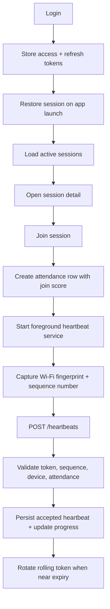

# Phase 9 Report — Automatic Attendance Management System

**Scope:** Phase 9.1 through Phase 9.6 only.  
**Source of truth:** current backend services and routes, Android student app sources, database schema documentation, and the existing Phase 9.5 / 9.6 validation reports.  
**Boundary:** this report does not claim teacher-dashboard work, analytics, WebSockets, or any later phases that are not present in the codebase.

## Executive Overview

Phase 9 completes the student-facing attendance pipeline from authentication through continuous heartbeat validation. The implementation is split into six sub-phases:

- Phase 9.1 established the student authentication foundation.
- Phase 9.2 surfaced active sessions and integrated them into the student dashboard.
- Phase 9.3 added session joining and attendance row creation.
- Phase 9.4 established the scoring model used by join-time attendance and confidence tracking.
- Phase 9.5 delivered the Android foreground service that emits heartbeat packets.
- Phase 9.6 stabilized rolling-token lifecycle handling so the first heartbeat and token rotation both work reliably.

The implemented system is intentionally incremental. Existing backend foundations from earlier phases were extended rather than replaced, and the Android app was wired to those backend contracts without redesigning the protocol.

## Phase 9 At a Glance

| Sub-phase | Purpose | Status |
| --- | --- | --- |
| 9.1 | Authentication foundation | Completed |
| 9.2 | Session discovery and dashboard integration | Completed with one deferred detail endpoint |
| 9.3 | Session joining and attendance creation | Completed |
| 9.4 | Attendance scoring and confidence model | Completed in the implemented join / heartbeat pipeline |
| 9.5 | Continuous attendance validation on Android | Completed, with token lifecycle later stabilized in 9.6 |
| 9.6 | Rolling-token stabilization and rotation | Completed |

## What Was Implemented

- Secure login, access tokens, refresh tokens, logout, and session restoration.
- Active session listing and navigation from the dashboard into session detail views.
- Join-session API with attendance creation, duplicate-join prevention, and join-time scoring.
- Join score, confidence score, and attendance status propagation through attendance rows.
- Android foreground heartbeats with Wi-Fi fingerprint capture, sequence numbers, and periodic transmission.
- Rolling-token seeding and rotation so accepted heartbeats continue before token expiry.

## What Remains Partial or Deferred

- `GET /sessions/:id` is still deferred in the route layer and returns `501`.
- Some current-attendance UI paths exist, but the server-side detail endpoint is not fully enabled in the student route set.
- Teacher dashboard session-start / session-end routes remain deferred.
- No later-phase analytics or broadcast mechanisms are claimed here.

## Overall Sequence Flow

## Security Summary

- Credentials are exchanged for a short-lived JWT access token and a longer-lived refresh token.
- Refresh tokens are rotated rather than reused.
- Login failure tracking and account lockout remain in place.
- Heartbeat packets include sequence numbers, device fingerprints, Wi-Fi data, and token-bound validation.
- Rolling tokens are time-bound and persisted with sequence numbers so the backend can reject stale or replayed heartbeat states.

## Validation Summary

- Backend test suite currently passes: 10 suites, 60 tests.
- Authentication, session, join, heartbeat, and finalization tests all pass together in the current backend state.
- Android validation is documented in the existing device-validation report and source tree; the foreground service and screen flows are present in code.

## Phase-by-Phase Status Snapshot

### Phase 9.1

- Login: completed.
- JWT access tokens: completed.
- Refresh tokens: completed.
- Session restoration: completed.
- Logout: completed.

### Phase 9.2

- Loading active sessions: completed.
- Dashboard integration: completed.
- Session detail route: partially completed because the backend detail endpoint is still deferred.

### Phase 9.3

- Join API: completed.
- Attendance creation: completed.
- Duplicate join prevention: completed.
- Join validation: completed.

### Phase 9.4

- Join score calculation: completed.
- PRESENT / PARTIAL / REJECTED logic: completed.
- Confidence score concepts: completed.

### Phase 9.5

- Foreground service: completed.
- Heartbeat lifecycle: completed.
- Heartbeat packet generation: completed.
- Sequence numbers: completed.
- Rolling-token logic: partially complete at this stage, then stabilized in Phase 9.6.

### Phase 9.6

- Lazy rolling-token seeding: completed.
- Minimal rotation before expiry: completed.
- Backend acceptance path unchanged except for the token lifecycle fix: completed.
- Test alignment and proof of acceptance for the rolling-token window: completed.

## Files In Scope

- `backend/src/routes/authRoutes.ts`
- `backend/src/routes/sessionRoutes.ts`
- `backend/src/routes/heartbeatRoutes.ts`
- `backend/src/services/sessionService.ts`
- `backend/src/services/heartbeatService.ts`
- `backend/src/services/attendanceFinalizationService.ts`
- `android/app/src/main/java/com/automatic/attendance/student/ui/screens/*`
- `android/app/src/main/java/com/automatic/attendance/student/viewmodel/*`
- `android/app/src/main/java/com/automatic/attendance/student/repository/*`
- `android/app/src/main/java/com/automatic/attendance/student/service/HeartbeatForegroundService.kt`
- `docs/PHASE9_5_DEVICE_VALIDATION_REPORT.md`
- `docs/PHASE9_6_ROLLING_TOKEN_REPORT.md`

## Conclusion

Phase 9 is now a coherent student attendance pipeline: authentication, discovery, join, scoring, heartbeat emission, and rolling-token stabilization are all represented in the codebase and validated by tests or documented device-validation artifacts.

The only major gaps that remain are the explicitly deferred ones, especially the single-session detail endpoint and teacher-dashboard routes. Those are documented here as partial or not started rather than assumed complete.
