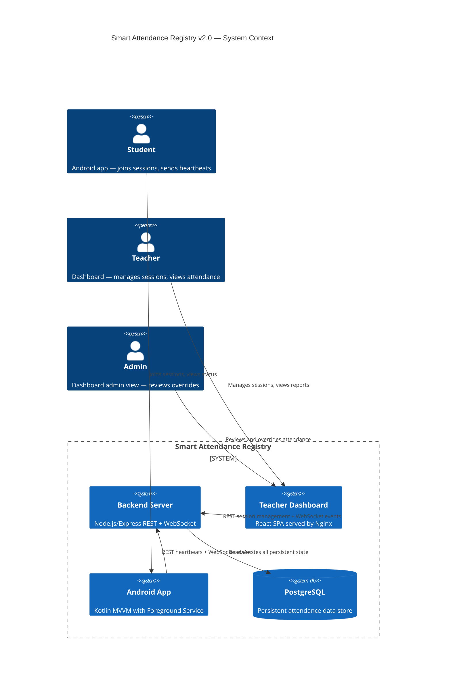
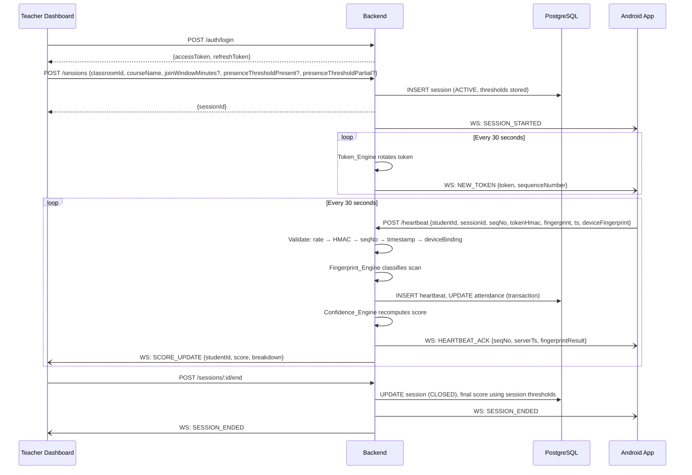
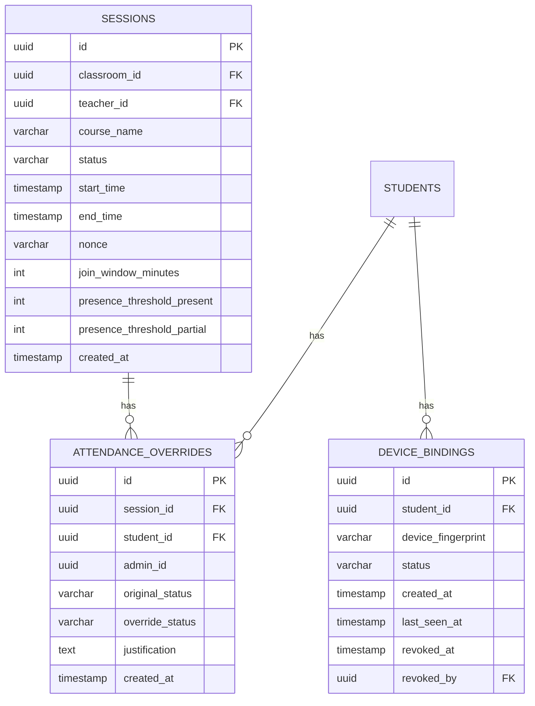

# Smart Attendance Registry — Architecture Review & Consolidated Document

---

## SECTION 1: Executive Summary

### Overview

Your version (MY VERSION) is a well-engineered, production-realistic attendance system built around Wi-Fi fingerprinting and a rolling cryptographic token/heartbeat pipeline. It demonstrates strong understanding of backend systems engineering: ACID transactions, JWT auth, HMAC-based token security, configurable confidence weights, negative fingerprint samples, and a properly layered 5-component backend. The architecture is honest about Android constraints, documents them explicitly, and stays within what a student team can ship.

Your teammate's version (FRIEND VERSION) is architecturally more ambitious but fundamentally less realistic. It introduces a 3-layer verification stack (GPS + Wi-Fi + BLE), continuous IMU sampling at 10 Hz for proxy detection via motion-signature cross-correlation, and a mobile Teacher App as the BLE scanner. These features are research-grade, not student-project-grade. Continuous IMU at 10 Hz will drain a phone battery in under 2 hours. GPS inside a building is unreliable. The Teacher-App-as-BLE-scanner architecture (students advertise, teacher scans) is the explicitly discouraged pattern per the evaluation criteria. The IMU correlation engine is essentially a graduate research project embedded inside an already-complex system.

### Decision

**Treat your version as the base architecture. Selectively incorporate exactly three elements from your teammate's version:**

1. **Device Enrollment Binding** (from friend R1) — the concept of permanently binding a device ID to a student identity at registration time strengthens your authentication layer at no additional complexity cost.
2. **Configurable Session Parameters** (from friend R17, specifically `minimum_presence_pct`) — your version already has configurable join windows; extending configuration to presence thresholds is a clean, low-effort addition.
3. **Administrative Override Interface** (from friend R16) — a manual override endpoint for flagged or disputed attendance is an excellent real-world feature that costs very little to add and significantly improves the system's practical value for educators.

Everything else from the teammate's version is either covered by your architecture, architecturally incompatible, or moved to Future Work.

---

## SECTION 2: Feature Comparison Table

| Feature | MY Version | FRIEND Version | Decision |
|---|---|---|---|
| JWT Access + Refresh Tokens | ✅ Full implementation with 15-min TTL | ❌ Not present | KEEP (yours) |
| Role-Based Access Control (TEACHER/STUDENT) | ✅ Embedded in JWT payload | ❌ Not present | KEEP (yours) |
| Account lockout (5 attempts) | ✅ Requirement 1.10 | ❌ Not present | KEEP (yours) |
| bcrypt password hashing (cost 12) | ✅ Requirement 1.6 | ❌ Not present | KEEP (yours) |
| Device Enrollment Binding | ❌ Not present | ✅ R1 — permanent device-to-student binding | INCORPORATE (friend) |
| Wi-Fi Fingerprinting (k-NN + Euclidean) | ✅ Full k-NN with negative samples | ✅ Simpler matching, no negative samples | KEEP (yours, superior) |
| Negative Fingerprint Samples | ✅ CLASSROOM/NEGATIVE sample types | ❌ Not present | KEEP (yours) |
| 4-tier Location Confidence | ✅ STRONG/PROBABLE/WEAK/VERY_WEAK | ❌ Binary 85% threshold | KEEP (yours) |
| Wi-Fi Triangulation as signal | ✅ (implicit in k-NN distance) | ✅ Building zone matching | KEEP (yours) |
| Rolling Session Tokens (30s rotation) | ✅ SHA-256 derivation + nonce | ❌ Not present | KEEP (yours) |
| HMAC Validation on heartbeats | ✅ HMAC-SHA256 client-side compute | ✅ On BLE beacons only | KEEP (yours, broader) |
| Heartbeats every 30 seconds | ✅ Foreground Service | ❌ BLE every 2s is different paradigm | KEEP (yours) |
| Sequence Numbers + Replay Prevention | ✅ Gap-tolerant + HMAC digest cache | ✅ Timestamp-only (30s) | KEEP (yours, stronger) |
| Timestamp Validation | ✅ Asymmetric ±60s/10s window | ✅ 30s freshness | KEEP (yours) |
| Presence Confidence Score | ✅ 4-component weighted formula | ✅ Binary pass/fail with 80% presence | KEEP (yours, far superior) |
| Configurable Confidence Weights | ✅ attendance_weights table | ❌ Not present | KEEP (yours) |
| Session Lifecycle Management | ✅ ACTIVE/CLOSED with WebSocket broadcast | ✅ Start/stop with scheduling | KEEP (yours) |
| Configurable Join Window | ✅ Configurable 5–15 min | ❌ Fixed 5 min | KEEP (yours) |
| Configurable Presence Threshold | ❌ Fixed 85/60 score thresholds | ✅ minimum_presence_pct 50–100% | INCORPORATE (friend concept) |
| Fault Tolerance (3 missed HBs) | ✅ Sliding 10-slot window | ❌ Not present | KEEP (yours) |
| WebSocket Server (full event set) | ✅ Full ws event protocol | ❌ Not present (HTTP polling) | KEEP (yours) |
| Android Foreground Service | ✅ Kotlin MVVM with WorkManager fallback | ✅ React Native Foreground Service | KEEP (yours — native Kotlin) |
| Teacher Web Dashboard (React) | ✅ React 18 + TanStack Query | ❌ Teacher mobile app only | KEEP (yours — web is better for teachers) |
| CSV Export | ✅ Requirement 11.9 | ✅ PDF + CSV | KEEP (yours) |
| Historical Reporting | ✅ Full session history + per-student stats | ✅ Equivalent | KEEP (yours) |
| Administrative Override | ❌ Not present | ✅ R16 with audit logging | INCORPORATE (friend) |
| Docker Compose Deployment | ✅ Full with health checks | ❌ No containerisation | KEEP (yours) |
| Property-Based Tests (11 properties) | ✅ fast-check, full coverage | ✅ 24 properties (many untestable) | KEEP (yours — more realistic) |
| GPS Verification | ❌ Not present | ✅ R2 — GPS geofence | MOVE TO FUTURE WORK |
| BLE Proximity Signal | ❌ Not present | ✅ Student advertises, Teacher scans | INCORPORATE WITH REDESIGN |
| Continuous IMU Collection (10 Hz) | ❌ Not present | ✅ R5 — core proxy detection | MOVE TO FUTURE WORK |
| Motion Signature Correlation | ❌ Not present | ✅ R6 — Pearson/DTW correlation | MOVE TO FUTURE WORK |
| Baseline Profile Collection | ❌ Not present | ✅ R9 — 5-min enrollment IMU | MOVE TO FUTURE WORK |
| Stationary Device Detection | ❌ Not present | ✅ R7 — gyroscope micro-tremor | MOVE TO FUTURE WORK |
| Multi-device Pocket Detection | ❌ Not present | ✅ R13 — z-axis phase lag | MOVE TO FUTURE WORK |
| iOS Support | ❌ Android only | ✅ React Native cross-platform | ACKNOWLEDGED (Android MVP) |
| AES-256-GCM Beacon Encryption | ❌ Not applicable | ✅ R12 | ADOPT FOR BLE BEACON IF BLE ADDED |

---

## SECTION 3: Features To Keep (From Your Version)

All features in your base version are retained. The following are the highest-value items:

**Authentication Layer**
All of Requirement 1 is kept: JWT access/refresh tokens, bcrypt hashing, RBAC embedded in JWT, account lockout at 5 consecutive failures, 15-minute access token TTL. This is production-grade and well-specified.

**Wi-Fi Fingerprinting Engine**
Your full k-NN implementation with Euclidean distance, negative samples (CLASSROOM/NEGATIVE), 4-tier confidence tiers, distance threshold based on 90th-percentile pairwise distance, and incremental mean RSSI updates is significantly superior to your teammate's binary 85% threshold approach. Keep it entirely.

**Rolling Session Token Engine**
The SHA-256 token derivation with per-session nonce, 30-second rotation, 5-second overlap window, HMAC client-side computation, and replay cache (65s TTL) is exactly the right design. Your teammate's beacon replay prevention (30s timestamp only) is weaker.

**Heartbeat Pipeline**
The entire heartbeat validation pipeline — rate limiting → HMAC check → gap-tolerant sequence → timestamp window → session state — is well-designed and well-ordered. The gap logging to `sequence_gaps` is a useful audit artifact.

**Presence Confidence Engine**
The 4-component weighted formula `(0.5 × fingerprint + 0.3 × continuity + 0.1 × packetStability + 0.1 × joinScore)` with configurable weights via `attendance_weights` table is far more nuanced than your teammate's binary presence/absence model. Keep it, including the PRESENT/PARTIAL/ABSENT thresholds.

**Fault Tolerance Module**
The 3-missed-heartbeat recoverable threshold, 10-slot sliding window, DISCONNECTED state after 10+ missed heartbeats, and explicit rejoin requirement is realistic and well-implemented.

**WebSocket Server**
Full event protocol, 10s auth timeout, 90s idle timeout, ping/pong keepalive, subscription routing, and TOKEN_REFRESH on reconnect. No changes needed.

**Android App Architecture**
Native Kotlin + MVVM + Jetpack is the correct choice over React Native for a system requiring continuous background sensor access. WorkManager fallback is a smart addition. Keep all of Task 12.

**Teacher Dashboard**
React 18 + Vite + TanStack Query with live attendance table, configurable weights panel, CSV export, and Playwright E2E tests. This is more appropriate for teachers than a mobile app.

**Docker Compose Deployment**
Your deployment architecture (3 containers, health checks, migration runner, environment variable validation) is complete and correct.

**Testing Strategy**
11 property-based tests with fast-check, unit tests, integration tests against real PostgreSQL, Android property tests with Kotest. This is the right approach. Your teammate's 24 properties include many that are testing research-grade features that don't exist in the MVP.

---

## SECTION 4: Features To Remove

These features appear in either version and should not be included in the MVP:

**From Friend Version — Remove Entirely from MVP:**

- GPS geofence verification (R2): GPS is unreliable indoors. Buildings attenuate GPS signals to the point where readings are meaningless for classroom-level resolution. The feature also requires PostGIS, a heavy dependency with no other use in the system.
- Continuous IMU collection at 10 Hz (R5): 10 Hz sampling produces 1800 samples per axis per 3-minute window. This alone will drain battery to under 2 hours. Android's Doze mode will kill this. Not viable.
- Motion signature correlation engine (R6): Pearson/DTW correlation over 3-minute windows for all device pairs is a graduate-level research feature. The computational cost scales as O(n²) with the number of students. For a 60-student classroom, that's 1770 device pairs every 3 minutes.
- Baseline profile collection at enrollment (R9): Requires 5 minutes of controlled movement capture during enrollment. Users will not sit still; the baseline will drift; the feature requires a research-quality enrollment UX.
- Stationary device detection (R7): Relies on gyroscope micro-tremors as a signal. This is explicitly research-grade. Human micro-tremor signals are device-dependent, age-dependent, and medication-dependent.
- Multi-device pocket detection (R13): Phase lag analysis between z-axis motion signatures is a published research technique. Not a student-project feature.
- Teacher Mobile App as BLE Scanner: The pattern of students advertising BLE and teacher scanning is the explicitly disallowed architecture. It makes the teacher a single point of failure and creates range problems.
- iOS support (current scope): React Native cross-platform is a significant scope increase. Android MVP is the correct call for a student project.
- Permanent non-overridable enrollment binding (R1.6): The "no administrator override" policy is operationally unacceptable (broken phones, replacements). Replace with the softer device-binding-at-login approach in Section 6.
- 24-hour session key rotation (friend R12.7): Key rotation per session (yours) is simpler and sufficient.
- AES-256-GCM beacon encryption: Only relevant if BLE beacons are used. See BLE section.

---

## SECTION 5: Features To Move To Future Work

The following features have genuine value but are deferred to post-MVP:

**BLE Proximity Signal (Redesigned)**
If BLE is added post-MVP, the correct architecture is: Teacher device broadcasts a BLE Beacon; Android student apps scan the beacon. BLE RSSI becomes an optional 5th confidence signal added to the Confidence Engine formula (e.g., `bleProximityScore` with a small weight like 0.1, redistributing other weights proportionally). This is well-defined and realistic in a follow-up phase.

**GPS Campus Geofence**
Useful as a coarse "student is on campus" check, not a classroom-level check. Can be added as an optional signal in a future phase if the institution has reliable outdoor GPS boundaries.

**IMU-Based Anti-Spoofing (Research Track)**
The full IMU correlation engine (motion signatures, baseline profiles, proxy detection) is a legitimate research contribution. Move it to a documented Future Work section in the project report. It makes the project academically interesting without blocking the MVP.

**Administrative Override Interface (Move Up — See Section 3 Addendum)**
This has been promoted from Future Work to MVP because it is trivially implementable (one endpoint + audit log table) and significantly improves the system's real-world credibility with educators.

**Cross-Platform (iOS) Support**
Can be pursued post-MVP by wrapping the Android app logic in a React Native or Flutter layer, or by building a native Swift app.

**Configurable Presence Threshold**
Your version uses a fixed score-based threshold (≥85 = PRESENT, 60–84 = PARTIAL, <60 = ABSENT). The friend's concept of a configurable `minimum_presence_pct` (50–100%) is useful. This can be incorporated as a session-level configuration parameter that adjusts the PRESENT/PARTIAL thresholds — moved up to MVP as a low-cost incorporation (see Section 11).

---

## SECTION 6: Architecture Review

### Recommended Final Architecture

The 5-layer architecture below supersedes both versions:

```
Layer 1 — Authentication
  JWT Access Tokens (15-min TTL)
  Refresh Tokens (7-day TTL, revocable)
  Device Enrollment Binding (new — from friend R1, softened)
  RBAC (STUDENT / TEACHER / ADMIN roles)
  Account Lockout

Layer 2 — Session Management
  Session Lifecycle (ACTIVE/CLOSED)
  WebSocket Server (full event protocol)
  Rolling Session Tokens (30s rotation, HMAC client-side)
  Configurable Join Window (5–15 min)
  Configurable Presence Threshold (new from friend R17)

Layer 3 — Presence Verification
  Wi-Fi Fingerprinting (k-NN, negative samples, 4-tier confidence)
  [Future: BLE Proximity Signal — Teacher broadcasts, students scan]
  [Future: GPS Campus Boundary]

Layer 4 — Synchronization Verification
  Heartbeats every 30 seconds
  Gap-tolerant Sequence Numbers
  Asymmetric Timestamp Window (±60s/10s)
  Rate Limiting (4 HB/60s)
  Replay Prevention (HMAC digest cache)

Layer 5 — Confidence Engine
  Location Confidence (fingerprintScore → 4-tier mapping)
  Session Continuity (sliding 10-slot window)
  Packet Stability (rejection ratio)
  Join Score (punctuality)
  Configurable Weights (attendance_weights table)
  Configurable Status Thresholds (presence_thresholds — new)
  Administrative Override (new from friend R16)
```

### Device Enrollment Binding (Incorporated from Friend)

The friend's concept of binding a device to a student identity is valuable but the "permanent with no override" policy is operationally unworkable. The recommended softened implementation:

- At first login from a new device, the system creates a `device_bindings` record linking `(studentId, deviceFingerprint, enrollmentTimestamp)`.
- A student may have at most 2 active device bindings (primary + backup).
- ADMIN role can revoke a binding (e.g., for a lost/replaced phone).
- The device fingerprint is included as a secondary verification signal in heartbeats (not a hard gate).

This adds a `device_bindings` table and a check in the heartbeat processor. It does not require a 5-minute IMU baseline collection.

### BLE Architecture Correction

The friend version has students advertising and teacher scanning — this is explicitly disallowed. If BLE is incorporated (Future Work Phase 4):

- **Teacher device broadcasts a BLE iBeacon** with a session-specific UUID.
- **Student Android apps scan for the beacon** using `BluetoothLeScanner`.
- Student apps include `bleRssi` in the heartbeat payload.
- The Confidence Engine uses `bleRssi` as an optional proximity signal with a small weight.
- This requires no Teacher App changes (beacon broadcasting is trivial) and does not create a single point of failure.

---

## SECTION 7: Security Review

### Your Version — Security Assessment: Strong

Your version has the correct threat model for an attendance system:

| Threat | Your Mitigation | Assessment |
|---|---|---|
| Replay attacks | HMAC digest cache (65s TTL) + sequence numbers + timestamp window | Excellent |
| Token theft | Raw token never sent by client; HMAC computed client-side | Excellent |
| Precomputation | Per-session 128-bit nonce in SHA-256 derivation | Excellent |
| Credential theft | bcrypt cost 12, account lockout, refresh token revocation | Good |
| Rate-based attacks | 4 HB/60s per student-session + global 100 req/min IP limit | Good |
| Proxy attendance | Sequence number gaps logged; continuity score penalizes absences | Moderate |
| JWT forgery | HS256 signed with JWT_SECRET from environment | Standard |

### Friend Version — Security Assessment: Overcomplicated for Wrong Threats

The friend version focuses heavily on IMU-based proxy detection (motion correlation) while missing basic backend security (no JWT, no rate limiting, no sequence numbers). The AES-256-GCM beacon encryption is correct in principle but adds implementation complexity for a BLE feature that is Future Work.

### Recommended Security Additions (from Friend Version)

1. **Device Enrollment Binding** (incorporated): Adds a lightweight identity-device binding check. Heartbeats from unregistered devices are flagged in the audit log.
2. **Admin Override Audit Log**: When an admin overrides an attendance record, log `(adminId, studentId, sessionId, originalStatus, newStatus, justification, timestamp)`. This is from friend R16.4–16.5 and is trivially implementable.

### Security Items to Reject

- AES-256-GCM beacon encryption: Premature until BLE is in-scope.
- IMU hash in heartbeat payload: The IMU system is Future Work; the hash field would always be empty in MVP.
- 24-hour session key rotation: Per-session token rotation (your design) is sufficient.
- Non-revocable permanent enrollment binding: Operationally dangerous; replaced with softened binding above.
---

## SECTION 8: Android Feasibility Review

### Your Version — Feasibility: High

| Feature | Android API | Feasibility | Notes |
|---|---|---|---|
| Foreground Service with notification | `Service` + `startForeground()` | ✅ High | Standard pattern; stable since API 26 |
| Wi-Fi scanning (ACCESS_FINE_LOCATION) | `WifiManager.getScanResults()` | ✅ High with caveats | Android 10+: throttled to 4 scans/2 min; mitigated by using existing cached results between HBs |
| WorkManager fallback (≤30s interval) | `PeriodicWorkRequest` | ⚠️ Medium | Min interval is 15 min in Android; use a `Handler` inside Foreground Service instead as primary; WorkManager as true fallback only |
| WebSocket client (OkHttp) | OkHttp WebSocket | ✅ High | Stable library; reconnect logic straightforward |
| Encrypted SharedPreferences | `EncryptedSharedPreferences` | ✅ High | Jetpack Security library |
| HMAC-SHA256 computation | `javax.crypto.Mac` | ✅ High | Standard JCA API |
| ACCESS_WIFI_STATE + NEARBY_WIFI_DEVICES | Runtime permissions | ✅ High | Must request at runtime; documented in ANDROID_LIMITATIONS.md |

**Your Task 12.12 (ANDROID_LIMITATIONS.md) is critical — the documented limitations are accurate.**

The real Android constraint is Wi-Fi scan throttling. Your mitigation (transmit heartbeat with empty `fingerprintData` if scan fails) is correct. The system degrades gracefully — the continuity score still accumulates; only the fingerprint component is zero for that slot.

### Friend Version — Feasibility: Low

| Feature | Android API | Feasibility | Issue |
|---|---|---|---|
| IMU at 10 Hz continuously | `SensorManager.registerListener(SENSOR_DELAY_GAME)` | ❌ Low | Android Doze kills this; 10 Hz × 6 axes × session duration is ~10 MB/hour of data |
| GPS every 30 seconds indoors | `FusedLocationProviderClient` | ❌ Low | GPS accuracy indoors is 10–50+ meters, not sub-room level |
| BLE advertising (student side) | `BluetoothLeAdvertiser` | ⚠️ Medium | Android 10+ background advertising restricted; needs Foreground Service |
| Background data upload batching | WorkManager | ⚠️ Medium | Doze mode delays batched uploads |
| React Native for all features | React Native bridge | ⚠️ Low-Medium | Native sensor APIs are more reliable; React Native bridge adds latency and complexity for high-frequency sensor work |

**Conclusion: The friend version's Android requirements are not feasible for a student project in the current Android OS environment.**

---

## SECTION 9: Battery Usage Review

### Your Version — Battery Assessment: Acceptable

Estimated battery impact per hour of active session:

| Component | Frequency | Battery Cost |
|---|---|---|
| Wi-Fi scan | 1 per 30s (throttled from cached) | ~1–2% |
| Foreground Service overhead | Continuous | ~0.5% |
| WebSocket connection | Persistent | ~0.5% |
| HTTP heartbeat POST | 1 per 30s | ~0.3% |
| HMAC-SHA256 computation | 1 per 30s | ~0.0% (negligible) |
| **Total estimate** | — | **~2–3% per hour** |

This is well within acceptable range. A 90-minute lecture consumes roughly 3–5% of battery. Students will not notice.

### Friend Version — Battery Assessment: Critical Failure

| Component | Frequency | Battery Cost |
|---|---|---|
| IMU sampling at 10 Hz | 600 samples/min, 6 axes | **~8–12% per hour** alone |
| GPS every 30 seconds | 2/min | ~3–5% per hour |
| BLE advertising every 2 seconds | 30/min | ~3–4% per hour |
| Wi-Fi scanning every 45 seconds | ~1.3/min | ~1–2% per hour |
| Data upload batching | Periodic | ~1% per hour |
| **Total estimate** | — | **~16–24% per hour** |

A 90-minute lecture at the friend's battery consumption rate would drain 24–36% of battery. A student attending a full day of 5 classes would drain their phone completely. This is not a student project — it is a requirement for students to carry battery packs.

The friend's requirement of "< 5% per hour" (R15.7) contradicts the technical requirements of continuous IMU + GPS + BLE. This requirement cannot be met.

### BLE Addition (Future Work) Battery Impact

If BLE is added per the recommended architecture (student scans Teacher beacon):
- BLE scanning in foreground: ~1–2% per hour additional
- Total with BLE: ~4–5% per hour — still acceptable

---

## SECTION 10: Scalability Review

### Your Version — Scalability: Good for Student Project

**Throughput analysis** for a 60-student session with 30-second heartbeats:
- 60 students × 2 heartbeats/min = 120 heartbeats/minute = 2 heartbeats/second at peak
- PostgreSQL can comfortably handle 1000+ writes/second on commodity hardware
- Node.js non-blocking I/O handles 500+ concurrent WebSocket connections per Requirement 10.5

**Horizontal scaling path**: The design explicitly notes that the in-memory `Map<sessionId, Set<WebSocket>>` can be replaced with Redis pub/sub without changing the client protocol. This is the correct future-proof note.

**Bottlenecks**:
- The `setInterval` per-session token rotation uses one interval per active session. For 100 concurrent sessions, this is 100 intervals. Not a problem at student-project scale but worth noting.
- The `used_hmac_digests` in-memory replay cache per session will grow with session duration. Add periodic cleanup of expired entries (TTL > 65s).

### Friend Version — Scalability: Theoretically Worse

The Correlation Engine is O(n²) in the number of students per session. For 60 students: 1770 device pairs × preprocessing + Pearson + DTW every 3 minutes. This is 590 computations per minute. At the design's stated "> 10 seconds/pair" warning threshold, 1770 pairs could take 17,700+ seconds — effectively never completing before the next window.

The friend's architecture relies on the Teacher App's mobile device for BLE scanning. A mobile device cannot realistically scan and process beacons from 60 students simultaneously while also managing session state and uploading to the backend.

### Scalability Additions from Friend Version

The friend has one useful scalability note: **batch sensor data uploads** to reduce network operations. Your version sends one heartbeat per student per 30 seconds — this is already the correct pattern. No changes needed.
---

## SECTION 11: Updated Requirements Document

# Requirements Document — Smart Attendance Registry (v2.0)

## Introduction

The Smart Attendance Registry is a production-ready classroom attendance system that verifies student physical presence using Wi-Fi fingerprinting, rolling cryptographic tokens, and heartbeat synchronization — no additional hardware required. The system continuously computes a Presence Confidence Score (0–100) for each student by combining physical location signals with temporal synchronization signals, producing a tamper-resistant attendance record.

Three additions from teammate review have been incorporated:
1. **Device Enrollment Binding** — links a device identity to a student at registration time.
2. **Configurable Presence Thresholds** — extends session configuration to allow teachers to set PRESENT/PARTIAL thresholds per session.
3. **Administrative Override Interface** — allows admins to manually review and correct attendance with full audit logging.

The system has four components:
1. **Backend Attendance Server** — Node.js/Express.js REST API + WebSocket server backed by PostgreSQL
2. **Android Student Application** — Kotlin/MVVM app with Foreground Service for Wi-Fi scanning and heartbeat transmission
3. **Teacher Dashboard** — React.js SPA for session management, live attendance, and reporting
4. **Authentication Layer** — JWT-based auth shared across all components

---

## Glossary

*(All original terms retained. New terms added below.)*

- **Device_Binding**: A record in the `device_bindings` table linking a `deviceFingerprint` to a `studentId`, created on first login from a new device.
- **deviceFingerprint**: A string derived from stable device properties (Android ID) used to identify a specific physical device.
- **Presence_Threshold**: Session-level configuration specifying the minimum Presence_Confidence_Score for PRESENT status (default 85) and PARTIAL status (default 60), stored in `sessions.presence_threshold_present` and `sessions.presence_threshold_partial`.
- **Admin**: A user with role ADMIN who can review flagged records and issue attendance overrides.
- **Override_Log**: An audit record in the `attendance_overrides` table capturing every manual attendance change.

---

## Requirements

### Requirement 1: User Authentication and Device Binding

**User Story:** As a Student or Teacher, I want to securely log in with my credentials, so that only authorized users can access the system. As the system, I want to record which device a student used, so that anomalous device changes can be flagged.

#### Acceptance Criteria

1. WHEN a Student submits valid credentials (email + password), THE Auth_Service SHALL return a signed JWT access token and a refresh token within 2 seconds.
2. WHEN a Teacher submits valid credentials (email + password), THE Auth_Service SHALL return a signed JWT access token and a refresh token within 2 seconds.
3. IF a user submits invalid credentials, THEN THE Auth_Service SHALL return an HTTP 401 response and SHALL NOT return any token.
4. WHEN a JWT access token expires, THE Auth_Service SHALL accept a valid refresh token and issue a new access token without requiring re-login; IF the refresh token is invalid or malformed, THEN THE Auth_Service SHALL return HTTP 401.
5. IF a refresh token is expired or revoked, THEN THE Auth_Service SHALL clear session state, return HTTP 401, and require re-login.
6. THE Auth_Service SHALL store passwords as bcrypt hashes with minimum cost factor 12 and SHALL NOT store plaintext passwords.
7. WHEN a user logs out, THE Auth_Service SHALL invalidate the refresh token.
8. THE Auth_Service SHALL embed the user role (STUDENT, TEACHER, or ADMIN) and user ID in the JWT payload.
9. THE Auth_Service SHALL issue JWT access tokens with a validity window of exactly 15 minutes.
10. IF a user submits 5 consecutive failed login attempts, THEN THE Auth_Service SHALL lock the account and return HTTP 429 for all subsequent attempts.
11. WHEN a Student successfully authenticates from a device, THE Auth_Service SHALL check whether a `device_bindings` record exists for `(studentId, deviceFingerprint)`; IF none exists AND the student has fewer than 2 active bindings, THE Auth_Service SHALL create a new `device_bindings` record; IF the student already has 2 active bindings, THE Auth_Service SHALL return HTTP 409 with code `DEVICE_LIMIT_REACHED`.
12. THE Auth_Service SHALL include the `deviceFingerprint` in the JWT payload for Student tokens so that the Heartbeat_Processor can verify device binding without additional database queries.
13. WHEN an Admin revokes a device binding, THE Auth_Service SHALL set the `device_bindings` record status to `REVOKED` and SHALL invalidate all active refresh tokens for that student-device pair.

---

### Requirement 2: Classroom Wi-Fi Fingerprint Registration

*(Unchanged from your original Requirement 2 — fully retained)*

---

### Requirement 3: Wi-Fi Fingerprint Classification

*(Unchanged from your original Requirement 3 — fully retained)*

---

### Requirement 4: Session Lifecycle Management

**User Story:** As a Teacher, I want to start and end lecture sessions with configurable join windows and attendance thresholds, so that the system adapts to my classroom's needs.

#### Acceptance Criteria

1–9. *(All original criteria 1–9 retained unchanged)*

10. THE Session_Manager SHALL record the join timestamp for each Student enrollment.
11. WHEN a Teacher creates a session, THE Session_Manager SHALL accept optional `presenceThresholdPresent` (default 85, range 70–100) and `presenceThresholdPartial` (default 60, range 40–84) parameters and SHALL persist them in the Sessions table; IF `presenceThresholdPartial >= presenceThresholdPresent`, THE Session_Manager SHALL return HTTP 400.
12. THE Session_Manager SHALL use the session-specific `presenceThresholdPresent` and `presenceThresholdPartial` values when computing final Attendance_Status; IF these values are absent, THE Session_Manager SHALL use the defaults (85 and 60).

---

### Requirement 5: Rolling Session Token Generation

*(Unchanged from your original Requirement 5 — fully retained)*

---

### Requirement 6: Heartbeat Transmission (Android App)

*(Unchanged from your original Requirement 6, with one addition)*

10. IF the Wi-Fi scan fails or returns no results, THEN THE Foreground_Service SHALL transmit the heartbeat with an empty `fingerprintData` array rather than skipping the transmission.
11. THE Foreground_Service SHALL include the `deviceFingerprint` in each heartbeat payload so that the Heartbeat_Processor can cross-check device binding.

---

### Requirement 7: Heartbeat Validation

*(Unchanged from your original Requirement 7, with one addition)*

8. WHEN the Heartbeat_Processor receives a heartbeat, it SHALL verify that the `deviceFingerprint` in the payload matches an active `device_bindings` record for the authenticated student; IF no matching binding exists, THE Heartbeat_Processor SHALL log a `DEVICE_BINDING_MISMATCH` event but SHALL NOT reject the heartbeat unless the student has zero active bindings (in which case HTTP 403 is returned).

---

### Requirement 8: Presence Confidence Score Computation

**User Story:** As the system, I want to compute a Presence Confidence Score using configurable weights and session-specific thresholds.

#### Acceptance Criteria

1–6. *(All original criteria 1–6 retained)*

7. FOR ALL valid combinations of component scores within their defined ranges, THE Confidence_Engine SHALL produce a Presence_Confidence_Score in [0, 100].
8. WHEN the session ends, THE Confidence_Engine SHALL use the session-specific `presenceThresholdPresent` and `presenceThresholdPartial` values (from Sessions table) rather than hardcoded defaults when assigning Attendance_Status.

---

### Requirement 9: Fault Tolerance and Reconnection

*(Unchanged from your original Requirement 9 — fully retained)*

---

### Requirement 10: WebSocket Communication

*(Unchanged from your original Requirement 10 — fully retained)*

---

### Requirement 11: Teacher Dashboard — Session Management

*(Unchanged from your original Requirement 11, with one addition)*

10. THE Dashboard SHALL allow the Teacher to set session-specific `presenceThresholdPresent` and `presenceThresholdPartial` values when creating a session; IF not set, defaults (85/60) SHALL be displayed.

---

### Requirement 12: Teacher Dashboard — Historical Reporting

*(Unchanged from your original Requirement 12 — fully retained)*

---

### Requirement 13: Android App — Student Session Flow

*(Unchanged from your original Requirement 13 — fully retained)*

---

### Requirement 14: Security — Replay Attack Prevention

*(Unchanged from your original Requirement 14 — fully retained)*

---

### Requirement 15: Administrative Override Interface

**User Story:** As an Admin, I want to manually review flagged attendance records and issue corrections with full audit logging, so that false positives and disputes can be resolved fairly.

#### Acceptance Criteria

1. THE Backend SHALL provide an `attendance_overrides` table with columns `(id, sessionId, studentId, adminId, originalStatus, overrideStatus, justification, createdAt)`.
2. WHEN an Admin calls `POST /admin/sessions/:sessionId/attendance/:studentId/override` with `{overrideStatus, justification}`, THE Backend SHALL update the `attendance.status` field to `overrideStatus` and SHALL insert a record into `attendance_overrides` capturing the original status, override status, admin ID, justification, and timestamp.
3. THE Backend SHALL require ADMIN role JWT for all `/admin/*` endpoints; non-admin requests SHALL receive HTTP 403.
4. THE Override endpoint SHALL accept `overrideStatus` values of PRESENT, PARTIAL, or ABSENT only; other values SHALL return HTTP 400.
5. THE Backend SHALL preserve the original automated `confidence_score` and `status` values in the `attendance` table by storing them in the `attendance_overrides` record before applying the override; the `attendance.status` field reflects the most recently applied value (override or original).
6. THE Dashboard SHALL provide an admin view listing all attendance records for a session, with a button to override any record; the view SHALL display the original automated status alongside any override.
7. THE Backend SHALL provide `GET /admin/overrides` returning all override records for audit; this endpoint SHALL require ADMIN role.
8. IF an Admin attempts to override an attendance record for a session that is still ACTIVE, THE Backend SHALL return HTTP 409.

---

### Requirement 16: Data Persistence and Schema Integrity

*(Unchanged from your original Requirement 15 — renumbered)*

Additional table:
1a. THE Backend SHALL also persist data in `device_bindings` (id, studentId, deviceFingerprint, status, createdAt, revokedAt) and `attendance_overrides` (id, sessionId, studentId, adminId, originalStatus, overrideStatus, justification, createdAt) tables.

---

### Requirement 17: Deployment and Operations

*(Unchanged from your original Requirement 16 — renumbered)*
---

## SECTION 12: Updated Design Document

# Design Document — Smart Attendance Registry (v2.0)

## Overview

The Smart Attendance Registry verifies student physical presence using Wi-Fi fingerprinting and rolling cryptographic tokens. Three features from teammate review have been incorporated into this design:

1. **Device Enrollment Binding** — softened from the friend's permanent-irrevocable model to a 2-binding-per-student, admin-revocable model.
2. **Configurable Presence Thresholds** — session-level PRESENT/PARTIAL score thresholds (default 85/60).
3. **Administrative Override Interface** — manual attendance correction with full audit trail.

All other architectural decisions from v1.0 are retained unchanged. IMU, GPS geofencing, and BLE features are explicitly deferred to Future Work.

### Design Goals (unchanged)
- Tamper-resistance: Rolling tokens + sequence numbers + timestamp windows make replay attacks computationally infeasible.
- Fault tolerance: Up to 3 consecutive missed heartbeats are recoverable.
- Real-time feedback: Teachers see live score updates within 5 seconds.
- Horizontal scalability: Stateless REST + Redis-upgradeable WebSocket tier.
- Operational simplicity: `docker compose up`.

### Technology Choices (unchanged from v1.0)

| Layer | Technology | Rationale |
|---|---|---|
| Backend API | Node.js 20 LTS + Express.js | Non-blocking I/O for high-frequency heartbeat ingestion |
| WebSocket | `ws` library | Low overhead |
| Database | PostgreSQL 16 | ACID, JSONB, mature indexing |
| ORM / Query | `pg` raw SQL | Full query control |
| Android | Kotlin + MVVM + Jetpack | Native APIs for reliable background service |
| Teacher UI | React 18 + Vite + TanStack Query | Fast SPA |
| Auth | JWT (15 min) + refresh tokens | Stateless RBAC |
| Containerisation | Docker Compose | Single-command deployment |

---

## Architecture

### System Context



### Component Interaction (Updated Sequence)



---

## New Components

### 10. Device Binding Service (New)

Manages the `device_bindings` table. Called by Auth Service on every student login.

**Endpoints**

| Method | Path | Auth | Description |
|---|---|---|---|
| GET | `/auth/devices` | STUDENT JWT | List student's active device bindings |
| DELETE | `/admin/devices/:bindingId` | ADMIN JWT | Revoke a device binding |

**Binding Logic**

```
On Student Login:
  existing = SELECT * FROM device_bindings WHERE studentId = ? AND status = 'ACTIVE'
  if exists(deviceFingerprint in existing):
    → update last_seen_at, continue
  elif count(existing) < 2:
    → INSERT new binding, continue
  else:
    → HTTP 409 DEVICE_LIMIT_REACHED
```

**`device_bindings` Table**

```sql
CREATE TABLE device_bindings (
  id UUID PRIMARY KEY DEFAULT gen_random_uuid(),
  student_id UUID NOT NULL REFERENCES students(id),
  device_fingerprint VARCHAR(255) NOT NULL,
  status VARCHAR(20) NOT NULL DEFAULT 'ACTIVE',  -- ACTIVE | REVOKED
  created_at TIMESTAMP NOT NULL DEFAULT NOW(),
  last_seen_at TIMESTAMP,
  revoked_at TIMESTAMP,
  revoked_by UUID REFERENCES teachers(id),
  UNIQUE(student_id, device_fingerprint)
);
CREATE INDEX idx_device_bindings_student ON device_bindings(student_id, status);
```

**Heartbeat Device Check**

The Heartbeat_Processor adds a step 5b after session state check:

```
5b. Device binding check:
    bindings = SELECT * FROM device_bindings WHERE studentId = ? AND status = 'ACTIVE'
    if count(bindings) == 0:
      → HTTP 403 NO_DEVICE_BINDING
    if deviceFingerprint NOT IN bindings:
      → INSERT INTO audit_log (DEVICE_BINDING_MISMATCH), continue (do NOT reject)
```

The mismatch is logged but not a hard rejection — this avoids false positives from device fingerprint drift.

---

### 11. Administrative Override Service (New)

**Endpoints**

| Method | Path | Auth | Description |
|---|---|---|---|
| GET | `/admin/sessions/:id/attendance` | ADMIN JWT | View all attendance records for session |
| POST | `/admin/sessions/:sessionId/attendance/:studentId/override` | ADMIN JWT | Override attendance status |
| GET | `/admin/overrides` | ADMIN JWT | List all overrides (audit log) |

**Override Flow**

```mermaid
sequenceDiagram
    participant Admin as Admin Dashboard
    participant B as Backend
    participant DB as PostgreSQL

    Admin->>B: POST /admin/sessions/:id/attendance/:studentId/override
         {overrideStatus: "PRESENT", justification: "Technical failure"}
    B->>DB: SELECT status FROM attendance WHERE session_id=? AND student_id=?
    B->>DB: INSERT INTO attendance_overrides (originalStatus, overrideStatus, adminId, justification)
    B->>DB: UPDATE attendance SET status = overrideStatus WHERE ...
    B-->>Admin: HTTP 200 {overrideId, originalStatus, newStatus}
```

**`attendance_overrides` Table**

```sql
CREATE TABLE attendance_overrides (
  id UUID PRIMARY KEY DEFAULT gen_random_uuid(),
  session_id UUID NOT NULL REFERENCES sessions(id),
  student_id UUID NOT NULL REFERENCES students(id),
  admin_id UUID NOT NULL,  -- references teachers(id) where role=ADMIN
  original_status VARCHAR(20) NOT NULL,
  override_status VARCHAR(20) NOT NULL,
  justification TEXT NOT NULL,
  created_at TIMESTAMP NOT NULL DEFAULT NOW()
);
CREATE INDEX idx_overrides_session ON attendance_overrides(session_id);
CREATE INDEX idx_overrides_student ON attendance_overrides(student_id);
```

---

## Updated Data Models

### Sessions Table (Updated)

```sql
-- Additional columns added to sessions table
ALTER TABLE sessions ADD COLUMN presence_threshold_present INT DEFAULT 85;
ALTER TABLE sessions ADD COLUMN presence_threshold_partial INT DEFAULT 60;
-- Constraint: threshold_partial < threshold_present
ALTER TABLE sessions ADD CONSTRAINT chk_thresholds
  CHECK (presence_threshold_partial < presence_threshold_present);
```

### Updated Entity-Relationship Diagram

*(All original tables retained. New tables added below.)*



---

## Updated Confidence Engine

### Configurable Thresholds

```javascript
// In confidence.service.ts — final status assignment
async function assignAttendanceStatus(sessionId, studentId, score) {
  const session = await getSession(sessionId);
  const thresholdPresent  = session.presenceThresholdPresent ?? 85;
  const thresholdPartial  = session.presenceThresholdPartial ?? 60;

  if (score >= thresholdPresent) return 'PRESENT';
  if (score >= thresholdPartial) return 'PARTIAL';
  return 'ABSENT';
}
```

### Updated Heartbeat Validation Pipeline (v2.0)

```
1. Rate limit check          → HTTP 429 if > 4 heartbeats/60s
2. HMAC token validity       → HTTP 401 if tokenHmac invalid
3. Sequence number check     → HTTP 400 if seqNo ≤ lastAccepted
4. Timestamp window          → HTTP 400 if |clientTs - serverTs| > 60s
5. Session state check       → HTTP 403 if REJECTED or DISCONNECTED
6. Device binding check      → HTTP 403 if no active bindings; LOG if fingerprint mismatch
```

---

## Updated Correctness Properties

*(All 11 original properties retained. Two new properties added.)*

### Property 12: Device Binding Limit Enforcement

*For any* student who already has 2 active device bindings, a login attempt from a third distinct device SHALL return HTTP 409 with code `DEVICE_LIMIT_REACHED` and SHALL NOT create a new binding record.

**Validates: Requirement 1.11**

---

### Property 13: Override Audit Completeness

*For any* administrative override of an attendance record, the system SHALL create an `attendance_overrides` record containing the original status, override status, admin ID, justification, and timestamp; the `attendance.status` field SHALL reflect the override value; and the original value SHALL be recoverable from the `attendance_overrides` record.

**Validates: Requirement 15.2, 15.5**

---

## Updated Error Code Registry

*(All original error codes retained. New codes added.)*

| HTTP Status | Code | Trigger |
|---|---|---|
| 403 | `NO_DEVICE_BINDING` | Student has zero active device bindings |
| 409 | `DEVICE_LIMIT_REACHED` | Student already has 2 active device bindings |
| 409 | `CANNOT_OVERRIDE_ACTIVE_SESSION` | Override attempted on ACTIVE session |

---

## Testing Strategy Updates

### New Unit Tests

- Device Binding Service: First login creates binding; second new device creates second binding; third device returns 409; admin revoke sets status REVOKED; login after revoke creates new binding.
- Override Service: Valid override updates attendance.status and creates override record; override on ACTIVE session returns 409; non-admin call returns 403; justification field required (400 if absent).
- Confidence Engine: Session with custom thresholds (75/50) assigns PRESENT at 75, PARTIAL at 50, ABSENT below 50; session with default thresholds uses 85/60.

### New Property Tests

- **P12**: Generate random students with 0, 1, 2 active bindings; verify 3rd-device login returns 409 exactly when count = 2.
- **P13**: Generate random override requests; verify `attendance_overrides` record is created with all required fields for every successful override.

### New Integration Tests

- Full override flow: Create session → join → send heartbeats → end session → verify ABSENT → admin overrides to PRESENT → verify attendance.status = PRESENT → verify override record in DB.
- Device binding flow: Student logs in from device A → binding created → logs in from device B → second binding created → logs in from device C → HTTP 409.
---

## SECTION 13: Updated Implementation Plan

# Implementation Plan: Smart Attendance Registry (v2.0)

## Overview

This plan extends the original 15-phase plan with tasks for the three incorporated features:
- **Device Enrollment Binding** (new tasks in Phase 2 and Phase 12)
- **Configurable Presence Thresholds** (new tasks in Phase 4 and Phase 7)
- **Administrative Override Interface** (new Phase 7B)

All original tasks from the base version are retained with their original numbering. New tasks are inserted with `NEW` tags for traceability.

---

## Phase 1: Project Foundation (unchanged)
*(Tasks 1.1–1.10 unchanged. Add the following new tasks.)*

- [ ] **1.11 [NEW]** Add `device_bindings` table to `migrations/001_initial_schema.sql` with columns `(id UUID PK, student_id UUID FK, device_fingerprint VARCHAR, status VARCHAR DEFAULT 'ACTIVE', created_at TIMESTAMP, last_seen_at TIMESTAMP, revoked_at TIMESTAMP, revoked_by UUID nullable FK)` and a unique constraint on `(student_id, device_fingerprint)`.
  - *Requirements: 1.11*

- [ ] **1.12 [NEW]** Add `attendance_overrides` table to `migrations/001_initial_schema.sql` with columns `(id UUID PK, session_id UUID FK, student_id UUID FK, admin_id UUID, original_status VARCHAR, override_status VARCHAR, justification TEXT NOT NULL, created_at TIMESTAMP)`.
  - *Requirements: 15.1*

- [ ] **1.13 [NEW]** Write `migrations/006_session_thresholds.sql` to add `presence_threshold_present INT DEFAULT 85` and `presence_threshold_partial INT DEFAULT 60` columns to `sessions` table, plus a CHECK constraint `presence_threshold_partial < presence_threshold_present`.
  - *Requirements: 4.11, 4.12*

- [ ] **1.14 [NEW]** Add indexes to `migrations/002_indexes.sql`: `idx_device_bindings_student ON device_bindings(student_id, status)`, `idx_overrides_session ON attendance_overrides(session_id)`, `idx_overrides_student ON attendance_overrides(student_id)`.
  - *Requirements: 16.1a*

---

## Phase 2: Backend Foundation (updated)
*(Tasks 2.1–2.11 unchanged. Add the following new tasks.)*

- [ ] **2.12 [NEW]** Implement the Device Binding Service (`backend/src/services/device-binding.service.ts`): `checkOrCreateBinding(studentId, deviceFingerprint)` — queries `device_bindings` for existing active binding; if found, updates `last_seen_at` and returns; if not found and count < 2, inserts new binding; if count ≥ 2, throws `DeviceLimitError`; `revokeBinding(bindingId, adminId)` — sets `status = REVOKED`, records `revoked_at` and `revoked_by`.
  - *Requirements: 1.11, 1.13*

- [ ] **2.13 [NEW]** Update the Auth Service login flow: after successful credential validation and before issuing tokens, call `DeviceBindingService.checkOrCreateBinding(studentId, deviceFingerprint)`; if `DeviceLimitError` is thrown, return HTTP 409 with code `DEVICE_LIMIT_REACHED`; include `deviceFingerprint` in the JWT payload for STUDENT tokens.
  - *Requirements: 1.11, 1.12*

- [ ] **2.14 [NEW]** Implement admin device binding endpoints: `GET /auth/devices` (STUDENT JWT — list own bindings), `DELETE /admin/devices/:bindingId` (ADMIN JWT — revoke binding); add `ADMIN` role to role-guard middleware.
  - *Requirements: 1.13*

- [ ]* **2.15 [NEW]** Write Device Binding unit tests: first login creates binding; second device creates second binding; third device returns HTTP 409; admin revoke sets status REVOKED; login from same device updates `last_seen_at` without creating duplicate; `deviceFingerprint` appears in JWT payload.
  - *Requirements: 1.11, 1.12, 1.13*

---

## Phase 3: Fingerprint Engine (unchanged)
*(Tasks 3.1–3.9 unchanged)*

---

## Phase 4: Session Lifecycle Management (updated)
*(Tasks 4.1–4.6 unchanged. Add the following.)*

- [ ] **4.7 [NEW]** Update the `createSession` function to accept optional `presenceThresholdPresent` (default 85, range 70–100) and `presenceThresholdPartial` (default 60, range 40–84) parameters; validate `presenceThresholdPartial < presenceThresholdPresent` and return HTTP 400 if violated; persist both values to the `sessions` table.
  - *Requirements: 4.11, 4.12*

- [ ] **4.8 [NEW]** Update the Session router to expose `presenceThresholdPresent` and `presenceThresholdPartial` in `POST /sessions` and `GET /sessions/:id` response bodies.
  - *Requirements: 4.11*

- [ ]* **4.9 [NEW]** Write session threshold unit tests: `presenceThresholdPartial < presenceThresholdPresent` accepted; `presenceThresholdPartial = presenceThresholdPresent` returns HTTP 400; default values applied when not supplied; thresholds stored in DB and returned in session GET.
  - *Requirements: 4.11, 4.12*

---

## Phase 5: Rolling Token Engine (unchanged)
*(Tasks 5.1–5.7 unchanged)*

---

## Phase 6: Heartbeat Synchronization (updated)
*(Tasks 6.1–6.10 unchanged. Update task 6.1.)*

- [ ] **6.1 [UPDATED]** Implement the Heartbeat Processor validation pipeline: ordered checks — (1) rate limit, (2) HMAC token validity, (3) gap-tolerant sequence, (4) timestamp window, (5) session state, **(6) [NEW] device binding check**: query `device_bindings` for student's active bindings; if count = 0, return HTTP 403 `NO_DEVICE_BINDING`; if `deviceFingerprint` from JWT not in active bindings, insert `DEVICE_BINDING_MISMATCH` into audit log and continue.
  - *Requirements: 7.8*

---

## Phase 7: Attendance Confidence Engine (updated)
*(Tasks 7.1–7.7 unchanged. Update task 7.4.)*

- [ ] **7.4 [UPDATED]** Implement the final score computation on session end: load `presenceThresholdPresent` and `presenceThresholdPartial` from the Sessions table for the given `sessionId`; use these values (falling back to 85/60 if null) when assigning PRESENT/PARTIAL/ABSENT status.
  - *Requirements: 8.8*

- [ ]* **7.8 [NEW]** Write confidence engine threshold tests: session with thresholds (75, 50) — score 75 → PRESENT, score 50 → PARTIAL, score 49 → ABSENT; session with default thresholds — score 85 → PRESENT, score 60 → PARTIAL, score 59 → ABSENT.
  - *Requirements: 4.11, 8.8*

---

## Phase 7B: Administrative Override Interface (new)

- [ ] **7B.1 [NEW]** Implement the `attendance_overrides` repository (`backend/src/repositories/overrides.repository.ts`): `createOverride(sessionId, studentId, adminId, originalStatus, overrideStatus, justification)` — inserts into `attendance_overrides` and atomically updates `attendance.status = overrideStatus` in a single transaction; `listOverrides(filters?)` — returns all override records with optional sessionId filter.
  - *Requirements: 15.1, 15.2, 15.5*

- [ ] **7B.2 [NEW]** Implement the admin router (`backend/src/routes/admin.router.ts`): `GET /admin/sessions/:id/attendance` (list all attendance records for session, showing both automated status and any override), `POST /admin/sessions/:sessionId/attendance/:studentId/override` (create override — validate ADMIN role, session is CLOSED, overrideStatus is valid, justification is non-empty), `GET /admin/overrides` (audit log).
  - *Requirements: 15.2, 15.3, 15.4, 15.7, 15.8*

- [ ] **7B.3 [NEW]** Update the Dashboard admin view: add a "Sessions" admin tab showing all sessions; for each session, show a student list with automated status, confidence score, and an "Override" button; the Override modal collects `overrideStatus` (dropdown: PRESENT, PARTIAL, ABSENT) and `justification` (required text field); on submit, call `POST /admin/sessions/:id/attendance/:studentId/override`; display override indicator and original automated status alongside override.
  - *Requirements: 15.6*

- [ ]* **7B.4 [NEW]** Write override unit tests: valid override on CLOSED session — updates attendance.status and creates override record; override on ACTIVE session returns HTTP 409; non-admin call returns HTTP 403; justification missing returns HTTP 400; `GET /admin/overrides` returns all override records.
  - *Requirements: 15.2, 15.4, 15.7, 15.8*

- [ ]* **7B.5 [NEW]** Write override property test (P13): generate random override requests with arbitrary `(sessionId, studentId, adminId, originalStatus, overrideStatus, justification)`; assert `attendance_overrides` record contains all fields and `attendance.status` equals `overrideStatus`; run 200 iterations.
  - `// Feature: smart-attendance-registry, Property 13: Override audit completeness`
  - *Requirements: 15.2, 15.5*

---

## Phase 8: Backend Unit Test Checkpoint (unchanged)
*(Checkpoint task 8 unchanged — now includes device binding, thresholds, and override unit tests)*

---

## Phase 9: Property-Based Tests (updated)
*(Tasks 9.1–9.11 unchanged. Add two new properties.)*

- [ ] **9.12 [NEW]** Write property-based test **P12 — Device Binding Limit Enforcement**: generate students with 0, 1, or 2 active bindings; for students with 0 or 1 bindings, assert new-device login succeeds; for students with 2 bindings, assert HTTP 409 with `DEVICE_LIMIT_REACHED`; run 200 iterations.
  - `// Feature: smart-attendance-registry, Property 12: Device binding limit enforcement`
  - *Requirements: 1.11*

- [ ] **9.13 [NEW]** Write property-based test **P13 — Override Audit Completeness**: generate arbitrary valid override requests; assert `attendance_overrides` record contains all required fields (originalStatus, overrideStatus, adminId, justification, timestamp) and `attendance.status` equals `overrideStatus`; run 200 iterations.
  - `// Feature: smart-attendance-registry, Property 13: Override audit completeness`
  - *Requirements: 15.2, 15.5*

---

## Phase 10: Integration Tests (updated)
*(Tasks 10.1–10.8 unchanged. Add new tests.)*

- [ ] **10.9 [NEW]** Write device binding integration test: student first login → binding created; second-device login → second binding created; third-device login → HTTP 409; admin revoke → binding revoked; login from revoked device creates new binding.
  - *Requirements: 1.11, 1.13*

- [ ] **10.10 [NEW]** Write full override workflow integration test: start session → student joins → submit heartbeats → end session → verify status is ABSENT → admin POSTs override to PRESENT with justification → verify attendance.status = PRESENT → verify override record in DB → verify GET /admin/overrides returns record.
  - *Requirements: 15.1, 15.2, 15.5*

- [ ] **10.11 [NEW]** Write session threshold integration test: create session with `presenceThresholdPresent=75, presenceThresholdPartial=50` → student joins and sends heartbeats producing score 72 → end session → verify status is PARTIAL (not ABSENT); create another session with default thresholds → same score 72 → verify status is ABSENT.
  - *Requirements: 4.11, 8.8*

---

## Phase 11: Integration Test Checkpoint (unchanged)

---

## Phase 12: Android Application (updated)
*(Tasks 12.1–12.14 unchanged. Add one new task.)*

- [ ] **12.15 [NEW]** Implement `DeviceFingerprintUtils.kt`: `getDeviceFingerprint(context: Context): String` using `Settings.Secure.ANDROID_ID` with a SHA-256 hash for stability; include `deviceFingerprint` in the heartbeat payload and pass it to the Auth Service at login time.
  - *Requirements: 1.11, 6.11*

---

## Phase 13: Teacher Dashboard (updated)
*(Tasks 13.1–13.12 unchanged. Add new tasks.)*

- [ ] **13.13 [NEW]** Update the Session Management page: add `presenceThresholdPresent` (default 85, range 70–100) and `presenceThresholdPartial` (default 60, range 40–84) fields to the session creation form; validate `partial < present` client-side; display session thresholds in the session detail view.
  - *Requirements: 4.11, 11.10*

- [ ] **13.14 [NEW]** Implement the Admin Override view: add a protected `/admin` route (visible only to users with role = ADMIN in JWT); display session selector; for each selected session, show student attendance records with automated status, confidence score, and an "Override" button; implement the override modal (overrideStatus dropdown + justification textarea); call `POST /admin/sessions/:id/attendance/:studentId/override`; refresh the record on success; display the override indicator and original automated status.
  - *Requirements: 15.6*

- [ ]* **13.15 [NEW]** Write Dashboard override UI unit tests: "Override" button visible only for ADMIN role; override modal validates justification is non-empty; successful override shows override indicator; original automated status remains visible alongside override.
  - *Requirements: 15.6*

---

## Phase 14: Final Test Checkpoint (unchanged)

---

## Phase 15: Final Documentation (updated)
*(Tasks 15.1–15.6 unchanged. Add one new task.)*

- [ ] **15.7 [NEW]** Update `docs/SECURITY_CONCEPTS_USED.md` with: device binding as an identity-device correlation mechanism; how device fingerprint mismatches are flagged without hard rejection to avoid false positives; the audit log pattern for administrative overrides.
  - *Requirements: 1.11, 15.5*

---

## Updated Task Dependency Graph

New tasks and their waves:

```json
{
  "new_tasks": [
    { "wave": 0, "tasks": ["1.11", "1.12", "1.13", "1.14"] },
    { "wave": 3, "tasks": ["2.12", "2.13", "2.14"] },
    { "wave": 5, "tasks": ["2.15"] },
    { "wave": 10, "tasks": ["4.7", "4.8"] },
    { "wave": 12, "tasks": ["4.9", "7.4 (updated)"] },
    { "wave": 21, "tasks": ["7.8", "7B.1"] },
    { "wave": 22, "tasks": ["7B.2", "7B.3"] },
    { "wave": 23, "tasks": ["7B.4", "7B.5", "9.12", "9.13"] },
    { "wave": 26, "tasks": ["10.9", "10.10", "10.11"] },
    { "wave": 29, "tasks": ["12.15"] },
    { "wave": 36, "tasks": ["13.13", "13.14"] },
    { "wave": 38, "tasks": ["13.15"] },
    { "wave": 39, "tasks": ["15.7"] }
  ]
}
```

---

## Notes

- All 8 original architecture corrections from v1.0 are preserved.
- 3 new feature additions from teammate review add 17 tasks total (7 optional `*`).
- New property tests (P12, P13) bring total property count to 13.
- No tasks from the friend version's IMU, GPS, or BLE pipelines are incorporated.
- The override service (Phase 7B) can be implemented in parallel with Phase 12 (Android) or Phase 13 (Dashboard) since it has no dependencies on either.
- Device fingerprint logic (Task 12.15) is a prerequisite for heartbeat validation task 6.1 update — ensure 12.15 is complete before updating 6.1 in practice.
---

## SECTION 14: Final MVP Roadmap

# Smart Attendance Registry — Final MVP Roadmap

---

## Overview

The MVP is delivered in 4 phases. Each phase produces a working, testable vertical slice. The three incorporated teammate features (Device Binding, Configurable Thresholds, Admin Override) are distributed across phases so that no phase is overloaded.

**Team configuration assumption**: 2 students (you + teammate). Work can be split along component lines: backend + Android vs. backend + Dashboard.

---

## Phase 1: Core Backend + Authentication

**Target duration**: 2–3 weeks  
**Complexity**: Medium  
**Delivers**: A working, secure backend that can register users, manage classrooms, and serve JWT-protected API calls.

### Scope
- Monorepo setup and Docker infrastructure (Tasks 1.1–1.10, 1.11–1.14)
- Backend Foundation: Express, TypeScript, PostgreSQL pool, migration runner (Tasks 2.1–2.10)
- Auth Service: login, register, refresh, logout, lockout, RBAC (Task 2.5–2.9)
- **[NEW] Device Binding Service** (Tasks 2.12–2.14)
- Classroom management + Fingerprint registration endpoint (Tasks 3.1–3.8)
- Session lifecycle: start, join, end, join-window scoring (Tasks 4.1–4.5)
- **[NEW] Configurable presence thresholds in session create** (Tasks 4.7–4.8)

### Dependencies
- PostgreSQL 16 locally or via Docker
- Node.js 20 LTS

### Definition of Done
- `docker compose up` starts all services
- `POST /auth/login` returns JWT tokens
- `POST /classrooms/:roomId/fingerprints` stores fingerprints and validates BSSID/RSSI
- `POST /sessions` creates ACTIVE session with configurable thresholds
- `POST /sessions/:id/join` assigns joinScore correctly at boundaries (0s, 121s, 301s)
- Auth unit tests pass (Task 2.11)
- Fingerprint engine unit tests pass (Task 3.9)
- Session manager unit tests pass (Task 4.6, 4.9)
- Device binding unit tests pass (Task 2.15)

---

## Phase 2: Heartbeat Pipeline + Confidence Engine

**Target duration**: 2–3 weeks  
**Complexity**: High (most security-critical code lives here)  
**Delivers**: The core attendance verification loop is operational end-to-end.

### Scope
- Token Engine: SHA-256 derivation, rotation scheduler, HMAC broadcast (Tasks 5.1–5.6)
- Heartbeat Processor: full validation pipeline including device binding check (Task 6.1 updated, 6.2–6.6)
- Fault Tolerance Module: missed heartbeat tracking, sliding window, DISCONNECTED state (Task 6.5–6.6)
- WebSocket Server: AUTH, SUBSCRIBE, ping/pong, TOKEN_REFRESH on reconnect (Task 6.7)
- Confidence Engine: configurable-weight formula, configurable thresholds, final score assignment (Tasks 7.1–7.6, 7.4 updated, 7.8)
- **[NEW] Admin Override Service** (Tasks 7B.1–7B.2)
- Backend checkpoint: all unit tests pass (Phase 8)

### Dependencies
- Phase 1 complete
- `ws` library for WebSocket server

### Definition of Done
- A heartbeat POST with valid HMAC, sequenceNumber, and timestamp returns HEARTBEAT_ACK
- A heartbeat POST with stale token returns HTTP 401
- A heartbeat POST with duplicate sequenceNumber returns HTTP 400
- A rate-limited heartbeat (5th in 60s) returns HTTP 429
- Token rotation fires every 30 seconds and broadcasts NEW_TOKEN
- Confidence score is recomputed after each accepted heartbeat
- Session final status uses session-specific thresholds when set
- Admin override endpoint creates override record and updates attendance.status
- All backend unit tests pass (Tasks 2.11, 3.9, 4.6, 5.7, 6.8, 6.9, 6.10, 7.7, 7B.4)

---

## Phase 3: Property Tests + Integration Tests + Android App

**Target duration**: 3–4 weeks  
**Complexity**: High (testing depth + Android background service)  
**Delivers**: System is verified correct by property tests; Android app can join sessions and transmit heartbeats.

### Scope
- All 13 property-based tests (Tasks 9.1–9.13) using fast-check
- All 11 integration tests (Tasks 10.1–10.11) against real PostgreSQL
- Backend integration checkpoint (Phase 11)
- Android app: MVVM setup, Auth screens, Device Fingerprint, Foreground Service, HMAC computation, WebSocket client (Tasks 12.1–12.15)
- Android unit + property tests (Tasks 12.13–12.14)

### Dependencies
- Phase 2 complete
- Android Studio 2024+, minSdk 26 (Android 8.0)

### Definition of Done
- All 13 property-based tests pass with ≥ 200 iterations each
- All integration tests pass against Docker Compose test environment
- Android Foreground Service sends heartbeats at 30-second intervals
- Android app shows Connected / Reconnecting / Disconnected in notification
- Android HMAC computation matches backend validation
- Android property tests (Kotest) pass for Wi-Fi vector construction and HMAC determinism
- Device fingerprint included in heartbeat payload and accepted by backend

---

## Phase 4: Teacher Dashboard + Documentation

**Target duration**: 2–3 weeks  
**Complexity**: Medium  
**Delivers**: Complete system — teachers can create sessions, view live attendance, export CSV, and override records.

### Scope
- Dashboard React app: auth, classroom management, fingerprint registration, session management (Tasks 13.1–13.8)
- Session creation form with configurable thresholds (Task 13.13)
- Live attendance table with WebSocket SCORE_UPDATE (Tasks 13.6–13.8)
- Historical reporting + CSV export (Tasks 13.9–13.10)
- **[NEW] Admin Override view** (Tasks 13.14–13.15)
- Dashboard unit tests + Playwright E2E tests (Tasks 13.11–13.12)
- Final checkpoint (Phase 14)
- Project documentation: README, report, viva guide, CN/OS/security concepts (Phase 15)

### Dependencies
- Phase 3 complete
- Playwright for E2E testing

### Definition of Done
- Teacher can start session with custom join window and custom presence thresholds
- Live attendance table updates within 5 seconds of score change
- Session end triggers final status using session-specific thresholds
- CSV export downloads correctly with all required columns
- Admin can override attendance with justification; override indicator visible
- Playwright E2E: full teacher flow from login to CSV export passes
- Override E2E: admin login → session select → override student → verify change persists
- All documentation files created and reviewed

---

## Summary Table

| Phase | Key Deliverable | Weeks | New Feature Included |
|---|---|---|---|
| 1 | Secure backend + fingerprinting + session management | 2–3 | Device Binding + Configurable Thresholds |
| 2 | Heartbeat pipeline + confidence engine + admin override API | 2–3 | Admin Override API |
| 3 | Verified correct by PBT + integration tests + Android app | 3–4 | All three incorporated in tests |
| 4 | Teacher dashboard + admin UI + full documentation | 2–3 | Admin Override Dashboard UI |
| **Total** | **Complete MVP** | **9–13 weeks** | |

---

## Future Work (Documented, Not Implemented)

The following are explicitly deferred and should be documented in `docs/PROJECT_REPORT.md` as future work. Their presence in the project report demonstrates research awareness and positions the project as a genuine contribution:

1. **BLE Proximity Signal** (Phase 4 extension): Teacher device broadcasts iBeacon; student app scans and includes `bleRssi` in heartbeat; Confidence Engine adds 5th component. Architecture is defined; implementation is a 1-week addition.

2. **IMU-Based Anti-Spoofing** (Research Track): Continuous IMU sampling at reduced frequency (1 Hz), motion signature cross-correlation for proxy detection, baseline profile comparison. Requires careful battery budgeting. This is the academically interesting extension — publish-worthy.

3. **GPS Campus Boundary** (Optional Layer): Coarse outdoor check using device GPS + polygon geofence. Adds PostGIS dependency. Useful for institutions that want a pre-filter before Wi-Fi fingerprinting.

4. **iOS Support**: React Native or Flutter port, or native Swift app reusing the backend unchanged.

5. **Redis-backed WebSocket Horizontal Scaling**: Replace in-memory `Map<sessionId, Set<WebSocket>>` with Redis pub/sub for multi-server deployment. Architecture is already designed for this.
