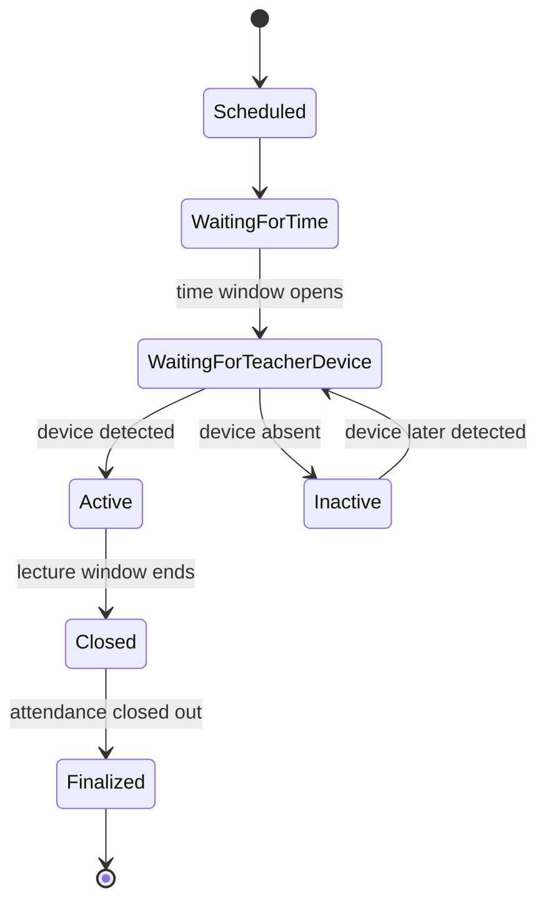
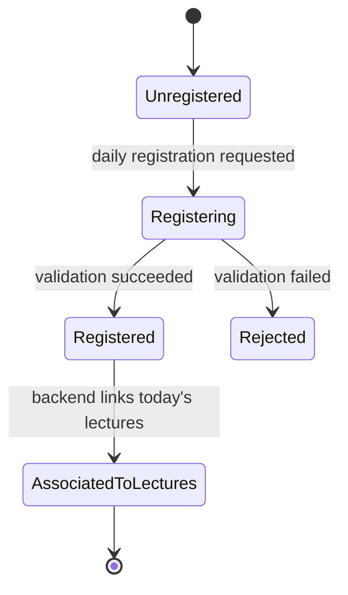
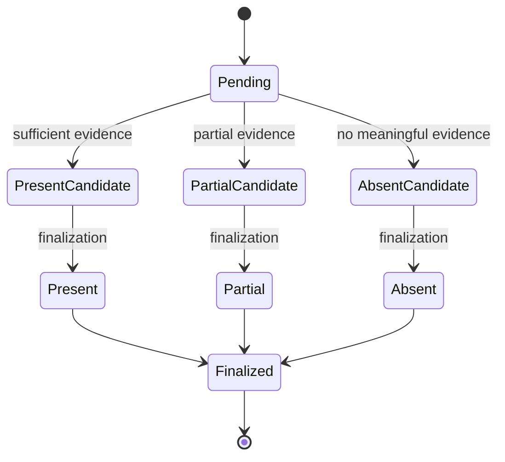
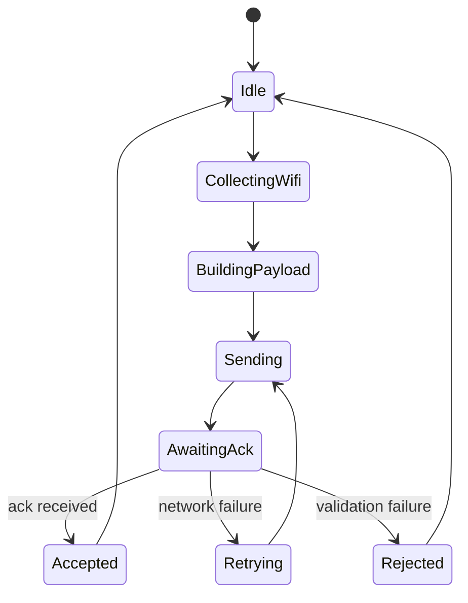
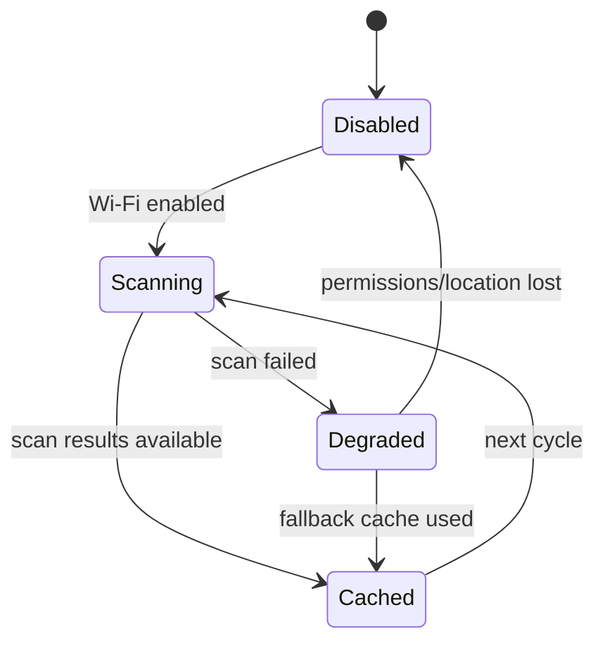
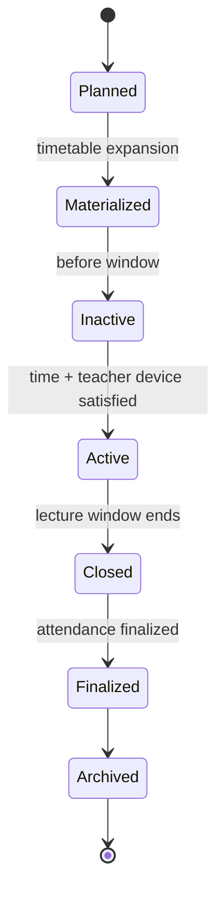

# State Machines

## 1. Teacher Session State Machine

## 2. Student Registration State Machine

## 3. Attendance State Machine

## 4. Heartbeat State Machine

## 5. Wi-Fi Monitoring State Machine

## 6. Session Lifecycle State Machine

