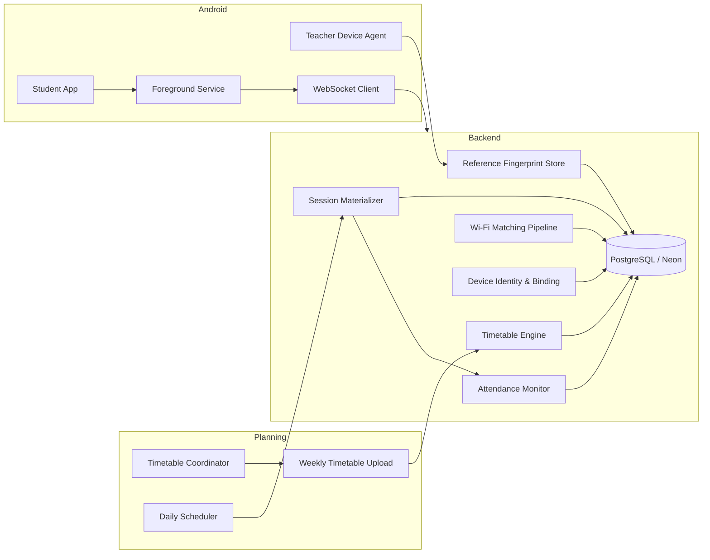

# System Architecture V2

## Scope

This document replaces the older teacher-driven attendance architecture with a timetable-driven, zero-teacher-interaction model. It is design-only and intended to support implementation of the next phase without further architectural redesign.

## High-Level Architecture

## Components

### Timetable Coordinator
- Uploads and maintains the weekly timetable.
- Does not start, stop, or mark sessions.
- Acts as the administrative source of truth for scheduling input.

### Timetable Engine
- Normalizes the weekly timetable into lecture slots.
- Materializes lecture sessions ahead of the academic day.
- Produces session instances before students arrive.

### Daily Scheduler
- Runs automatically at the beginning of each day.
- Materializes the day's session instances.
- Opens registration windows and prepares activation checks.

### Session Materializer
- Converts timetable rows into actual lecture sessions.
- Applies date, classroom, and lecture metadata.
- Ensures sessions already exist before the lecture window begins.

### Teacher Device Agent
- Represents the teacher's enrolled device identity.
- Supplies device presence signals used to activate a lecture.
- Captures the classroom reference fingerprint automatically when activation occurs.

### Student App
- Performs one daily registration.
- Continues to scan Wi-Fi and send heartbeats.
- Never joins individual lecture sessions manually in the redesigned architecture.

### Attendance Monitor
- Observes heartbeats, device binding, and session state.
- Maintains the live attendance lifecycle.
- Finalizes attendance when the lecture window closes.

### Wi-Fi Matching Pipeline
- Compares future student fingerprints against the teacher reference fingerprint.
- Is intentionally deferred from this phase of the redesign.

### Device Identity & Binding
- Replaces request-characteristic fingerprinting with stable device identity.
- Uses Android ID plus device metadata for student and teacher identity correlation.

### Reference Fingerprint Store
- Stores the teacher classroom reference fingerprint per active lecture session.
- Acts as the environmental baseline for later matching.

## Responsibilities

| Component | Responsibility | Not Responsible For |
|---|---|---|
| Timetable Engine | Create lecture schedule entries | Manual teacher session creation |
| Daily Scheduler | Prepare daily lecture instances | Attendance scoring |
| Session Materializer | Create session rows from timetable data | Fingerprint matching |
| Teacher Device Agent | Detect teacher presence and collect classroom reference | Student registration |
| Student App | Daily registration and heartbeat transmission | Lecture creation |
| Attendance Monitor | Live attendance lifecycle | CSV exports and reporting |

## Updated Workflow

1. Timetable coordinator uploads the weekly timetable.
2. Backend stores timetable definitions and future lecture slots.
3. Daily scheduler expands the timetable into the day's lecture sessions.
4. Sessions exist in an inactive state before the lecture begins.
5. When lecture time arrives, the backend checks teacher-device presence in the classroom.
6. If the time window and teacher presence are both valid, the session becomes ACTIVE.
7. The teacher reference fingerprint is captured automatically at activation and stored per session.
8. Students register once at the beginning of the day.
9. The backend automatically associates the registered student with each lecture scheduled that day.
10. The Student App continuously sends Wi-Fi fingerprints and heartbeats.
11. The backend monitors Wi-Fi, rolling tokens, device identity, and session state throughout the day.
12. When the lecture ends, the session is closed and attendance is finalized.

## Design Principles

- Zero teacher interaction for session lifecycle control.
- Timetable-first planning so sessions are pre-created.
- Automatic activation based on time and teacher presence.
- Daily registration to reduce student friction.
- Strong separation between reference fingerprints and student fingerprints.
- Auditability for every activation, registration, heartbeat, and closure event.
- Backward compatibility with existing heartbeat and persistence infrastructure where possible.

## Communication Flow

- Timetable upload uses backend REST endpoints.
- Scheduler execution is internal backend orchestration.
- Student heartbeats remain the primary live data stream.
- Teacher-device detection is a backend-controlled presence input.
- Reference fingerprint capture is a session-scoped write to the database.
- Attendance lifecycle reads and writes remain server-side.

## Current Architecture

The current implementation is still anchored around manual sessions, student join actions, and a session-based workflow. This worked for the student-module freeze but does not satisfy the updated timetable-driven requirement set.

## Problems

- Sessions are still conceptually teacher-initiated.
- Student attendance begins from a join flow rather than a daily registration model.
- Teacher reference fingerprint capture exists as storage but not as an automatic activation workflow.
- The architecture still assumes manual session management in the user journey.

## New Architecture

The redesigned architecture is timetable-driven, session-precreated, and activation-aware. Students register once per day, lecture sessions are generated from the timetable, and the backend determines when a lecture becomes active based on time plus teacher-device presence.

## Advantages

- Removes teacher-side operational burden.
- Reduces per-lecture user interaction.
- Improves consistency because lecture instances exist ahead of time.
- Supports automatic classroom presence gating.
- Provides a clearer path for later fingerprint comparison and attendance finalization.

## Migration Strategy

1. Freeze the student-session flow as a compatibility layer.
2. Add timetable tables and session materialization logic.
3. Introduce daily registration and automatic association.
4. Add teacher-device presence detection and activation rules.
5. Keep reference fingerprint storage session-scoped.
6. Gradually deprecate manual teacher session actions.

## Future Phases

- Timetable ingestion and normalization.
- Daily lecture materialization.
- Teacher-device presence detection.
- Daily student registration.
- Automatic attendance monitoring.
- Fingerprint comparison and confidence scoring.
- Final attendance closure and reconciliation.

## Final Architecture Review

### Review Result

This redesign is internally consistent with the updated requirements direction. It removes manual teacher session control, shifts session creation to the timetable engine, adds daily student registration, and defines activation as a backend decision based on schedule time plus teacher-device presence.

### What Changed

- Manual session start/end actions are no longer the primary operational model.
- The timetable becomes the source of truth for lecture scheduling.
- Sessions are materialized before the lecture window instead of being created on demand.
- Teacher reference fingerprint capture is tied to automatic activation.
- Student registration is daily rather than per-session.

### What Remains Stable

- Existing authentication and refresh-token infrastructure.
- Heartbeat-oriented attendance evidence collection.
- Session-scoped reference fingerprint storage.
- PostgreSQL as the persistence layer.

### Open Risks

- Teacher-device presence detection may produce false positives if the device profile model is too weak.
- Timetable imports need strict normalization to avoid duplicate or overlapping lecture instances.
- Daily registration must remain timezone-safe and idempotent.
- Automatic closure must be resilient to scheduler delays and partial network failure.

### Design Recommendation

Proceed with Phase 3 implementation only after the timetable schema and lecture materialization rules are finalized, because those definitions determine the rest of the session lifecycle, registration, and monitoring flow.
