# System Workflows

## 1. Weekly Timetable Upload

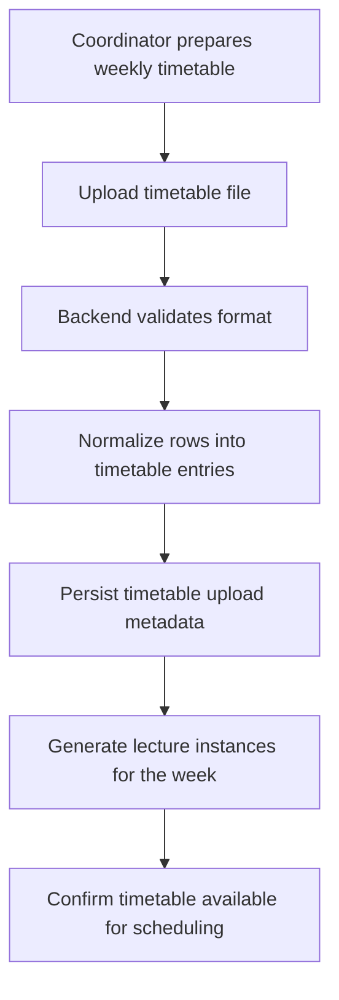

## 2. Daily Scheduler

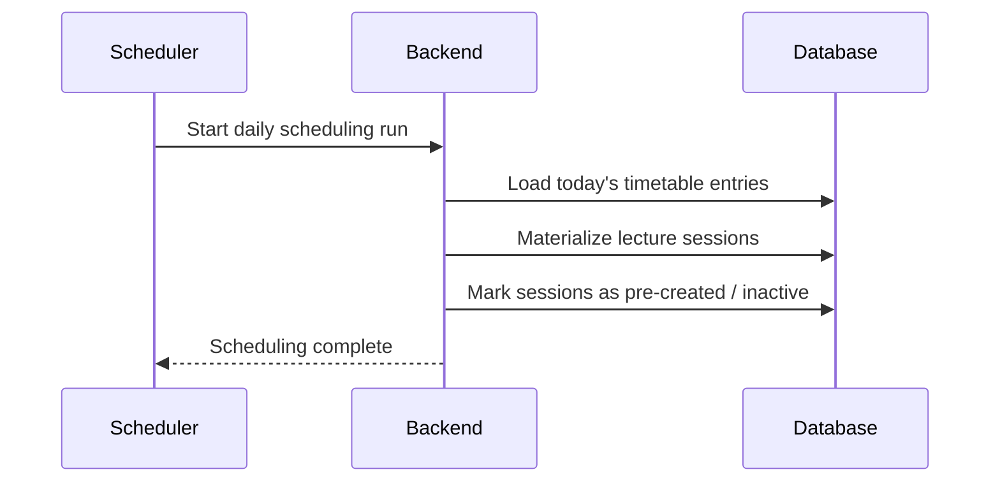

## 3. Teacher Arrival

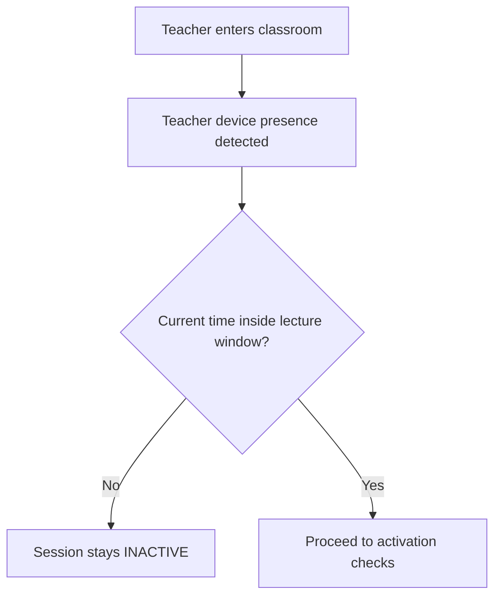

## 4. Automatic Session Activation

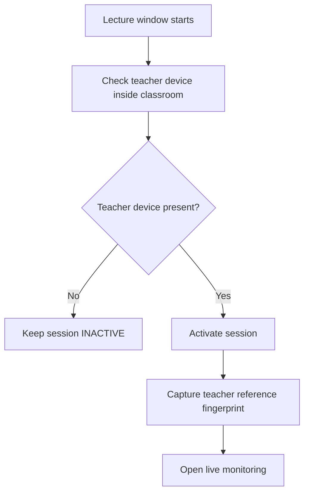

## 5. Student Daily Registration

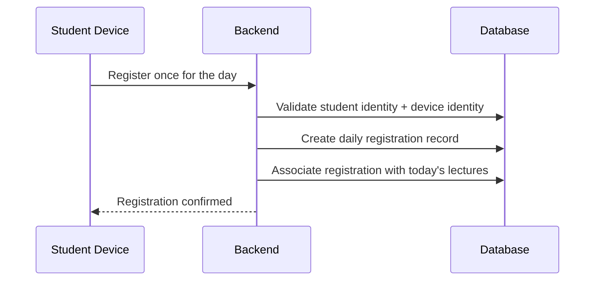

## 6. Heartbeat Lifecycle

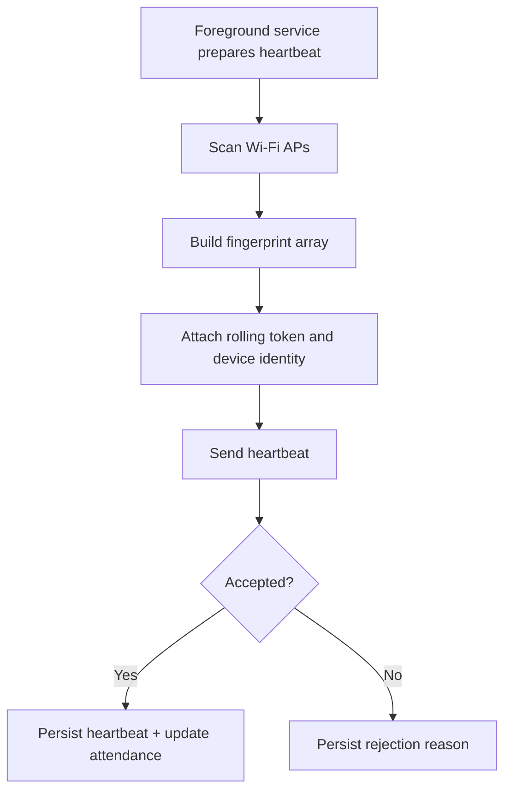

## 7. Automatic Attendance Monitoring

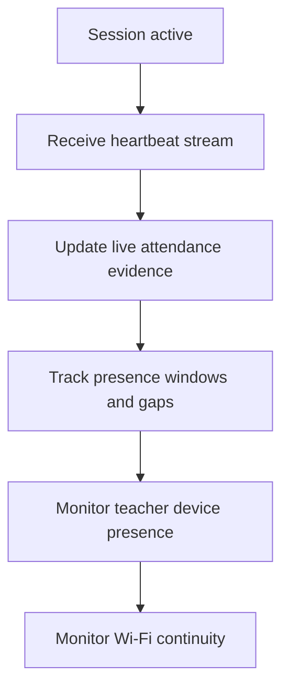

## 8. Late Arrival

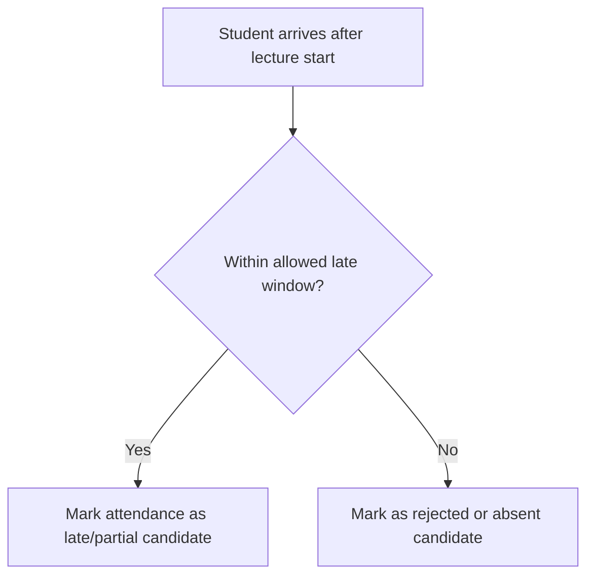

## 9. Lunch Break

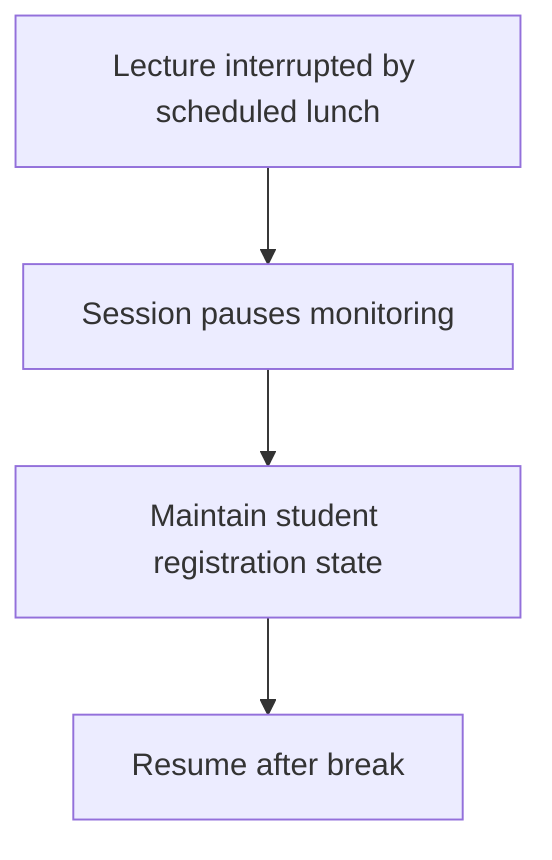

## 10. Half-Day Leave

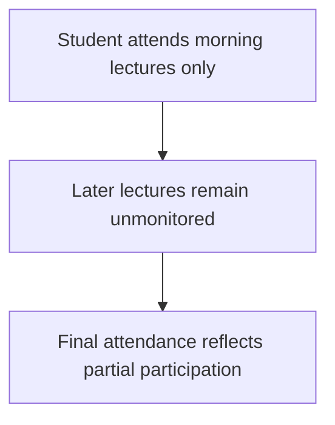

## 11. Campus Exit

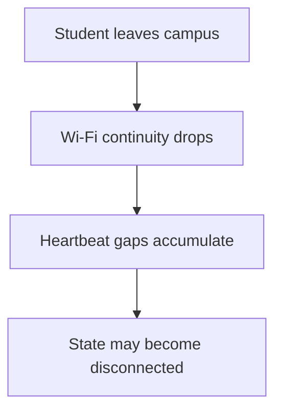

## 12. Campus Re-entry

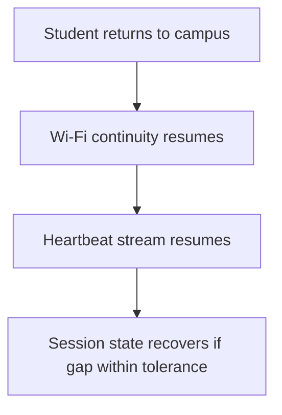

## 13. Automatic Session Closure

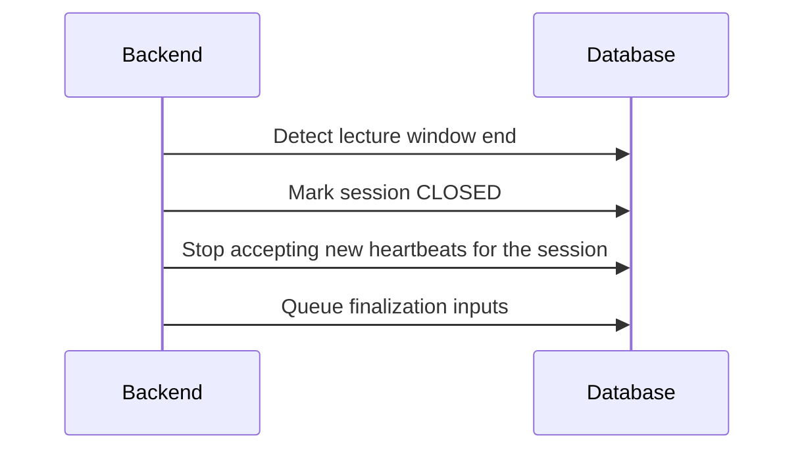

## 14. Attendance Finalization

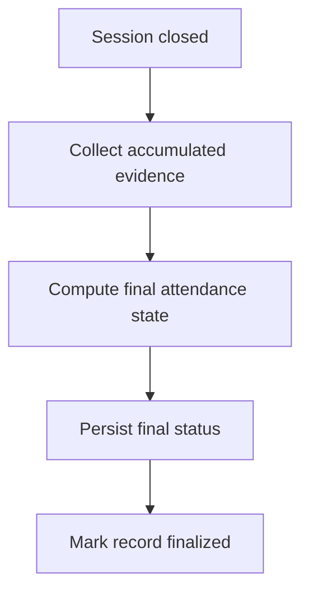
