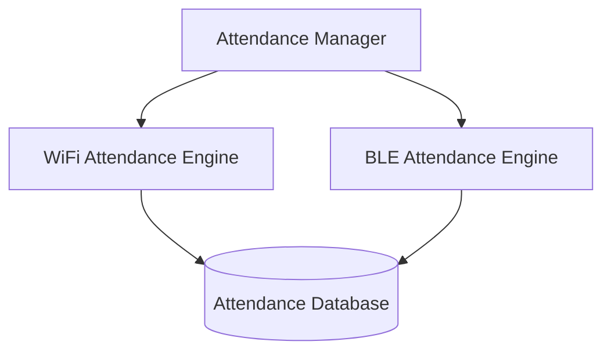
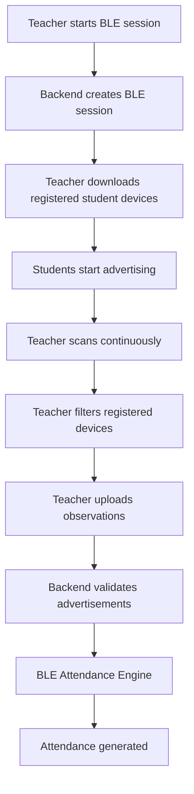

# BLE_ARCHITECTURE.md

## System Architecture

Only one attendance engine executes for a session. BLE is not an additional confidence signal and is not merged into the Wi-Fi fingerprinting engine.

## Attendance Mode

Teacher starts session

↓

Select Attendance Mode

↓

`WIFI` or `BLE`

The selected mode determines which single engine runs for the entire session. The other engine remains inactive.

## BLE Attendance Flow

## Android Architecture

### Student App

- `BLEAdvertiserService`
- `AdvertisementGenerator`
- `RollingTokenManager`

### Teacher App

- `BLEScannerService`
- `ScanCallback`
- `RegisteredDeviceFilter`
- `ObservationUploader`
- `PresenceMonitor`

## Design Notes

- BLE attendance is an independent attendance mechanism.
- BLE is used when Wi-Fi Fingerprinting is unavailable or when the teacher explicitly starts a BLE session.
- Each session stores a single `attendance_mode` value and only one engine writes attendance for that session.