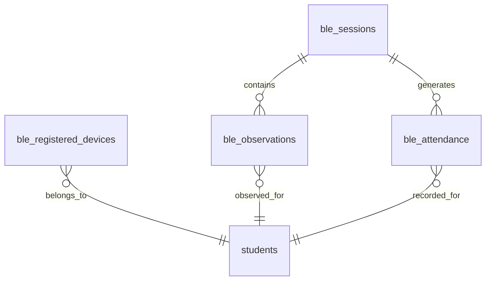

# BLE_DATABASE.md

## Overview

The BLE attendance module uses a dedicated relational model for session control, device registration, observation ingestion, and derived attendance records.

## Schema Goals

- Keep BLE attendance independent from Wi-Fi fingerprinting.
- Store raw observations separately from derived attendance.
- Preserve replay-resistant validation data for auditing.
- Support efficient lookups by session, student, and token window.

## Tables

### `ble_sessions`
Stores each BLE-only attendance session.

| Column | Type | Purpose |
| --- | --- | --- |
| `id` | UUID / bigint | Primary key for the session. |
| `course_id` | FK | Course or class that owns the session. |
| `teacher_id` | FK | Teacher who started the session. |
| `attendance_mode` | enum | Must be `BLE` for BLE sessions; may also store `WIFI` for the shared session model. |
| `start_time` | timestamp | Session start time. |
| `end_time` | timestamp | Session end time, nullable until closed. |
| `status` | enum | Session lifecycle state such as `ACTIVE`, `ENDED`, or `CANCELLED`. |

Recommended indexes:

- `(teacher_id, start_time)`
- `(course_id, start_time)`
- `(status, start_time)`
- `(attendance_mode, status)`

Primary key:

- `id`

Foreign keys:

- `course_id` references the owning course
- `teacher_id` references the teacher who started the session

### `ble_registered_devices`
Stores the student device registration used to validate BLE packets.

| Column | Type | Purpose |
| --- | --- | --- |
| `id` | UUID / bigint | Primary key for the registration row. |
| `student_id` | FK | Owning student. |
| `anonymous_ble_id` | binary / text | Opaque BLE identifier broadcast by the student device. |
| `public_identifier` | text | Human-readable registration label shown to teachers and admins. |
| `device_hash` | text | Stable device binding hash used by the backend. |
| `created_at` | timestamp | Registration time. |

Recommended constraints and indexes:

- Unique on `anonymous_ble_id`
- Unique on `device_hash`
- Index on `(student_id)`
- Index on `(public_identifier)`

Primary key:

- `id`

Foreign keys:

- `student_id` references the owning student

### `ble_observations`
Stores every validated or rejected BLE observation uploaded by the teacher device.

| Column | Type | Purpose |
| --- | --- | --- |
| `id` | UUID / bigint | Primary key for the observation row. |
| `session_id` | FK | Session that received the observation. |
| `student_id` | FK | Student matched to the advertisement. |
| `rssi` | integer | Raw signal strength value from the scan. |
| `last_seen` | timestamp | Most recent time the student was observed in the scan window. |
| `rolling_token` | text / binary | Time-window token used for replay protection. |
| `timestamp` | timestamp | Observation timestamp from the teacher device. |
| `hmac` | binary / text | Payload integrity check. |

Recommended indexes:

- `(session_id, timestamp)`
- `(session_id, student_id)`
- `(student_id, last_seen)`
- `(rolling_token)` for replay lookup and deduplication

Primary key:

- `id`

Foreign keys:

- `session_id` references `ble_sessions.id`
- `student_id` references the matched student

### `ble_attendance`
Stores the derived attendance result for each student in each BLE session.

| Column | Type | Purpose |
| --- | --- | --- |
| `id` | UUID / bigint | Primary key for the attendance row. |
| `session_id` | FK | Session that produced the attendance record. |
| `student_id` | FK | Student being evaluated. |
| `status` | enum | Final attendance outcome such as `PRESENT` or `MISSING`. |
| `first_seen` | timestamp | First valid observation time. |
| `last_seen` | timestamp | Most recent valid observation time. |

Recommended constraints and indexes:

- Unique on `(session_id, student_id)`
- Index on `(session_id, status)`
- Index on `(student_id, last_seen)`

Primary key:

- `id`

Foreign keys:

- `session_id` references `ble_sessions.id`
- `student_id` references the student record being evaluated

## Relationships

- `ble_sessions` is the session root for all BLE attendance activity.
- `ble_observations.session_id` points to the active BLE session that received the scan upload.
- `ble_observations.student_id` points to the matched student for the validated packet.
- `ble_attendance.session_id` and `ble_attendance.student_id` identify the final attendance row for that student in that session.
- `ble_registered_devices.student_id` ties the registered BLE identity to the student account used by the teacher and backend.

## Data Flow

1. A teacher starts a BLE attendance session, which creates a row in `ble_sessions`.
2. Students register devices ahead of time, which creates rows in `ble_registered_devices`.
3. Teacher devices collect scan packets and upload them as `ble_observations`.
4. The backend validates each observation against the session and registration tables.
5. The BLE Attendance Engine derives the final result set and writes `ble_attendance`.
6. The dashboard and reporting layers read `ble_attendance` as the authoritative result for the session.

## Validation and Storage Rules

- Session creation must set `attendance_mode = BLE` when BLE attendance is selected.
- Observation rows are append-only.
- Attendance rows are upserted by `(session_id, student_id)`.
- The backend should treat `ble_observations` as the audit trail and `ble_attendance` as the final result set.
- Registration data must be checked before any observation can contribute to attendance generation.

## Notes for Implementation

- The database layer should distinguish raw observation ingestion from attendance generation.
- All time-based queries should use session-specific indexes to avoid scanning the full observation history.
- The schema is intentionally mode-aware so the same attendance database can support either `WIFI` or `BLE` without merging the execution engines.
