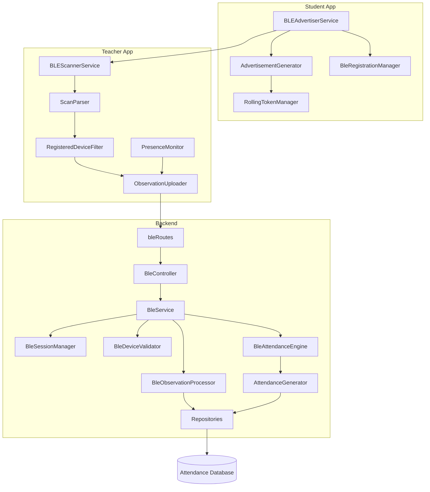

# PHASE2_FILE_STRUCTURE.md

## 1. Overview

### Purpose

This document is the implementation blueprint for Phase 2 of the BLE Attendance Module. It defines the complete file structure, responsibilities, dependencies, and implementation order needed to build BLE attendance without guessing file locations or ownership boundaries.

### Implementation Philosophy

- BLE attendance is a standalone attendance mechanism.
- BLE must not be merged into the Wi-Fi Fingerprinting confidence engine, heartbeat flow, or matching flow.
- Only one attendance mode executes per session: `WIFI` or `BLE`.
- Reuse existing authentication, configuration, database, logging, and session utilities whenever possible.
- Keep BLE code isolated inside dedicated BLE directories and modules.
- Use a service layer and repository layer for all backend work.
- Avoid duplicated logic across student, teacher, backend, and dashboard components.

### Directory Organization

The Phase 2 implementation should follow a strict modular layout:

- `backend/` for API, engine, persistence, and session orchestration.
- Android student files for advertisement generation and device broadcasting.
- Android teacher files for scanning, filtering, and observation upload.
- Dashboard files for BLE session monitoring and attendance display.
- Migration files for BLE database structures.
- Documentation files for design reference and implementation coordination.

### Component Separation

BLE components must remain independent from Wi-Fi components.

- Student advertising only supports BLE.
- Teacher scanning only supports BLE.
- Backend BLE processing only accepts `attendance_mode = BLE` sessions.
- Dashboard BLE pages should read BLE attendance data without touching Wi-Fi matching or confidence calculations.

---

## 2. Backend File Structure

### Proposed Backend Tree

```text
backend/
  src/
    attendance/
      ble/
        BleAttendanceEngine.ts
        BleSessionManager.ts
        BleDeviceValidator.ts
        BleObservationProcessor.ts
        PresenceMonitor.ts
        AttendanceGenerator.ts
    routes/
      bleRoutes.ts
    controllers/
      BleController.ts
    services/
      BleService.ts
    repositories/
      BleObservationRepository.ts
      BleAttendanceRepository.ts
      BleDeviceRepository.ts
    models/
      BleSession.ts
      BleObservation.ts
      BleAttendance.ts
```

### Backend File Responsibilities

| File | Responsibility | Primary Dependencies |
| --- | --- | --- |
| `BleAttendanceEngine.ts` | Determines present/missing status and orchestrates attendance generation for BLE sessions. | `BleObservationProcessor.ts`, `AttendanceGenerator.ts`, `PresenceMonitor.ts`, repositories, models |
| `BleSessionManager.ts` | Creates, opens, closes, and validates BLE-only sessions. | `BleSession` model, session utilities, configuration, repository layer |
| `BleDeviceValidator.ts` | Validates registered devices, anonymous BLE IDs, rolling tokens, timestamps, and HMACs. | `BleDeviceRepository.ts`, session context, security utilities |
| `BleObservationProcessor.ts` | Normalizes incoming scan observations and prepares them for validation and storage. | `BleDeviceValidator.ts`, `BleObservationRepository.ts`, models |
| `PresenceMonitor.ts` | Evaluates observation freshness, timeout rules, and missing-state transitions. | `BleObservationRepository.ts`, `BleAttendanceRepository.ts`, session state |
| `AttendanceGenerator.ts` | Converts validated observation state into final attendance records. | `PresenceMonitor.ts`, repositories, models |
| `bleRoutes.ts` | Exposes BLE REST endpoints. | `BleController.ts`, route registration, auth middleware |
| `BleController.ts` | Handles request/response mapping and input validation handoff. | `BleService.ts`, request DTOs, auth context |
| `BleService.ts` | Coordinates controller requests, business rules, and backend orchestration. | engine, repositories, session manager, validator |
| `BleObservationRepository.ts` | Reads and writes BLE observations. | database connection, `BleObservation` model |
| `BleAttendanceRepository.ts` | Reads and writes final BLE attendance records. | database connection, `BleAttendance` model |
| `BleDeviceRepository.ts` | Reads device registrations and lookup mappings. | database connection, `BleSession` context, device models |
| `BleSession.ts` | Describes BLE session data structure and lifecycle state. | shared database types, enums |
| `BleObservation.ts` | Describes observation payloads and persisted scan records. | shared database types |
| `BleAttendance.ts` | Describes final attendance records for BLE sessions. | shared database types |

### Backend Dependency Rules

- `bleRoutes.ts` depends on `BleController.ts` only.
- `BleController.ts` depends on `BleService.ts` only.
- `BleService.ts` depends on managers, validators, processors, repositories, and models.
- Repositories must never call controllers or routes.
- `BleAttendanceEngine.ts` must not access HTTP request objects directly.
- `PresenceMonitor.ts` must operate on session and observation state, not raw UI concerns.
- `BleDeviceValidator.ts` must own validation logic for packet authenticity and freshness.

### Backend Notes

- Reuse existing backend configuration, logging, database connection, authentication, and session ownership checks.
- Do not copy Wi-Fi fingerprinting logic into BLE files.
- BLE database interactions should remain inside BLE repositories and BLE models.

---

## 3. Android Student File Structure

### Proposed Student App Tree

```text
android/
  app/
    src/
      main/
        java/
          com/
            smartattendance/
              app/
                services/
                  BLEAdvertiserService.kt
                ble/
                  AdvertisementGenerator.kt
                  RollingTokenManager.kt
                  BleRegistrationManager.kt
                  BlePermissions.kt
                  BleConstants.kt
```

### Student File Responsibilities

| File | Purpose | Responsibilities | Dependencies |
| --- | --- | --- | --- |
| `BLEAdvertiserService.kt` | Runs the BLE advertisement lifecycle on the student device. | Start/stop advertising, session-bound broadcasting, foreground/background coordination. | `AdvertisementGenerator.kt`, `RollingTokenManager.kt`, `BlePermissions.kt`, app lifecycle utilities |
| `AdvertisementGenerator.kt` | Builds the BLE advertisement payload. | Assemble anonymous device ID and rolling token into the compact discovery payload. | `RollingTokenManager.kt`, `BleConstants.kt`, cryptographic helpers |
| `RollingTokenManager.kt` | Produces and validates rolling tokens for the active session window. | Time-window token generation, rotation, and freshness checks. | clock/time utilities, `BleConstants.kt` |
| `BleRegistrationManager.kt` | Handles student BLE registration metadata and device binding. | Store registration state, expose anonymous ID mapping, coordinate device identity setup. | authentication/session utilities, local storage, `BleConstants.kt` |
| `BlePermissions.kt` | Centralizes Android BLE permission checks. | Bluetooth permission gating, location permission checks where required by OS version. | Android permission APIs, app configuration |
| `BleConstants.kt` | Stores shared BLE constants. | UUIDs, manufacturer data constants, packet sizes, timeout values, and interval defaults. | none |

### Student Dependency Rules

- `BLEAdvertiserService.kt` depends on all student BLE helper classes.
- `AdvertisementGenerator.kt` depends on `RollingTokenManager.kt` and `BleConstants.kt`.
- `BleRegistrationManager.kt` should not know about teacher scanning or backend persistence internals.
- `BlePermissions.kt` should only answer permission state and request requirements.
- `BleConstants.kt` should remain a pure constants holder.

### Student Notes

- Student BLE files must not reference Wi-Fi fingerprinting classes.
- The student app should only advertise when the current session mode is `BLE`.
- Any shared auth or user-state logic should be reused from existing app infrastructure.

---

## 4. Android Teacher File Structure

### Proposed Teacher App Tree

```text
android/
  app/
    src/
      main/
        java/
          com/
            smartattendance/
              app/
                services/
                  BLEScannerService.kt
                ble/
                  RegisteredDeviceFilter.kt
                  ObservationUploader.kt
                  PresenceMonitor.kt
                  ScanParser.kt
                  BleConstants.kt
```

### Teacher File Responsibilities

| File | Purpose | Responsibilities | Dependencies |
| --- | --- | --- | --- |
| `BLEScannerService.kt` | Runs continuous BLE scanning on the teacher device. | Start/stop scans, collect packets, dispatch scan results. | `ScanParser.kt`, `RegisteredDeviceFilter.kt`, `ObservationUploader.kt`, `BleConstants.kt` |
| `RegisteredDeviceFilter.kt` | Filters only registered student devices. | Match anonymous BLE IDs or device hashes, reject unknown advertisements. | registration data, `BleConstants.kt` |
| `ObservationUploader.kt` | Uploads scan observations to the backend. | Batch observation payloads, handle retries, submit session-scoped records. | network client, auth utilities, `BleConstants.kt` |
| `PresenceMonitor.kt` | Tracks device freshness and local missing-state timing. | Maintain last-seen map, evaluate timeout thresholds, surface presence state. | `ScanParser.kt`, `BleConstants.kt`, local in-memory cache |
| `ScanParser.kt` | Decodes raw BLE scan packets. | Parse payload layout, extract anonymous ID, rolling token, timestamp, HMAC, RSSI. | `BleConstants.kt`, packet specification |
| `BleConstants.kt` | Stores shared BLE constants for the teacher app. | UUIDs, payload offsets, upload intervals, timeout thresholds. | none |

### Teacher Dependency Rules

- `BLEScannerService.kt` depends on parser, filter, uploader, and constants.
- `ScanParser.kt` must remain pure and not call network or storage code.
- `ObservationUploader.kt` should only send validated local observation data.
- `PresenceMonitor.kt` should not compute attendance finalization; that remains backend-side.

### Teacher Notes

- Teacher BLE files must not reference Wi-Fi matching, heartbeat, or confidence engine classes.
- The teacher scanner should be active only during `attendance_mode = BLE` sessions.
- Existing networking and authentication utilities should be reused where possible.

---

## 5. Dashboard File Structure

### Proposed Dashboard Tree

```text
dashboard/
  pages/
    BleAttendancePage.tsx
  components/
    BleSessionCard.tsx
    StudentBleStatusTable.tsx
    RSSIChart.tsx
    LastSeenIndicator.tsx
```

### Dashboard File Responsibilities

| File | Purpose | Responsibilities | Dependencies |
| --- | --- | --- | --- |
| `BleAttendancePage.tsx` | Main BLE attendance dashboard page. | Load session data, display live BLE attendance status, coordinate component layout. | API client, session data hooks, BLE components |
| `BleSessionCard.tsx` | Session summary card. | Show course, teacher, mode, start/end state, and BLE session status. | session API data |
| `StudentBleStatusTable.tsx` | Tabular student presence view. | Display present/missing state, last seen, and validation state by student. | BLE attendance API, `LastSeenIndicator.tsx` |
| `RSSIChart.tsx` | Signal visualization component. | Render RSSI trends per student or session. | BLE observation data, charting library |
| `LastSeenIndicator.tsx` | Human-readable last-seen display. | Render elapsed time since last observation and freshness state. | time formatting utilities |

### Dashboard Dependency Rules

- `BleAttendancePage.tsx` depends on all BLE dashboard components.
- `StudentBleStatusTable.tsx` and `RSSIChart.tsx` should consume API data, not database state directly.
- Dashboard components must use BLE attendance APIs only and must not invoke Wi-Fi fingerprint views.

### Dashboard Notes

- Reuse the existing dashboard shell, routing, authentication, and API client patterns if they already exist.
- Add BLE-specific views without changing Wi-Fi dashboard behavior.

---

## 6. Database Files

### Proposed Migration Tree

```text
backend/
  migrations/
    create_ble_sessions.sql
    create_ble_registered_devices.sql
    create_ble_observations.sql
    create_ble_attendance.sql
```

### Migration Responsibilities

| File | Purpose |
| --- | --- |
| `create_ble_sessions.sql` | Create the session table for BLE-only attendance sessions. |
| `create_ble_registered_devices.sql` | Create the registration table mapping students to anonymous BLE devices. |
| `create_ble_observations.sql` | Create the observation table for scan uploads and validation history. |
| `create_ble_attendance.sql` | Create the final attendance table for BLE session results. |

### Database Notes

- The migrations should be ordered so sessions and registrations exist before observation and attendance persistence.
- Indexes should support lookups by session, student, rolling token, and last seen.
- Reuse the existing database migration approach already used by the backend project.

---

## 7. API Layer

### Dependency Flow

```text
Route
↓
Controller
↓
Service
↓
Repository
↓
Database
```

### API Responsibilities by Layer

| Layer | Responsibilities |
| --- | --- |
| Route | Expose BLE endpoints and attach middleware. |
| Controller | Validate request shape, map transport data, and return responses. |
| Service | Apply BLE business rules and orchestrate the workflow. |
| Repository | Read/write BLE persistence records. |
| Database | Store sessions, devices, observations, and attendance. |

### Backend API File Flow

- `bleRoutes.ts` registers the API surface.
- `BleController.ts` parses request inputs and calls the service layer.
- `BleService.ts` delegates to the session manager, validator, processor, engine, and repositories.
- Repositories isolate SQL or ORM access from business logic.

### API Notes

- Reuse the existing authentication middleware, request context, logging, and config wiring.
- BLE endpoints must not pass through Wi-Fi matching or heartbeat logic.

---

## 8. Component Dependency Diagram



### Diagram Notes

- The student app produces BLE advertisements.
- The teacher app scans, filters, and uploads observations.
- The backend validates, stores, and generates attendance.
- All data ends in the attendance database.

---

## 9. Existing Files To Reuse

| Existing Component | Reuse Strategy | Reason |
| --- | --- | --- |
| Authentication | Reuse existing login/session/auth middleware. | Avoid duplicating security and identity logic. |
| JWT | Reuse existing token handling if already present. | Keep API authorization consistent. |
| Database Connection | Reuse the current backend database connector. | Maintain a single persistence configuration. |
| Logging | Reuse existing logging configuration. | Preserve observability and error tracing. |
| Configuration | Reuse existing environment/config loading. | Keep deployment and runtime behavior consistent. |
| User Management | Reuse existing user identity data and roles. | BLE session ownership depends on existing users. |
| Session Management | Reuse existing session ownership and lifecycle primitives where safe. | BLE must attach to the existing session model without duplicating it. |
| Shared Utilities | Reuse helper functions for validation, timestamps, formatting, and hashing where appropriate. | Prevent duplicate utility code. |

### Reuse Rule

Reuse existing infrastructure whenever it does not force BLE into the Wi-Fi confidence engine or matching path.

---

## 10. Existing Files NOT To Modify

| Existing Component | Reason It Must Remain Untouched |
| --- | --- |
| WiFi Fingerprinting Engine | BLE is not part of Wi-Fi confidence logic. |
| Matching Engine | BLE is not part of matching. |
| Confidence Engine | BLE must not be merged into the confidence pipeline. |
| Heartbeat Engine | BLE is not part of heartbeat. |
| Fingerprint APIs | BLE uses its own API layer. |
| Fingerprint Database | BLE uses its own attendance tables and migration files. |
| Wi-Fi Session Flow | BLE operates independently with `attendance_mode = BLE` only. |
| Wi-Fi Dashboard Views | BLE should add separate dashboard views instead of altering Wi-Fi views. |

### Isolation Rule

Unless a shared utility is strictly necessary, BLE must remain isolated from Wi-Fi implementation files.

---

## 11. New Files To Create

### Backend

- [ ] `backend/src/attendance/ble/BleAttendanceEngine.ts`
- [ ] `backend/src/attendance/ble/BleSessionManager.ts`
- [ ] `backend/src/attendance/ble/BleDeviceValidator.ts`
- [ ] `backend/src/attendance/ble/BleObservationProcessor.ts`
- [ ] `backend/src/attendance/ble/PresenceMonitor.ts`
- [ ] `backend/src/attendance/ble/AttendanceGenerator.ts`
- [ ] `backend/src/routes/bleRoutes.ts`
- [ ] `backend/src/controllers/BleController.ts`
- [ ] `backend/src/services/BleService.ts`
- [ ] `backend/src/repositories/BleObservationRepository.ts`
- [ ] `backend/src/repositories/BleAttendanceRepository.ts`
- [ ] `backend/src/repositories/BleDeviceRepository.ts`
- [ ] `backend/src/models/BleSession.ts`
- [ ] `backend/src/models/BleObservation.ts`
- [ ] `backend/src/models/BleAttendance.ts`

### Android Student

- [ ] `BLEAdvertiserService.kt`
- [ ] `AdvertisementGenerator.kt`
- [ ] `RollingTokenManager.kt`
- [ ] `BleRegistrationManager.kt`
- [ ] `BlePermissions.kt`
- [ ] `BleConstants.kt`

### Android Teacher

- [ ] `BLEScannerService.kt`
- [ ] `RegisteredDeviceFilter.kt`
- [ ] `ObservationUploader.kt`
- [ ] `PresenceMonitor.kt`
- [ ] `ScanParser.kt`
- [ ] `BleConstants.kt`

### Dashboard

- [ ] `BleAttendancePage.tsx`
- [ ] `BleSessionCard.tsx`
- [ ] `StudentBleStatusTable.tsx`
- [ ] `RSSIChart.tsx`
- [ ] `LastSeenIndicator.tsx`

### Database

- [ ] `create_ble_sessions.sql`
- [ ] `create_ble_registered_devices.sql`
- [ ] `create_ble_observations.sql`
- [ ] `create_ble_attendance.sql`

### API

- [ ] `backend/src/routes/bleRoutes.ts`
- [ ] `backend/src/controllers/BleController.ts`
- [ ] `backend/src/services/BleService.ts`
- [ ] `backend/src/repositories/BleObservationRepository.ts`
- [ ] `backend/src/repositories/BleAttendanceRepository.ts`
- [ ] `backend/src/repositories/BleDeviceRepository.ts`

### Documentation

- [ ] `docs/ble/BLE_ARCHITECTURE.md`
- [ ] `docs/ble/BLE_REQUIREMENTS.md`
- [ ] `docs/ble/BLE_SECURITY.md`
- [ ] `docs/ble/BLE_IMPLEMENTATION_TASKS.md`
- [ ] `docs/ble/BLE_PACKET_SPEC.md`
- [ ] `docs/ble/BLE_DATABASE.md`
- [ ] `docs/ble/BLE_API.md`
- [ ] `docs/ble/PHASE2_FILE_STRUCTURE.md`

---

## 12. Implementation Order

### Step 1: Database

Create the BLE database tables and indexes first.

Why first:

- The backend, API, and engine need a stable schema.
- Session, observation, registration, and attendance persistence all depend on the database model.

### Step 2: Backend APIs

Create BLE routes, controllers, services, repositories, and models.

Why second:

- The frontend and mobile clients need stable endpoints.
- The backend can define validation and persistence contracts before the Android clients are wired.

### Step 3: Student BLE Advertiser

Implement the student-side BLE advertisement stack.

Why third:

- The packet specification and registration model must already exist.
- Student payload generation depends on token and discovery-layout rules.

### Step 4: Teacher BLE Scanner

Implement the teacher-side scanning, parsing, filtering, and upload stack.

Why fourth:

- The teacher client depends on the packet layout and the observation upload API.
- Scanning must align with backend validation and registered-device rules.

### Step 5: BLE Attendance Engine

Implement BLE attendance generation, presence evaluation, and final record creation.

Why fifth:

- Attendance logic depends on validated observations coming from the API.
- The engine must use the session state and database records already defined in earlier steps.

### Step 6: Dashboard

Implement BLE session monitoring and attendance display.

Why sixth:

- The dashboard depends on backend data contracts and finalized attendance output.
- UI should consume stable BLE endpoints rather than inventing its own interpretation.

### Step 7: Integration Testing

Test the full BLE flow end to end.

Why last:

- End-to-end verification requires database, backend, mobile clients, and dashboard components to exist first.
- Integration tests should confirm isolation from Wi-Fi behavior and correct operation in `attendance_mode = BLE` sessions.

### Dependency Summary

- Database comes before backend.
- Backend comes before client integrations.
- Student advertising must exist before teacher scanning can be fully validated.
- Teacher scanning must exist before attendance generation can be tested with live observations.
- Dashboard comes after backend contracts stabilize.

---

## 13. Design Principles

### Architectural Rules

- **Single Responsibility Principle**: Each file should own one clear function.
- **Dependency Injection**: Inject shared services instead of creating hidden global dependencies.
- **Service Layer**: Business logic belongs in services and engines, not controllers or routes.
- **Repository Pattern**: All persistence access should go through repositories.
- **No BLE code inside Wi-Fi modules**: Keep the BLE implementation isolated from fingerprinting, matching, and heartbeat code.
- **No duplicated authentication logic**: Reuse existing auth/session infrastructure.
- **No duplicated session management**: Reuse existing session ownership and lifecycle utilities where possible.
- **Reuse existing infrastructure whenever possible**: Logging, config, database, and identity primitives should be shared rather than reimplemented.

### Implementation Boundaries

- Student app files handle BLE advertising only.
- Teacher app files handle BLE scanning and upload only.
- Backend BLE files handle validation, storage, and attendance generation only.
- Dashboard files handle display only.
- Database migrations handle schema only.

### Final Rule

BLE must remain a separate attendance mechanism with its own session mode, file structure, and processing pipeline.
