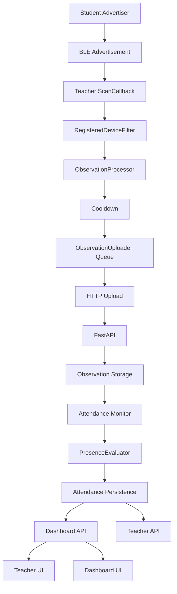

# Runtime Validation Analysis

## Architecture Diagram

## State Ownership Table

| Metric | Owner | Storage | Lifetime | Update Frequency | Read Locations | Reset Conditions |
| --- | --- | --- | --- | --- | --- | --- |
| Advertisement Count | Backend observation rows | `ble_observations` via `advertisement_count_by_student` in API responses | Per session | Each upload / observation view request | Dashboard API, Teacher UI observation view | New session, session query scope |
| Packets Received | `BleSession.packets_received` | `ble_sessions.packets_received` | Per session | Each accepted upload batch | Dashboard API, session summary API, Teacher UI | New session start, session end |
| Packets Accepted | Backend upload response + stored observations | `ble_observations` rows | Per upload | Each accepted observation | Upload response, dashboard/teacher observation view | New session |
| RSSI | `ble_observations.rssi` | `ble_observations` | Per observation | Each accepted observation | Observation API, dashboard, teacher UI | New session |
| Average RSSI | Backend summary computation | Derived from `ble_observations` | Per session | On summary/dashboard request | Dashboard API, session summary API | New session |
| Confidence | Backend evaluator / processor derived value | Derived from observation + presence state | Per observation / per presence evaluation | When processing or evaluating | Teacher UI, summary views | New session |
| Last Seen | `ble_observations.last_seen` | `ble_observations` | Per observation | Each accepted observation | Observation API, presence API, teacher UI | New session |
| Last Accepted | Latest accepted observation timestamp | `ble_observations.timestamp` / teacher UI latest accepted timestamp | Per session | Each accepted observation | Teacher UI, summary views | New session |
| Presence | `ble_attendance.status` | `ble_attendance` | Per session + student | Attendance monitor cycle / finalize session | Presence API, dashboard, teacher UI | New session, monitor evaluation |
| Detected Students | Backend distinct student set | Derived from `ble_observations` | Per session | On summary/dashboard request | Dashboard API, summary API | New session |
| Students Seen | Backend distinct student set | Derived from `ble_observations` | Per session | On dashboard/summary request | Dashboard API, teacher UI | New session |
| Missing | `ble_attendance.status == MISSING` / evaluator count | `ble_attendance` | Per session + student | Attendance monitor cycle | Presence API, summary API | New session, evaluator run |
| Present | `ble_attendance.status == PRESENT` / evaluator count | `ble_attendance` | Per session + student | Attendance monitor cycle | Presence API, summary API | New session, evaluator run |
| Latest Observation | Most recent `ble_observations.timestamp` | Derived from `ble_observations` | Per session | On summary/dashboard request | Dashboard API, summary API | New session |
| Cooldown | Backend process-local tracker | `cooldown_tracker` in memory | Per process + session/student | Each processed observation | Observation processor | Session reset, process restart |
| Current Session | `ble_sessions.status` and active-session lookup | `ble_sessions` + active-session API | Per session | Session start/end, dashboard refresh | Teacher repository, dashboard API, scanner/advertiser session checks | Session end, new session |
| Queue Size | Teacher uploader queue length | `ObservationUploader.queue` | Per process | Each enqueue / flush | Teacher scanner logs | Session change, uploader flush |
| Uploader Pending Count | Teacher uploader queue length | `ObservationUploader.queue` | Per process | Each enqueue / flush | Teacher scanner logs | Session change, uploader flush |
| Observation Count | `ble_observations` row count | `ble_observations` | Per session | On API request / upload insert | Summary, dashboard, observation API | New session |
| Rolling Token | Observation payload / row | `ble_observations.rolling_token` | Per observation | Each accepted observation | Processor logs, observation API | New session |
| Anonymous BLE ID | Registration row | `ble_registered_devices.anonymous_ble_id` | Per device registration | On registration / lookup | Registered device API, processor logs | Not reset on session change |
| Device Hash | Registration row | `ble_registered_devices.device_hash` | Per device registration | On registration / lookup | Registered device API | Not reset on session change |
| BLE Registration | Registration row | `ble_registered_devices` | Per device | On registration only | Teacher/student registration APIs | Explicit unregister / user change |
| Student Cache | Backend observation set / teacher repository response cache | Derived, not persisted as a singleton | Per session or request | Request scoped | Teacher UI | New session / request refresh |
| Teacher Cache | PreferencesManager + repository auth cache | DataStore / in-memory auth token | App process | Login / refresh / clear | TeacherRepository, ViewModels | Logout, token refresh |
| Dashboard Cache | Teacher dashboard ViewModel state | `TeacherDashboardUiState` | ViewModel lifetime | Refresh timer / session change | Dashboard screen | Session change, ViewModel refresh |
| Scheduler State | Backend background tasks + scanner watchdog jobs | Process-local jobs | Process lifetime | Timer-driven | Logs, service lifecycle | Service stop, process death |
| Observation Queue | Teacher uploader queue | `ObservationUploader.queue` | Process + session bounded | On enqueue / flush | Teacher scanner logs | Session change, flush, stop |
| Presence Cache | Backend observation tracker + attendance rows | `ble_attendance` + evaluator input | Session scoped | Monitor cycle | Presence API, teacher UI | New session |
| Attendance Cache | `ble_attendance` rows | `ble_attendance` | Session scoped | Monitor cycle / finalize | Presence API, summary API | New session |
| Session Cache | Backend session rows + app prefs session id | `ble_sessions`, DataStore active session id | Session scoped | Session start/end / refresh | Dashboard, teacher repository, scanner, advertiser | Session end, new session |

## Verified Runtime Evidence

- Live backend health was reachable after the schema fix.
- A live probe created a BLE session, uploaded observations, and read back dashboard, summary, presence, and SQL state.
- The first live session reported `received=2`, `packets_received=2`, and one detected student.
- The second live session started with `packets_received=0` on both dashboard and SQL.

## Remaining Runtime Gap

- Real-device Bluetooth OFF/ON soak validation still requires a physical device or emulator with controllable Bluetooth state.
- This workspace can prove API/SQL/runtime behavior for the backend and can prove compile/test correctness, but not a physical Bluetooth radio toggle without device access.